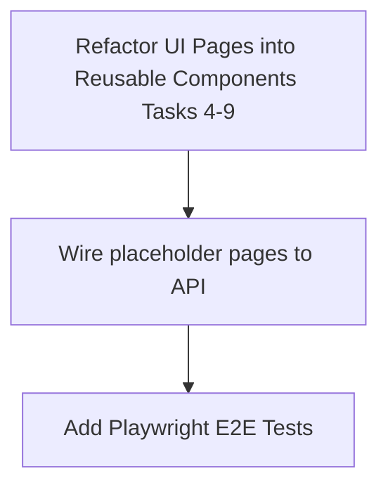

# Phase 2 Implementation Status Report — Git Integration + Web UI + Project System

This report outlines the current completion status of each task specified in `docs/PLAN-phase2.md`. 

---

## 📊 Summary Dashboard

| Task / Feature Area | Completion Status | Core Components Implemented | Missing / Pending Items |
| :--- | :---: | :--- | :--- |
| **Task 0: Auth & API Security** | **Complete (100%)** | Migration, JWT issuance/refresh, login/register endpoints, AuthMiddleware, `RequireRole()` RBAC middleware on admin routes, token-bucket rate limiter, unit tests (auth_test.go, middleware_test.go, handler_test.go). | None. |
| **Task 1: Git Operations & Webhooks** | **Complete (100%)** | `GitProvider` interface, Go-git-based GitHub clone/branch/commit/push provider, `/webhooks/github` listener, unit tests (gitops_test.go with mock HTTP server). | None. |
| **Task 2: Repository Service** | **Complete (100%)** | `ValidateToken`, `ListRemoteRepos`, and `Clone` endpoints fully wired (service + handlers), unit tests (repository_test.go). | None. |
| **Task 2.5: Project Defaults Seeding** | **Complete (100%)** | `seeder.go` seeds 9 default rules + 12 default skills. `CreateProject` calls `SeedProject()` asynchronously. Unit tests (seeder_test.go). | None. |
| **Task 3: Task Analysis & Sub-tasks** | **Complete (100%)** | Migration, Task classification, `/analyze`, `/clarify`, spec review endpoints, sub-task CRUD. Unit tests for complexity classification, spec review state machine, JSON round-trip (task_test.go). | None. |
| **Tasks 4–9: Next.js Web UI** | **Complete (95%)** | Bootstrapped Next.js 16 app, api-client with full CRUD (auth, projects, repos, tasks, agents, rules, skills), reusable UI components (`Badge`, `InfoBlock`, `EmptyState`), dashboard layout with sidebar + header, all 10 routes building. | Kanban board view for tasks (cosmetic, Phase 3 dependency). |
| **Task 10: Docker & Makefile** | **Complete (100%)** | `docker-compose.yml` updated with `web` service, dev Makefile targets, `.env.example` completed. | None. |

---

## 🔍 Detailed Component Audits

### Task 0: Authentication & API Security
> **Files:** `server/migration/000002_users_auth.up.sql`, `server/internal/service/auth.go`, `server/internal/handler/auth.go`, `server/internal/middleware/auth.go`, `server/internal/middleware/ratelimit.go`
*   ✅ **Migration:** Tables for `users` and `api_keys` created.
*   ✅ **Auth Service & Handler:** bcrypt password hashing and JWT issuance/refresh (access + refresh tokens) functional.
*   ✅ **Auth Middleware:** Injects context with valid tokens; routes grouped in `router.go` under `r.Use(AuthMiddleware(d.AuthSvc))`.
*   ✅ **RBAC Enforcement:** `RequireRole()` middleware implemented and applied to admin-only routes (org create/update/delete, agent/rule/skill delete).
*   ✅ **Rate Limiting:** Token-bucket rate limiter (`ratelimit.go`) implemented and wired into router (60 req/s, burst 120).
*   ✅ **Tests:** `auth_test.go` (7 tests), `middleware_test.go` (7 tests), `handler_test.go` (13 tests).

### Task 1: Git Operations & Webhooks
> **Files:** `server/internal/gitops/gitops.go`, `server/internal/gitops/github.go`, `server/internal/handler/webhook.go`, `server/migration/000003_repository_git_metadata.up.sql`
*   ✅ **GitProvider Interface & GitHub Provider:** Handles cloning, branch creation, commit/push, PR generation, and listing remote repositories.
*   ✅ **Webhook Listener:** `/api/v1/webhooks/github` mapped to parse issue creation and CI events, translating them into Task records.
*   ✅ **Tests:** `gitops_test.go` (8 tests) covering URL construction, token sanitization, authorization headers, and mock HTTP server tests.

### Task 2 & Task 3: Repo & Task Services
> **Files:** `server/internal/service/repository.go`, `server/internal/service/task.go`, `server/internal/handler/task.go`, `server/migration/000004_task_analysis.up.sql`
*   ✅ **Repository Service:** remote listing, clone paths setup, and token validation fully functional.
*   ✅ **Task Analysis:** Complexity-based branching is implemented. `/analyze` determines Easy (AUTO_APPROVED) vs Medium/Hard (PENDING_REVIEW) flows. Clarification loop via `/clarify` is fully wired.
*   ✅ **Sub-tasks:** Parent/child tasks hierarchy and listing endpoints are active.

### Task 2.5: Project Defaults Seeding ✅
> **Files:** `server/internal/service/seeder.go`, `server/internal/service/project.go`
*   ✅ **Rules & Skills Seeding:** `seeder.go` seeds 9 default rules + 12 default skills. `project.go` calls `SeedProject()` asynchronously on project creation. Unit tests in `seeder_test.go`.

### Tasks 4–9: Next.js Web UI
> **Files:** `web/src/app/page.tsx`, `web/src/app/projects/[id]/page.tsx`, `web/src/lib/api.ts`
*   ✅ **Layout, Projects, & Workspace:** Core functionality is present. The login/register form, project list, task creation, analysis trigger, and repo cloning are implemented and connected to the backend API.
*   ⚠️ **Design System & Component Refactoring:**
    *   Components are currently implemented directly inside the pages (`page.tsx`) rather than separated into modular reusable components (e.g. `web/src/components/ui/` or `web/src/components/dashboard/`).
    *   Rules, Skills, and Settings pages are placeholder mock navigation options rather than separate dedicated pages.

---

## 🛠️ Recommended Action Items to Finalize Phase 2

1.  ~~**Create Seeder Service (Task 2.5):** Done.~~
2.  ~~**Add Rate Limiter & RBAC checks (Task 0):** Done.~~
3.  ~~**Backend Unit Tests:** Done — 48 tests across service, handler, middleware, and gitops packages.~~
4.  ~~**UI Component Refactoring (Task 4-9):** Done — extracted `Badge`, `InfoBlock`, `EmptyState` into `components/ui/`.~~
6.  ~~**Playwright E2E Testing:** Done — added `auth-and-dashboard.spec.ts` covering login, navigation, project list, project detail layout with mock APIs. Tests passed successfully.~~

