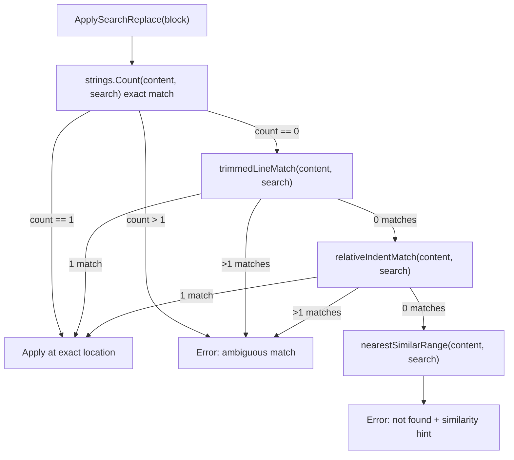
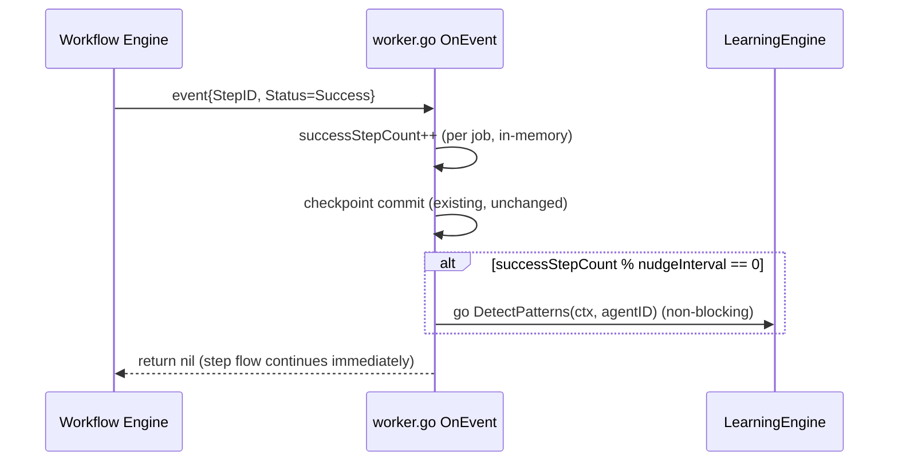
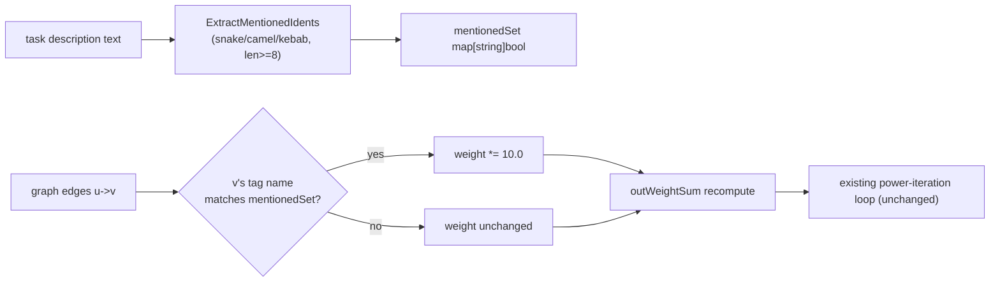
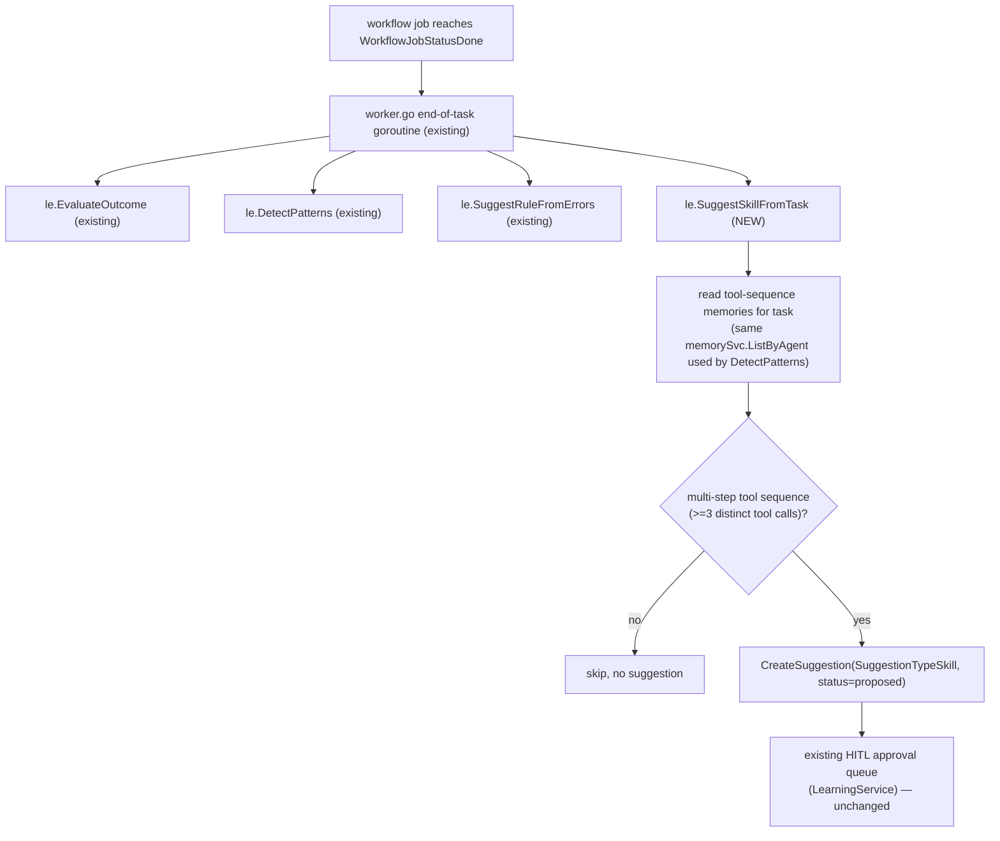

# Design: Agent & Prompt Management Enhancements

## Architecture

### Issue 1 — Fuzzy Search/Replace Fallback Chain



### Issue 2 — Mid-Task Learning Nudge



### Issue 3 — Mention-Boost PageRank



### Issue 4 — Skill Self-Authoring Suggestion



## Data Models

### No new persisted models required
`models.SuggestionTypeSkill` already exists (`server/pkg/models/learning.go:15`) and is unused by any producer today — Issue 4 is purely a new producer against the existing `Suggestion` table/schema.

### `EditBlock` fallback helpers (new, unexported)

```go
// In patch/search_replace.go

// trimmedLineMatch finds a window in content whose lines match search's lines
// after per-line whitespace trimming. Returns start/end byte offsets, or
// ok=false if zero or >1 matches.
func trimmedLineMatch(content, search string) (start, end int, ok bool, ambiguous bool)

// relativeIndentMatch re-encodes indentation as relative-to-previous-line
// (reusing the same idea as Aider's RelativeIndenter) and compares in that
// space. Returns start/end byte offsets in the ORIGINAL content.
func relativeIndentMatch(content, search string) (start, end int, ok bool, ambiguous bool)

// nearestSimilarRange returns the line range in content most similar to
// search (line-based Levenshtein or token-overlap scoring), for error hints only.
func nearestSimilarRange(content, search string) (startLine, endLine int, snippet string)
```

### Mid-task nudge counter (new, in-memory, per-job)

```go
// In worker.go — declared inside runWorkflow/executeTask, scoped to a single job run.
successStepCount := 0
const learningNudgeInterval = 4 // fires DetectPatterns every 4 successful steps

// inside OnEvent, after existing checkpoint-commit block:
if event.Status == workflow.StepStatusSuccess {
    successStepCount++
    if o.learnEngine != nil && successStepCount%learningNudgeInterval == 0 {
        nudgeCtx := context.WithoutCancel(ctx)
        go o.learnEngine.DetectPatterns(nudgeCtx, agent.ID)
    }
}
```

### Mention-boost identifier extraction (new)

```go
// In repomap/ranking.go (or a new mentions.go in same package)

// ExtractMentionedIdents tokenizes free text (task descriptions, NOT source
// files — symbol.ExtractTags already handles source files) into identifier
// candidates matching Aider's heuristic: snake_case, camelCase, or
// kebab-case tokens of length >= 8.
func ExtractMentionedIdents(text string) map[string]bool

// CalculatePageRank gains a new parameter; zero-value ("" or nil) preserves
// existing behavior exactly (REQ-008).
func (g *DependencyGraph) CalculatePageRank(activeFiles []string, taskDescription string) map[string]float64
```

The mention-boost multiplies `weight` in the existing `outWeightSum` pre-calculation loop (`ranking.go:36-48`) — specifically, when computing `sum += weight` for edge `u->v`, if `v`'s node tag name intersects `mentionedSet`, use `weight * 10.0` instead of `weight`. This must happen consistently in both the `outWeightSum` computation and the inbound-flow computation (`ranking.go:77-86`, which re-reads `g.Graph.Weight(v, u)` — the boosted weight needs to be looked up the same way, so the simplest correct implementation multiplies the *edge weights in a boosted copy* fetched via a small `boostedWeight(u, v, mentionedSet) float64` helper called at both sites, rather than mutating the underlying `Graph`).

### Skill suggestion producer (new)

```go
// In learning/patterns.go, alongside DetectPatterns/SuggestRuleFromErrors

// SuggestSkillFromTask proposes a reusable skill definition when a completed
// task's memory record shows a non-trivial multi-step tool sequence.
// Mirrors Hermes's /learn pattern: no separate distillation model call —
// this just formats a CreateSuggestionInput from data already collected by
// EvaluateOutcome/memorySvc, same as DetectPatterns does for pattern suggestions.
func (le *LearningEngine) SuggestSkillFromTask(ctx context.Context, task *models.Task, job *models.WorkflowJob)
```

## Security & Execution Boundaries

| Component | Constraint |
|-----------|------------|
| Fuzzy fallback matchers | Read-only comparison logic; the actual file write (`os.WriteFile` equivalent) path in `ApplySearchReplace` is unchanged — fallback only changes *where* the replacement is located, not how it's written |
| Mid-task nudge goroutine | Uses `context.WithoutCancel(ctx)` exactly like the existing end-of-task call, so job cancellation does not leak into an orphaned goroutine holding the parent context; must NOT hold any lock on the job/workflow state |
| Skill suggestion | Never writes to `skills/executor.go` or any live skill registry — output is strictly a `Suggestion` row with `status="proposed"`, gated by the existing HITL approval endpoint |
| Mention-boost extraction | Operates only on the task description string already available to the orchestrator (no new external input surface); must not be confused with `symbol.ExtractTags`, which parses actual source files under repo boundaries |

## Risk Mitigation

| Risk | Severity | Mitigation |
|------|----------|------------|
| Fuzzy fallback silently applies a patch at the wrong location | HIGH | Fallbacks only ever apply when exactly one candidate is found (REQ-004); ambiguous matches always error out, same as today's `count > 1` behavior |
| Mid-task nudge fires too often, spamming the suggestion queue with duplicate "proposed" pattern suggestions | MEDIUM | `learningNudgeInterval` default (4 steps) chosen so a typical task (5-8 steps) fires at most once mid-task in addition to the end-of-task call; `DetectPatterns` already requires `count >= 3` occurrences before creating any suggestion, which naturally rate-limits noise |
| Mention-boost multiplier applied inconsistently between `outWeightSum` and inbound-flow lookups, silently breaking PageRank convergence | HIGH | Centralize boost lookup in a single `boostedWeight(u, v, mentionedSet)` helper called from both sites (see Data Models) instead of duplicating the multiplier logic |
| `SuggestSkillFromTask` proposes a "skill" for trivial single-tool tasks, flooding HITL queue | LOW | Gate on `>= 3` distinct tool calls in the task's memory record (REQ-009), same threshold style as `DetectPatterns`'s `count >= 3` |
| `CalculatePageRank` signature change breaks existing test call sites | LOW | `graph_test.go` call sites updated to pass `""` for the new parameter, verified to produce byte-identical scores (REQ-008) |
