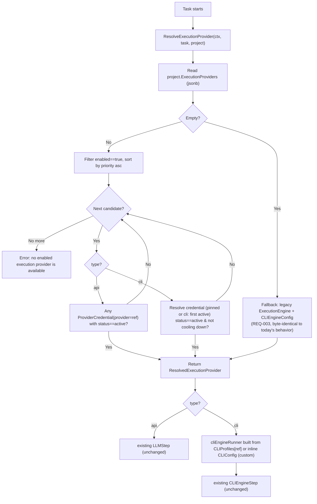

# Design: CLI Execution Provider Routing

## Architecture Overview



**Insertion point is intentionally narrow**: only `resolveCLIEngineRunner` (`server/internal/orchestrator/cli_engine_step.go:143`) changes its data source. `step_registry.go:26` and `worker.go:309` keep calling it exactly as before — they don't know the Router exists. `CLIEngineStep.RunLLMStep`, `LLMStep`, and `patch_retry_loop.go` are untouched (matches the "single-shot selection, no mid-task switch" decision — no need to make retry loops re-resolve providers).

## Data Model

### Backend: `server/pkg/models/cli_profiles.go` (new)

```go
package models

// CLIProfile is a system-level, built-in description of how to invoke a
// specific CLI coding tool. Not stored in DB — org admins cannot create new
// ones in this phase; only "custom" (inline CLIEngineConfig) escapes the registry.
type CLIProfile struct {
	Command            string   `json:"command"`
	Args               []string `json:"args"`
	AuthCheckCommand   string   `json:"auth_check_command,omitempty"`
	TimeoutMinutes     int      `json:"timeout_minutes"`
	CredentialProvider string   `json:"credential_provider"` // e.g. "cli:claude"
}

var CLIProfiles = map[string]CLIProfile{
	"claude_code": {
		Command:            "claude",
		Args:               []string{"-p", "--dangerously-skip-permissions", "{prompt_file}"},
		AuthCheckCommand:   "claude --version",
		TimeoutMinutes:     30,
		CredentialProvider: "cli:claude",
	},
	"openai_codex": {
		Command:            "codex",
		Args:               []string{"exec", "--full-auto", "{prompt_file}"},
		AuthCheckCommand:   "codex --version",
		TimeoutMinutes:     30,
		CredentialProvider: "cli:codex",
	},
	"antigravity": {
		Command:            "antigravity",
		Args:               []string{"run", "--yes", "{prompt_file}"},
		AuthCheckCommand:   "antigravity --version",
		TimeoutMinutes:     30,
		CredentialProvider: "cli:antigravity",
	},
}

// ProfileOrEmpty returns the profile and true, or a zero value and false if
// the key is unknown — callers must not panic on an unrecognized ref.
func ProfileOrEmpty(key string) (CLIProfile, bool) {
	p, ok := CLIProfiles[key]
	return p, ok
}
```

> ⚠️ **Task 1.2 carries over from the old OpenSpec unverified**: exact `codex`/`antigravity` command/args must be checked against the real CLIs before merge — only `claude_code`'s values were manually verified in this session.

### Backend: `server/pkg/models/project.go` (additions)

```go
type ExecutionProviderConfig struct {
	Type         string           `json:"type"`                     // "api" | "cli"
	Ref          string           `json:"ref"`                      // api: "openai"/"anthropic"/"gemini"; cli: "claude_code"/"openai_codex"/"antigravity"/"custom"
	CredentialID string           `json:"credential_id,omitempty"`  // optional pin
	Priority     int              `json:"priority"`
	Enabled      bool             `json:"enabled"`
	CLIConfig    *CLIEngineConfig `json:"cli_config,omitempty"`     // only when ref=="custom"
}

// on Project struct:
ExecutionProviders json.RawMessage `json:"execution_providers,omitempty" gorm:"column:execution_providers;type:jsonb;default:'[]'"`

var validExecutionProviderTypes = map[string]bool{"api": true, "cli": true}
var validCLIRefs = map[string]bool{"claude_code": true, "openai_codex": true, "antigravity": true, "custom": true}

func ValidateExecutionProviders(raw json.RawMessage) ([]ExecutionProviderConfig, error) {
	if len(raw) == 0 {
		return nil, nil
	}
	var list []ExecutionProviderConfig
	if err := json.Unmarshal(raw, &list); err != nil {
		return nil, fmt.Errorf("execution_providers: invalid JSON: %w", err)
	}
	for i, p := range list {
		if !validExecutionProviderTypes[p.Type] {
			return nil, fmt.Errorf("execution_providers[%d].type must be \"api\" or \"cli\", got %q", i, p.Type)
		}
		if p.Type == "cli" {
			if !validCLIRefs[p.Ref] {
				return nil, fmt.Errorf("execution_providers[%d].ref %q is not a known CLI profile", i, p.Ref)
			}
			if p.Ref == "custom" && (p.CLIConfig == nil || strings.TrimSpace(p.CLIConfig.Command) == "") {
				return nil, fmt.Errorf("execution_providers[%d]: ref=\"custom\" requires cli_config.command", i)
			}
		}
		if p.Type == "api" && !IsAllowedProvider(p.Ref) {
			return nil, fmt.Errorf("execution_providers[%d].ref %q is not a known API provider", i, p.Ref)
		}
	}
	return list, nil
}
```

### Migration (new — this is a real schema change, unlike the superseded OpenSpec)

`server/migration/<timestamp>_add_execution_providers_to_projects.sql`:
```sql
ALTER TABLE projects ADD COLUMN execution_providers jsonb NOT NULL DEFAULT '[]';
```
No backfill needed — REQ-003 defines the empty-array fallback behavior explicitly, so existing rows default to `[]` and Router falls back to legacy fields automatically.

### Execution Router: `server/internal/orchestrator/execution_router.go` (new)

```go
type ResolvedExecutionProvider struct {
	Type         string // "api" | "cli"
	Ref          string
	CredentialID string          // resolved concrete credential id (cli) or empty (api — let CredentialPoolService pick)
	CLIConfig    *models.CLIEngineConfig // populated for type=="cli" (from CLIProfiles[ref] or inline custom)
}

func (o *Orchestrator) ResolveExecutionProvider(ctx context.Context, task *models.Task, project *models.Project) (*ResolvedExecutionProvider, error) {
	providers, err := models.ValidateExecutionProviders(project.ExecutionProviders)
	if err != nil {
		return nil, err // should not happen post-write-validation, defensive
	}
	if len(providers) == 0 {
		return o.legacyResolve(ctx, task, project) // REQ-003
	}
	sort.Slice(providers, func(i, j int) bool { return providers[i].Priority < providers[j].Priority })
	for _, p := range providers {
		if !p.Enabled {
			continue
		}
		if p.Type == "api" {
			if o.hasAvailableCredential(ctx, project.OrgID, p.Ref, p.CredentialID) {
				return &ResolvedExecutionProvider{Type: "api", Ref: p.Ref}, nil
			}
			continue
		}
		// type == "cli"
		cfg, credID, ok := o.resolveCLICandidate(ctx, project.OrgID, p)
		if ok {
			return &ResolvedExecutionProvider{Type: "cli", Ref: p.Ref, CredentialID: credID, CLIConfig: cfg}, nil
		}
	}
	return nil, fmt.Errorf("no enabled execution provider is available")
}
```

`hasAvailableCredential`/`resolveCLICandidate` reuse `ProviderCredentialRepo` lookups already used by `CredentialPoolService` — filter by `provider`, exclude `status=="rate_limited"` or `CooldownUntil` in the future, prefer `CredentialID` pin if set. No new cooldown table; `ProviderCredential.Status`/`CooldownUntil` (already exist, `server/pkg/models/provider_credential.go`) are reused as-is for CLI. **This closes the read-side of the gap only** — see "CLI quota detection (write-side)" below for how `status`/`CooldownUntil` actually get set for a CLI credential, which did not exist before this OpenSpec (REQ-006).

`resolveCLICandidate` also resolves the credential to run with: if `p.CredentialID` is set (pin — required for `ref=="custom"`, optional override for known profiles per REQ-007), use it directly (must be `status=="active"`); otherwise pick the first `status=="active"` credential whose `provider==CLIProfiles[ref].CredentialProvider` (unchanged default-pick behavior). The chosen credential's ID is returned as `credID` and threaded into `ResolvedExecutionProvider.CredentialID` → `cliEngineRunner` (new field, see below) so the quota-detection write-side knows which credential to cool down.

### CLI quota detection (write-side) — closes REQ-006's gap

**Problem**: `ProviderCredential.Status`/`CooldownUntil` already exist and are now *read* by the Router (above), but nothing has ever *written* `rate_limited`/`CooldownUntil` for a `cli:*` credential — only HTTP 429 responses trigger this today, via `llm.IsTransientError` (`server/pkg/llm/transient_error.go`) called from `gateway.go`. A CLI subprocess has no HTTP status code; the only signal available is captured stdout/stderr text and the exit code, and only *after* the process exits (`cli.go`'s `RunCodeStep` doc comment: `Runtime.Run` is blocking, no live streaming, so mid-run detection is not possible with the current sandbox interface).

**New: `server/internal/orchestrator/engine/cli_quota.go`**
```go
package engine

import (
	"regexp"
	"strings"
)

// CLIQuotaRule is one pattern that, if matched against a CLI invocation's
// combined stdout+stderr (or exit code), means the underlying credential
// hit a rate limit / quota ceiling — not a code or environment bug.
type CLIQuotaRule struct {
	ExitCodes []int          // matches if result.ExitCode is one of these (empty = any)
	Patterns  []*regexp.Regexp // matches if any pattern is found in the combined output (case-insensitive)
}

// CLIQuotaRules is keyed by CLIProfile ref (or "*" for rules applied to any
// CLI, e.g. "custom"), because each tool's quota-exceeded message differs.
// Config-driven table (mirrors the ERROR_RULES pattern from the 9router
// reference project) instead of scattered string checks, so adding a 4th
// CLI tool means adding one map entry, not touching control flow.
var CLIQuotaRules = map[string][]CLIQuotaRule{
	"claude_code": {
		{Patterns: []*regexp.Regexp{
			regexp.MustCompile(`(?i)usage limit reached`),
			regexp.MustCompile(`(?i)rate limit`),
		}},
	},
	"openai_codex": {
		{Patterns: []*regexp.Regexp{
			regexp.MustCompile(`(?i)rate limit`),
			regexp.MustCompile(`(?i)quota exceeded`),
			regexp.MustCompile(`(?i)429`),
		}},
	},
	"antigravity": {
		{Patterns: []*regexp.Regexp{
			regexp.MustCompile(`(?i)quota exceeded`),
			regexp.MustCompile(`(?i)rate limit`),
		}},
	},
	"*": { // fallback for "custom" and any ref without a specific rule set
		{Patterns: []*regexp.Regexp{
			regexp.MustCompile(`(?i)rate.?limit`),
			regexp.MustCompile(`(?i)quota`),
			regexp.MustCompile(`(?i)try again later`),
		}},
	},
}

// detectQuotaExceeded reports whether combined output/exit code for the
// given profile ref matches a known quota-exceeded signature. Never panics
// on an unknown ref — falls back to the "*" rule set.
func detectQuotaExceeded(ref string, combined string, exitCode int) bool {
	rules, ok := CLIQuotaRules[ref]
	if !ok {
		rules = CLIQuotaRules["*"]
	}
	for _, rule := range rules {
		for _, code := range rule.ExitCodes {
			if code == exitCode {
				return true
			}
		}
		for _, p := range rule.Patterns {
			if p.MatchString(combined) {
				return true
			}
		}
	}
	return false
}
```

**Insertion point**: `cliEngine.RunCodeStep` (`server/internal/orchestrator/engine/cli.go`, right after `killed := detectLoop(combined)`) adds `quotaExceeded := detectQuotaExceeded(req.CLIConfig.ProfileRef, combined, result.ExitCode)` and sets it on a new `CodeStepResult.QuotaExceeded bool` field. `req.CLIConfig` needs a new `ProfileRef string` field (the `ExecutionProviderConfig.Ref` that produced this config — `"claude_code"/"openai_codex"/"antigravity"/"custom"`), set by `resolveCLICandidate` when building the `CLIEngineConfig` for the Router path (empty/`"custom"` for the legacy fallback path, which then uses the `"*"` rule set — acceptable since legacy projects only ever used ad-hoc custom commands anyway).

**Consuming the signal — `cliEngineRunner.RunLLMStep`** (`server/internal/orchestrator/cli_engine_step.go`): after `res, err := r.eng.RunCodeStep(ctx, req)`, if `res.QuotaExceeded && r.credID != ""`, call a new `CooldownSetter` interface:
```go
// New interface, satisfied by *service.CredentialPoolService (already has
// this exact method signature — SetCooldown(ctx, id, model, until)):
type CooldownSetter interface {
	SetCooldown(ctx context.Context, id string, model string, until time.Time) error
}
```
`cliEngineRunner` gains a `credID string` field (set by `resolveCLIEngineRunner` from `resolved.CredentialID`, threaded from the Router — see Task 2.3) and a `cooldown CooldownSetter` field (set from `Orchestrator`, which already gets `WithCredentials` wired at construction — add a parallel `WithCooldownSetter(s CooldownSetter) Option`, reusing the existing `*service.CredentialPoolService` instance the API-native path already has). Call `r.cooldown.SetCooldown(ctx, r.credID, "", time.Now().Add(cliCooldownDuration))` with `model=""` (CLI credentials aren't per-model, so this hits the credential-level cooldown path in `credential_router.go:66`, not the model-cooldown branch). `cliCooldownDuration` is a package constant, `1 * time.Minute`, matching `gateway.go`'s capped transient-error cooldown for consistency — not configurable in this phase.

This call happens **after** the step is otherwise handled as a failure (`res.Success==false` → existing error return unchanged) — setting the cooldown doesn't change this step's outcome, only what `ResolveExecutionProvider` sees on the *next* Task run (REQ-005, no mid-task switch).

`resolveCLIEngineRunner` becomes:
```go
func (o *Orchestrator) resolveCLIEngineRunner(ctx context.Context, task *models.Task) *cliEngineRunner {
	project, err := o.projects.GetByID(ctx, task.ProjectID)
	if err != nil {
		return nil
	}
	resolved, err := o.ResolveExecutionProvider(ctx, task, project)
	if err != nil || resolved.Type != "cli" {
		return nil // unchanged contract: nil => let LLMStep handle it
	}
	return newCLIEngineRunner(o, resolved.CLIConfig, project.OrgID)
}
```

### Frontend: `web/src/lib/cliProfiles.ts` (new) — mirrors Go registry, same 3 keys, used only to render labels/icons in the Execution Providers list (no command/args shown to user).

### Frontend: `execution-providers-list.tsx` state shape mirrors `ExecutionProviderConfig`; reuses the priority ▲/▼ + Enabled toggle pattern already implemented in `ModelRoutingRules.tsx` (same component styling, not a new pattern).

**Credential dropdown (closes REQ-007's gap)**: the row for a given CLI provider (preset or "Custom CLI") renders a "CLI Authentication Profile" `<select>` sourced from the same credentials list `cli-engine-config-form.tsx` already fetches today (`GET` credentials filtered client-side by `provider.startsWith("cli:")`), populated with `{value: credential.id, label: credential.label}`. Behavior differs by row:
- **"Custom CLI"**: dropdown is **required** (no fixed `CredentialProvider` to fall back to — `resolveCLICandidate` has nothing to default-pick from for `ref=="custom"`). Client-side validation blocks save if empty, mirroring the existing `command` required-field check.
- **Known presets (Claude Code/OpenAI Codex/Antigravity)**: dropdown is **optional**, pre-filtered to only credentials matching that profile's `CredentialProvider` (e.g. `cli:codex` for the Codex row), default "Auto (first available)" — leaving it on Auto sends `credential_id: ""`, matching today's default-pick behavior.

Both cases write to `ExecutionProviderConfig.CredentialID`, already part of the type from Issue 2 — no new field needed, this is a UI-only closure of a scenario the type already supported.

## API Endpoints

No new endpoints. `PUT /projects/:id` / `POST /projects` accept the new `execution_providers` field in the existing request body (additive, optional — omitting it preserves current behavior per REQ-003).

## Security & Risk Mitigation

| Risk | Mitigation |
|---|---|
| `execution_providers[].ref=="custom"` lets a user re-inject arbitrary command/args (same surface as today's raw form) | Same validation as existing `ValidateCLIEngineConfig` applies to `CLIConfig` when `ref=="custom"` — no new attack surface, just relocated |
| CLI credential status/cooldown reused for routing decisions an org didn't previously see surfaced this way | No new data exposure — `ProviderCredential.Status` was already readable via existing credential list endpoints |
| Empty-array fallback silently diverging from `ExecutionProviders`-driven path over time (two code paths to maintain) | `legacyResolve` is a thin wrapper reusing `ResolveEngine`/old `CLIEngineConfig` read verbatim — not reimplemented, so it can't drift in behavior; tracked for removal once adoption is confirmed (out of scope here) |

## Trade-offs (explicit, per user decisions)

- **Single-shot selection, no mid-task failover**: chosen over auto-switch-mid-task because CLI re-spawn cost (subprocess + OAuth session) makes automatic mid-run switching risky without deeper `patch_retry_loop` changes — deferred, not rejected outright.
- **System-level CLI Profile registry, no org CRUD**: matches the 3 CLIs Auto Code OS currently supports; if/when a 4th arbitrary tool is needed generally (not just via `custom`), promoting the registry to a DB table is a natural, additive follow-up (the `ExecutionProviderConfig.Ref` string field doesn't need to change shape).
- **Legacy fields kept, not migrated**: avoids a backfill script and a forced-cutover risk for projects mid-flight; cleanup is an explicit follow-up once `execution_providers` adoption is verified in production.
