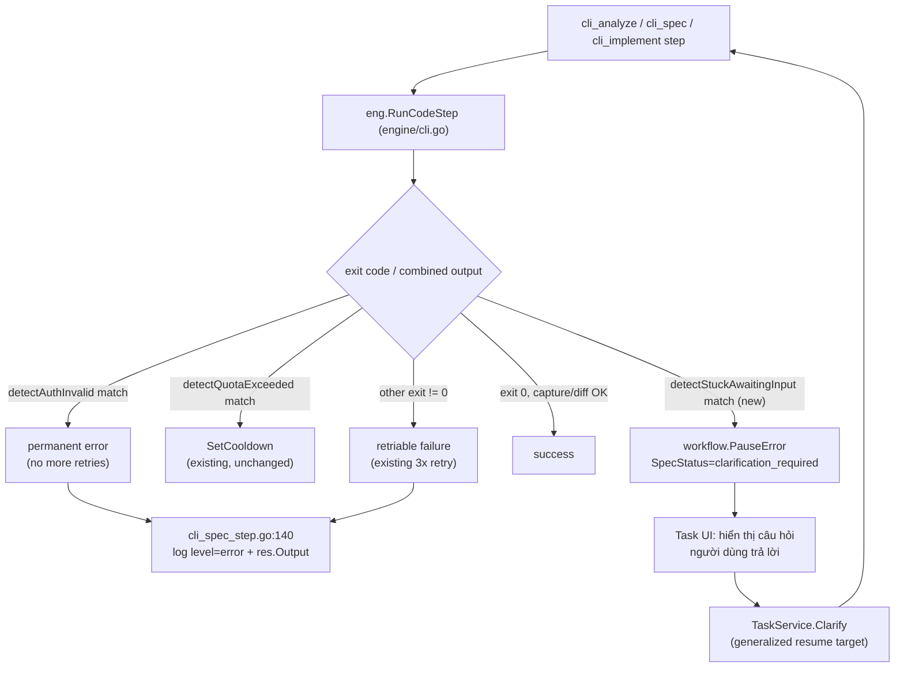

# Design: CLI Execution Reliability & Tracing

## Architecture



## Issue 1 — Log lỗi CLI step kèm lý do thật

`cli_spec_step.go:140` hiện tại:

```go
r.o.log(ctx, task.ID, &jobID, "info", fmt.Sprintf("%s: cli engine finished (success=%v)", stepID, res.Success))
```

Đổi thành:

```go
if res.Success {
    r.o.log(ctx, task.ID, &jobID, "info", fmt.Sprintf("%s: cli engine finished (success=true)", stepID))
} else {
    reason := res.Error
    if reason == "" {
        reason = "unknown error"
    }
    r.o.log(ctx, task.ID, &jobID, "error", fmt.Sprintf("%s: cli engine failed: %s\n--- output (last 2000 chars) ---\n%s",
        stepID, reason, lastN(res.Output, 2000)))
}
```

- `res.Output`/`res.Error` đã qua `redactSecrets` trong `RunCodeStep` (`cli.go:324,333`) — an toàn để log thẳng, không redact lại.
- Cắt còn 2000 ký tự cuối (`lastN`, helper mới nhỏ trong cùng file) để không làm phình `.jsonl` log với output CLI dài (một số CLI in hàng nghìn dòng tool-call trace) — log đầy đủ vẫn còn nguyên trong DB artifact `cli_output` như hiện tại, không đổi.

## Issue 2 — Phân loại lỗi auth-invalid là permanent

File mới `server/internal/orchestrator/engine/cli_auth.go`, cấu trúc y hệt `cli_quota.go` (đã có, đã test):

```go
package engine

import "regexp"

// CLIAuthInvalidRule mirrors CLIQuotaRule (cli_quota.go) but for a
// different failure class: the linked credential is present and marked
// active, yet the CLI itself reports it isn't authenticated. Unlike quota
// (transient, cools down and retries later), this is permanent until a
// human re-runs the CLI auth capture flow — retrying burns attempts for
// nothing since the same credential produces the same failure every time.
type CLIAuthInvalidRule struct {
    Patterns []*regexp.Regexp
}

var CLIAuthInvalidRules = map[string][]CLIAuthInvalidRule{
    "claude_code": {
        {Patterns: []*regexp.Regexp{
            regexp.MustCompile(`(?i)not logged in`),
            regexp.MustCompile(`(?i)please run /login`),
            regexp.MustCompile(`(?i)please run claude login`),
        }},
    },
    "openai_codex": {
        {Patterns: []*regexp.Regexp{
            regexp.MustCompile(`(?i)not authenticated`),
            regexp.MustCompile(`(?i)codex login`),
        }},
    },
    "antigravity": {
        {Patterns: []*regexp.Regexp{
            regexp.MustCompile(`(?i)not authenticated`),
            regexp.MustCompile(`(?i)please sign in`),
        }},
    },
    "*": {
        {Patterns: []*regexp.Regexp{
            regexp.MustCompile(`(?i)not logged in`),
            regexp.MustCompile(`(?i)please authenticate`),
            regexp.MustCompile(`(?i)authentication required`),
        }},
    },
}

func detectAuthInvalid(ref string, combined string) bool {
    rules, ok := CLIAuthInvalidRules[ref]
    if !ok {
        rules = CLIAuthInvalidRules["*"]
    }
    for _, rule := range rules {
        for _, p := range rule.Patterns {
            if p.MatchString(combined) {
                return true
            }
        }
    }
    return false
}
```

`RunCodeStep` (`cli.go:311-335`) gọi thêm `authInvalid := detectAuthInvalid(cfg.ProfileRef, combined)` cạnh `quotaExceeded`, thêm field `AuthInvalid bool` vào `CodeStepResult` (`engine.go`, struct hiện có `Success`/`Output`/`LoopKilled`/`QuotaExceeded`/`Files`). Khi `authInvalid`, set `res.Error` với prefix rõ ràng (vd `"cli engine: credential not authenticated (permanent, will not retry): ..."`).

`RunCLIStep` (`cli_spec_step.go:146-153`) — khi `out`/lỗi trả về mang theo `AuthInvalid`, wrap lỗi bằng cách nào đó caller nhận diện được là non-retriable. Cách ít xâm lấn nhất: dùng lại pattern đã có cho `ErrConfigInvalid` — wrap lỗi với `%w: engine.ErrConfigInvalid` khi `AuthInvalid=true`, để bất kỳ nơi nào retry-loop đang check `errors.Is(err, engine.ErrConfigInvalid)` tự động không retry nữa (cần xác nhận retry-loop hiện tại của `worker.go`/state machine có check `ErrConfigInvalid` chưa — nếu chưa, đây là chỗ cần thêm check trong state machine, ghi rõ trong `tasks.md`).

## Issue 3 — `auth_check_command` thực sự kiểm tra login

**Giới hạn đã biết**: không có tài liệu xác nhận lệnh CLI thật cho `claude`/`codex`/`antigravity` để check login *mà không* kích hoạt side-effect (gọi API tốn quota, hoặc cố mở OAuth flow). Đây không phải lỗi thiết kế của OpenSpec này — là unknown thật cần verify thủ công (chạy thử từng CLI, xem `--help`/docs của từng binary) trước khi sửa code.

Hướng tiếp cận đề xuất (không đoán lệnh cụ thể):
1. Với mỗi CLI, tìm lệnh "whoami"/"status" kiểu read-only (không tốn quota) nếu có.
2. Nếu không có lệnh nào như vậy tồn tại cho 1 CLI cụ thể, chấp nhận giới hạn: `auth_check_command` giữ nguyên `--version`-style (chỉ check binary), nhưng **Issue 2** (detect auth-invalid ở runtime) là lưới an toàn thực sự — preflight không bắt được thì lần chạy thật vẫn bắt được và không đốt hết retry.
3. Việc này được tách thành 1 task riêng trong `tasks.md`, đánh dấu "Investigation" trước "Implementation", không viết code mù trước khi xác nhận lệnh thật.

## Issue 4 — Prompt cấm hỏi lại

Thêm 1 đoạn giống nhau vào cuối `cli_analyze.md`, `cli_spec.md`, `cli_implement.md`:

```markdown
## Do not ask clarifying questions

You are running non-interactively — there is no user available to answer a
question mid-run. If something is ambiguous or underspecified, make the most
reasonable assumption, proceed, and record the assumption explicitly (under
Risks for cli_analyze, under "## Implementation Notes" for cli_spec/
cli_implement). Never stop and wait for input.
```

`cli_analyze.md` đã có section `## Risks` — assumption ghi vào đó. `cli_implement.md` đã có convention "note it in `design.md` under a `## Implementation Notes` section" cho trường hợp spec sai — dùng chung section đó cho assumption luôn, không thêm section mới.

## Issue 5 — Detector "stuck-awaiting-input"

Mở rộng `loop_detector.go` bằng 1 rule-set tách biệt (không trộn vào `errorLinePatterns`, vì ngữ nghĩa khác: input-patterns không cần "lặp lại 10 lần" mới có ý nghĩa — xuất hiện **1 lần ở cuối output khi process đã kết thúc** là đủ tín hiệu):

```go
// cli_question_detect.go
package engine

import "regexp"

var awaitingInputPatterns = []*regexp.Regexp{
    regexp.MustCompile(`(?i)\(y/n\)\s*$`),
    regexp.MustCompile(`(?i)do you want to\b.*\?\s*$`),
    regexp.MustCompile(`(?i)please confirm\b`),
    regexp.MustCompile(`(?i)waiting for (user )?input`),
    regexp.MustCompile(`(?i)\bwhich (option|approach|one)\b.*\?\s*$`),
}

// detectAwaitingInput reports whether the CLI's last non-empty output line
// looks like it's blocked waiting for an answer — checked only on the last
// line (not the whole transcript) because these tools print a lot of
// legitimate "?"-ending progress text; only the final line matters since
// the process has already exited/been killed by the time this runs.
func detectAwaitingInput(lastLine string) bool {
    for _, p := range awaitingInputPatterns {
        if p.MatchString(lastLine) {
            return true
        }
    }
    return false
}
```

`RunCodeStep` gọi `detectAwaitingInput(lastNonEmptyLine(combined))` cạnh `killed`/`quotaExceeded`/`authInvalid`. Đây là heuristic best-effort — không thể phủ hết mọi CLI, nhưng che được các trường hợp phổ biến nhất (y/n prompt, "Do you want to...?"). Ghi rõ trong `tasks.md` đây là danh sách pattern ban đầu, mở rộng dần khi gặp case thật (giống cách `CLIQuotaRules` đã phát triển).

## Issue 6 — Pause/resume tái dùng clarification infra

Khác với `analyze.go` (LLM trả `clarification_questions` có cấu trúc), CLI step chỉ có raw text. Khi `detectAwaitingInput` match:

```go
// trong cli_analyze.go / cli_spec.go / cli_implement.go, sau khi nhận `out`
if out.AwaitingInput {
    round := models.ClarificationRound{
        Round:     len(priorRounds) + 1,
        Timestamp: time.Now(),
        Questions: []string{lastNonEmptyLine(out.Output)}, // best-effort: 1 câu duy nhất trích từ output
    }
    // ... append vào task.Clarifications, set SpecStatus=TaskSpecStatusClarificationRequired
    return nil, workflow.PauseError{Step: s.ID(), Reason: "workflow paused for human task clarification (cli)"}
}
```

**Khác biệt cần xử lý so với flow API-native**: `TaskService.Clarify` (`service/task.go:245-249`) hard-code:

```go
specStatus := models.TaskSpecStatusNone
status := models.TaskStatusAnalyzing
```

Điều này đúng cho flow API-native (clarification luôn phát sinh ở step `analyze`, resume luôn quay lại `analyze`). Với CLI flow, clarification có thể phát sinh ở `cli_analyze`, `cli_spec`, hoặc `cli_implement` — resume phải quay lại **đúng step đã pause**, không phải luôn `Analyzing`.

Đề xuất tối thiểu-xâm-lấn: thêm field `PausedStep string` vào `models.Task` (hoặc tái dùng field đã có nếu tồn tại — cần kiểm tra trước khi thêm cột DB mới), set khi pause, đọc khi `Clarify` để quyết định `status`/`StatusOnResume` tương ứng thay vì hard-code `TaskStatusAnalyzing`. Việc engine đã có `CompletedSteps` (`workflow/engine.go:70-72`) để resume-from-checkpoint (chỉ chạy lại step chưa complete) nghĩa là **không cần** re-implement resume logic — chỉ cần `status` sau `Clarify` đúng để job re-queue vào đúng chỗ trong state machine.

Đây là thay đổi có rủi ro (đụng vào service dùng chung cho cả 2 flow) — tách thành task riêng, có test rõ ràng cho cả 2 trường hợp (clarify từ `analyze` vẫn hoạt động y hệt hôm nay; clarify từ CLI step resume đúng step CLI đó).

## Issue 7 — Xác nhận flag non-interactive (manual verification)

Checklist thủ công (không phải code) — chạy từng CLI trong sandbox thật với `CI=1`, không stdin, thử kích hoạt 1 tình huống cần xác nhận (vd yêu cầu nó sửa 1 file nằm ngoài phạm vi rõ ràng), quan sát: nó có tự treo chờ tty không, hay tự thoát/tự quyết. Ghi kết quả vào `tasks.md` khi thực hiện.

## Risk Mitigation

| Risk | Severity | Mitigation |
|------|----------|------------|
| Regex pattern nhận diện "hỏi lại" sai (false positive) làm dừng oan 1 run đang chạy hợp lệ | MEDIUM | Chỉ check dòng cuối cùng của output sau khi process đã kết thúc/bị kill do timeout — không check giữa chừng, không thể tự "dừng oan" 1 run đang tiến triển |
| `TaskService.Clarify` generalize sai làm hỏng resume của flow API-native đang chạy tốt | HIGH | Test riêng: mọi test case cũ của `Clarify`/`analyze.go` phải pass y hệt trước/sau; thêm field mới thay vì sửa field cũ |
| `auth_check_command` sửa sai (do đoán lệnh không tồn tại) làm preflight luôn fail | HIGH | Tách Issue 3 thành Investigation-first task, không code trước khi xác nhận lệnh thật; Issue 2 (runtime detection) là lưới an toàn độc lập không phụ thuộc Issue 3 |
| Log 2000 ký tự cuối vào jsonl vẫn làm phình log nếu step fail nhiều lần liên tục | LOW | Đã có sẵn cơ chế log rotation/optimization từ `log-output-optimization-2026` (đã implement) — không cần giải lại ở đây |
