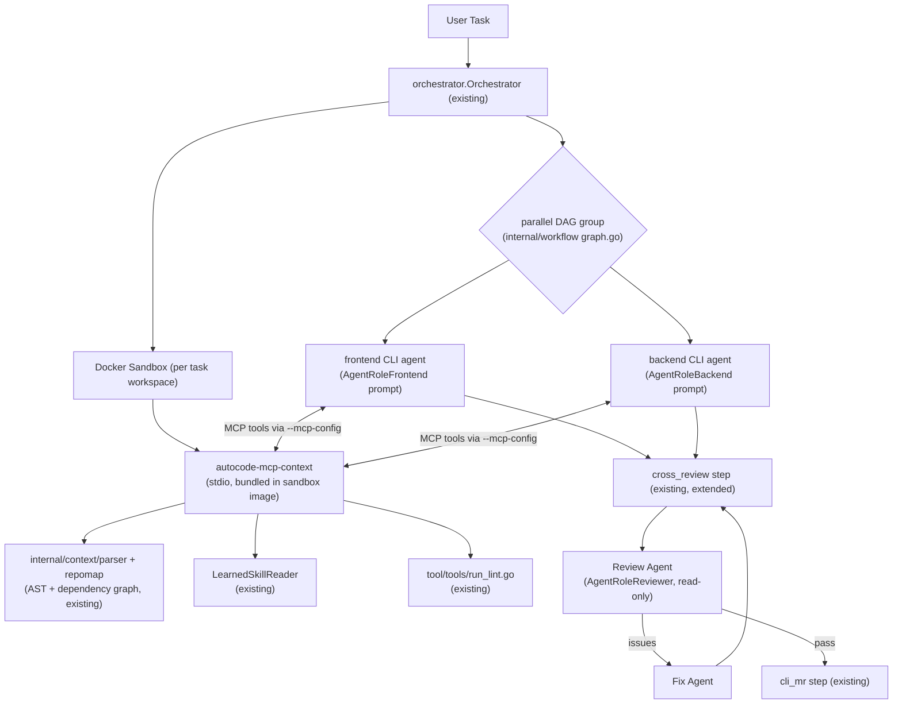

# Design: CLI Orchestrator Update

## Key Decisions
- **Decision:** Introduce a wrapper Orchestrator around CLI agent execution.
- **Reason:** CLI agents like Claude Code are incredibly capable and fast executors, but they lack visibility into overarching workflows and shouldn't act as their own unbiased reviewers. Wrapping them provides multi-agent parity with the API-native flow without rebuilding the underlying LLM intelligence engine.

- **Decision:** Split state and output contracts by direction — **state** (phase transitions, resume point) lives in the DB (`workflow_jobs`/checkpoints, via `WorkflowRepository`), **agent output** (`.autocode/review.json`, capture files) stays on the filesystem.
- **Reason:** State needs to be the single source of truth the server can query/resume from without depending on the task workspace still existing (workspaces get cleaned up post-task, see `wkspace.ReleaseWorkspaceLock`) — the existing `WorkflowCheckpoint`/`SaveArtifact` machinery (`internal/orchestrator/checkpoint`) already does this atomically and is what every other CLI step (`cli_analyze`, `cli_spec`, `cli_implement`) uses today, so this reuses it rather than adding a second, file-based state store that could drift from the DB. Agent *output*, by contrast, is naturally filesystem-shaped because it's the CLI agent writing to its own working directory — same convention as `.autocode/analysis.md` (`cliAnalysisCapturePath`, `steps/cli_analyze.go`), read back via `CodeStepRequest.CaptureFiles`/`out.Files[...]`.

## Approach
Instead of creating a new CLI wrapper, we extend the existing AutoCodeOS orchestrator (`server/internal/orchestrator`) to add a parallel-group DAG shape and an independent review/fix loop on top of the CLI spec-first pipeline that already exists (`cli_analyze` → `cli_spec` → `cli_implement` → `cross_review`/`cli_mr`, see `steps/cli_analyze.go`, `cli_spec_step.go`, `execution_router.go`'s `shouldUseCLISpecFirstWorkflow`). The orchestrator also bundles an **AutoCodeOS Context MCP Server** binary into the CLI sandbox image. This is a **bridge, not a new intelligence engine** — the AST/dependency-graph/symbol-extraction/RepoMap machinery it wraps already exists and is already used by the API-native flow's `context_load` step:
- `internal/context/parser` (tree-sitter based AST parsing, multi-language)
- `internal/context/symbol` (`ExtractTags` — function/class/variable extraction)
- `internal/context/repomap` (`DependencyGraph.BuildGraph`/`CalculatePageRank` — dependency graph + relevance ranking)
- `internal/context/provider` (`Provider.RetrieveContext`/`GetRepoMap`/`IndexWorkspace` — the same entrypoint `context_load.go` already calls)

Today this is only reachable from inside the Go process running the API-native tool loop. The MCP server's entire job is exposing these same Go APIs to the CLI agent subprocess, which otherwise can't call into the backend at all.

## Alternatives Considered
- **Directly modifying Claude Code / CLI Agents:** Rejected. We don't control the proprietary implementations of tools like Claude Code. We must treat them as black-box executors.
- **A standalone local `autocode` CLI binary (offline/air-gapped mode):** Rejected for this phase. It would run disconnected from the server-managed Docker sandbox (`sandbox.DockerRuntime`) that every CLI step already runs inside today, forcing two parallel orchestration systems with no stated migration path. If an offline mode is wanted later, it should be scoped as its own proposal once the server-side orchestrator work here has landed.
- **Reaching the MCP server over the network (e.g. a host-side HTTP endpoint):** Rejected. CLI steps run as subprocesses inside a Docker container the orchestrator manages; a prior feature (the read-only git credential helper, see `wkspace.writeGitCredentialHelper`) already hit this — network reachability from inside the sandbox (`host.docker.internal`, loopback) is unreliable across Docker setups. The MCP server must instead be a binary bundled into the same sandbox image and spoken to over **stdio** by each CLI tool's own MCP client config — mechanism differs per tool (see `docs/guides/headless-cli-tools.md#mcp-server-configuration`): Claude Code via `.mcp.json`/`--mcp-config`, Codex via `[mcp_servers.<name>]` in `~/.codex/config.toml`, Antigravity via workspace-level `mcp_config.json` (or the Interactive MCP Manager for interactive setup) — consistent with the file/bind-mount-based approach already used for git credentials.

## Architecture

## Interfaces & Contracts
- **Workflow Definition:** `internal/workflow` DAG (`Definition`/`ValidateDAG`, `graph.go`) — the parallel group is declared here, not a new schema.
- **State Persistence:** `WorkflowRepository` (`workflow_jobs`, checkpoints) — same store `cli_analyze`/`cli_spec`/`cli_implement` already checkpoint through, tracks current phase and resume point.
- **MCP Tools** (each a thin wrapper, not new intelligence):
  | Tool | Backed by |
  |---|---|
  | `repo.search` | `context/provider.Provider.RetrieveContext` |
  | `ast.query` | `context/symbol.ExtractTags` + `context/parser` |
  | `dependency.impact` | `context/repomap.DependencyGraph` (built via `BuildGraph`) |
  | `skill.search` | `LearnedSkillReader.SearchActiveByText` (already used by `context_load.go`) |
  | `architecture.query` | `context/provider.Provider.GetRepoMap` |
  | `quality.check` | `tool/tools/run_lint.go` |
- **Review Feedback:** `.autocode/review.json` (Structured output from the Review Agent containing an array of `issues`) — same capture-file convention as `.autocode/analysis.md`.

## Security Boundaries
- **Review Agent Confinement:** The Review Agent profile must aggressively enforce read-only tools or rely on containerized read-only mounts to ensure it cannot accidentally "fix" code during the review step.

## Observability & Tracing
- **MCP Stdio Isolation:** All internal logging in the MCP server (`mcp-context`) must write to `server/.data/workspaces/<task-id>/logs/mcp-server.log` or `stderr`. Writing logs to `stdout` is strictly prohibited to prevent JSON-RPC payload corruption.
- **Context Traceability:** The MCP server must dump all JSON-RPC request and response payloads to `server/.data/workspaces/<task-id>/logs/mcp-trace.jsonl` to provide a reproducible trace of exactly what context the agent received.
- **Subprocess Telemetry:** The Orchestrator must enforce structured JSON output from CLI agents (e.g., `--output-format json`) to extract duration, token usage, and cost, saving these metrics in the `workflow_jobs` database table.
- **Persistent Log Streams:** The Orchestrator uses `io.MultiWriter` to stream CLI subprocess output (`stdout`/`stderr`) directly to persistent files (`server/.data/workspaces/<task-id>/logs/cli_{role}_run.log`) in real-time to avoid data loss on container death or out-of-memory errors.

## Resilience & Operational Security
- **Authentication Bridge:** Provider API Keys (`ANTHROPIC_API_KEY`, etc.) are held by the orchestrator and injected into the Docker container solely as environment variables at execution time. They are strictly excluded from all `cmd.Args` and console log buffers.
- **Context Cancellation:** The API Orchestrator enforces process cancellation via `os/exec.CommandContext`. A user-initiated task cancellation on the Web UI will send an immediate SIGTERM to the Docker runtime, cascading down to the CLI agent and its local MCP server.
- **Idle Timeouts & Loop Protection:** Rather than imposing a hard absolute timeout that kills legitimately complex tasks, the Orchestrator enforces an **Idle Timeout** (e.g., 15 minutes without `stdout`/`stderr` activity) and monitors the stream for repetitive error loops. If the agent repeats identical shell errors excessively, it is terminated automatically.
- **Partial Checkpoint Recovery:** The state machine tracks progress per DAG node. If `frontend` succeeds but `backend` crashes, a retry will resurrect the `frontend` worktree from the DB checkpoint and strictly re-run the `backend` track, eliminating redundant token burn.

## Risks
- **Context Staleness (AST/Graph Desync):** Since the CLI agent runs for a long time and modifies files dynamically, an AST/Dependency graph generated at startup will become stale. 
  - *Mitigation:* The MCP Server must implement **Dynamic Context Invalidation**. On every `ast.query` or `repo.search` call, the server quickly checks file modification times (`mtime`) or `git diff`. If a file has been modified by the agent since the last index, the server incrementally re-parses only that file using `go-tree-sitter` before returning the result.
- **Concurrency Conflicts:** Two parallel agents might attempt to modify the same shared file (e.g., `package.json`).
  - *Mitigation:* Reuse `repoutil.Manager.SetupRoleWorktrees`/`CommitRoleWorktrees` (`internal/orchestrator/repoutil/worktrees.go`) — role-scoped git worktrees already exist for exactly this isolation need (used today for FE/BE role branches). The frontend and backend CLI agents each get their own worktree/branch; `cross_review` merges them before the review phase, matching the existing role-branch pattern instead of inventing new file locking.
