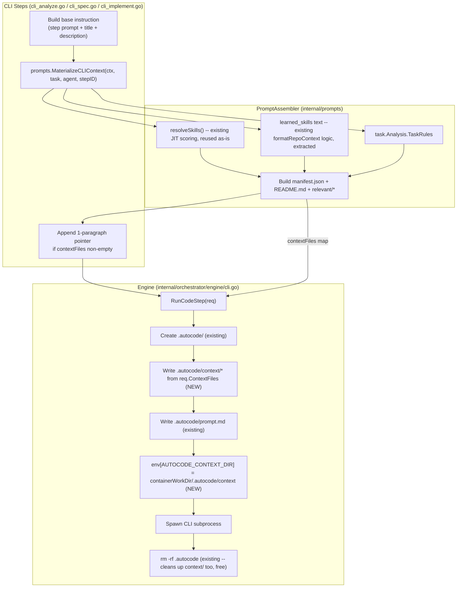

# Design: CLI Platform Knowledge Injection (v2 — Context Materializer)

## Architecture



## Data Flow

1. CLI step calls `prompts.LoadStepPrompt(stepID)` → base step template (unchanged).
2. CLI step calls `prompts.MaterializeCLIContext(ctx, task, agent, stepID)`:
   - Calls existing `resolveSkills(ctx, task, agent, stepID)` — same scoring already used by API mode (role match, `RequiredSkillsMap`, title/description keyword match) — selects up to `maxJITSkills` (5). This directly fixes the v1 bug where relevance-scoring was claimed but never actually invoked.
   - Renders each selected skill's full `ParsedSkill.Content` to `relevant/skills/<slugified-name>.md`.
   - Queries `a.learnedSkills` (injected via `LearnedSkillsLister` interface) using `SearchActiveByText(ctx, task.ProjectID, query, 3)`, and renders `relevant/learned_skills.md` using a shared `RenderLearnedSkillsSection` helper (extracted from `context_load.go`).
   - Reads `task.Analysis.TaskRules` (same JSON field API mode's `AssembleForAgent` already unmarshals) into `relevant/task_rules.md`.
   - Builds `manifest.json` (task id/type, counts of what's actually included, `sources` list) and `README.md` (short human/agent-readable pointer) — always present when the map is non-empty, even if some Layer-2 sub-parts are missing.
   - Enforces a combined ~12000 char budget across Layer 2 files; drops lowest-scored skills first if exceeded, `manifest.json.available` reflects the final counts (not the pre-drop counts).
   - Returns `map[string]string` (relative path → content), or an empty map when nothing is available (REQ-002).
3. CLI step passes this map as `contextFiles` to `runner.RunCLIStep(ctx, task, agent, jobID, stepID, instruction, captureFiles, contextFiles)`.
4. `cliStepRunner.RunCLIStep` threads `contextFiles` into `engine.CodeStepRequest.ContextFiles`.
5. `engine.cliEngine.RunCodeStep`:
   - Already creates `hostAutocodeDir` (`req.ContainerWorkDir + "/.autocode"`) before writing `prompt.md` — this is the existing ephemeral scratch convention (`cli.go:244-264`), auto-removed via in-script `rm -rf $autocodeDir` and a host-side `defer os.RemoveAll(hostAutocodeDir)` backup. **No new lifecycle mechanism is introduced** — `context/` is just a subdirectory of the same ephemeral root, cleaned up for free.
   - For each `(relPath, content)` in `req.ContextFiles`, writes `hostAutocodeDir/context/<relPath>` (creating parent dirs via `os.MkdirAll`).
   - Sets `env["AUTOCODE_CONTEXT_DIR"] = req.ContainerWorkDir + "/.autocode/context"` alongside the existing `env["CI"]`/`env["HOME"]` assignments (`cli.go:298-302`).
6. CLI binary runs with `AUTOCODE_CONTEXT_DIR` in its environment. The instruction's 1-paragraph pointer (REQ-004) tells it this exists. The agent decides — via its own shell/file tools — whether, when, and how deeply to read it. Platform's job stops at "make it discoverable."

## Key Design Decisions

### Materialize to disk, not inject into text (rejects v1)
CLI binaries (agy/claude/codex) are autonomous agents with their own shell/file tools — they don't need content pre-chewed into the prompt. Dumping full skill text into the instruction string duplicates work the agent can already do itself (reading a file) and forces the platform to guess relevance up front. Writing real files and pointing at them keeps the platform's role to "make knowledge discoverable," not "decide what matters."

### Resolve relevance first, don't mount everything (rejects v1.5)
v1.5 proposed deep-copying the *entire* `.data/projects/{id}/skills/` directory into `.autocode/skills/`. This scales badly (hundreds/thousands of skills with zero guidance) and reintroduces exactly the "let the agent search a haystack with no help" problem JIT scoring was built to avoid on the API side. Reusing `resolveSkills()` for Layer 2 keeps the same relevance signal API mode already benefits from, without duplicating scoring logic.

### Reuse the existing `.autocode/` ephemeral convention for lifecycle
The user's concern about "workspace rác" is already solved by code that exists today: `.autocode/` is created fresh and torn down (both in the container's own shell script and defensively on the host) around every single CLI invocation. `context/` rides along for free — no `/tmp/autocode-context/<task-id>` or new bind mount is needed, and no risk of parallel-task collisions since each task already gets its own workspace/worktree.

### Instruction stays thin — pointer only, never content
Per REQ-004: the instruction only ever gains a fixed, short paragraph (see Task 2.1 wording) referencing `$AUTOCODE_CONTEXT_DIR`. It never lists skill names or embeds skill text. If the agent chooses not to look, that is the agent's decision, not something the platform should compensate for by force-feeding content.

### Layer 3 (full catalog/index) explicitly deferred
A `catalog/skills.index` / `catalog/learned_skills.index` (names only, no content, for future on-demand/lazy fetch) is a reasonable evolution once skill volume grows enough that even Layer 2's top-5 stops being sufficient — but it adds a query/lazy-fetch dimension not needed yet. Per "keep it minimal," this spec's P0/P1 scope stops at Layer 1 + Layer 2. Layer 3 is noted as a future step (see `tasks.md` P2) so the next iteration doesn't have to re-derive this reasoning.

### This is not "Option C" (a queryable context tool) — that would be a separate future step
A future `autocode-context list|search|show` CLI tool inside the sandbox (if ever built) should stay a thin convenience layer over the materialized files (`/proc`-style: filesystem is the source of truth), never a proxy back to a live platform API — otherwise it silently reintroduces API-mode's structured-retrieval model into what should stay a filesystem-only contract for CLI mode. Out of scope for this spec; noted here only so the boundary is documented.

## API Changes

```go
// internal/orchestrator/engine/engine.go — CodeStepRequest gains one field
type CodeStepRequest struct {
    // ... existing fields unchanged ...

    // ContextFiles maps a path relative to .autocode/context/ to its content.
    // Written by RunCodeStep alongside prompt.md, before the CLI subprocess
    // spawns; torn down by the same .autocode/ cleanup. Nil/empty means no
    // context/ directory is created at all (identical to today's behavior).
    ContextFiles map[string]string
}
```

```go
// internal/orchestrator/steps/services.go — StepPromptLoader gains one method
type StepPromptLoader interface {
    LoadStepPrompt(stepID string) (string, error)
    MaterializeCLIContext(ctx context.Context, task models.Task, agent *models.Agent, stepID string) (map[string]string, error) // NEW
}

// CLIStepRunner.RunCLIStep gains one parameter
type CLIStepRunner interface {
    RunCLIStep(ctx context.Context, task *models.Task, agent *models.Agent, jobID, stepID, instruction string, captureFiles []string, contextFiles map[string]string) (CLIStepOutput, error)
}
```

## Risk Mitigation

| Risk | Severity | Mitigation |
|------|----------|------------|
| `resolveSkills` requires `agent *models.Agent`, not always populated in CLI step context | MEDIUM | `cli_analyze.go`/`cli_spec.go`/`cli_implement.go` already carry `s.rt.Agent` (passed through to `RunCLIStep` today) — thread the same value into `MaterializeCLIContext`; `resolveSkills` already tolerates `agent == nil` (role-based scoring simply contributes 0) |
| `PromptAssembler` missing `LearnedSkillsLister` dependency | MEDIUM | Add `LearnedSkillsLister` interface to `internal/prompts`, add `WithLearnedSkillsLister` builder method, and wire `LearnedSkillRepo` during `PromptAssembler` initialization in orchestrator |
| Interface change breaks compilation in test mocks | HIGH if missed | Explicitly enumerated in `specs.md` REQ-005 and `tasks.md`: all 4 `mockStepPromptLoader` sites + the CLI step runner mock in `engine/cli_test.go` — this is the exact gap that broke v1's task breakdown |
| Layer 2 budget drop changes agent behavior between runs non-deterministically | LOW | Drop order is deterministic (lowest `resolveSkills` score first, stable tie-break by skill name) — same run twice with unchanged inputs yields identical `manifest.json` |
| `AUTOCODE_CONTEXT_DIR` collides with an env var the CLI binary already uses internally | LOW | Checked against documented flags/env for claude/codex/agy (`docs/guides/*-cli-headless.md`) — no existing collision; naming is namespaced (`AUTOCODE_` prefix) |
