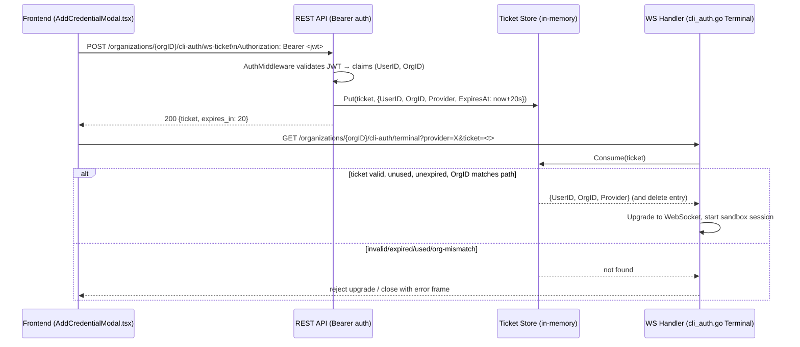

# Design: CLI Terminal WebSocket Ticket Auth

## Architecture



## Data Models

```go
// server/internal/handler/ws_ticket_store.go (new file)

package handler

import (
	"crypto/rand"
	"encoding/hex"
	"sync"
	"time"
)

// wsTicket is a single-use, short-lived, org-scoped credential exchanged
// for a query-param-safe value so the raw JWT never appears in a WS URL.
type wsTicket struct {
	UserID    string
	OrgID     string
	Provider  string
	ExpiresAt time.Time
}

const wsTicketTTL = 20 * time.Second

// wsTicketStore is an in-memory single-replica store. If the API ever runs
// multiple replicas without sticky WS routing, this must move to Redis —
// out of scope while the service is single-instance (see Risk Mitigation).
type wsTicketStore struct {
	mu      sync.Mutex
	tickets map[string]wsTicket
}

func newWSTicketStore() *wsTicketStore {
	return &wsTicketStore{tickets: make(map[string]wsTicket)}
}

// Mint creates a new random ticket bound to the given identity and returns
// the opaque token to hand back to the client.
func (s *wsTicketStore) Mint(userID, orgID, provider string) (string, error) {
	buf := make([]byte, 32)
	if _, err := rand.Read(buf); err != nil {
		return "", err
	}
	token := hex.EncodeToString(buf)

	s.mu.Lock()
	defer s.mu.Unlock()
	s.evictExpiredLocked()
	s.tickets[token] = wsTicket{
		UserID:    userID,
		OrgID:     orgID,
		Provider:  provider,
		ExpiresAt: time.Now().Add(wsTicketTTL),
	}
	return token, nil
}

// Consume validates and deletes a ticket in one atomic step (single-use).
// Returns ok=false if the ticket is missing, expired, or already consumed.
func (s *wsTicketStore) Consume(token, orgID string) (wsTicket, bool) {
	s.mu.Lock()
	defer s.mu.Unlock()

	t, found := s.tickets[token]
	delete(s.tickets, token) // single-use: always remove, valid or not

	if !found || time.Now().After(t.ExpiresAt) || t.OrgID != orgID {
		return wsTicket{}, false
	}
	return t, true
}

func (s *wsTicketStore) evictExpiredLocked() {
	now := time.Now()
	for k, v := range s.tickets {
		if now.After(v.ExpiresAt) {
			delete(s.tickets, k)
		}
	}
}
```

```go
// server/internal/handler/cli_auth.go — additions

type CLIAuthHandler struct {
	runtime sandbox.Runtime
	tickets *wsTicketStore // new field
}

func NewCLIAuthHandler(runtime sandbox.Runtime) *CLIAuthHandler {
	return &CLIAuthHandler{runtime: runtime, tickets: newWSTicketStore()}
}

// MintWSTicket handles POST /organizations/{orgID}/cli-auth/ws-ticket.
// Runs behind the existing AuthMiddleware chi.Router group (Bearer-only).
func (h *CLIAuthHandler) MintWSTicket(w http.ResponseWriter, r *http.Request) {
	orgID := chi.URLParam(r, "orgID")
	claims, ok := r.Context().Value(authClaimsKey).(*service.TokenClaims)
	if !ok || claims.OrgID != orgID {
		writeError(w, http.StatusForbidden, "org mismatch")
		return
	}

	var body struct {
		Provider string `json:"provider"`
	}
	if err := decodeJSON(r, &body); err != nil || body.Provider == "" {
		writeError(w, http.StatusBadRequest, "missing provider")
		return
	}

	ticket, err := h.tickets.Mint(claims.Subject, claims.OrgID, body.Provider)
	if err != nil {
		writeError(w, http.StatusInternalServerError, "failed to mint ticket")
		return
	}
	writeJSON(w, http.StatusOK, map[string]any{
		"ticket":     ticket,
		"expires_in": int(wsTicketTTL.Seconds()),
	})
}
```

```go
// server/internal/handler/cli_auth.go — Terminal() modification (replaces
// the current `provider := r.URL.Query().Get("provider")` block)

func (h *CLIAuthHandler) Terminal(w http.ResponseWriter, r *http.Request) {
	orgID := chi.URLParam(r, "orgID")
	ticketStr := r.URL.Query().Get("ticket")
	if ticketStr == "" {
		http.Error(w, "missing ticket", http.StatusUnauthorized)
		return
	}
	ticket, ok := h.tickets.Consume(ticketStr, orgID)
	if !ok {
		http.Error(w, "invalid, expired, or already-used ticket", http.StatusUnauthorized)
		return
	}
	provider := ticket.Provider // derived from ticket, not query param (REQ-007)

	conn, err := upgrader.Upgrade(w, r, nil)
	// ... rest of function unchanged, using `provider`, ticket.UserID/OrgID
	// for any audit/log fields instead of trusting r.URL.Query() or path alone.
}
```

```typescript
// web/src/lib/api/gateway.ts — additions

export const cliAuth = {
  mintWSTicket: (orgID: string, token: string, provider: string) =>
    request<{ ticket: string; expires_in: number }>(
      `/organizations/${orgID}/cli-auth/ws-ticket`,
      { method: "POST", token, body: JSON.stringify({ provider }) }
    ),
};
```

```tsx
// web/src/app/ai-providers/components/AddCredentialModal.tsx — wsUrl construction changes from:
//   wsUrl = `${wsBaseUrl}/organizations/${orgID}/cli-auth/terminal?provider=${form.provider}&token=${token}`;
// to an async ticket mint performed before rendering <InteractiveTerminal />:

const { ticket } = await api.cliAuth.mintWSTicket(orgID, token, form.provider);
const wsUrl = `${wsBaseUrl}/organizations/${orgID}/cli-auth/terminal?provider=${form.provider}&ticket=${ticket}`;
```

## API Endpoints

| Method | Path | Auth | Description |
|--------|------|------|-------------|
| POST | `/organizations/{orgID}/cli-auth/ws-ticket` | Bearer (existing `AuthMiddleware`) | Mint a 20s single-use ticket bound to `(UserID, OrgID, Provider)` |
| GET (WS upgrade) | `/organizations/{orgID}/cli-auth/terminal?provider=&ticket=` | Ticket (consumed on first use) | Open interactive CLI auth terminal; replaces old `?token=` param |

## Security & Execution Boundaries

| Agent | Allowed Paths | Permissions |
|-------|----------------|-------------|
| Coder | `server/internal/handler/cli_auth.go`, `server/internal/handler/ws_ticket_store.go`, `server/internal/handler/router.go` | Read, Write |
| Coder | `web/src/app/ai-providers/components/AddCredentialModal.tsx`, `web/src/lib/api/gateway.ts`, `web/src/lib/api/index.ts` | Read, Write |
| Reviewer | `server/internal/handler/`, `web/src/lib/api/`, `web/src/app/ai-providers/` | Read only |

## Out of Scope
- Other WebSocket routes (if any are added later) that might use `AuthMiddleware`'s generic `?token=` fallback are not touched by this change; this proposal only removes that fallback's *usage* for `cli-auth/terminal`, not the fallback mechanism itself in `AuthMiddleware`.
- Multi-replica ticket store (Redis-backed) — the service runs as a single API instance today; revisit if horizontal scaling is introduced.

## Risk Mitigation

| Risk | Severity | Mitigation |
|------|----------|------------|
| Ticket store grows unbounded if `Consume` is never called (client never connects after minting) | LOW | `evictExpiredLocked()` runs opportunistically on every `Mint`; entries are always TTL-bounded to 20s regardless |
| Race: two goroutines call `Consume` on the same ticket concurrently | MEDIUM | `Consume` holds `s.mu` for the full read-check-delete sequence, so only one caller can ever observe `found=true` |
| Multi-replica deployment splits ticket mint (replica A) from WS upgrade (replica B) | MEDIUM (future) | Documented as out-of-scope for current single-instance deployment; flag for follow-up spec if horizontal scaling is added |
| Frontend still logs `wsUrl` to console/Sentry with ticket visible | LOW | Ticket is single-use + 20s TTL, so even if logged it's a minor, rapidly-expiring exposure — orders of magnitude better than a standing JWT |
