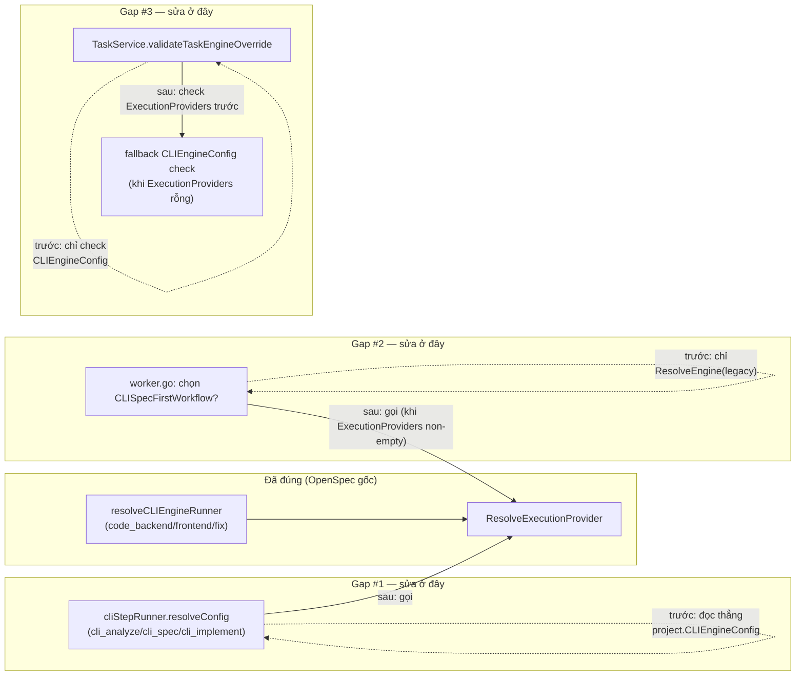

# Design: Execution Provider Routing — Adoption Gaps

## Architecture Overview

Không có Router mới — 3 điểm gọi dưới đây được sửa để **gọi `Orchestrator.ResolveExecutionProvider`** (đã tồn tại từ `cli-execution-provider-routing/`) thay vì đọc thẳng field cũ, đúng pattern `resolveCLIEngineRunner` đã làm cho `code_backend`/`code_frontend`/`fix`.



## Issue 1: `cli_spec_step.go`

### Hiện tại
```go
func (r *cliStepRunner) resolveConfig(ctx context.Context, task *models.Task) (*models.CLIEngineConfig, string, error) {
	project, err := r.o.projects.GetByID(ctx, task.ProjectID)
	...
	var cfg models.CLIEngineConfig
	if len(project.CLIEngineConfig) > 0 {
		json.Unmarshal(project.CLIEngineConfig, &cfg)
	}
	return &cfg, project.OrgID, nil
}
```
`cfg.ProfileRef` không bao giờ được set → `detectQuotaExceeded` luôn rơi vào rule `"*"` thay vì rule đúng theo tool. `RunCLIStep` không đọc `res.QuotaExceeded` — không có write-side cooldown.

### Sau khi sửa
```go
type cliStepRunner struct {
	o         *Orchestrator
	once      sync.Once
	preflight error
	credID    string // set bởi resolveConfig, đọc bởi RunCLIStep sau khi RunCodeStep
}

func (r *cliStepRunner) resolveConfig(ctx context.Context, task *models.Task) (*models.CLIEngineConfig, string, error) {
	if r.o.projects == nil {
		return nil, "", fmt.Errorf("cli step runner: project repository unavailable")
	}
	project, err := r.o.projects.GetByID(ctx, task.ProjectID)
	if err != nil {
		return nil, "", fmt.Errorf("cli step runner: load project: %w", err)
	}
	resolved, err := r.o.ResolveExecutionProvider(ctx, task, project)
	if err != nil {
		return nil, "", fmt.Errorf("cli step runner: %w", err)
	}
	if resolved.Type != "cli" {
		// worker.go (Issue 2) chỉ chọn cliStepRunner khi Router đã xác nhận
		// candidate cli — nếu vẫn tới đây với type=="api" thì 2 lần resolve
		// (worker.go lúc chọn workflow, ở đây lúc chạy step) đã bất đồng,
		// tức có thay đổi state giữa 2 lần gọi (vd credential vừa cooldown) —
		// fail rõ ràng thay vì âm thầm chạy CLI với config rỗng.
		return nil, "", fmt.Errorf("cli step runner: resolved provider is %q, not cli", resolved.Type)
	}
	r.credID = resolved.CredentialID
	return resolved.CLIConfig, project.OrgID, nil
}
```
`RunCLIStep` thêm đúng đoạn `cliEngineRunner.RunLLMStep` đã có, đặt ngay sau `eng.RunCodeStep`:
```go
if res.QuotaExceeded && r.credID != "" && r.o.cooldownSetter != nil {
	_ = r.o.cooldownSetter.SetCooldown(ctx, r.credID, "", time.Now().Add(cliCooldownDuration))
}
```
(`cliCooldownDuration` đã là hằng số package-level trong `cli_engine_step.go`, tái dùng — không định nghĩa lại.)

## Issue 2: `worker.go`

### Hiện tại (dòng ~296-309)
```go
var projectEngine string
if o.projects != nil {
	if p, err := o.projects.GetByID(ctx, task.ProjectID); err == nil {
		projectEngine = p.ExecutionEngine
		includeCrossReview = p.ReviewHarnessPolicy != models.ReviewHarnessSame
	}
}
if cliengine.ResolveEngine(task.ExecutionEngine, projectEngine) == models.ExecutionEngineCLI {
	def = workflow.CLISpecFirstWorkflow(runners, includeCrossReview)
}
```

### Sau khi sửa
```go
var project *models.Project
if o.projects != nil {
	if p, err := o.projects.GetByID(ctx, task.ProjectID); err == nil {
		project = p
		includeCrossReview = p.ReviewHarnessPolicy != models.ReviewHarnessSame
	}
}
if o.shouldUseCLISpecFirstWorkflow(ctx, task, project) {
	def = workflow.CLISpecFirstWorkflow(runners, includeCrossReview)
}
```

Hàm mới trong `execution_router.go` (cạnh `ResolveExecutionProvider`, cùng nhóm trách nhiệm):
```go
// shouldUseCLISpecFirstWorkflow reports whether task should run the
// cli_analyze -> cli_spec -> cli_implement workflow shape instead of the
// default DAG. Empty ExecutionProviders falls back to the legacy
// ResolveEngine check byte-identically (REQ-003 of the original OpenSpec);
// a non-empty list asks the Router the same question it will answer again
// per-step later — both calls happen at task/job start with no state
// change in between, consistent with "resolve once at Task start" (REQ-005).
func (o *Orchestrator) shouldUseCLISpecFirstWorkflow(ctx context.Context, task *models.Task, project *models.Project) bool {
	if project == nil {
		return false
	}
	if len(project.ExecutionProviders) == 0 {
		return engine.ResolveEngine(task.ExecutionEngine, project.ExecutionEngine) == models.ExecutionEngineCLI
	}
	resolved, err := o.ResolveExecutionProvider(ctx, task, project)
	return err == nil && resolved.Type == "cli"
}
```

**Lưu ý về REQ-005 (không mid-task switch)**: gọi `ResolveExecutionProvider` ở đây (chọn shape) và lại gọi trong `resolveCLIEngineRunner`/`cliStepRunner.resolveConfig` (chạy step) là 2 lần gọi riêng biệt, không phải "switch mid-task" — cả 2 đều xảy ra trước khi bất kỳ step nào thật sự chạy, tại thời điểm job được pick up. Nếu state đổi giữa 2 lần gọi (hiếm, cần đúng lúc credential cooldown xảy ra trong khoảng mili-giây giữa 2 call), Issue 1's guard (`resolved.Type != "cli"` → lỗi rõ ràng) là lưới an toàn — task fail với message rõ, user retry sẽ tự nhiên nhất quán lại.

## Issue 3: `internal/service/task.go`

### Hiện tại
```go
func (s *TaskService) validateTaskEngineOverride(ctx context.Context, projectID, executionEngine string) error {
	if executionEngine != models.ExecutionEngineCLI {
		return nil
	}
	project, err := s.projectRepo.GetByID(ctx, projectID)
	...
	var cfg models.CLIEngineConfig
	json.Unmarshal(project.CLIEngineConfig, &cfg)
	if err := models.ValidateCLIEngineConfig(executionEngine, &cfg); err != nil {
		return ErrValidation(...)
	}
	return nil
}
```

### Sau khi sửa
```go
func (s *TaskService) validateTaskEngineOverride(ctx context.Context, projectID, executionEngine string) error {
	if executionEngine != models.ExecutionEngineCLI {
		return nil
	}
	project, err := s.projectRepo.GetByID(ctx, projectID)
	if err != nil {
		return fmt.Errorf("get project: %w", err)
	}
	providers, err := models.ValidateExecutionProviders(project.ExecutionProviders)
	if err != nil {
		return ErrValidation(err.Error())
	}
	if len(providers) > 0 {
		for _, p := range providers {
			if p.Type == "cli" && p.Enabled {
				return nil // ít nhất 1 candidate cli đã bật — đủ để không chặn ở đây, Router quyết credential lúc chạy
			}
		}
		return ErrValidation("task execution_engine cannot be set to \"cli\": project has no enabled cli execution provider")
	}
	var cfg models.CLIEngineConfig
	if len(project.CLIEngineConfig) > 0 {
		_ = json.Unmarshal(project.CLIEngineConfig, &cfg)
	}
	if err := models.ValidateCLIEngineConfig(executionEngine, &cfg); err != nil {
		return ErrValidation(fmt.Sprintf("task execution_engine cannot be set to \"cli\": project has no cli_engine_config configured (%s)", err.Error()))
	}
	return nil
}
```
`s.projectRepo` cần trả về `*models.Project` với field `ExecutionProviders` (đã có sẵn — không cần đổi interface, chỉ đọc thêm field đã tồn tại).

## Security & Risk Mitigation

| Risk | Mitigation |
|---|---|
| Issue 2 gọi `ResolveExecutionProvider` 2 lần/job (1 lần chọn shape, 1 lần build runner) — tăng nhẹ số lần query credential | Cả 2 lần đều là read-only lookup nhẹ (không side-effect), xảy ra 1 lần lúc job pickup, không phải per-step — chi phí không đáng kể so với việc thật sự chạy CLI subprocess |
| Issue 3 nới lỏng validate (không check credential khả dụng ngay lúc tạo task) có thể cho phép tạo task rồi fail lúc chạy | Đây là hành vi **nhất quán** với cách Router hoạt động cho project cũ (`ValidateCLIEngineConfig` cũng chỉ check `Command` không rỗng, không check credential/quota lúc validate) — không phải nới lỏng bất thường, chỉ đồng bộ 2 con đường validate |

## Trade-offs

- **Không hợp nhất `cliStepRunner`/`cliEngineRunner` thành 1 type** dù giờ cả 2 đều gọi Router giống nhau: 2 runner có hợp đồng khác nhau (`steps.CLIStepRunner` file-based contract vs `steps.LLMRunner` patch-retry loop, xem comment gốc trong `cli_spec_step.go`) — hợp nhất là refactor lớn hơn phạm vi OpenSpec này, không cần thiết để đóng gap.
