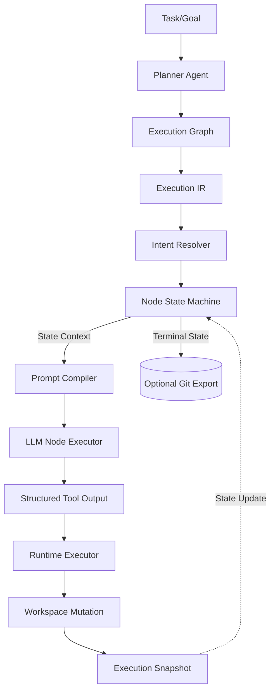

# Design: Execution Semantics 2026

## Architecture



## Data Models

```go
type ExecutionIR struct {
    NodeID      string       `json:"node_id"`
    Intent      Intent       `json:"intent"`
    Constraints []string     `json:"constraints"`
    Acceptance  []string     `json:"acceptance"`
    Budget      PhaseBudgets `json:"budget"`
}

type Intent struct {
    Capability string `json:"capability"`
    Operation  string `json:"operation"`
}

type PhaseBudgets struct {
    Discovery      int `json:"discovery"`
    Implementation int `json:"implementation"`
    Validation     int `json:"validation"`
}

type ExecutionSnapshot struct {
    ExecutionID   string            `json:"execution_id"`
    CurrentState  string            `json:"current_state"`
    Iteration     int               `json:"iteration"`
    WorkspaceDiff string            `json:"workspace_diff"`
    ToolHistory   []ToolCallRecord  `json:"tool_history"`
    PromptHash    string            `json:"prompt_hash"`
    Timestamp     time.Time         `json:"timestamp"`
}
```

## Security & Execution Boundaries

| Agent | Allowed Paths | Permissions |
|-------|---------------|-------------|
| Planner | N/A | Semantic output only (Execution IR) |
| Intent Resolver | Workspace | Read only |
| Coder (DISCOVERY) | Workspace | Read only |
| Coder (IMPLEMENTATION) | Resolved Physical Targets | Read, Write |

## Risk Mitigation

| Risk | Severity | Mitigation |
|------|----------|------------|
| Incomplete IR Schema | HIGH | Strict JSON Schema validation on Planner output |
| Prompt Compiler Drift | MEDIUM | Unit tests per provider (GPT, Gemini, Claude) |
| Missing Intent mappings | HIGH | Fallback to manual resolution or DISCOVERY state error |
