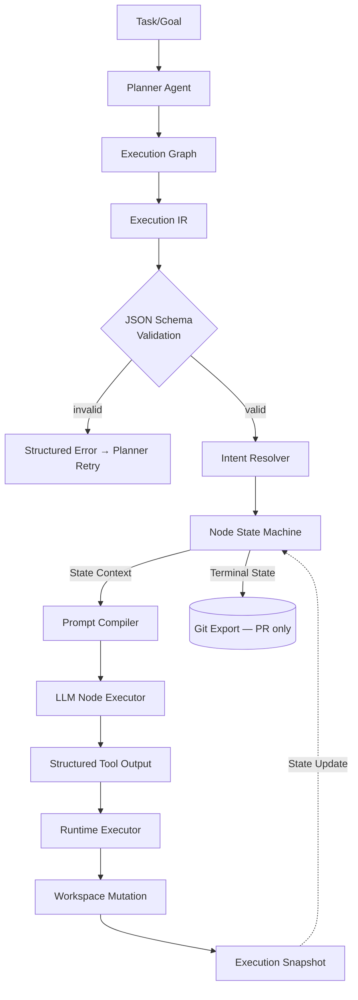
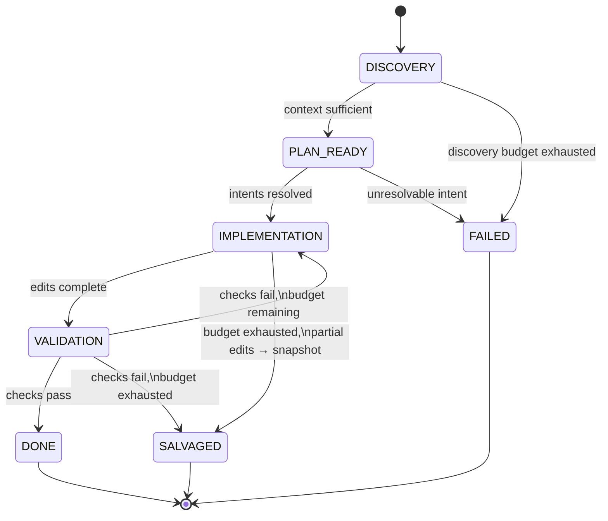

# Design: Execution Semantics 2026

## Architecture (Pipeline)



## Node State Machine



### Transition Rules

| State | LLM-driven | Budget | Tool Allowlist | Exit Condition |
|-------|-----------|--------|----------------|----------------|
| `DISCOVERY` | Yes | `budget.discovery` | Read-only (read_file, search, list) | Model signals context sufficiency, or budget exhausted → `FAILED` |
| `PLAN_READY` | No (deterministic gate) | — | None | All intents resolved → `IMPLEMENTATION`; any unresolved → `FAILED` |
| `IMPLEMENTATION` | Yes | `budget.implementation` | Read + Write **scoped to resolved targets** | Edits complete → `VALIDATION`; budget exhausted with edits → `SALVAGED` |
| `VALIDATION` | Yes | `budget.validation` | Read + test/lint execution | Pass → `DONE`; fail → back to `IMPLEMENTATION` if its budget remains, else `SALVAGED` |
| `SALVAGED` / `DONE` / `FAILED` | Terminal | — | — | Snapshot persisted; `DONE` may trigger Git export |

## Data Models

```go
// ExecutionIR is validated against schemas/execution_ir.schema.json before any
// prompt is compiled (REQ-001). Validation contract:
//   - additionalProperties: false — unknown fields are rejected, not ignored
//     (Go side decodes with json.Decoder.DisallowUnknownFields to match).
//   - required: node_id, intent, budget. constraints/acceptance may be empty
//     arrays but not null.
//   - schema_version pins the contract; a Planner emitting a different major
//     version fails validation rather than being best-effort parsed.
type ExecutionIR struct {
    SchemaVersion string       `json:"schema_version"` // e.g. "1.0"
    NodeID        string       `json:"node_id"`
    Intent        Intent       `json:"intent"`
    Constraints   []string     `json:"constraints"`
    Acceptance    []string     `json:"acceptance"`
    Budget        PhaseBudgets `json:"budget"`
}

type Intent struct {
    Capability string `json:"capability"` // semantic target, e.g. "UserRepository"; non-empty
    Operation  string `json:"operation"`  // enum: create | modify | delete | refactor
}

// PLAN_READY is a deterministic gate, not an LLM phase — it has no budget.
type PhaseBudgets struct {
    Discovery      int `json:"discovery"`
    Implementation int `json:"implementation"`
    Validation     int `json:"validation"`
}

type ExecutionSnapshot struct {
    ExecutionID   string           `json:"execution_id"`
    CurrentState  string           `json:"current_state"` // one of the state machine states
    Iteration     int              `json:"iteration"`     // within CurrentState
    WorkspaceDiff string           `json:"workspace_diff"` // unified diff vs. node entry workspace
    ToolHistory   []ToolCallRecord `json:"tool_history"`
    PromptHash    string           `json:"prompt_hash"` // hash of compiled prompt for replay integrity
    Timestamp     time.Time        `json:"timestamp"`
}

type ToolCallRecord struct {
    State     string          `json:"state"`
    Iteration int             `json:"iteration"`
    Tool      string          `json:"tool"`
    Args      json.RawMessage `json:"args"`
    Result    string          `json:"result"` // truncated per config
    Error     string          `json:"error,omitempty"`
}
```

## Security & Execution Boundaries

| Actor | Allowed Paths | Permissions |
|-------|---------------|-------------|
| Planner | N/A | Semantic output only (Execution IR); no tool access |
| Intent Resolver | Workspace | Read only |
| Coder (`DISCOVERY`) | Workspace | Read only |
| Coder (`IMPLEMENTATION`) | Resolved physical targets only | Read (workspace-wide), Write (targets only) |
| Coder (`VALIDATION`) | Workspace | Read + sandboxed test/lint execution; no writes |
| Snapshot store | Snapshot directory (outside workspace) | Write by runtime only |

## Migration & Rollout

1. **Flag-gated**: `execution.state_machine_enabled` in `server/pkg/config/config.yaml`, default `false`.
2. **Step-by-step migration**: coding steps first (highest budget pain), then `analyze` (recently migrated onto `RunToolLoop` in commit `31825ef` — migrate last to avoid churn).
3. **Parallel telemetry**: while flagged off for a step, log what the state machine *would* have gated, to validate allowlists before enforcement.
4. **Removal**: delete `RunToolLoop` and the Git salvage path only after all steps run flag-on for one release cycle.

## Risk Mitigation

| Risk | Severity | Mitigation |
|------|----------|------------|
| Incomplete/loose IR schema lets drift back in | HIGH | Strict JSON Schema validation on Planner output; unknown fields rejected |
| Big-bang tool-loop replacement regresses working steps | HIGH | Flag-gated per-step rollout + parallel telemetry (see Migration) |
| Missing intent mappings block all execution | HIGH | Fail fast at `PLAN_READY` with resolution error; planner retry with error context |
| Prompt Compiler drift across providers | MEDIUM | Golden-file unit tests per provider (GPT, Gemini, Claude) in `prompts/golden_test.go` style |
| Snapshot size growth (large diffs + tool history) | MEDIUM | Truncate tool results per config; store diff not full workspace copy |
| Replay divergence (snapshot restored ≠ original state) | MEDIUM | `PromptHash` integrity check on resume; byte-identical restore test (REQ-003) |
