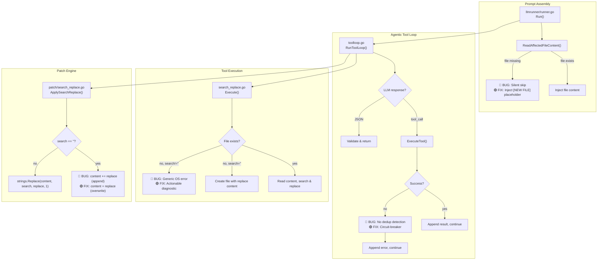

# Design: Fix Search/Replace Tool Infinite Loop

## Architecture

The bug spans 4 components in the agentic coding pipeline. The fix touches each component
at a single, surgical point without changing the overall architecture.



## Data Models

No new data models. The changes are behavioral modifications to existing functions.

### Circuit-Breaker State (toolloop.go internal)

```go
// failureTracker tracks consecutive failures per (tool, path) pair within a single
// RunToolLoop invocation. It is NOT persisted — it resets each time the loop starts.
type failureTracker struct {
    counts map[string]int // key: "tool_name:path"
}

func (ft *failureTracker) record(toolName, path string) int {
    key := toolName + ":" + path
    ft.counts[key]++
    return ft.counts[key]
}

func (ft *failureTracker) reset(toolName, path string) {
    delete(ft.counts, toolName+":"+path)
}
```

## Change Details

### Change 1: `search_replace.go` — Actionable error for non-existent files

**Location:** `server/internal/tool/tools/search_replace.go`, lines 82-94

**Before:**
```go
if os.IsNotExist(err) && search == "" {
    fileExisted = false
    data = []byte{}
} else {
    return tool.Result{
        Success: false,
        Diagnostics: []tool.Diagnostic{
            {Severity: "error", File: path, Message: fmt.Sprintf("cannot read file: %v", err)},
        },
    }, nil
}
```

**After:**
```go
if os.IsNotExist(err) {
    if search == "" {
        fileExisted = false
        data = []byte{}
    } else {
        return tool.Result{
            Success: false,
            Diagnostics: []tool.Diagnostic{
                {Severity: "error", File: path, Message: fmt.Sprintf(
                    "File %q does not exist. To create it, use the create_file tool, "+
                        "or call search_replace with an empty search parameter (search: \"\") "+
                        "to write the initial file content.", path)},
            },
        }, nil
    }
} else {
    return tool.Result{
        Success: false,
        Diagnostics: []tool.Diagnostic{
            {Severity: "error", File: path, Message: fmt.Sprintf("cannot read file: %v", err)},
        },
    }, nil
}
```

### Change 2: `llmrunner/runner.go` — Placeholder for non-existent affected files

**Location:** `server/internal/orchestrator/llmrunner/runner.go`, lines 63-73

**Before:**
```go
for _, file := range analysis.AffectedFiles {
    if content, ok := r.ReadAffectedFileContent(ctx, task, file.File); ok {
        displayPath := paths.WorkspaceToRepoRelative(file.File)
        b.WriteString(fmt.Sprintf("\n--- %s ---\n```\n%s\n```\n", displayPath, content))
    }
}
```

**After:**
```go
for _, file := range analysis.AffectedFiles {
    displayPath := paths.WorkspaceToRepoRelative(file.File)
    if content, ok := r.ReadAffectedFileContent(ctx, task, file.File); ok {
        b.WriteString(fmt.Sprintf("\n--- %s ---\n```\n%s\n```\n", displayPath, content))
    } else {
        b.WriteString(fmt.Sprintf("\n--- %s [NEW FILE — does not exist yet] ---\nThis file needs to be created. Use the create_file tool.\n", displayPath))
    }
}
```

### Change 3: `toolloop.go` — Circuit-breaker for repeated failures

**Location:** `server/internal/orchestrator/llmrunner/toolloop.go`, inside the tool-call branch

Add a `failureTracker` that increments on each error result for a `(tool, path)` pair. After
2 consecutive failures, skip the tool call and inject a corrective user message instead.

### Change 4: `patch/search_replace.go` — Overwrite instead of append

**Location:** `server/internal/orchestrator/patch/search_replace.go`, lines 133-135

**Before:**
```go
if search == "" {
    // Append or create
    content += replace
}
```

**After:**
```go
if search == "" {
    // Overwrite entire file (create or replace)
    content = replace
}
```

## Security & Execution Boundaries

| Agent | Allowed Paths | Permissions |
|-------|---------------|-------------|
| Coder (backend) | Role-specific worktree | Read, Write (via BoundaryCheckedToolExecutor) |
| Coder (frontend) | Role-specific worktree | Read, Write (via BoundaryCheckedToolExecutor) |

No changes to boundary enforcement. All edits go through the existing
`BoundaryCheckedToolExecutor` → `EvaluatePolicy` chain.

## Risk Mitigation

| Risk | Severity | Mitigation |
|------|----------|------------|
| Circuit-breaker accidentally blocks legitimate retries | MEDIUM | Only triggers after 2 consecutive identical failures; resets on any success |
| Overwrite semantics break existing workflows using append | LOW | Audit callers — `search==""` is documented as "replace entire file", not "append" |
| Placeholder text in prompt confuses the LLM | LOW | Use clear `[NEW FILE]` marker; matches existing conventions in codebase |
