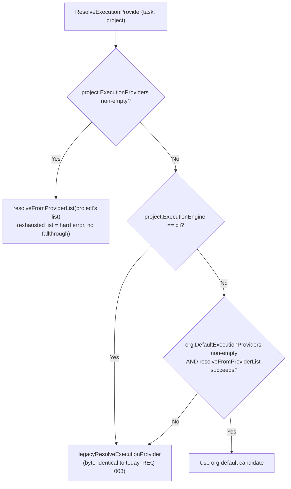

# Design: Global Default Execution Providers

## Precedence (the part the original draft left unspecified)

Four sources can determine a task's execution provider, in this exact order:

1. **`task.ExecutionEngine`** — not a source by itself, but narrows whichever list below is selected down to just `"api"` or `"cli"` rows (already implemented, `cli-execution-provider-routing-adoption-gaps/`).
2. **`project.ExecutionProviders`** (non-empty) — explicit per-project priority list. Highest priority; if this list is exhausted with no available candidate, that's a hard error (REQ-004 of `cli-execution-provider-routing/`), never a silent fall-through to org defaults.
3. **`project.ExecutionEngine == "cli"`** (legacy single-engine field, explicitly set) — a project already deliberately configured this way keeps running exactly as before, forever. **This is checked before the org default**, specifically so enabling a global default never changes behavior for a project already on the legacy CLI path (see proposal.md's correction note for why this matters).
4. **`organization.DefaultExecutionProviders`** (non-empty) — only reached when steps 2 and 3 both had nothing to offer, i.e. the project has never configured any execution routing at all (still sitting on `execution_providers=[]` and `execution_engine="api_native"`, the DB defaults). Same candidate-selection logic as step 2, just against the org's list instead of the project's.
5. Otherwise — today's plain `api_native` default (unchanged).



## Data Models

`Organization.DefaultExecutionProviders` mirrors `Project.ExecutionProviders` exactly — same underlying type (`json.RawMessage`/jsonb), same validator (`models.ValidateExecutionProviders`), same `[]models.ExecutionProviderConfig` shape once parsed. No new Go type needed.

```go
// server/pkg/models/organization.go
type Organization struct {
	ID                        string          `json:"id" gorm:"type:uuid;default:uuid_generate_v4();primaryKey"`
	Name                      string          `json:"name" gorm:"not null"`
	Description               string          `json:"description" gorm:"default:''"`
	DefaultExecutionProviders json.RawMessage `json:"default_execution_providers,omitempty" gorm:"column:default_execution_providers;type:jsonb;default:'[]'"`
	CreatedAt                 time.Time       `json:"created_at"`
	UpdatedAt                 time.Time       `json:"updated_at"`
}

type UpdateOrganizationInput struct {
	Name                      *string         `json:"name,omitempty"`
	Description               *string         `json:"description,omitempty"`
	DefaultExecutionProviders json.RawMessage `json:"default_execution_providers,omitempty"`
}
```

### Migration

`server/migration/000020_add_org_default_execution_providers.up.sql`:
```sql
ALTER TABLE organizations ADD COLUMN default_execution_providers jsonb NOT NULL DEFAULT '[]';
```
`.down.sql`: `ALTER TABLE organizations DROP COLUMN default_execution_providers;`

No backfill needed — same reasoning as the original `execution_providers` migration: existing rows default to `[]`, and `[]` means "nothing configured", which is exactly the precedence chain's step-4 no-op case.

## Backend Wiring

### Validation (`internal/service/organization.go`)
```go
func (s *OrganizationService) Update(ctx context.Context, id string, input models.UpdateOrganizationInput) (*models.Organization, error) {
	if _, err := models.ValidateExecutionProviders(input.DefaultExecutionProviders); err != nil {
		return nil, ErrValidation(err.Error())
	}
	return s.repo.Update(ctx, id, input)
}
```
`internal/repository/organization.go`'s `Update` passes `input.DefaultExecutionProviders` through to the `updates` map exactly like `ProjectRepo.Update` already does for `ExecutionProviders` (`if len(input.DefaultExecutionProviders) > 0 { updates["default_execution_providers"] = input.DefaultExecutionProviders }`).

### Orchestrator (`internal/orchestrator/`)

New minimal interface, mirroring `ProjectRepository`:
```go
// interfaces.go
type OrganizationRepository interface {
	GetByID(ctx context.Context, id string) (*models.Organization, error)
}
```
```go
// orchestrator.go
type Orchestrator struct {
	...
	orgs OrganizationRepository
}

func WithOrganizationRepository(repo OrganizationRepository) Option {
	return func(o *Orchestrator) { o.orgs = repo }
}
```
`cmd/api/main.go` already constructs `orgRepo := repository.NewOrganizationRepo(db)` (used today only for the handler) — pass the same instance: `orchestrator.WithOrganizationRepository(orgRepo)`.

### `execution_router.go`

Extract the existing inline candidate-selection loop (currently inside `ResolveExecutionProvider`) into a standalone helper so both project-level and org-level lists share it exactly:
```go
func (o *Orchestrator) resolveFromProviderList(ctx context.Context, orgID string, providers []models.ExecutionProviderConfig, taskEngineOverride *string) (*ResolvedExecutionProvider, error) {
	// body = today's sort + task-override-narrowing + candidate loop, unchanged
}
```
`ResolveExecutionProvider` becomes:
```go
func (o *Orchestrator) ResolveExecutionProvider(ctx context.Context, task *models.Task, project *models.Project) (*ResolvedExecutionProvider, error) {
	providers, err := models.ValidateExecutionProviders(project.ExecutionProviders)
	if err != nil {
		return nil, fmt.Errorf("execution provider routing: %w", err)
	}
	if len(providers) > 0 {
		return o.resolveFromProviderList(ctx, project.OrgID, providers, task.ExecutionEngine)
	}
	if project.ExecutionEngine != models.ExecutionEngineCLI {
		if resolved, ok := o.resolveFromOrgDefault(ctx, task, project); ok {
			return resolved, nil
		}
	}
	return o.legacyResolveExecutionProvider(task, project), nil
}

// resolveFromOrgDefault tries the organization's DefaultExecutionProviders.
// Returns ok=false for any reason it can't produce a candidate (no org repo
// wired, org lookup failed, list empty/invalid, or list exhausted) — every
// ok=false case falls through to the plain legacy/api_native default in the
// caller, never an error surfaced to the user, since "no org default
// configured" is the overwhelmingly common case and must stay silent.
func (o *Orchestrator) resolveFromOrgDefault(ctx context.Context, task *models.Task, project *models.Project) (*ResolvedExecutionProvider, bool) {
	if o.orgs == nil {
		return nil, false
	}
	org, err := o.orgs.GetByID(ctx, project.OrgID)
	if err != nil {
		return nil, false
	}
	providers, err := models.ValidateExecutionProviders(org.DefaultExecutionProviders)
	if err != nil || len(providers) == 0 {
		return nil, false
	}
	resolved, err := o.resolveFromProviderList(ctx, project.OrgID, providers, task.ExecutionEngine)
	if err != nil {
		return nil, false
	}
	return resolved, true
}
```

`shouldUseCLISpecFirstWorkflow` gets the identical shape of change (project list → org default → legacy `ResolveEngine`), reusing `resolveFromOrgDefault`.

### `TaskService.validateTaskEngineOverride` (`internal/service/task.go`)

Needs an org repo dependency added (`TaskService.orgRepo *repository.OrganizationRepo`, threaded through `NewTaskService`'s signature — the one call site in `cmd/api/main.go` updates accordingly). When `project.ExecutionProviders` is empty and `project.ExecutionEngine != "cli"`, check the org's `DefaultExecutionProviders` for an enabled `cli` entry before falling back to the legacy `CLIEngineConfig.Command` check — same three-tier shape as the orchestrator side.

## Frontend

- `web/src/lib/types.ts`: add `default_execution_providers?: ExecutionProviderConfig[]` to `Organization`.
- `web/src/lib/api/auth.ts`: add `updateOrganization(orgID, token, input)` (`PATCH /organizations/{orgID}`), export from `web/src/lib/api/index.ts`.
- `web/src/app/ai-providers/page.tsx`: new "Global Routing" tab (admin-only — reuse the same role check the page already has for other admin actions, if any; otherwise the backend's `RequireRole(Admin)` on `PATCH /organizations/{orgID}` is the actual enforcement boundary regardless of what the UI shows). Renders `ExecutionProvidersList` bound to `organization.default_execution_providers` instead of a project's.
- `web/src/components/projects/project-profile.tsx`: when `project.execution_providers` is empty (and legacy `execution_engine != "cli"`), show an inline banner "Inheriting organization default routing" with a "Customize for this project" button that seeds the local editable list from the org's current default (a one-time copy — after that the project has its own non-empty list and behaves exactly like any explicitly-configured project, per precedence step 2).

## Security & Execution Boundaries

| Agent | Allowed Paths | Permissions |
|-------|---------------|-------------|
| Backend | `server/internal/`, `server/pkg/models`, `server/migration` | Read, Write |
| Frontend | `web/src/` | Read, Write |

`PATCH /organizations/{orgID}` is already `RequireRole(UserRoleAdmin)`-gated (verified in `router.go`) — no new authorization code needed, this reuses the existing boundary.

## Risk Mitigation

| Risk | Severity | Mitigation |
|------|----------|------------|
| Org default silently changing behavior for a project already on the legacy `execution_engine="cli"` path | HIGH (was unaddressed in the original draft) | Precedence check (`project.ExecutionEngine != "cli"`) happens *before* trying the org default — see "Precedence" above. |
| Existing projects/orgs behavior changes on deploy | LOW | Both new jsonb columns default to `'[]'` — an org with no default configured falls straight through to `legacyResolveExecutionProvider`, byte-identical to pre-migration behavior. |
| UI component complexity | LOW | Reuse `ExecutionProvidersList` as-is (already takes generic `{value, onChange, disabled}` — no project-specific coupling to remove). |
| `TaskService.validateTaskEngineOverride` rejecting a task-level `cli` override that the orchestrator would actually satisfy via org default | MEDIUM | Same three-tier check ported into `validateTaskEngineOverride`, not left as a follow-up — this exact class of bug (task-level override validated against a narrower source than the orchestrator actually uses) was already found and fixed once this session for the project-level list. |
