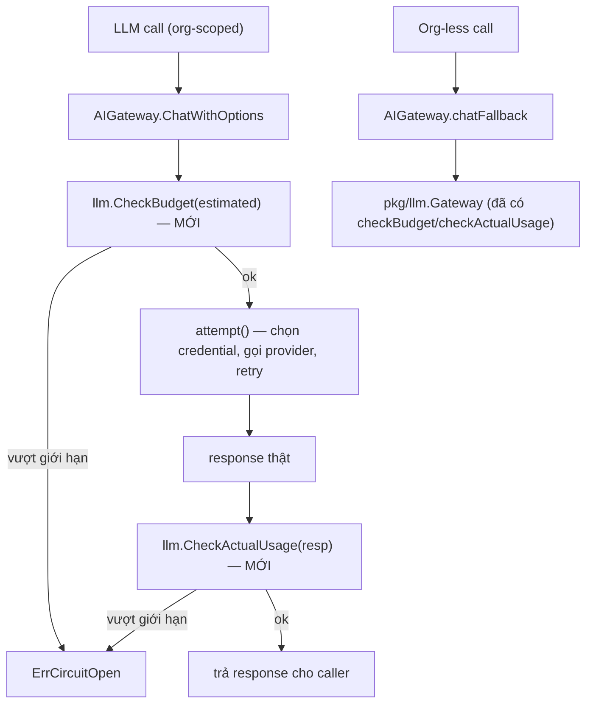

# Design: LLM Gateway Budget Guard + Consolidation

## Architecture Overview



## Issue 1: Budget circuit breaker cho `AIGateway`

### Extract thay vì viết lại
`pkg/llm.Gateway.checkBudget`/`checkActualUsage` (`router.go:271-309`) hiện là method, đọc `g.maxTokensPerCall`/`g.maxCostUSDPerCall` (field riêng của `Gateway`). Đổi thành hàm package-level nhận tham số tường minh, để cả `Gateway` lẫn `AIGateway` gọi chung — không có 2 bản logic:

```go
// pkg/llm/budget.go (file mới, tách khỏi router.go để không kéo theo các phụ
// thuộc riêng của Gateway vào chỗ AIGateway import)
package llm

func CheckBudget(inputTokens, outputLimit int, maxTokens int, maxCostUSD float64, meta ProviderMetadata) error {
	if maxTokens > 0 && inputTokens > maxTokens {
		return fmt.Errorf("%w: estimated input tokens %d exceed limit %d", ErrCircuitOpen, inputTokens, maxTokens)
	}
	if maxCostUSD > 0 {
		cost := estimateCost(inputTokens, outputLimit, meta)
		if cost > maxCostUSD {
			return fmt.Errorf("%w: estimated cost %.6f exceeds limit %.6f", ErrCircuitOpen, cost, maxCostUSD)
		}
	}
	return nil
}

func CheckActualUsage(resp *Response, cost float64, maxTokens int, maxOutputTokens int, maxCostUSD float64) error {
	if maxTokens > 0 && resp.PromptTokens > maxTokens {
		return fmt.Errorf("%w: prompt tokens %d exceed limit %d", ErrCircuitOpen, resp.PromptTokens, maxTokens)
	}
	if maxOutputTokens > 0 && resp.OutputTokens > maxOutputTokens {
		return fmt.Errorf("%w: output tokens %d exceed limit %d", ErrCircuitOpen, resp.OutputTokens, maxOutputTokens)
	}
	if maxCostUSD > 0 && cost > maxCostUSD {
		return fmt.Errorf("%w: actual cost %.6f exceeds limit %.6f", ErrCircuitOpen, cost, maxCostUSD)
	}
	return nil
}
```
`Gateway.checkBudget`/`checkActualUsage` trở thành wrapper mỏng gọi 2 hàm trên (giữ method signature cũ cho call site hiện có trong `router.go`, không đổi behavior).

### Wiring vào `AIGateway`
`AIGateway` cần biết `maxTokensPerCall`/`maxCostUSDPerCall` — thêm 2 field vào struct, set từ `cfg.LLM.CircuitMaxTokens`/`cfg.LLM.CircuitMaxCostUSD` lúc construct trong `cmd/api/main.go` (đã có sẵn giá trị này đọc cho `pkg/llm.Gateway`, chỉ cần truyền thêm 1 chỗ nữa).

Trong `ChatWithOptions`, chèn `CheckBudget` **ngay trước `attempt(eligibleEntries)`** (sau khi đã có `entries`/`opts`, trước khi tốn bất kỳ credential/API call nào) — ước tính input token bằng cách nào? `pkg/llm.Gateway` dùng `estimateTokens`-style helper trên `messages` (xem `router.go` các hàm ước tính gần `checkBudget`) — tái dùng nguyên hàm đó (export nếu đang private, hoặc di chuyển vào `budget.go` cùng 2 hàm trên) thay vì viết lại cách ước tính token.

`CheckActualUsage` chèn ngay sau khi có `resp` thành công (trước `return resp, nil` ở cuối `attempt`'s success path, đối xứng với chỗ `pkg/llm.Gateway` làm) — cost tính qua `EstimateCost`/`MetadataForModel` đã sẵn có, `gateway.go` đã import/dùng 2 hàm này ở chỗ khác (`gateway.go:358-359`) nên không phải thêm import mới.

**Không** áp `CheckBudget` cho `chatFallback` path — path đó gọi thẳng vào `pkg/llm.Gateway`, vốn đã tự check budget của chính nó.

## Issue 2: Recorder bị rớt ở fallback path

`cmd/api/main.go:350-368` (`buildLLMProvider`) hiện gọi `llm.NewProvider(cfg)` (không tham số recorder). `pkg/llm/provider.go:153`'s `NewProvider` cần thêm tham số `recorder llm.UsageRecorder`, truyền xuống `NewGatewayFromConfigWithRecorder(cfg, recorder)` thay vì hardcode `nil`. Đây là thay đổi signature public — grep toàn bộ `llm.NewProvider(` trước khi đổi để cập nhật hết call site (khả năng chỉ có `main.go`, nhưng phải verify, không giả định).

## Issue 3: Document `pkg/llm.Gateway` là fallback path

Thêm doc comment ở đầu `router.go`:
```go
// Package-level note: Gateway is the fallback LLM call path for org-less
// requests (opts.OrgID == "") — see internal/gateway.AIGateway for the
// primary, org-scoped path used by all real multi-tenant traffic. Kept
// as a separate, fully-functional implementation (not stubbed out) because
// it's still the live path for that one case; consolidating further is a
// follow-up once org-less calls are confirmed rare/removable.
```

## Trade-offs

- **Không hợp nhất `AIGateway`/`pkg/llm.Gateway` thành 1 type trong OpenSpec này** — 2 model dữ liệu khác nhau (`ComboEntry`+`CredentialPoolService` vs `RouteOptions`+chain đơn giản hơn), hợp nhất là refactor lớn, rủi ro cao hơn lợi ích so với việc chỉ đóng gap an toàn (Issue 1) + rò rỉ telemetry (Issue 2). Ghi nhận là follow-up khi có bằng chứng org-less call thật sự hiếm/không cần thiết.
