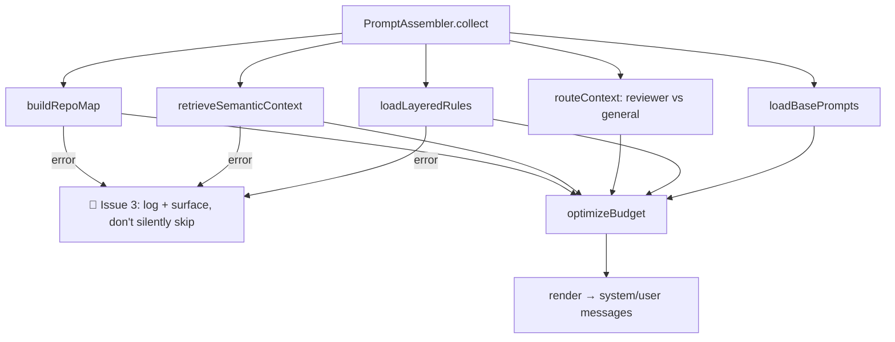

# Design: LLM Prompt & Tool Flow Hardening

## Architecture

Corrected call flow, annotated with where each fix from `proposal.md` plugs in (🔧 markers):

```mermaid
sequenceDiagram
    participant Step as Orchestrator Step (code_backend/fix/review/analyze)
    participant Runner as llmrunner.Runner
    participant Loop as RunToolLoop
    participant Exec as BoundaryCheckedToolExecutor
    participant Reg as tool.Registry
    participant GW as AIGateway
    participant Pool as CredentialPool
    participant Prov as Provider (OpenAI/Anthropic/Gemini/NineRouter)

    Step->>Runner: Run(ctx, task, agent, instruction)
    Note over Runner: 🔧 Issue 9: analyze now enters here too
    Runner->>Loop: RunToolLoop(ctx, messages, tools, maxIterations)
    loop until final answer or maxIterations
        Loop->>GW: ChatWithOptions(ctx, messages, opts{ExcludeModelID})
        Note over GW: 🔧 Issue 1: now reads opts.ExcludeModelID
        Note over GW: 🔧 Issue 1b: graceful fallback writes RouteTrace.SelfReviewFallback
        GW->>Pool: SelectCredential(org, provider, model, excluded)
        Note over Pool: 🔧 Issue 4: cooldown persisted (15s in-process cache TTL)
        GW->>Prov: HTTP call (per-attempt usage recorded)
        Prov-->>GW: response or transient error
        Note over GW: 🔧 Issue 4: one classifier, cooldown set at this layer
        GW-->>Loop: response
        alt tool calls present
            Loop->>Exec: execute each call sequentially
            Note over Exec: 🔧 Issue 5: capability check for ALL tools, not just edit tools
            Exec->>Reg: Registry.Execute(name, call)
            Reg-->>Exec: Result{Success, Message}
            Exec-->>Loop: "Error: ..." or tool output
            Note over Loop: 🔧 Issue 2: all-blocked round still counts toward maxIterations
            Note over Loop: 🔧 Issue 7: tool result truncated/deduped before append
        else final text
            Loop->>Loop: ParseJSONMarkdown → validate
        end
    end
    alt exhausted without valid answer
        Note over Loop: 🔧 Issue 6: salvage partial edits if any succeeded
        Loop-->>Runner: error or partial result
    else success
        Loop-->>Runner: parsed result
    end
    Runner-->>Step: result
    opt Review step, RouteTrace.SelfReviewFallback == true
        Step->>Step: set output.self_review_fallback = true
        Note over Step: 🔧 Issue 1b: propagates into checkpoint state + PR body, same as review_limit_exceeded
    end
    opt partial result accepted (Issue 6)
        Step->>Step: CreateGitCheckpoint(stepID + "_salvage")
        Note over Step: 🔧 checkpoint BEFORE running targeted tests on salvaged edits
        Step->>Step: RunTargetedTests(...)
        alt tests hang / corrupt worktree
            Step->>Step: RestoreGitCheckpoint(salvage checkpoint hash)
        end
    end
```

Prompt assembly (parallel concern, feeds the first `messages` payload):



## Data Models

### Self-review fallback trace (Issue 1 / REQ-M01)

Mirrors the existing `BudgetTrace` pattern (`assembler.go` — a mutable struct stored in `context.Context`, written deep inside the call chain, read back by the caller) so the gateway can signal "I couldn't honor the exclusion" without a return-value plumbing change through every layer between `AIGateway.ChatWithOptions` and the Review step:

```go
// server/pkg/llm/route_trace.go (new)
type routeTraceKey struct{}

type RouteTrace struct {
    SelfReviewFallback bool   // true if ExcludeModelID was requested but no alternative existed
    ExcludedModel      string // the model that was requested to be excluded
    ActualModel        string // the model actually used for this call
}

func WithRouteTrace(ctx context.Context) (context.Context, *RouteTrace) {
    rt := &RouteTrace{}
    return context.WithValue(ctx, routeTraceKey{}, rt), rt
}

func RouteTraceFromCtx(ctx context.Context) *RouteTrace {
    rt, _ := ctx.Value(routeTraceKey{}).(*RouteTrace)
    return rt
}
```

`internal/gateway/gateway.go`'s graceful-fallback branch sets `rt.SelfReviewFallback = true` when it fires. `steps/review.go` calls `ctx, routeTrace := llm.WithRouteTrace(ctx)` before `RunLLMStep`, then after the call:

```go
if routeTrace != nil && routeTrace.SelfReviewFallback {
    out["self_review_fallback"] = true
    out["self_review_fallback_model"] = routeTrace.ActualModel
}
```

This `out` map already flows into checkpoint state (same as `cycle_limit_reached`) and from there into the PR body warning section (`docs/features/product/09-pr-human-review.md` — the `review_limit_exceeded` warning is the existing precedent to extend, not a new mechanism).

### Salvage checkpoint (Issue 6 / REQ-002)

Reuses the existing `CreateGitCheckpoint`/`RestoreGitCheckpoint` pair (`repoutil/worktrees.go`) already used for step-boundary checkpoints — but for an in-progress, not-yet-fully-successful step, so it needs a distinct label to avoid colliding with (or being mistaken for) a real step-success checkpoint:

```go
// server/internal/orchestrator/steps/patch_retry_loop.go
if result.Partial {
    salvageHash, err := cfg.Worktree.CreateGitCheckpoint(ctx, cfg.Task, cfg.Agent, cfg.StepID+"_salvage", cfg.WorktreeSuffix)
    if err != nil {
        cfg.Log.Log(ctx, cfg.Task.ID, &cfg.JobID, "error", fmt.Sprintf("failed to create salvage checkpoint: %v", err))
        // proceed without a safety net rather than blocking salvage entirely — see design note below
    }
    testErr := RunTargetedTests(ctx, cfg, result.EditsApplied)
    if testErr != nil && salvageHash != "" {
        _ = cfg.Worktree.RestoreGitCheckpoint(ctx, cfg.Task, cfg.Agent, salvageHash, cfg.WorktreeSuffix)
    }
}
```

Design note: a failed *checkpoint creation* should not itself block salvage (it degrades to "no safety net for this specific test run," not "abandon the partial edits") — but it must be logged at `error` level so the gap is visible, consistent with Issue 3's "surface, don't silently skip" principle applied elsewhere in this spec.

### Cooldown cache TTL (Issue 4 / REQ-M04)

```go
// server/internal/service/credential_pool.go
const cooldownCacheTTL = 15 * time.Second // bounds cross-replica staleness; see risk table
```

The in-process cache entry for a `(credential, model)` cooldown is invalidated either on local write (existing behavior) or after `cooldownCacheTTL` elapses since it was last fetched from the persisted store, whichever comes first.

### Persistent credential cooldown (Issue 4 / REQ-M04)

Extend the existing `provider_credentials` cooldown mechanism to be keyed per-model instead of per-credential-only, so the real failure path (`gateway.go:255`, which always passes a non-empty model) writes to a persisted store instead of the in-memory map:

```go
// server/pkg/models/credential_cooldown.go (new)
type CredentialCooldown struct {
    CredentialID string    `gorm:"primaryKey" json:"credential_id"`
    Model        string    `gorm:"primaryKey" json:"model"`
    CooldownUntil time.Time `json:"cooldown_until"`
}
```

`CredentialPoolService.SelectCredential` reads through this table (with an in-process cache layer to avoid a DB round-trip per selection, invalidated on write) instead of the bare `map[string]time.Time`.

### Tool capability check (Issue 5 / REQ-001)

```go
// server/internal/tool/registry.go — Execute signature gains a role parameter
func (r *Registry) Execute(ctx context.Context, agentRole string, name string, call ToolCall) (Result, error) {
    tool, ok := r.tools[name]
    if !ok {
        return Result{}, fmt.Errorf("unknown tool: %s", name)
    }
    if !tool.Capabilities().AllowedForRole(agentRole) {
        return Result{Success: false, Message: fmt.Sprintf("role %s is not authorized for tool %s", agentRole, name)}, nil
    }
    return tool.Execute(ctx, call)
}
```

### Partial-result signal (Issue 6 / REQ-002)

```go
// server/internal/orchestrator/llmrunner/toolloop.go
type ToolLoopResult struct {
    Content      string // final parsed content, empty if exhausted
    Partial      bool   // true if exhausted but edits were applied
    EditsApplied []string // paths touched by successful search_replace/create_file calls
}
```

`patch_retry_loop.go` checks `result.Partial` and, if true, runs targeted tests against the applied edits before deciding whether to retry or accept.

### Tool-loop result truncation (Issue 7 / REQ-M06)

```go
const maxToolResultChars = 8000 // ~2000 tokens

func truncateToolResult(s string) string {
    if len(s) <= maxToolResultChars {
        return s
    }
    return s[:maxToolResultChars] + fmt.Sprintf("\n... [truncated %d chars]", len(s)-maxToolResultChars)
}
```

Read-memoization keys on `(path, startLine, endLine)` scoped to a single `RunToolLoop` invocation (a local `map[string]string` in the loop's closure, not shared across steps).

## Security & Execution Boundaries

| Agent | Allowed Paths | Permissions |
|-------|---------------|-------------|
| Coder (backend) | `server/internal/gateway/`, `server/internal/service/credential_*.go`, `server/internal/orchestrator/llmrunner/`, `server/internal/tool/`, `server/internal/orchestrator/steps/{boundary_tool_executor,patch_retry_loop,analyze}.go`, `server/internal/prompts/`, `server/pkg/llm/`, `server/pkg/models/credential_cooldown.go` (new) | Read, Write |
| Coder (migration) | `server/internal/repository/`, migration files for `CredentialCooldown` | Read, Write (schema-additive only — no destructive migration) |
| Reviewer | `server/internal/`, `server/pkg/` | Read only |

No task in this spec touches `web/` or any user-facing API contract — this is entirely an internal reliability/correctness hardening pass. No new external endpoints are introduced.

## Risk Mitigation

| Risk | Severity | Mitigation |
|------|----------|------------|
| Fixing the circuit-breaker loophole (Issue 2) causes more tasks to legitimately hit `maxIterations` and hard-fail, where before they silently looped | MEDIUM | Ship together with Issue 6 (partial-result salvage) so a hard iteration-cap hit still preserves completed edits instead of being a pure regression in failure rate |
| Persisting cooldowns (Issue 4) adds a DB round-trip to the credential-selection hot path | MEDIUM | In-process read cache with a **15s named TTL** (`cooldownCacheTTL`), invalidated on local write OR on TTL expiry, whichever first; only the write path (on failure) needs synchronous persistence |
| 15s cache TTL (Issue 4) means a cooldown set by replica A can still be missed by replica B's cache for up to 15s | LOW | Acceptable bounded window — the credential is only briefly over-selected, not indefinitely; existing per-credential retry (4 attempts, exp backoff) in `gateway.go` absorbs an occasional stale-cache hit without failing the call |
| Execution-time capability check (Issue 5) rejects a tool call that was previously silently allowed, breaking an existing workflow that relied on the gap | LOW | `DefaultRoleProfiles()` already defines the intended capability set per role for prompt-advertisement purposes — reuse the same source of truth so enforcement matches what's already advertised, not a stricter new policy |
| `collect()` decomposition (Issue 8) introduces regressions in prompt content/ordering during refactor | MEDIUM | Add characterization tests (golden-file prompt snapshots for a few representative task/agent combos) before decomposing, run before/after diff |
| Migrating `AnalyzeStep` onto `RunToolLoop` (Issue 9) changes analyze's behavior since it currently has no circuit breaker at all | LOW | Verify analyze's existing test suite (`analyze_test.go`) still passes; the shared loop's circuit breaker is strictly safer (bounded) than no breaker |
| Harness Independence fix (Issue 1) could reduce available model choice for orgs with only one model configured per level group | LOW | Already handled by the graceful single-model fallback ported from `pkg/llm/router.go`, proven in existing tests; now also flagged via `self_review_fallback` so it's visible rather than silent |
| Salvage checkpoint (Issue 6) failing to create shouldn't block using the partial result at all | LOW | Checkpoint failure degrades to "no safety net for this test run" (logged at `error`) rather than discarding the salvaged edits outright — see design note under "Salvage checkpoint" above |
