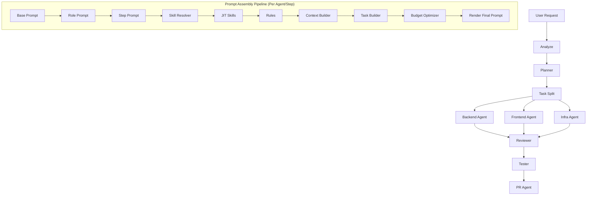

# Design: Prompt Optimization and JIT Skill Routing

## Context
A scalable agent framework requires a highly decoupled and configurable prompt generation pipeline. We are migrating from a string-concatenation assembler to an object-based pipeline with strict context isolation, dynamic skill routing, and explicit token budgets.

## Goals / Non-Goals
**Goals:**
- Implement the `PromptSection` pipeline (`collect -> sort -> render`).
- Slice context into distinct domains (Requirement, Architecture, Diff, etc.) and route by Step + Capability.
- Resolve skills dynamically based on Task + Step.
- Enforce prompt token budgets per section.
- Support file versioning (`_v2`, `_gpt`, etc.) for A/B testing.

**Non-Goals:**
- Modifying the LLM Gateway tier logic.
- Rewriting the DAG step definitions in `server/internal/workflow/`.

## Architecture



## Data Models

**Prompt Section Structure**
```go
type PromptSection struct {
    Name        string
    Body        string
    Priority    int    // Lower number = higher priority (kept first during optimization)
    Tokens      int    // Estimated token count (len(Body)/4)
    IsImmutable bool   // If true, the section CANNOT be truncated or dropped (e.g. strict rules, base prompt)
}

// Global Budget Config Example (Adjustable based on Model Group: Fast vs Balanced vs Powerful)
var DefaultBudget = map[string]int{
    "base":     300,
    "role":     400,
    "step":     500,
    "skills":   2500,
    "rules":    500, // Account for layered rules
    "context":  7000,
    "task":     1000,
}
```

## Layered Rules Integration (Rule Precedence — 5.2a)
Prompt assembly will compile rules sequentially from high-precedence to low-precedence:
1. **Global Rules**: Core security & compliance. Set as `IsImmutable = true` (cannot be omitted).
2. **Agent Role Constraints**: Specialized boundaries per role (e.g., Reviewer cannot modify code). Set as `IsImmutable = true`.
3. **Project Rules**: Injected project conventions. `strict` rules are `IsImmutable = true`, `advisory` rules are mutable.
4. **Task Rules**: Injected task-level bounds. Advisory rules are mutable.

## JIT Skill & Tool Integration (Skill System — 5.2b)
1. **Source Merging**: The `SkillResolver` queries both the **Global Skill Registry** (synced Git repo) and **Local Skills** (from `[ProjectRoot]/skills/`).
2. **Dynamic Tool Filtering**: Tools are dynamically discovered and extracted from the metadata/tool-definitions block inside the `SKILL.md` of resolved JIT skills. These are registered at run-time as allowed tools instead of using static role templates.

## Context Routing Matrix

| Step / Role | Context Slices Included |
|-------------|-------------------------|
| `plan` (Planner) | User Request, OpenSpec Req, Arch Summary, Dependency Summary, Repo Structure (short), Analyze Results, Standards |
| `code_backend` (Backend) | Specific Task (e.g. Task #0), Arch Summary, Relevant Files, Semantic Snippets, API Contracts, Standards |
| `review` (Reviewer) | Requirement, Acceptance Criteria, Security Checklist, Coding Standards, Diff, Modified Files (Excludes Planner/Decomposition) |
| `test` (Tester) | Requirement, Acceptance Criteria, Modified APIs, Edge Cases, Test Checklist |
| `pr` (PR Agent) | Requirement, Task List, Git Diff Summary, Commit Summary |

## Example Rendered Prompt Structure
*(For documentation purposes in codebase)*
```markdown
# System Prompt
========
[Base Prompt] (Immutable)
You are an AI Agent...

[Role Prompt] (Immutable)
You are a Backend Developer... Goal: ...

[Step Prompt]
You are executing code_backend. Your goal is...

[JIT Skills] (Dynamic allowed tools registered from these skills)
(golang-best-practices.md)
(clean-code.md)

[Rules] (Layered)
- [Global - Strict] (Immutable) No raw SQL...
- [Role Constraint - Strict] (Immutable) Do not modify non-backend files.
- [Project - Advisory] Use standard logging helper.

[Context] (Sliced)
### Architecture Summary
...
### Semantic Snippets
...

[Task]
### Requirement
...
```

## API Endpoints
- N/A (Internal pipeline refactor, no REST APIs exposed)

## Security & Execution Boundaries

| Agent | Allowed Paths | Permissions |
|-------|---------------|-------------|
| Coder | `server/internal/prompts/` | Read, Write |
| Reviewer | `server/internal/` | Read only |

## Risk Mitigation

| Risk | Severity | Mitigation |
|------|----------|------------|
| Prompt token limit exceeded unexpectedly | HIGH | Strict BudgetOptimizer enforcement with guaranteed mutable/immutable section pruning |
| Skill resolution misses critical tool | MEDIUM | Log unregistered skills and fallback to global standard tools |
