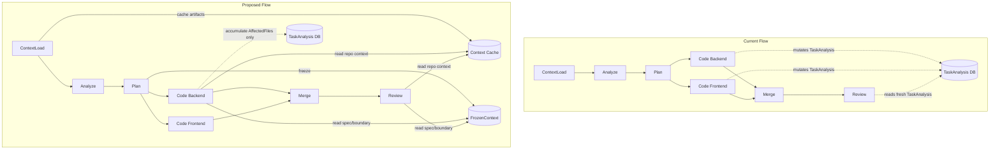

# Design: Orchestrator Context Stability & Prompt Efficiency

## Architecture



## Context Freeze Design

The `FrozenContext` is a structured snapshot created at Plan step completion:

```go
// FrozenContext holds the immutable execution contract for a workflow run.
type FrozenContext struct {
    SpecHash            string                    `json:"spec_hash"`
    ProposalMD          string                    `json:"proposal_md"`
    SpecsMD             string                    `json:"specs_md"`
    DesignMD            string                    `json:"design_md"`
    TasksMD             string                    `json:"tasks_md"`
    ExecutionUnits      []models.ExecutionUnit    `json:"execution_units"`
    ExecutionBoundaries []models.ExecutionBoundary `json:"execution_boundaries"`
    AffectedFiles       []models.AffectedFile     `json:"affected_files"`
    AcceptanceCriteria  []models.AcceptanceCriterion `json:"acceptance_criteria"`
}
```

Stored as a checkpoint artifact at key `"frozen_context"`.

## Parse Error Classification

```go
type ParseErrorKind string

const (
    ParseFormatError     ParseErrorKind = "format"      // Malformed JSON syntax
    ParseTruncationError ParseErrorKind = "truncation"   // Response cut off mid-JSON
    ParseSchemaError     ParseErrorKind = "schema"       // Valid JSON, wrong structure
    ParseBusinessError   ParseErrorKind = "business"     // Valid structure, wrong content
)

type ClassifiedParseError struct {
    Kind    ParseErrorKind
    Message string
    Raw     string // original LLM output
}
```

Detection heuristics:
- **Truncation**: last character is not `}` or `]`, or `depth > 0` after parsing
- **Format**: `json.Unmarshal` fails on well-terminated content
- **Schema**: JSON parses but required keys missing
- **Business**: JSON parses with valid schema but fails domain validation

## Context Cache Design

```go
// ContextCache holds pre-computed context artifacts from ContextLoad.
type ContextCache struct {
    SemanticSnippets []provider.ContextSnippet `json:"semantic_snippets"`
    RepoMap          string                     `json:"repo_map"`
    DirectoryTree    string                     `json:"directory_tree"`
    ActiveFiles      []string                   `json:"active_files"`
}
```

Stored in the `context_load` step output under key `"context_cache"`.

## Security & Execution Boundaries

| Agent | Allowed Paths | Permissions |
|-------|---------------|-------------|
| Coder | `server/internal/orchestrator/`, `server/internal/prompts/`, `server/pkg/models/` | Read, Write |

## Risk Mitigation

| Risk | Severity | Mitigation |
|------|----------|------------|
| FrozenContext stale after Analyze re-run | MEDIUM | FrozenContext is re-created on every Plan execution. `ErrGraphChanged` triggers re-plan. |
| Cache miss for dynamic repo changes | LOW | Cache is per-workflow-run; fresh clone always triggers ContextLoad. |
| Retry strategy mismatch | LOW | Conservative: default to full re-generation for unclassified errors. |
| Backward compatibility | MEDIUM | `FrozenContext` loading falls back to live `TaskAnalysis` if snapshot is missing (old workflows). |
