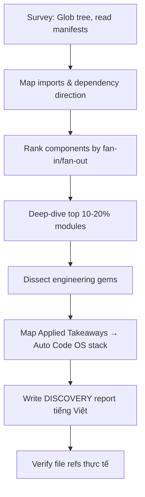

# Design: Phân Tích Reference Projects

## Kiến Trúc Tổng Quan

```
docs/references/
├── README.md                                              # Master index + Top 10
├── agent-platform/
│   ├── DISCOVERY-multica.md                               # Managed agents platform
│   ├── DISCOVERY-ai-sdlc.md                               # Spec-driven SDLC framework
│   ├── DISCOVERY-hermes-agent.md                          # Self-improving AI agent
│   ├── DISCOVERY-aider.md                                 # AI pair programming
│   ├── DISCOVERY-openspec.md                              # Spec-driven dev CLI
│   └── DISCOVERY-superpowers.md                           # Skills framework for agents
├── memory/
│   ├── DISCOVERY-agentmemory.md                           # Persistent agent memory
│   └── DISCOVERY-zep.md                                   # Knowledge graphs & memory
├── token-compression/
│   ├── DISCOVERY-headroom.md                              # Context optimization proxy (Rust)
│   ├── DISCOVERY-claw-compactor.md                        # 14-stage fusion pipeline (Python)
│   ├── DISCOVERY-rtk.md                                   # Rust CLI token killer
│   ├── DISCOVERY-caveman.md                               # Output token reduction skill
│   ├── DISCOVERY-toon.md                                  # Token-oriented object notation
│   └── DISCOVERY-llmlingua.md                             # Microsoft prompt compression
└── infrastructure/
    ├── DISCOVERY-9router.md                               # LLM router & token saver
    ├── DISCOVERY-openclaw.md                              # Multi-channel AI gateway
    ├── DISCOVERY-free-claude-code.md                      # Agent proxy (Anthropic/OpenAI)
    ├── DISCOVERY-llm-key-manager.md                       # Hybrid AI gateway key mgmt
    ├── DISCOVERY-prompt-base.md                           # Modular AI framework (Gemini)
    └── DISCOVERY-antigravity-awesome-skills.md            # Skills registry (1900+ skills)
```

## Phân Loại Projects (20 repos → 4 categories)

| Category | Projects | Lý Do Phân Loại |
|----------|----------|-----------------|
| **agent-platform** | multica, ai-sdlc, hermes-agent, aider, OpenSpec, superpowers | Trực tiếp liên quan đến orchestration, task lifecycle, agent execution — core domain của Auto Code OS |
| **memory** | agentmemory, zep | Persistent memory, knowledge graphs — khả năng học hỏi giữa các tasks |
| **token-compression** | headroom, claw-compactor, rtk, caveman, toon, LLMLingua | Giảm chi phí LLM — operational concern lớn nhất |
| **infrastructure** | 9router, openclaw, free-claude-code, llm-key-manager, prompt_base, antigravity-awesome-skills | Router, proxy, key management, skills framework — nền tảng hỗ trợ |

## Report Template (12 Perspectives)

Mỗi `DISCOVERY-*.md` tuân theo template của `explore-codebase` skill:

```markdown
# Báo Cáo Phân Tích — <tên project>

## Tổng Quan
<mô tả ngắn, stack, quy mô, maturity — tối đa 5 dòng>

## Tính Năng Nổi Bật (Best Features)
<3–5 capabilities nổi bật với phân tích thiết kế và kết quả đo được; file refs>

## Áp Dụng Cho Auto Code OS (Applied Takeaways — ranked)
1. **<Ý tưởng>** — What: <mechanism, file ref>. Apply: <thay đổi cụ thể trong stack của Auto Code OS — table/module/library>. Impact: <H/M/L> · Effort: <H/M/L> · Risk: <H/M/L> · Est: <...>

## Kiến Trúc (Architecture)
<style, layers, dependency direction, lý do lựa chọn; mermaid diagram; confidence label>

### ADR Suy Luận (Inferred ADRs)
| Quyết Định | Bằng Chứng | Lợi Ích | Đánh Đổi | Confidence |

## Luồng Chính (Main Flow)
<mermaid flowchart từ entry point đến output>

## Design Patterns & Chất Lượng Code
<patterns với file refs, ưu/nhược; phong cách code/naming/maintainability>

## Kỹ Thuật Thú Vị & Thực Hành Kỹ Thuật
<implementations đặc sắc theo Phase 2; testing/logging/config/DI/errors/security>

## Engineering Gems
1. `path/to/file` — Vấn đề: ... · Cách làm phổ biến (yếu hơn): ... · Vì sao elegant: ... · Đánh đổi: ... · Bài học rút ra: ...

## Top 10 Điều Đáng Học
| # | Khái Niệm | File | Vì Sao Hữu Ích | Độ Khó | Thứ Tự |

## Hướng Dẫn Đọc (Reading Guide)
**L0 Build & Run:** ... **L1 Entry Points:** ... **L2 Core Abstractions:** ... **L3 Architecture Glue:** ... **L4 Engineering Gems:** ... **L5 Reimplement:**

## Anti-Patterns & Không Nên Copy
<flaws framed as lessons; context-bound decisions>

## Câu Hỏi Đáng Suy Ngẫm
<open architectural questions>

## Đánh Giá Tổng Thể
| Architecture | Maintainability | Scalability | Clean Code | Learning Value |
| x/10 | x/10 | x/10 | x/10 | x/10 |

## Lộ Trình Học Tập
<tuần-by-tuần path từ đọc đến reimplementing core ideas>
```

## Quy Trình Phân Tích Mỗi Project



## Cleanup Strategy

Trước khi tạo reports mới:
1. Xóa **tất cả** file `.md` cũ ở root `docs/references/` trừ `README.md` — bao gồm cả 2 dạng tên:
   - `DISCOVERY-*.md` (nếu có)
   - `{project}.md` không prefix — hiện còn 13 file: `9router.md`, `agentmemory.md`, `aider.md`, `ai-sdlc.md`, `antigravity-awesome-skills.md`, `free-claude-code.md`, `hermes-agent.md`, `llm-key-manager.md`, `multica.md`, `openclaw.md`, `openspec.md`, `prompt-base.md`, `superpowers.md`
2. Giữ lại `README.md` — sẽ được ghi đè bằng version mới
3. Trạng thái đích sau cleanup: root chỉ còn `README.md` + 4 subfolder

## Auto Code OS Context (Destination Project)

Để Applied Takeaways mapping chính xác, cần hiểu stack hiện tại:

| Component | Technology | Key Paths |
|-----------|-----------|-----------|
| Backend API | Go 1.26+ | `server/cmd/api/`, `server/internal/handler/` |
| Orchestrator | Go (DAG engine) | `server/internal/orchestrator/` |
| LLM Gateway | Go (multi-provider) | `server/pkg/llm/` |
| Sandbox | Docker containers | `server/internal/sandbox/`, `docker/Dockerfile.sandbox` |
| Frontend | Next.js (App Router) | `web/src/app/`, `web/src/components/` |
| Database | PostgreSQL | `server/internal/database/`, `server/migration/` |
| Prompts | Go templates | `server/internal/prompts/` |
| GitOps | Go | `server/internal/gitops/`, `server/internal/orchestrator/gitops/` |
| Tools | Go (tool framework) | `server/internal/tool/` |
| Context | Go (repo analysis) | `server/internal/context/` |
