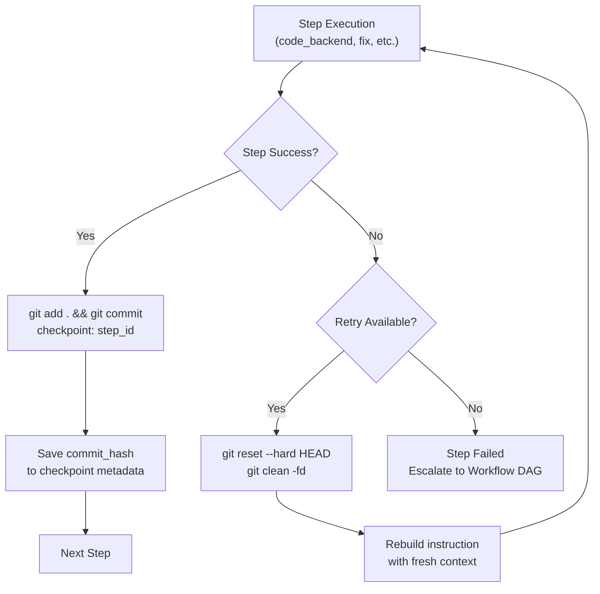
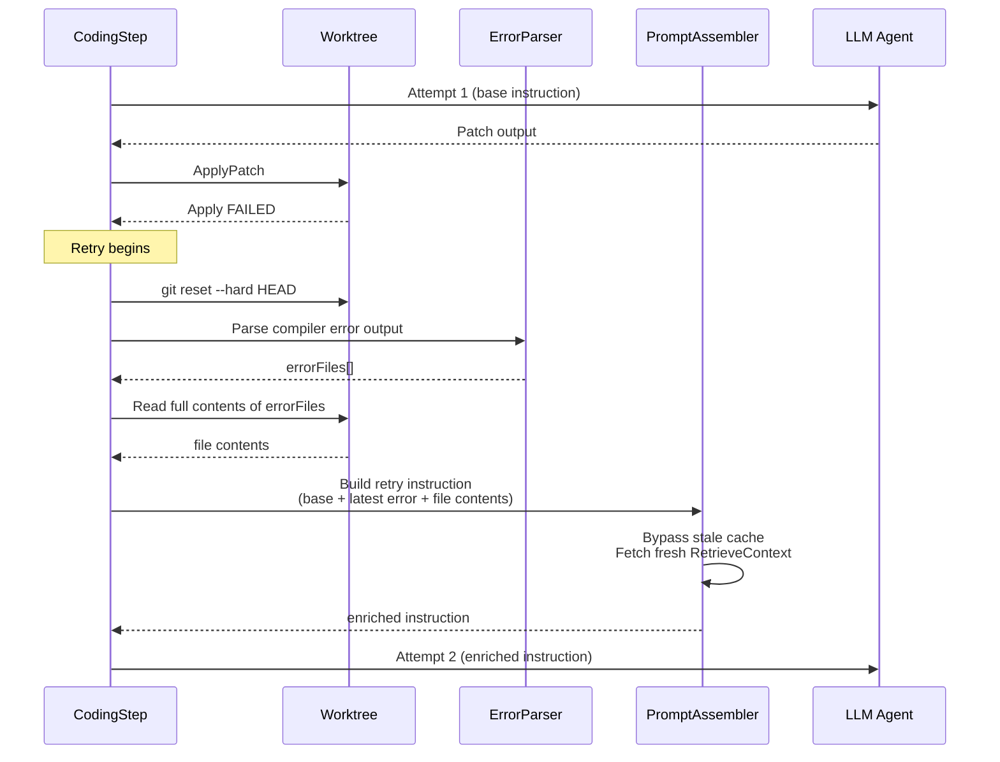
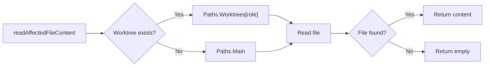

# Design: Resilient Retry Pipeline

## Architecture

### Macro-level: Checkpoint Flow



### Micro-level: Retry Loop with Context Injection



### Context Resolution Priority



## Data Models

### Checkpoint Metadata Extension

```go
// In models.Checkpoint — add CommitHash field
type Checkpoint struct {
    ID         string          `json:"id"`
    TaskID     string          `json:"task_id"`
    Step       string          `json:"step"`
    State      json.RawMessage `json:"state"`
    CommitHash string          `json:"commit_hash"` // NEW: Git commit for this checkpoint
    CreatedAt  time.Time       `json:"created_at"`
}
```

### Error File Parser

```go
// In steps/code_backend.go — new helper
func parseCompilerErrorFiles(errorOutput string) []string {
    re := regexp.MustCompile(`([a-zA-Z0-9_/.-]+\.go):\d+:\d+:`)
    matches := re.FindAllStringSubmatch(errorOutput, -1)
    seen := make(map[string]bool)
    var files []string
    for _, m := range matches {
        if !seen[m[1]] {
            seen[m[1]] = true
            files = append(files, m[1])
        }
    }
    return files
}
```

### Hunk Count Validator

```go
// In patch/validator.go — new function
func ValidateHunkCounts(patch string) []ValidationError {
    // Parse each @@ header, count actual +/- lines in body,
    // compare against declared counts.
    // Return ValidationError if mismatch detected.
}
```

## Security & Execution Boundaries

| Agent | Allowed Paths | Permissions |
|-------|---------------|-------------|
| CodingStep | `Paths.Worktrees[role]` | Read, Write (via sandbox) |
| PromptAssembler | `Paths.Worktrees[role]`, `Paths.Main` | Read only |
| IndexWorkspace | `AgentPathContext.PhysicalRoot()` | Read only (scoped scan) |
| ApplyPatch revert | `Paths.Worktrees[role]` | Write (git reset) |

**Key constraint:** `RetrieveContext` MUST NOT return snippets with absolute host paths. Unresolvable paths are dropped (`continue`), not leaked.

## Risk Mitigation

| Risk | Severity | Mitigation |
|------|----------|------------|
| `git reset --hard` deletes uncommitted work from a previous successful step | HIGH | Always create checkpoint commit BEFORE any retry can reset. Reset targets HEAD (the checkpoint), not a remote branch. |
| Re-indexing on resume adds latency | MEDIUM | Only re-index on resume/rollback (rare operation). Normal step flow uses cached index. |
| Error file parser misparses non-Go output | LOW | Regex is scoped to `.go` extension. Future: add language-specific parsers. |
| Search/Replace auto-switch confuses LLM | MEDIUM | Only trigger after 2 unified diff failures. Clear format instructions in prompt. |
| `maxSnippets = 8` increases prompt size on retry | LOW | Only raised during retry. Token budget enforcement in `optimizeBudget()` still applies. |
