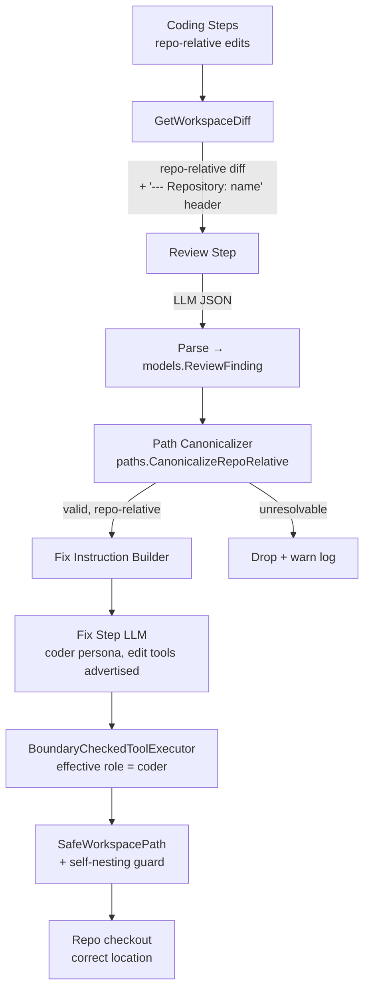

# Design: Review→Fix Seam Hardening 2026

## Architecture (corrected data flow)



Key invariant (single owner: the runtime, established at the gitops/review boundary):

> **Every file path that crosses an agent seam is repository-relative.** Repository identity travels in a separate typed field, never as a path prefix.

## Role Resolution

One function owns step-level role semantics, used by BOTH advertisement and enforcement.

**Why the rule must be capability-driven, not a `fix+reviewer` special case:** agent
assignment is by *task status*, not by step (`agent_manager.go:67` `rolesForTask`). During
execution phases the fallback chain is `[primaryRole, planner, backend]`, and during
reviewing phases `[reviewer, planner, backend]` — so **any** edit-expected step (`fix`,
`code_backend*`, `code_frontend*`) can legally arrive under a non-coder agent (planner,
reviewer, qa, security-auditor, db-architect, documentation-writer) whenever the preferred
agent is busy. Task 8291a25e hit exactly this: fix cycle 1 ran under the Planner agent,
cycle 2 under the Reviewer agent. Enumerating role names would silently miss the next case.

```go
// stepRequiresEditCaps reports whether stepID's instruction expects the model
// to modify files (fix + all coding steps; review/analyze/plan stay read-only).
func stepRequiresEditCaps(stepID string) bool {
    return stepID == workflow.StepFix ||
        strings.HasPrefix(stepID, workflow.StepCodeBackend) ||
        strings.HasPrefix(stepID, workflow.StepCodeFrontend)
}

// effectiveRoleForStep returns the capability role a step's LLM call should
// advertise, execute, AND render its persona with. If the step expects edits
// but the assigned agent's role lacks CapEdit/CapCreate, remap to the task's
// coder role (task 8291a25e: fix under planner/reviewer had zero edit tools
// while its instruction demanded edits).
func effectiveRoleForStep(stepID, agentRole string, task *models.Task) string {
    if !stepRequiresEditCaps(stepID) {
        return agentRole
    }
    if tool.AllowedForRole(agentRole, []tool.Capability{tool.CapEdit}) &&
        tool.AllowedForRole(agentRole, []tool.Capability{tool.CapCreate}) {
        return agentRole // already a coder role — keep it
    }
    return coderRoleForTask(task) // "frontend" iff analysis.PrimaryCategory ∈ {frontend, ui, ux}; else "backend"
}
```

### Role Resolution Matrix (authoritative)

| Step | Agent role has Edit+Create? | Effective role |
|---|---|---|
| `fix`, `code_backend*`, `code_frontend*` | yes (`backend`, `frontend`) | unchanged |
| `fix`, `code_backend*`, `code_frontend*` | no (`planner`, `reviewer`, `qa`, `security-auditor`, `db-architect`, `documentation-writer`, unknown) | `coderRoleForTask(task)`: `frontend` when `analysis.PrimaryCategory ∈ {frontend, ui, ux}`, else `backend` |
| `review`, `analyze`, `plan`, `context_load`, `test`, `merge`, `pr` | any | unchanged — read-only steps are *correct* with read-only roles; never grant them edit caps |

The capability predicate reuses the existing `tool.AllowedForRole` (`capability.go:71`) so the
matrix can never drift from `DefaultRoleProfiles` — adding a new coder role later requires no
change here.

Call sites (all three consume the SAME resolved role — divergence is the root bug):
- `llm_step.go:48` — `tools = o.capManager.ToolsForRole(effectiveRoleForStep(...))`
- `llm_step.go:87-92` — `NewBoundaryCheckedToolExecutor(...)` (replaces the current executor-only remap).
- Prompt assembly — persona prompt file selection (REQ-005).

`DefaultRoleProfiles` (`capability.go`): `backend`/`frontend` gain `CapCreate` (commit the existing working-tree hotfix).

## Data Models

```go
// ReviewFinding is the typed contract crossing the review→fix seam.
// File is repository-relative by definition; Repo carries repository
// identity separately (never as a path prefix). This is the first
// applied slice of the execution-semantics-2026 typed-contract model.
type ReviewFinding struct {
    Repo           string `json:"repo,omitempty"`
    File           string `json:"file"`            // repository-relative
    Line           int    `json:"line,omitempty"`
    Severity       string `json:"severity"`        // CRITICAL|HIGH|MEDIUM|LOW
    Recommendation string `json:"recommendation"`
}
```

Decode path: `review.go` replaces `getReviewFindings(parsed) any` with
`ParseReviewFindings(parsed) ([]models.ReviewFinding, error)` — tolerant on input
(accepts today's `findings` / `array` / single-object shapes) but strict on output.

## Path Canonicalizer

```go
// CanonicalizeRepoRelative normalizes a path that may carry workspace
// prefixes into a clean repository-relative path.
//
//   "code/repos/tool_zentao/main/cmd/sync/main.go" → "cmd/sync/main.go"
//   "cmd/sync/main.go"                             → "cmd/sync/main.go"
//   "code/repos/x/main/code/repos/x/main/a.go"     → "a.go" (collapses duplicates)
//
// Returns ok=false when the path escapes the repo or still contains a
// foreign repo prefix after stripping (caller drops the finding + warns).
func CanonicalizeRepoRelative(p, repoName, branch string) (string, bool)
```

Location: `server/pkg/paths` (beside `ResolveSafePath`). Applied in `fix.go` to every
`ReviewFinding.File` before instruction rendering; also applied to `affected_files`
entries for consistency.

## Diff Generation (gitops)

`GetWorkspaceDiff` / `GetWorkspaceChangedFiles` Python scripts: drop the
`--src-prefix=a/{rel_path}/ --dst-prefix=b/{rel_path}/` arguments (client.go:195) and the
equivalent path-prefixing in the status variant. Repository attribution already exists as
`--- Repository: {name}` — consumers that need the physical location resolve it through
workspace metadata, not by parsing path prefixes.

`getDiffPrefixes` (client.go:99): delete the function; `GetDiff`/`GetPRDiff` call sites drop
the `prefixes` interpolation. (Supersedes the partial working-tree hotfix.)

Downstream check: `ApplyPatch`/snapshot-restore consumers of these diffs must be audited for
prefix assumptions before the change lands (see tasks.md 1.2).

## Tool-Layer Guard (defense in depth)

`SafeWorkspacePath(workspace, relPath)` gains a self-nesting check when `workspace` is a
repo checkout (contains `.git` or matches the `code/repos/<repo>/<branch>` layout):

```text
relPath begins with "code/repos/" → reject:
  "path %q appears workspace-prefixed; this workspace is the repository root — use %q"
```

`patch.EvaluatePolicy`: classify the same pattern as `SeverityError` (model gets actionable
feedback and can correct within the loop) instead of Warning/auto-expansion into
`ExpandedBoundaries`.

## Authorization Rejection Semantics (REQ-006)

An authorization rejection is **NOT fail-fast** — it is an in-loop, loop-correctable tool
error returned to the model, exactly like a boundary `SeverityError` today. Rationale:

- After Task 1.1, advertised set == executable set, so a rejection can only mean the model
  hallucinated an undeclared tool name. Failing the whole step on a single hallucination
  would regress robustness for no benefit.
- "Permanent" is a property of the **message content**, not of control flow: the error text
  tells the model this tool will never become available *within this step*, so it must stop
  retrying it (task 8291a25e: the model burned calls 108→127→131 permuting paths against an
  authorization wall it couldn't see).
- Pathological repetition is already terminated by the existing loop safeties, unchanged:
  the repeated-failure circuit breaker (`toolloop.go` `failureCounts` → "Stop repeating this
  exact call"), the stall guard, and the phase/iteration budget. No new fail-fast path is
  introduced.

Registry authorization error (`registry.go:49`) becomes:

```text
Error: role %q is not authorized to use tool %q. This will not change during this step —
do not call it again. Tools available to you: %s
```

The available-tools list comes from `CapabilityManager.ToolsForRole(call.AgentRole)` (names
only), so the message is grounded in the same source of truth as advertisement.

## Trade-offs

- **Remap vs. reassign agents:** remapping fix to a coder capability role is surgical; the
  alternative (assigning a dedicated fixer agent in workflow config) touches scheduling and
  is deferred. The shared `effectiveRoleForStep` keeps the remap in exactly one place.
- **Strip-prefix canonicalization is heuristic** (`code/repos/<repo>/<branch>/`): acceptable
  because the layout is runtime-owned and stable (`paths.NewOSWorkspacePaths`); the long-term
  fix is `path_type`-tagged fields per execution-semantics-2026, which this design converges
  toward.
- **Dropping unresolvable findings** loses review signal in the worst case, but a poisoned
  path in the prompt is strictly worse (proven by call-131); the warn log preserves
  observability.

## Security

- Boundary enforcement (`EvaluatePolicy` in the boundary-checked executor) is unchanged in
  authority — this spec only *tightens* its verdict for self-nested paths.
- `SafeWorkspacePath` traversal protection is preserved; the new guard is additive.
- Role capability changes grant `CapCreate` to roles that already hold `CapEdit`; no
  read-only role gains write ability (reviewer/planner profiles stay read-only — the fix
  step's effective role changes instead).
