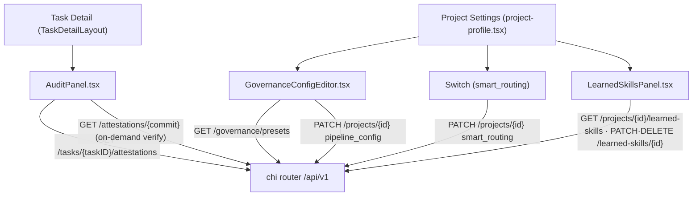

# Design: Roadmap UI Surfacing

## Architecture



Toàn bộ data-fetching theo pattern hiện có: `useAuthedSWR` cho GET, `api.*` client (`web/src/lib/api/`) cho mutation, `sonner` toast cho feedback, mutate SWR key sau mutation để cập nhật không reload.

## Backend addition (duy nhất)

`GET /api/v1/governance/presets` — handler mới `internal/handler/governance.go`:

```go
type GovernancePreset struct {
    Name   string          `json:"name"`
    Config json.RawMessage `json:"config"`
}
// Handler loop qua governance.PresetNames, gọi governance.Preset(name),
// trả []GovernancePreset. Không cần service/repo — presets là embedded files.
```

Register trong `router.go` cạnh các route `/api/v1` đã auth. Validation errors của `pipeline_config` đã có sẵn: `service.validatePipelineConfig` trả lỗi khi update project → handler trả 400 với message chứa danh sách lỗi; UI chỉ cần parse/hiển thị body của 400 response (không đổi backend).

## Data Models (TypeScript — thêm vào `web/src/lib/types.ts`)

```ts
export interface Attestation {
  id: string;
  task_id: string;
  job_id: string;
  commit_hash: string;
  key_id: string;
  coded_by: { engine?: string; provider: string; model: string } | null;
  reviewed_by: { provider: string; model: string } | null;
  prompt_hash: string;
  policy_snapshot: { autonomy?: string; review_harness?: string; fix_cycles_used?: number } | null;
  created_at: string;
}

export interface AttestationVerifyResult {
  envelope: unknown;   // DSSE envelope, hiển thị raw
  verified: boolean;
  key_id: string;
}

export interface GovernancePreset { name: string; config: unknown }

export interface LearnedSkill {
  id: string;
  project_id: string;
  title: string;
  trigger_keywords: string[];
  content: string;
  status: "draft" | "active" | "disabled";
  source_task_id: string | null;
  usage_count: number;
  success_count: number;
  created_at: string;
  updated_at: string;
}
```

`Project` type: thêm `smart_routing: boolean` và `pipeline_config?: unknown` nếu chưa có.

## API Endpoints

| Method | Path | Trạng thái | Dùng bởi |
|--------|------|-----------|----------|
| GET | `/api/v1/tasks/{taskID}/attestations` | ✅ có sẵn | AuditPanel |
| GET | `/api/v1/attestations/{commit}` | ✅ có sẵn | AuditPanel (verify + envelope modal) |
| GET | `/api/v1/attestations/keys` | ✅ có sẵn | (không dùng UI pass này) |
| GET | `/api/v1/governance/presets` | 🆕 build mới | GovernanceConfigEditor |
| PATCH | `/api/v1/projects/{id}` | ✅ có sẵn (`smart_routing`, `pipeline_config` trong UpdateProjectInput) | Switch, GovernanceConfigEditor |
| GET | `/api/v1/projects/{projectID}/learned-skills` | ✅ có sẵn | LearnedSkillsPanel |
| PATCH | `/api/v1/learned-skills/{skillID}` | ✅ có sẵn | approve/disable |
| DELETE | `/api/v1/learned-skills/{skillID}` | ✅ có sẵn | delete |

## Component decisions

- **AuditPanel**: đặt trong `SupportingAccordion`-style section của task detail, cùng hàng với CheckpointsPanel — follow đúng pattern `ReviewVerdictCard` (fetch bằng taskID từ `TaskDetailContext`). Verify badge lấy từ `GET /attestations/{commit}` gọi lazy per-row khi panel mở (tránh N calls khi user không mở panel). Envelope modal chỉ fetch khi click.
- **GovernanceConfigEditor**: textarea + `JSON.parse` client-side check trước khi PATCH (báo lỗi syntax ngay); lỗi schema/DAG do server trả 400 hiển thị dưới editor. Không kéo thêm dependency editor nặng (Monaco) — textarea monospace là đủ cho v1.
- **Switch**: primitive tự viết theo Tailwind (button role="switch" aria-checked), không thêm dependency (Radix chưa có trong repo — verify lúc implement; nếu `@radix-ui/react-switch` đã có trong package.json thì dùng nó).
- **LearnedSkillsPanel**: bảng đơn giản trong project detail page, không phải top-level route — learned skills là project-scoped.

## Security & Execution Boundaries

| Agent | Allowed Paths | Permissions |
|-------|---------------|-------------|
| Coder | `web/src/`, `server/internal/handler/`, `server/internal/handler/router.go` | Read, Write |
| Coder | `server/internal/governance/` | Read only (chỉ consume Preset/PresetNames) |
| Reviewer | toàn repo | Read only |

## Risk Mitigation

| Risk | Severity | Mitigation |
|------|----------|------------|
| Per-row verify call gây N requests trên task nhiều commit | LOW | Lazy verify khi panel expand; task hiếm khi >5 repo/commit per PR |
| JSON editor cho phép save config phá pipeline | MEDIUM | Server-side `validatePipelineConfig` đã chặn (schema+DAG); UI chỉ là convenience layer |
| Nhầm lẫn 2 khái niệm "skill" (repo skills vs learned skills) trong UX | MEDIUM | Đặt Learned Skills trong project detail (project-scoped), KHÔNG thêm vào trang `/skills` global; label rõ "Learned Skills (extracted from merged tasks)" |
| `pipeline_config` round-trip mất format/comment | LOW | JSON thuần (jsonb), không có comment để mất; pretty-print khi load |
