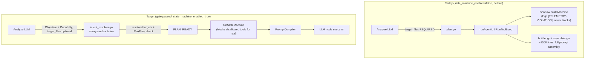

# Design: Runtime-Centric Completion 2026

## Architecture (current vs. target)



## Issue 1 — Rollout Gate

### Data source: `WorkflowRepo`, not raw SQL (correction)

Task logs are **not reliably queryable via SQL** in this deployment. `WorkflowRepo` (`internal/
repository/workflow.go:82`) has two storage backends selected by `SetLogFileRoot`
(`workflow.go:89`): when `fileRoot == ""`, `CreateLog`/`TailLogs`/`ListLogs` read/write the GORM
`task_logs` table; when `fileRoot != ""`, they read/write per-task `<taskID>.jsonl` files instead
(`workflow.go:255-289`, `291-330`). `cfg.Logging.FileRoot` **defaults** to
`<DataRoot>/logs` (`pkg/config/config.go:208`) and `cmd/api/main.go:90` calls
`workflowRepo.SetLogFileRoot(cfg.Logging.FileRoot)` unconditionally — so file-mode is the default,
active mode (confirmed: `server/.data/logs/*.jsonl` exist in this checkout). A gate implemented as
raw SQL against `task_logs` would silently return zero rows in this — the default — deployment
mode. The gate must go through `WorkflowRepo`, which already branches on the active mode.

Neither existing method fits: `TailLogs`/`ListLogs` are scoped to one `task_id`. Two new
repository methods are needed, each implementing the same file-vs-DB branch `CreateLog` already
does:

```go
// internal/repository/task.go (new method)
// ListRecentByStatus returns the most recent `limit` tasks whose status is terminal
// (one of the given statuses), newest first — the sampling population for the gate.
func (r *TaskRepo) ListRecentByStatus(ctx context.Context, statuses []string, limit int) ([]models.Task, error)

// internal/repository/workflow.go (new method)
// FindLogsByPattern scans logs for the given task IDs (DB `Where` when fileRoot=="",
// JSONL scan when fileRoot!="", mirroring TailLogs/CreateLog's existing branch) and
// returns every row at the given level whose message starts with messagePrefix.
// Returning rows (not just a count) lets the gate derive TopViolationTypes by
// inspecting Message text without a second repository method.
func (r *WorkflowRepo) FindLogsByPattern(ctx context.Context, taskIDs []string, level, messagePrefix string) ([]models.TaskLog, error)
```

Terminal statuses per `models.TaskStatus*` constants (`pkg/models/task.go:12-23`; there is no
`'done'`): `merged`, `pr_ready`, `human_review`, `failed`. "One row per LLM call" is approximated
by counting rows whose message starts with `"assembled prompt with"` (existing log line, e.g.
`llmrunner` step logs), via a separate `FindLogsByPattern` call with `level="info"`.

### Gate function

```go
// server/internal/orchestrator/rollout/gate.go (new)
type GateResult struct {
    TasksSampled     int
    TotalCalls       int
    TotalViolations  int
    ViolationRatePct float64
    Pass             bool
    TopViolationTypes map[string]int // "tool not permitted", "out-of-scope write", ...
}

// EvaluateStateMachineGate samples the last sampleSize terminal tasks via TaskRepo,
// then calls WorkflowRepo.FindLogsByPattern twice (once for "assembled prompt with"
// info rows = TotalCalls, once for "[TELEMETRY-VIOLATION]" warn rows = TotalViolations)
// across that sample (file- or DB-backed, whichever is active), and applies thresholdPct.
// TopViolationTypes buckets the violation rows' Message text against known phrasings
// ("tool %s is not permitted", "out-of-scope write" — runner.go:307,315) client-side;
// no third repository method needed for a per-gate-run volume of a few hundred rows.
// It is a read-only report — flipping state_machine_enabled remains an explicit
// config/env change, never automatic.
func EvaluateStateMachineGate(ctx context.Context, tasks *repository.TaskRepo, logs *repository.WorkflowRepo, sampleSize int, thresholdPct float64) (GateResult, error)
```

Exposed as a `cmd/migrate`-style standalone CLI command (`cmd/rollout-gate/main.go`, new) that
prints `GateResult` as JSON to stdout — no new table or migration: this is a manually-invoked ops
report, not something another Go caller queries at runtime, so a DB row would be one more thing
to migrate/clean up for no reader. If a persistent audit trail is wanted later, log the JSON
result through the existing `Logger`/`WorkflowRepo.CreateLog` (task-less/system log, or piggyback
on a synthetic task ID) — deliberately not decided here to avoid over-building ahead of need.

### Canary sequencing

1. Gate passes → flip `state_machine_enabled=true` for a fixed percentage of new tasks (config
   knob, not built here — reuse whatever feature-flag/percentage mechanism already exists in
   `pkg/config`; if none exists, start with all-or-nothing per deployment environment (staging
   first) rather than building new percentage-rollout infrastructure as part of this change).
2. Re-run the gate query scoped to `state_machine_enabled=true` tasks only, watching for
   `PhaseViolationError` rejection rates and `SALVAGED`/`FAILED` terminal-state rates vs. the
   legacy path's historical failure rate.
3. One full release cycle at 100% with the gate still passing → REQ-002 (legacy removal).

## Issue 2 — Intent Resolver Authoritative (REQ-M01)

### Current code (`intent_resolver.go:96-99`, real signature)

```go
func ResolveIntent(ir models.ExecutionIR, candidates []models.AffectedFile, targetFiles []string) ([]string, error) {
    if len(targetFiles) > 0 {
        return targetFiles, nil // <-- LLM output trusted verbatim, token matching never runs
    }
    // token-matching against candidates (analysis.AffectedFiles) happens only here today
    ...
}
```

### New code (corroboration semantics, still no I/O)

LLM-suggested paths are not trusted verbatim and not discarded outright: a suggestion is kept
only when the Planner's own `AffectedFiles` evidence corroborates it. Resolver output is the
union of its token matches and the corroborated suggestions. `intent_resolver.go` documents
itself as I/O-free (`intent_resolver.go:90-91`) — logging is I/O, so uncorroborated suggestions
are returned as data, not logged in place; the caller decides whether/how to log:

```go
// ResolveIntent's signature gains a third return value: paths the LLM suggested that the
// resolver's own AffectedFiles matching did not corroborate. Callers that care about this
// signal (Task 2.1, plan.go) log it themselves — ResolveIntent stays pure.
func ResolveIntent(ir models.ExecutionIR, candidates []models.AffectedFile, targetFiles []string) (resolved []string, dropped []string, err error) {
    matched := matchTokens(ir, candidates)                        // existing intentTokens + pathMatchesTokens, unchanged
    corroborated := intersectWithCandidates(targetFiles, candidates) // LLM paths kept only if present in AffectedFiles

    resolved = union(matched, corroborated)
    dropped = difference(targetFiles, corroborated) // uncorroborated LLM paths, returned not logged
    if len(resolved) == 0 {
        return nil, dropped, unresolvableErr(ir) // unchanged failure surface at PLAN_READY
    }
    return resolved, dropped, nil
}
```

`ResolveExecutionIRTargets` (`intent_resolver.go:139-161`) aggregates `dropped` per node into a
new return value (`map[node_id][]string`) alongside the existing resolved-targets map, still
performing no I/O itself. `plan.go`'s `PlanStep.Execute` — which already holds `s.log Logger`
(`plan.go:28`) and already logs `ResolveExecutionIRTargets`'s errors at `plan.go:235,245` — logs
each non-empty `dropped` entry the same way, e.g. `s.log.Log(ctx, s.rt.Task.ID, &s.rt.JobID,
"warn", fmt.Sprintf("Plan: node %s — LLM-suggested paths not corroborated by AffectedFiles: %v",
nodeID, dropped))`.

`IntentResolutionError.Reason` strings currently narrate the old fallback order ("attempted unit
target_files (none found) and token matching fallback…", `intent_resolver.go:106,121`) and must
be reworded to match the new semantics. `unit.TargetFiles`'s meaning changes from "authoritative
when present" to "advisory, corroboration-gated".

`analyze.go:322-332`'s hard-fail validation on empty `target_files` is deleted; the schema
(`execution_ir.schema.json`) marks `target_files` as optional rather than required.

### Test migration

- `intent_resolver_test.go`: `TestResolveIntent_Resolvable/Ambiguous/Unresolvable` keep asserting
  on `matchAgainstAffectedFiles` behavior — unaffected by removing the early-return branch; update
  call sites for the new three-return-value signature (`dropped` ignored/`nil`-checked as
  appropriate per case).
- New test: `TestResolveIntent_DropsUncorroboratedLLMSuggestion` — LLM supplies paths absent from
  `AffectedFiles`; assert they are excluded from `resolved` and present in `dropped`.
- New test: `TestResolveIntent_KeepsCorroboratedLLMSuggestion` — LLM supplies a path present in
  `AffectedFiles` that token matching alone would miss; assert it survives into `resolved` and is
  absent from `dropped`.
- New test in `plan_test.go` (or equivalent): a non-empty `dropped` map from
  `ResolveExecutionIRTargets` produces a corresponding `s.log.Log(..., "warn", ...)` call —
  asserts the logging responsibility actually landed in `plan.go`, not silently nowhere.
- `analyze_step_test.go`: remove the assertion that empty `target_files` fails validation; add an
  assertion that empty `target_files` with a populated `Capability`/`Objective` passes.

## Issue 3 — Review Objective Injection (REQ-003)

**No model change needed**: `FrozenContext` already snapshots the full
`ExecutionUnits []ExecutionUnit` (`task.go:235`), and each unit carries `Objective`
(`task.go:159-166`). The review diff is the *merged* result of every unit's step
(`code_backend_0..n`), so the instruction must render **all** unit objectives, keyed by unit ID
— not a single one.

`review.go:257` builds `instruction` by string-concatenation. Add one more block, guarded exactly
like the existing `frozen.AcceptanceCriteria` block (`review.go:269-271`):

```go
if frozen != nil && len(frozen.ExecutionUnits) > 0 {
    var b strings.Builder
    b.WriteString("\n\nUNIT OBJECTIVES - the diff below was written to satisfy these goals:\n")
    for _, u := range frozen.ExecutionUnits {
        if strings.TrimSpace(u.Objective) != "" {
            fmt.Fprintf(&b, "- [%s] %s\n", u.ID, u.Objective)
        }
    }
    instruction += b.String()
}
```

## Issue 4 — MaxFiles Enforcement (REQ-004)

Enforced inside `ResolveExecutionIRTargets`'s existing per-IR loop (`intent_resolver.go:139-161`),
where both the `ir` and its matching `unit` are already in scope, immediately after
`ResolveIntent` returns:

```go
targets, err := ResolveIntent(ir, analysis.AffectedFiles, targetFiles)
if err != nil {
    errs = append(errs, err) // existing unresolvable handling
    continue
}
if max := unit.Constraints.MaxFiles; max > 0 && len(targets) > max {
    errs = append(errs, fmt.Errorf("node %s: resolved %d files exceeds MaxFiles=%d", ir.NodeID, len(targets), max))
    continue
}
resolved[ir.NodeID] = targets
```

`max > 0` guards units that never set a budget (defaults to unenforced, matching today's
behavior for those) rather than silently defaulting to some new magic number.

Flag semantics follow the existing unresolvable-intent pattern (`intent_resolver.go:133-138`):
`PlanStep` treats the aggregated error as a hard failure only when `state_machine_enabled` is on,
and as a warn log when off — MaxFiles violations ride the same `errors.Join` aggregation, so no
new control flow is introduced.

## Issue 5 — Semantic Hash (REQ-005)

**No migration needed.** `PromptHash` lives on `ExecutionSnapshot` (`pkg/models/ir.go:128-136`),
not `ExecutionIR` (`ir.go:52-59`, which has no hash field at all) — `ExecutionSnapshot` has no
`gorm` tags and is never its own table; it is JSON-marshaled and persisted via
`r.SaveArtifact(ctx, jobID, task.ID, stepID, "execution_snapshot", snapshot)`
(`statemachineloop.go:470`) as an artifact (same artifact-storage mechanism as diffs/checkpoints
elsewhere in `orchestrator/`, itself file- or DB-backed depending on config — irrelevant here
since it's opaque JSON either way). Adding `SemanticHash` is a new field on a plain Go struct with
`json` tags; no `ALTER TABLE`, no `migration/*.sql` file, no `AutoMigrate` (none exists in this
codebase — schema changes are exclusively hand-written numbered SQL files run via
`golang-migrate`, `internal/database/database.go:60-81`, `cmd/api/main.go:60` /
`cmd/migrate/main.go:30` — irrelevant here specifically because `ExecutionSnapshot` was never a
SQL-backed struct to begin with).

```go
// pkg/models/ir.go
type ExecutionSnapshot struct {
    // ...existing fields (ExecutionID, CurrentState, Iteration, WorkspaceDiff, ToolHistory)...
    PromptHash   string `json:"prompt_hash"`   // unchanged: hash of rendered prompt text
    SemanticHash string `json:"semantic_hash"` // new: hash of execution-state fields only
    Timestamp    time.Time `json:"timestamp"`
}

// ExecutionIR.Constraints and .Acceptance are already []string (ir.go:56-57), not nested
// objects — sorted before hashing since schema validation doesn't guarantee input order.
func ComputeSemanticHash(ir models.ExecutionIR, resolvedTargets []string) string {
    h := sha256.New()
    fmt.Fprintf(h, "node=%s\nop=%s\ncap=%s\n", ir.NodeID, ir.Intent.Operation, ir.Intent.Capability)

    sortedTargets := append([]string(nil), resolvedTargets...)
    sort.Strings(sortedTargets)
    for _, t := range sortedTargets {
        fmt.Fprintf(h, "target=%s\n", t)
    }

    sortedAcceptance := append([]string(nil), ir.Acceptance...)
    sort.Strings(sortedAcceptance)
    for _, a := range sortedAcceptance {
        fmt.Fprintf(h, "acceptance=%s\n", a)
    }

    sortedConstraints := append([]string(nil), ir.Constraints...)
    sort.Strings(sortedConstraints)
    for _, c := range sortedConstraints {
        fmt.Fprintf(h, "constraint=%s\n", c)
    }
    return hex.EncodeToString(h.Sum(nil))
}
```

Computed alongside `PromptHash` at the same call site (`statemachineloop.go:456-468`, where
`promptHash` is already derived before `snapshot := models.ExecutionSnapshot{...}` is built) and
at the resume call site (`llm_step.go:107`). Resume logic (`llm_step.go:107-109`) gains a second
check: if `PromptHash` mismatches (wording changed) but `SemanticHash` matches, log
"semantically unchanged, skipping re-reasoning" and resume exactly as a `PromptHash` match does
today, instead of falling through to full replay.

## Trade-offs

- **Rollout gate lives on existing log text, not a new event schema.** Matching on
  `message LIKE '[TELEMETRY-VIOLATION]%'` is brittle to log-message wording changes; acceptable
  because it reuses data collected for exactly this purpose since Task 2.2 shipped, and a new
  structured event table is more infrastructure than a one-time gate check justifies. Revisit if
  the gate becomes a permanent/recurring dashboard rather than a one-time flip decision.
- **Intent Resolver reversal is the highest-risk item in this change.** It changes tested,
  shipped behavior (Task 1.2) rather than filling a gap. Mitigated by: resolver's core matching
  logic is untouched (the verbatim early-return is replaced by corroboration, which keeps recall
  for LLM suggestions the Planner's `AffectedFiles` evidence supports), existing resolver tests
  keep asserting the same contract, and the failure mode for a bad match is unchanged
  (`PLAN_READY` rejection, not a silent wrong-file edit in `IMPLEMENTATION`).
- **MaxFiles enforcement can newly fail units that previously "worked" by exceeding budget
  silently.** This is intentional — a unit resolving to more files than its own declared budget
  was already under-scoped for its `PhaseBudgets`; today it just runs anyway with a mismatched
  budget instead of failing fast. Some previously-passing tasks may start failing at `PLAN_READY`
  until Analyze is prompted to declare more realistic `MaxFiles`.
- **SemanticHash false-positive risk:** if `Acceptance`/`Constraints` don't fully capture what
  matters for a node (e.g. a dependency's resolved content changed but no IR field reflects it),
  a stale resume could skip reasoning it shouldn't. Scope is deliberately narrow (IR fields only,
  not repository content) to keep the hash cheap and deterministic; this is a known limitation,
  not solved by this change.

## Security

- No change to boundary enforcement authority (`EvaluatePolicy`) — MaxFiles enforcement adds a
  new rejection reason at `PLAN_READY`, using the same code path as existing unresolvable-intent
  rejection.
- Intent Resolver reversal does not weaken write-scope enforcement: `IMPLEMENTATION`'s
  write-scope check already consumes `ExecutionIRTargets` (`runner.go:291`), which is populated
  by the resolver either way — only the *source of truth* for that map changes, not whether it's
  enforced.
- Rollout gate query is read-only against `task_logs`; no new write path, no new PII surface
  (log messages already contain whatever they contained before).
