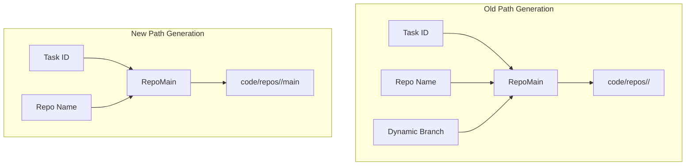

# Design: Simplify Repository Workspace Paths

## Architecture



## Path Generation Changes

We will modify the `WorkspacePaths` interface and its implementation:

```go
// Old
RepoMain(taskID, repoName, branch string) Directory
RepoMainRelative(repoName, branch string) string
RepoRelativeToWorkspace(repoName, branch, repoPath string) string

// New
RepoMain(taskID, repoName string) Directory
RepoMainRelative(repoName string) string
RepoRelativeToWorkspace(repoName, repoPath string) string
```

### Removing `FindRepoMainBranchDir`

The utility `FindRepoMainBranchDir` currently scans `code/repos/<repo>` to find a folder that is not `worktrees`. With the static `main` structure, this logic is obsolete and will be removed.

## Security & Execution Boundaries

| Agent | Allowed Paths | Permissions |
|-------|---------------|-------------|
| Coder | `server/pkg/paths/`, `server/internal/orchestrator/` | Read, Write |

## Risk Mitigation

| Risk | Severity | Mitigation |
|------|----------|------------|
| Workspace metadata incompatibility | LOW | Running tasks may fail if metadata expects dynamic branches, but fresh tasks will work perfectly. We are in development, so wiping workspaces or updating metadata struct is acceptable. |
| Test suite breakages | MEDIUM | We will strictly update all usages of `RepoMain` across all tests and re-run the full orchestrator test suite to ensure completeness. |
