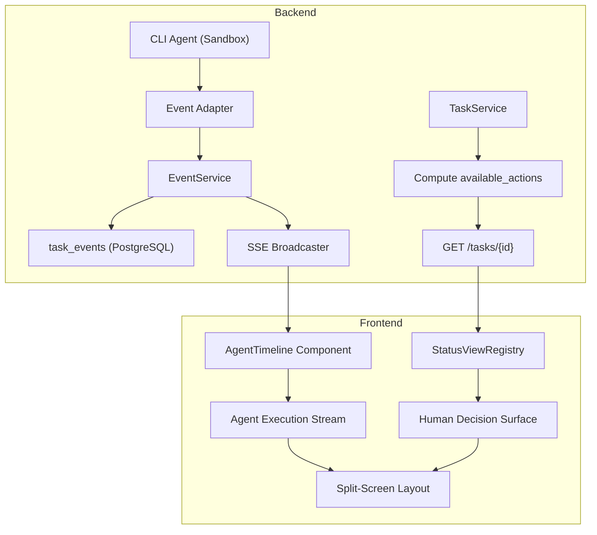
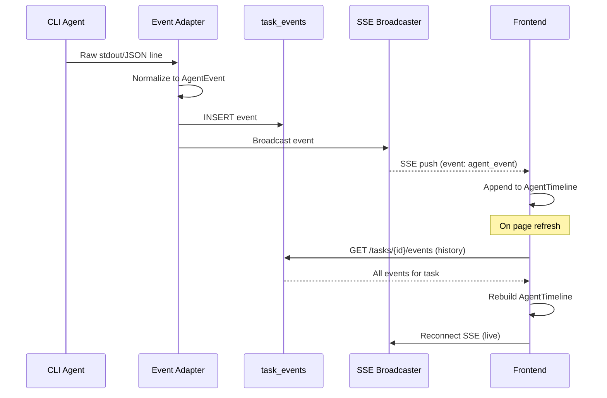

# Design: Status-Driven Agent Workspace

## Key Decisions

- **Decision:** Persist events to DB before SSE broadcast (write-through, not fire-and-forget).
  - **Reason:** Guarantees no event is lost on page refresh, server restart, or SSE disconnect. The DB is the source of truth; SSE is a real-time optimization.

- **Decision:** Normalize CLI output in a backend Go adapter, not in frontend JavaScript.
  - **Reason:** Decouples the UI from CLI-specific output formats. When adding a new CLI provider (e.g., Gemini CLI), only the backend adapter needs a new parser — the frontend is untouched.

- **Decision:** Backend computes `available_actions`, not frontend.
  - **Reason:** Actions depend on status + job state + (future) user permissions + (future) enterprise approval gates. Centralizing this logic in Go avoids duplicating business rules in TypeScript and ensures the UI can never show a button the user isn't authorized to press.

- **Decision:** Use a TypeScript `StatusViewRegistry` object (plain map), not dynamic imports or a routing framework.
  - **Reason:** All status views are small, statically known components. Dynamic imports add unnecessary complexity and loading states. A simple map is the most predictable, testable, and extensible pattern.

- **Decision:** `spec_review` is the only status whose `available_actions` contains an approval-style action (`approve_spec`, `request_changes`). Every other status — including `pr_ready` and `human_review` — never returns `approve_*`/`reject_*` actions. (`planning_split` is not a real backend status — see below.)
  - **Reason:** Product decision: the human reviews and approves the *spec*; every step after that (decomposition, coding, review/fix/test loops, PR creation) runs unattended. Baking this into `computeAvailableActions` (server-side, single function) rather than the frontend guarantees no future status can accidentally introduce a second approval gate — a new status added to the registry without updating this function simply gets no actions, never a silent approval prompt.

- **Decision:** The agent opens a PR automatically once tests pass (`pr_ready`); merging the PR is out of scope for this app.
  - **Reason:** Auto-merging AI-authored code straight to the main branch with zero human visibility is a separate, higher-risk product decision than "don't ask for step-by-step approval." Stopping at "PR opened" keeps a natural, external checkpoint (the repo's own CI / branch protection / a human on GitHub) without reintroducing an in-app approval click. `pr_ready` and `human_review` are therefore rendered as **informational, auto-advancing** progress states — the timeline shows "PR opened" / "PR link" — not as gates with buttons.

- **Decision:** `planning_split` is **dropped**, not formalized as a backend status. The agent's decompose-or-not decision is rendered as an informational sub-view, not an approval gate, and not a distinct top-level status.
  - **Reason:** Task 1.0's verification (see below) confirmed `planning_split` has zero occurrences anywhere in `server/` — it is not one of the 13 real status constants in `server/pkg/models/task.go`, and not a key in `ValidTaskTransitions`. It exists only as dead frontend surface area: a `TaskStatus` union member (`web/src/lib/types.ts:145`) and a status-badge entry (`web/src/lib/status/index.ts:50`) that the backend never emits, plus two components (`SplitProposalCard.tsx`, `TaskSubtasks.tsx`) that check for it defensively. Formalizing it into the backend would mean inventing a new state-machine status to serve a UI need that's better served by data already on the task.
  - **Resolution:** The split decision happens during `analyzing` or `coding` (whichever the backend's decomposition step runs under — confirmed by Task 1.0). It's surfaced two ways, both driven by data, not status: (1) an `agent.plan` timeline event when the decision is made, and (2) `SplitProposalView` rendered as a conditional sub-view of `CodingProgressView` — shown whenever the task payload has a non-empty `proposed_split`/subtask list, hidden otherwise. This removes `planning_split` from `TaskStatus`, `ValidTaskTransitions` mentions, `StatusViewRegistry`, and the status-badge map.

- **Decision:** Autopilot execution is bounded by explicit guardrails, not open-ended.
  - **Reason:** "Runs to `pr_ready` without pausing for approval" must not mean "runs forever unsupervised." An agent that loops, thrashes on `fixing`↔`testing`, or produces a runaway diff needs an automatic circuit breaker, not a human watching a dashboard to notice. Concretely:
    - `max_retry_count` (default 5). **Definition of "a retry"** (this was previously undefined — a loop like `coding → compile fail → fixing → compile fail → ...` needs an unambiguous counter): `retry_count` for a task increments by exactly 1 each time the orchestrator re-enters `fixing` from `testing` (or `reviewing`) having just failed. It does **not** increment per compile attempt or per file edit inside a single `fixing` pass — only per state-machine re-entry into `fixing`. It is reset to 0 the moment the task successfully leaves `fixing`→`testing`→(pass). It also increments if the agent itself emits a `command.finished` event with a retry-intent flag (i.e. the agent explicitly decides to redo the same step) even without a status re-entry, so an agent that retries internally without bouncing the status can't bypass the counter. After 5, the workflow orchestrator auto-transitions the task to `blocked` with `payload.reason = "max_retries_exceeded"`, surfaced via a `task.error` event before the transition.
    - `max_execution_time` (default 2h wall-clock per task, configurable per project): exceeding it auto-transitions to `blocked` with `reason = "execution_timeout"`.
    - `cost_budget` (token/dollar ceiling per task, configurable per project): exceeding it auto-transitions to `blocked` with `reason = "cost_budget_exceeded"`. Requires the Agent Adapter to accumulate a running cost counter from CLI usage events — if the current CLI integration doesn't expose token/cost data, this guardrail ships as time+retry only for v1 and cost is added when that data exists (do not fake a cost figure). **Decision on the unavailable case:** when cost data isn't exposed, `cost_budget` is **inactive**, not defaulted to a conservative estimated limit — a fabricated/estimated cost figure would produce false `blocked` transitions on legitimate long-running tasks, which is worse than having no cost guardrail at all. `max_execution_time` and `max_retry_count` are the enforced backstop in that case; they don't depend on CLI-specific telemetry and are never skipped.
    - `max_event_count` (default 20,000 events per task, **v1, not deferred**): once a task's `task_events` row count crosses this ceiling, the orchestrator auto-transitions to `blocked` with `reason = "event_volume_exceeded"` before persisting further events past the limit (the triggering `task.error` event itself is still written, then the stream is capped). This exists independently of the payload-size cap below — a task producing 100k tiny events (e.g. a stuck loop emitting one `file.changed` per millisecond) is a pathological case the size cap alone doesn't catch, and the review that flagged this correctly identified it as a v1 risk, not a Phase 5 nice-to-have.
    - `security_block`: if the CLI output or Agent Adapter's scrubber (see Security Boundaries) detects a pattern matching a hardcoded secret being committed, or a diff touching a path on a project-level deny-list (e.g. `.github/workflows/`, `infra/`), the task auto-transitions to `blocked` with `reason = "security_review_required"` rather than proceeding to `pr_ready`. This is deliberately conservative — false positives cost a human 30 seconds on `blocked`; false negatives cost a lot more.
  - `blocked` already has `retry_blocked`/`cancel` actions (see specs.md) — these guardrails route into the existing recovery status rather than inventing a new one. A human is only pulled in when the autopilot has concrete evidence something is wrong, not on every step.

## Approach

The system is designed as two independent data planes that converge only at the Task ID:

1. **Control Plane (Human Decision Surface):** Driven by `task.status` and `available_actions` — both sourced from the Task API response. This is a request/response interaction (click button → API call → re-fetch task).

2. **Data Plane (Agent Execution Stream):** Driven by `TaskEvent` objects streamed via SSE. This is a push-based, append-only timeline. The frontend subscribes once and renders events as they arrive.

The two planes are architecturally independent: the Control Plane doesn't need the Event Stream to function, and the Event Stream doesn't need the Control Plane to render. This separation makes each independently testable and deployable.

## Alternatives Considered

### Option A: Tabbed Console
Tabs (Action Gate | Agent Feed | Overview) with auto-switching based on status. Rejected because it forces tab-switching to see both the control panel and the agent stream simultaneously — the most common user need during `coding` status.

### Option C: Dynamic Accordion Stack
Vertically stacked cards that expand/collapse based on status. Rejected because it reuses the existing accordion pattern (`SupportingAccordion.tsx`) which already feels cluttered, and the constant vertical resizing creates a janky experience.

### Frontend-side log parsing
Having the frontend parse raw CLI stdout into structured events. Rejected because: (a) CLI output format varies per provider, (b) parsing logic would be duplicated if a mobile client is ever built, (c) the frontend shouldn't "guess" event boundaries from unstructured text.

### Hardcoded action buttons per status
Keeping `if(status === "coding") show Pause` in the frontend. Rejected because every new status or permission check requires touching multiple UI files, and the pattern has already created scattered conditional logic across `TaskHeroCards`, `TaskHeader`, `TaskDetailLayout`, and `BlockedTaskNotice`.

## Architecture



### Data Flow: Event Lifecycle



## Interfaces & Contracts

### `TaskEvent` Model (Go)

```go
type TaskEvent struct {
    ID             string          `json:"id" gorm:"type:uuid;default:uuid_generate_v4();primaryKey"`
    TaskID         string          `json:"task_id" gorm:"type:uuid;not null;index:idx_task_events_task_seq,priority:1"`
    SequenceNumber int64           `json:"sequence_number" gorm:"not null;index:idx_task_events_task_seq,priority:2"` // per-task monotonic order — see Ordering below
    Type           string          `json:"type" gorm:"not null"`
    SchemaVersion  int             `json:"schema_version" gorm:"not null;default:1"`
    Payload        json.RawMessage `json:"payload" gorm:"type:jsonb;default:'{}'"`
    ArtifactID     *string         `json:"artifact_id,omitempty" gorm:"type:uuid"` // FK into workflow_artifacts, set when Payload holds a summary instead of full content — see Large Output Externalization
    SizeBytes      int             `json:"size_bytes" gorm:"not null"`     // len(Payload) at write time, for storage observability without a JSONB scan
    CreatedAt      time.Time       `json:"created_at" gorm:"index"`        // display/debugging timestamp only — NOT the ordering key, see below
}
```

`SchemaVersion` is per-`type`, not global — `tool.finished` can be at v2 while `test.result` is still v1. Consumers (frontend `TimelineEntry`, any future replay/analytics tooling) switch on `(type, schema_version)`, not `type` alone. Bumping a payload shape without bumping the version is a spec violation, not a style choice — it's what makes old persisted events in `task_events` renderable forever without a migration.

### Ordering: `sequence_number`, not `created_at`

**Problem:** `created_at` alone is not a reliable ordering key. Two events written by different goroutines (e.g. the Agent Adapter's stdout reader and its stderr reader running concurrently) can carry timestamps a millisecond apart or, on some Postgres configurations, can even collide at the stored resolution — `created_at` is fine for display ("2 seconds ago") but is not fit to be the sort key that determines replay order or the SSE cursor.

**Decision:** every `task_events` row gets a `sequence_number bigint`, monotonically increasing **per `task_id`**, assigned at write time inside the same transaction that inserts the row (`SELECT COALESCE(MAX(sequence_number), 0) + 1 FROM task_events WHERE task_id = ? FOR UPDATE` in the same transaction as the insert — the per-task row-lock scope keeps this cheap; there is no global sequence to contend on across unrelated tasks). `sequence_number` is:
- The authoritative order for rendering the timeline (`ORDER BY sequence_number`, not `ORDER BY created_at`).
- The value sent as the SSE `id:` field (replacing a raw event UUID there — see SSE Wire Format) and the value clients echo back via `Last-Event-ID` / `?after=`.
- Compared, not the UUID `id`, when the frontend decides "have I already rendered this event" during reconnect — UUIDs have no order, `sequence_number` does.

This is additive to the existing `id` (UUID) primary key, which remains the row identity for lookups/joins; `sequence_number` is purely the ordering/cursor concern.

### `AvailableAction` (added to Task response)

```go
type AvailableAction struct {
    ID                   string `json:"id"`
    Label                string `json:"label"`
    Style                string `json:"style"`                          // "primary", "warning", "danger", "default"
    ConfirmationRequired bool   `json:"confirmation_required"`          // frontend must show a confirm dialog before dispatching
    Endpoint             string `json:"endpoint"`                       // e.g. "POST /tasks/{taskID}/actions" — see Action Dispatch below
    DisabledReason       string `json:"disabled_reason,omitempty"`      // set (and the button greyed out but still visible) when the actor lacks permission, rather than silently omitting the action
}
```

`available_actions` is deliberately **not** filtered down to "what this specific user is allowed to click" — it lists every action valid for the task's current state, and `disabled_reason` communicates *why* a given viewer can't press one (e.g. `"Only the task owner can approve a spec"`). This keeps the contract stable regardless of who's viewing, and gives the frontend something better to render than a vanished button. Server-side authorization is still enforced independently on the POST (see Security Boundaries) — a disabled-but-visible button is a UX aid, not the security boundary.

### Action Dispatch (single endpoint, not one per action)

```
POST /api/v1/tasks/{taskID}/actions
{
  "action": "approve_spec",   // must be one of task.available_actions[].id
  "request_id": "<client-generated-uuid>"
}
```

- `request_id` makes the call idempotent: replaying the same `request_id` (double-click, retried fetch after a flaky network) returns the original result instead of executing the action twice. Enforced via a unique constraint on `(task_id, request_id)` in a small `task_action_requests` table (or equivalent dedup store) — a second request with the same key returns the first response, not a second side effect.
- The server re-validates `action` against the *current* `available_actions` at request time (not the stale list the client fetched) and returns `409 Conflict` if the task has since moved to a status where that action no longer applies (e.g. someone already clicked `approve_spec` from another tab).
- Returns `403 Forbidden` with a machine-readable `reason` if the caller fails the `ActionPolicy` check below.

### Event Type Taxonomy

| Type | Payload Fields | Description |
|------|---------------|-------------|
| `task.started` | `step` | Agent begins working on a workflow step |
| `task.completed` | `step`, `duration_ms` | Agent finishes a workflow step |
| `task.error` | `step`, `error`, `is_retryable` | Agent encounters an error |
| `status.changed` | `from`, `to` | Task status transition |
| `agent.reasoning_summary` | `summary` | Agent's own public-facing explanation of its reasoning (never raw chain-of-thought) |
| `agent.plan` | `steps[]` | Agent announces planned actions |
| `agent.message` | `text` | Generic agent text output |
| `tool.started` | `tool`, `input` | Agent invokes a tool |
| `tool.finished` | `tool`, `output`, `duration_ms`, `success` | Tool execution completes |
| `file.changed` | `path`, `additions`, `deletions` | Agent modifies a file |
| `command.started` | `command`, `cwd` | Shell command begins |
| `command.finished` | `command`, `exit_code`, `stdout_tail`, `stderr_tail` | Shell command completes |
| `test.result` | `passed`, `failed`, `skipped`, `details` | Test suite results |

### SSE Wire Format

```
id: 501
event: agent_event
data: {"id":"evt_abc","task_id":"task_123","sequence_number":501,"type":"tool.started","schema_version":1,"timestamp":"...","payload":{"tool":"terminal","input":"go test ./..."}}

id: 502
event: agent_event
data: {"id":"evt_def","task_id":"task_123","sequence_number":502,"type":"tool.finished","schema_version":1,"timestamp":"...","payload":{"tool":"terminal","output":"PASS","duration_ms":3200,"success":true}}
```

Every frame sets the standard SSE `id:` field to the event's `sequence_number` (not the UUID `id` — see Ordering above; `sequence_number` is what defines "after this point," the UUID doesn't). This is what makes cursor-based reconnect (below) possible without inventing a custom protocol — `EventSource` echoes whatever's in `id:` back via `Last-Event-ID` automatically, so using `sequence_number` there means the browser hands the server an ordering-correct cursor for free.

### SSE Reconnect: cursor-based, not "replay everything and hope"

The original plan — "on connect, replay all historical events, then subscribe to live broadcasts" — has a race: an event emitted in the gap between the history query finishing and the live subscription registering is lost. It also re-sends the full history on every reconnect (10:00:01 UI connects, ..., 10:00:04 UI subscribes — anything emitted at 10:00:03 falls in the gap).

Fixed design, using the browser's native `EventSource` reconnect behavior instead of fighting it:

1. `GET /tasks/{taskID}/events/stream` accepts an optional `Last-Event-ID` request header (sent automatically by `EventSource` on reconnect, and always a `sequence_number` per the wire format above) or `?after=<sequence_number>` query param (used for the *first* connection after a page load, where there's a locally-cached last-seen `sequence_number` from the initial `GET /events` history call).
2. The handler, inside a single request:
   a. Subscribes to the live broadcast channel for the task **first** (buffered, so nothing sent during step (b) is dropped).
   b. Loads all events with `sequence_number` greater than the cursor (or all events, if no cursor) from `task_events`, ordered by `sequence_number`, and streams them.
   c. Then streams anything that arrived on the live channel during (b), deduplicated by `sequence_number` against what was already sent in (b).
   d. Continues streaming new broadcasts.
3. The frontend never needs its own dedup logic to compensate for a lossy reconnect — the guarantee is upstream — though it keeps a defensive `Set<sequence_number>` client-side anyway (cheap, and covers any future backend bug) per invariant 5.

This replaces the earlier "SSE reconnect storm" risk entry — the fix isn't just backoff, it's that reconnecting no longer means re-fetching the entire task history every time, and that the cursor is a real ordering key instead of an ambiguous timestamp.

### Frontend failure states

Two failure modes the happy-path design doesn't cover on its own:

- **SSE disconnect (network blip, server restart, tab backgrounded then resumed):** handled entirely by the reconnect mechanism above — `EventSource`'s native retry fires, `Last-Event-ID` carries the last-seen `sequence_number`, the handler catches the client up from exactly that point. The UI shows a small non-blocking "Reconnecting…" indicator in the timeline header while `EventSource.readyState !== OPEN`, and clears it on the next received event. No full-page error state, no lost events, no manual retry button needed for this case.
- **Unknown `schema_version`:** a frontend build only knows how to render the `schema_version`s that existed when it shipped. If it receives an event whose `(type, schema_version)` pair it doesn't recognize (e.g. backend rolled out `tool.finished` v2 before the frontend deployed the matching renderer), `TimelineEntry` renders a generic `UnknownEventCard` — shows the event's `type`, timestamp, and raw `payload` as pretty-printed JSON in a collapsed `<details>` — instead of throwing and breaking the rest of the timeline. This is a per-event fallback, not a per-stream failure: one unrecognized event never blocks rendering of the events before/after it.

### `StatusViewRegistry` (TypeScript)

```typescript
type StatusViewConfig = {
  component: React.ComponentType;
  defaultTab?: "control" | "activity"; // for mobile
};

const StatusViewRegistry: Record<string, StatusViewConfig> = {
  todo:             { component: TodoView,             defaultTab: "control" },
  context_loading:  { component: ExecutionProgressView, defaultTab: "activity" },
  analyzing:        { component: ExecutionProgressView, defaultTab: "activity" },
  spec_review:      { component: SpecReviewView,       defaultTab: "control" },   // the ONLY approval gate
  coding:           { component: CodingProgressView,   defaultTab: "activity" },
  reviewing:        { component: ReviewProgressView,   defaultTab: "activity" },
  fixing:           { component: FixProgressView,      defaultTab: "activity" },
  testing:          { component: TestProgressView,     defaultTab: "activity" },
  pr_ready:         { component: PrCreatedView,        defaultTab: "activity" },  // informational, no merge action
  human_review:     { component: PrCreatedView,        defaultTab: "activity" },  // informational, no merge action
  blocked:          { component: BlockedView,          defaultTab: "control" },   // recovery, not approval
  merged:           { component: MergedView,           defaultTab: "control" },
  failed:           { component: FailedView,           defaultTab: "control" },   // recovery, not approval
};
```

All 13 members of `TaskStatus` (`server/pkg/models/task.go` / `web/src/lib/types.ts`, after removing the dead `planning_split` member — see Task 1.0) have an entry. A unit test asserts `Object.keys(StatusViewRegistry)` matches the frontend's `TaskStatus` type exactly, so a status added to the *frontend* union without a registry entry fails CI.

**That alone is insufficient** — it only checks frontend-internal-consistency (registry vs. frontend type), not that the frontend type actually matches the Go backend's real enum. The two can silently drift (someone adds a status in Go, forgets the frontend union, both "tests" above stay green). To make backend↔frontend parity a hard build failure rather than a hand-sync convention:
- A Go test (`server/pkg/models/task_status_test.go`) writes the current `TaskStatus` string constants out to a checked-in fixture, `docs/openspecs/status-driven-agent-workspace/task-statuses.generated.json` (a flat sorted array of the 13 values).
- A frontend test (`web/src/lib/status/__tests__/parity.test.ts`) reads that same fixture and asserts it's set-equal to the frontend `TaskStatus` union's members (via a small literal array kept in sync with the type, since TypeScript unions aren't introspectable at runtime).
- CI runs both. If a developer adds `TaskStatusSecurityReview = "security_review"` in Go without regenerating the fixture and updating the frontend, the Go test fails first (fixture is stale) — this is intentionally a two-step "regenerate, then update frontend" flow, not a runtime auto-sync, so a human deliberately confirms the frontend has a view for the new status before it ships.

## Redundant Component Consolidation

The Task Detail page has accumulated eight prior redesign iterations (`task-detail-status-driven-ui`, `task-detail-status-ui`, `task-detail-layout-rebuild`, `task-detail-ui-enhancement`, `task-detail-workflow-redesign`, `workflow-centric-dashboard`, `ui-status-consolidation`, `task-detail-data-alignment` — all now retired, see [[proposal]]). That left genuine duplication in `web/src/app/projects/[id]/tasks/[taskID]/components/`. This spec's UI work is not additive on top of that pile — it replaces it. Each row below is a concrete deletion, not a "maybe":

| Existing component | LOC | Fate |
|---|---|---|
| `SpecPanel.tsx` | 532 | **Delete.** Content merged into `status-views/SpecReviewView.tsx`. |
| `SpecReviewGate.tsx` | 150 | **Delete.** Duplicate of `SpecPanel`'s approval affordance; superseded by `SpecReviewView.tsx` + `DynamicActionBar`. |
| `CLISpecPanel.tsx` | 185 | **Delete.** Third overlapping spec-display component; folded into `SpecReviewView.tsx`. |
| `TaskHeroCards.tsx` | 533 | **Delete.** This is the file the [[proposal]] problem statement names directly — scattered `if(status === ...)` card rendering. Fully replaced by the per-status view components. |
| `TaskSidebar.tsx` | 209 | **Delete.** Its workflow-progress-step rendering is superseded by `AgentTimeline` (right column); any static task metadata it shows moves into `TaskTitleBlock` or the relevant status view. |
| `SplitProposalCard.tsx` | 153 | **Delete.** Replaced by `status-views/SplitProposalView.tsx` — same data, no `approve_split`/`reject_split` buttons per the autopilot decision above. |
| `BlockedTaskNotice.tsx` | 65 | **Delete.** Replaced by `status-views/BlockedView.tsx`. |
| `ReviewActionBar.tsx` | 110 | **Delete.** Built for a human-driven merge-approval step that no longer exists (`pr_ready`/`human_review` are now informational). Any reusable "open PR" link moves into `PrCreatedView.tsx`. |
| `ReviewVerdictCard.tsx` | 132 | **Keep, relocate.** The agent's own review verdict (not a human action) is legitimate content for `PrCreatedView.tsx` / the timeline — re-used, not deleted. |
| `RequestChangesModal.tsx` | 81 | **Keep, relocate.** Still needed for the one real gate — `request_changes` on `spec_review` — moves under `SpecReviewView.tsx`. |
| `BoundaryResolutionControls.tsx` | 204 | **Keep, relocate.** Recovery affordance for a paused job with a boundary error; moves under `HumanDecisionSurface`'s paused-banner handling (not deleted — this is operational recovery, not an approval gate). |
| `TaskSubtasks.tsx` | 208 | **Keep, relocate.** Subtask progress tree is reused inside `CodingProgressView.tsx` for decomposed parents. |
| `AuditPanel.tsx`, `CheckpointsPanel.tsx`, `SupportingAccordion.tsx` | 183 / 302 / 206 | **Keep as-is.** Already the "Advanced / historical reference" surface the [[proposal]] Non-goals section calls for; stays below the split screen. |

Net effect: **~1,939 LOC deleted** (`SpecPanel` + `SpecReviewGate` + `CLISpecPanel` + `TaskHeroCards` + `TaskSidebar` + `SplitProposalCard` + `BlockedTaskNotice` + `ReviewActionBar`), replaced by the smaller, single-purpose `status-views/*.tsx` set. This consolidation is tracked as its own phase in `tasks.md` so it isn't lost as a "nice to have" — deletion only happens after the replacement view is verified to render the same information, and is done in the same PR as the view that replaces it (never left dangling as dead code).

## Security Boundaries

- The SSE event stream endpoint requires the same `Bearer` token authentication as all other API endpoints.
- Event payloads must never contain raw API keys, tokens, or credentials. The Agent Adapter must scrub sensitive patterns before persisting.
- The `available_actions` computation runs server-side; the frontend cannot invoke an action that wasn't returned by the backend. This is necessary but **not sufficient** — see Authorization below; `available_actions` describes what's valid for the *task's state*, not what's permitted for the *caller*.

### Authorization: `ActionPolicy`

Every action ID maps to a policy checked on `POST /tasks/{taskID}/actions`, independent of and in addition to the `available_actions` state check:

| Action | Requires |
|---|---|
| `approve_spec`, `request_changes` | Caller is the task's assignee/owner, or has `project.write` permission |
| `pause`, `cancel` | Caller has `project.write` permission |
| `retry`, `retry_blocked` | Caller has `project.write` permission |
| `delete` | Caller has `project.admin` permission (destructive, and not reversible the way `cancel` is) |
| `execute` | Caller has `project.write` permission |

This table is intentionally coarse for v1 (project-level roles only, no per-task ACL) — the proposal's original assumption ("future user permissions/roles") is resolved now rather than deferred, because shipping `available_actions` without any server-side policy check would mean the button list is theater. A caller failing the check gets `403 Forbidden`; the button itself renders with `disabled_reason` set (see `AvailableAction` above) so the UI doesn't need a second source of truth for who can click what.

### Idempotency

See Action Dispatch above — every action POST carries a client-generated `request_id`; replays of the same id are no-ops that return the original result, not repeated side effects (important specifically for `approve_spec`, `cancel`, and `delete`, where a double-submit is user-visible and, for `delete`, destructive).

## Performance Considerations

- **Expected throughput:** ~5-50 events/second per active task during `coding` status. Low overall since typically only 1-5 tasks are actively executing per instance.
- **Latency budget:** Event → UI render < 200ms (SSE push latency + React render).
- **DB write cost:** One INSERT per event. With ~100-1000 events per task execution, this is negligible relative to existing task/checkpoint writes.
- **SSE replay on reconnect:** No longer full-history-every-time (see SSE Reconnect above) — only events since the client's last-seen cursor (`sequence_number`, not `created_at` — see Ordering above). Initial page load still fetches full history via `GET /events`, ordered by `sequence_number`; cursor-based pagination (`?before=<sequence_number>&limit=`) ships in **v1** for that endpoint, not deferred to Phase 5 — the review correctly flagged "no pagination" as a real v1 risk once event counts are in the thousands, not a nice-to-have.
- **Known bottleneck:** The Agent Adapter must process CLI output synchronously on the sandbox goroutine. If parsing is slow, it could delay the next CLI output read. Mitigation: the adapter uses a buffered channel to decouple parsing from the sandbox read loop.
- **Payload size limit (v1, not deferred):** Each event's `payload` is capped at **8KB** before persistence, and the actual byte length is recorded in the new `size_bytes` column (cheap storage-observability query: `SELECT type, avg(size_bytes) FROM task_events GROUP BY type` — no JSONB scan needed to find what's bloating the table). Fields prone to unbounded growth are truncated by the Agent Adapter, not left to the DB: `command.finished.stdout_tail`/`stderr_tail` cap at 5KB each with a `"... truncated, N bytes total"` marker; `file.changed` never carries a full diff body, only `additions`/`deletions` counts (the diff itself is fetched from the git provider by the frontend if needed, not persisted per-event).
- **Large output externalization (v1):** When an event's natural payload would need to exceed the 8KB cap to be useful in full (e.g. a full `npm test` failure log, a full diff), the Agent Adapter doesn't just truncate and lose the rest — it writes the full content to the existing `workflow_artifacts` table (`server/pkg/models/workflow.go`'s `WorkflowArtifact`, already used elsewhere in the orchestrator for `patch`/`diff`/`test_output`/`review_findings`, so this reuses existing infrastructure instead of inventing a new blob store) and sets the new `TaskEvent.ArtifactID` to the created artifact's ID. The event's own `payload` then holds a short summary plus the artifact reference:
  ```json
  {
    "type": "agent.tool_result",
    "artifact_id": "a1b2c3d4-...",
    "payload": { "summary": "npm test failed: 3 of 42 tests failed", "tool": "npm test", "exit_code": 1 }
  }
  ```
  not a raw 500KB terminal dump embedded in `task_events.payload`. The frontend timeline renders the summary inline and offers a "View full output" action that fetches `GET /api/v1/artifacts/{artifactID}` (existing `ArtifactRepo` lookup pattern) on demand.
- **`max_event_count` guardrail (v1):** 20,000 events/task auto-blocks (see Decisions above) — the row-count backstop, complementing the per-row size cap/externalization above. Together they bound `task_events` growth on both axes in v1.
- **Event retention policy (v1):** Events for **active** tasks are retained indefinitely (needed for the live timeline and post-mortem of the run in progress). Events for tasks in a terminal status (`merged`, `failed`, `blocked` older than 30 days with no further activity) are eligible for a retention job that runs after 90 days — deferred to Phase 5 as an implementation (the job itself), but the *policy* (90 days for terminal tasks, forever for active ones) is decided now so nothing is built assuming unlimited retention that later needs an awkward migration. Externalized artifacts (`workflow_artifacts` rows referenced by `ArtifactID`) follow the same 90-day terminal-task window, deleted alongside their parent events by the same job.

## Observability

### Metrics
- `task_events.total` — counter of events persisted, labeled by `type`.
- `task_events.sse_subscribers` — gauge of active SSE connections per task.
- `task_events.adapter_parse_errors` — counter of CLI outputs that fell through to `agent.message` fallback.

### Logging
- INFO: Event persisted (`task_id`, `event_type`, `event_id`).
- WARN: Adapter parse fallback triggered (`task_id`, raw output snippet — truncated to 200 chars, no secrets).
- ERROR: DB write failure for event (`task_id`, `event_id`, error).

### Tracing
- N/A — single-service. The event lifecycle (Adapter → DB → SSE) is contained within the Go API server.

## Risks

| Risk | Probability | Impact | Mitigation |
|------|-------------|--------|------------|
| High event volume causes DB bloat | Was Medium (v1 gap) | Resolved for v1 | Payload size cap (8KB) + large-output externalization to `workflow_artifacts` bounds per-row size; `max_event_count` (20,000/task) guardrail bounds row count in real time, not just via a lagging retention job; 90-day retention job bounds row count over the long run for terminal tasks. All three ship in v1, not deferred. |
| CLI output format changes break adapter | Medium | Medium | Adapter uses a lenient parser with `agent.message` fallback. Tests cover known output formats. |
| Events lost between history replay and live subscription on reconnect | Was High (naive replay) | High | Resolved by cursor-based reconnect (subscribe-then-catchup ordering, see SSE Reconnect) — not by client backoff alone. |
| Autopilot runs unsupervised past the point a human would have intervened | Medium | High | `max_retry_count`/`max_execution_time`/`cost_budget`/`security_block` guardrails auto-transition to `blocked` (see Decisions). This is the direct mitigation for removing per-step approval — the system needs its own judgment, not just the human's, for when to stop. |
| Action endpoint invoked by a caller without permission | Medium | High | `ActionPolicy` server-side check on every `POST /actions`, independent of `available_actions` (see Security Boundaries). |
| Double-submitted action (double-click, retry) causes duplicate side effect | Medium | Medium | `request_id`-based idempotency, unique-constrained (see Action Dispatch). |
| Existing UI tests break from layout change | High | Low | Incremental migration: old layout remains behind a feature flag until new layout is stable. |
| `planning_split` status was dead frontend code (confirmed unreachable — zero backend occurrences) | Resolved | N/A | Task 1.0 verified and removed it; split UI now keys off `proposed_split` payload data instead of a status. |
