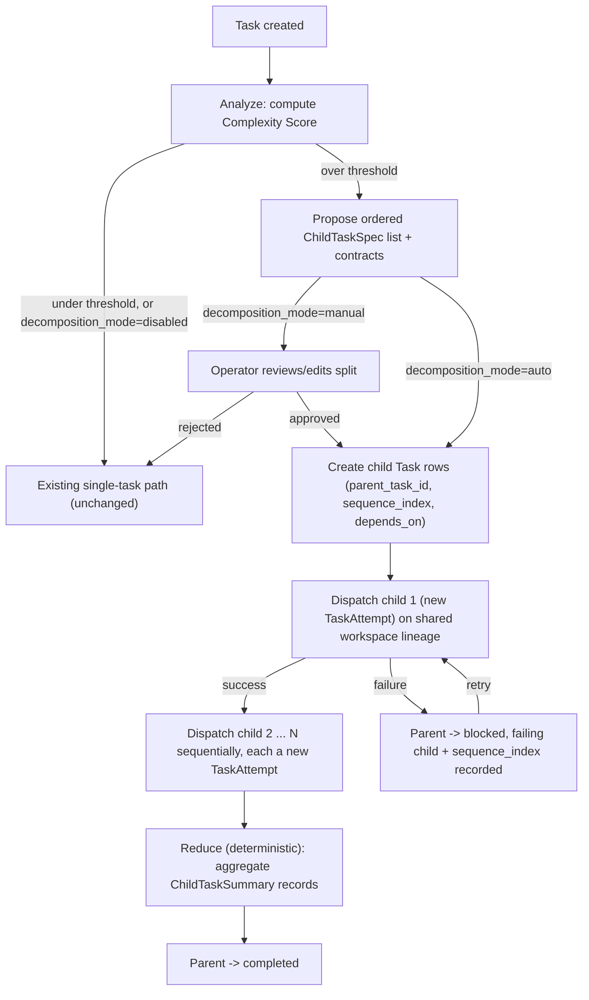

# Design: Task Sub-task Decomposition

## Key Decisions
- **Decision:** Split at planning time (analyze step), not on failure/retry.
  **Reason:** A task that already blew past a provider's token ceiling failed with an untrustworthy partial transcript; re-planning from that point compounds the original problem instead of avoiding it.
- **Decision:** Reuse the existing `parent_task_id`/`SubTasks`/`CreateSubTask` linkage (`server/pkg/models/task.go:66,86`, `server/internal/service/task.go:326-337`) — do not introduce a parallel "chunk" entity.
  **Reason:** That linkage already exists and already ships. Every retry/resume/checkpoint/telemetry mechanism already built for `Task` applies to sub-tasks for free — a parallel chunk concept would reimplement it for no benefit.
- **Decision:** Add `TaskAttempt` as a distinct entity from `Task`, in Phase 1, not deferred.
  **Reason:** A `Task` row answers "what is this work item," a `TaskAttempt` answers "what happened the last time (or three times) we tried it." Collapsing them (mutating `Task` fields on each retry, as the pre-existing model implicitly does today for non-decomposed tasks) destroys exactly the forensic trail this incident needed — "which attempt died at 297s, with what token counts" is only answerable if attempts are their own rows.
- **Decision:** Children execute on the parent's shared workspace/branch lineage (sequential commits), not isolated-then-merged per-child worktrees.
  **Reason:** An isolated worktree per child means child 2 cannot see child 1's real, uncommitted-but-verified work without an explicit merge/handoff — which either reintroduces a context-transfer problem (re-summarizing a diff back into a prompt) or requires a merge step that can itself conflict. Continuous execution on one lineage avoids both.
- **Decision:** Reduce is deterministic code; LLM usage (if any) happens strictly after Reduce, off the critical path.
  **Reason:** Reduce's job (union file lists, sum test counts, sum cost/duration) is data aggregation with one correct answer, not judgment. Routing it through an LLM reintroduces a context-size risk one level up and makes the parent's terminal status non-reproducible for identical child outcomes.
- **Decision:** `decomposition_mode` (`manual` | `auto` | `disabled`) is config, default `manual`.
  **Reason:** Splitting has real overhead and real risk (wrong boundaries cause child-to-child friction); not every project should get it unconditionally the moment the Complexity Score crosses a threshold. `manual` matches the existing "propose then human approves" pattern already used for spec review (`spec_review` status) elsewhere in the task lifecycle — consistent operator experience, not a new paradigm.
- **Decision:** A failed child sets the parent to `blocked`, a new status distinct from `failed`.
  **Reason:** `failed` today means "this task did not happen, retry from scratch or reset to `todo`" (see `ValidTaskTransitions`). A decomposed parent with 2 of 3 children done has real completed progress — reusing `failed` would either falsely imply that progress is gone, or require every consumer of `TaskStatusFailed` (UI badges, alerting, `ValidTaskTransitions`) to special-case "well, unless it has children." A new status keeps `failed`'s existing meaning intact.

## Approach
Extend the existing analyze → plan → execute pipeline with an optional split point between analyze and execute, built entirely on top of the `parent_task_id` linkage that already exists. This reuses the current task state machine and worktree/checkpoint infrastructure rather than introducing a parallel "batch job" system.

## Alternatives Considered
- **Client-side timeout tuning only** (raise `API_TIMEOUT_MS` and friends). Rejected as the sole fix: it does not touch the provider's per-turn *output*-token ceiling — a task genuinely requiring 54k output tokens in one turn cannot be timeout-tuned into fitting a ~4k–8k cap. Kept as an immediate, code-free stopgap (proposal.md Non-goals) alongside this redesign, not instead of it.
- **Streaming/chunked single CLI turn** ("continue" mid-stream when budget runs out). Rejected: none of the three integrated CLIs (`claude`, `codex`, `agy`) expose a supported resume-mid-generation primitive today.
- **Fully autonomous chunking with no operator review, unconditionally.** Rejected as the *only* mode: wrong split boundaries are expensive to discover only after execution starts. `decomposition_mode` resolves this without ruling out automation forever — `auto` is supported by the same data model from day one, just gated off by default until split quality is proven per-project.
- **Single input-token threshold as the split trigger.** Rejected: a 200k-token single-file refactor and a 50k-token five-module feature are not equally risky, but a pure token threshold treats them the same. A composite Complexity Score (tokens + files + dependency depth + deliverable count) better matches where wrong-boundary risk actually comes from.
- **Isolated worktree per child, merged at the end.** Rejected: reintroduces a context-handoff problem between children (see Key Decisions) and adds a merge-conflict failure mode this feature exists to avoid.
- **Mutating the `Task` row in place on retry (no `TaskAttempt`).** Rejected: loses per-attempt forensic data, which is precisely what was missing when investigating the original 297s incident.

## Architecture

## Interfaces & Contracts
- `Task` model additions (all nullable/additive): `SequenceIndex *int`, `DecompositionMode *string` (`manual`|`auto`|`disabled`), `ComplexityScore *json.RawMessage` (breakdown: tokens/files/depth/deliverables + total), `DependsOn pq.StringArray` (sibling task IDs).
- New `TaskAttempt` model: `ID`, `TaskID` (FK), `AttemptNumber int`, `StartedAt`, `FinishedAt *time.Time`, `ExitStatus *int`, `TokensIn *int`, `TokensOut *int`, `CostUSD *float64`, `SandboxRef string` (container/run identifier).
- New `ChildTaskSpec` (analyze output, pre-approval): `Title`, `Instructions`, `Contract{ InputPreviousSummary *ChildTaskSummary, OutputExpected []string }`, `DependsOn []int` (indices into the proposed list, resolved to task IDs on creation).
- New `ChildTaskSummary` (post-execution): `ChangedFiles []string`, `TestsPassed/TestsFailed int`, `CostUSD float64`, `DurationSeconds int`, `OneLineOutcome string`, `ContractDeviation *string` (set when `output_expected` wasn't fully satisfied).
- Task detail API response: existing `subtasks []Task` (already shipped) now reflects real orchestration state; adds `decomposition_mode`, `complexity_score`, `depends_on`, `attempts []TaskAttemptSummary`.
- New `Task.Status` value: `blocked` (see specs.md Failure Scenario), added to `ValidTaskTransitions` as reachable from a running decomposed-parent state and transitioning to itself (retry-in-place) or forward to `completed`/`merged` once unblocked.
- Analyze step output gains `proposed_split *[]ChildTaskSpec` and `complexity_score` (nil/zero when under threshold — the common case).
- Reduce step consumes `[]ChildTaskSummary` only — never a child's raw stdout/stderr.

## Security Boundaries
No new trust boundary: child tasks execute in the same per-task sandboxed container model as today (`sandbox.Runtime`), inheriting the parent task's project/credential scope. No child gets broader permissions than the parent would have had running as one task. `TaskAttempt.SandboxRef` is an identifier only, not a credential.

## Performance Considerations
- **Expected throughput:** N/A (task-orchestration feature, not a hot request path).
- **Latency budget:** A decomposed task's wall-clock time is expected to be *higher* than a hypothetically-successful single-turn run, in exchange for reliability — explicit trade-off (proposal.md), not a regression to fix.
- **Caching:** Sandbox cache mounts (existing `SandboxManager` work) already persist language/package caches across container runs, so sequential children don't each pay a cold-cache penalty.
- **Known bottlenecks:** Sequential-only execution in v1 means total time scales linearly with child count even though `DependsOn` is captured; acceptable for v1 per Non-goals.

## Observability
### Metrics
- `task.decomposition.split_proposed` — counter, per analyze run that crosses the Complexity Score threshold
- `task.decomposition.child_count` — histogram, children per parent
- `task.decomposition.child_failure_rate` — gauge
- `task.tokens.before_split` — the estimate that triggered the split (what the single-turn run would have needed)
- `task.tokens.after_split` — sum of actual tokens in/out across all child `TaskAttempt`s
- `task.duration.single_estimate` — analyze's estimated wall-clock time had the task run as one turn
- `task.duration.actual` — sum of actual child durations plus orchestration overhead
- `task.cost.saved` — `(estimated single-turn cost) - (sum of actual child costs)`, may be negative (proves/disproves the trade-off per-task, not just in aggregate)

### Logging
- INFO: split proposed with `parent_task_id`, proposed child count, complexity score breakdown
- INFO: child task attempt start/end with `parent_task_id`, `child_task_id`, `sequence_index`, `attempt_number`
- WARN: child completed but `ChildTaskSummary.ContractDeviation` set
- ERROR: child failure with `parent_task_id`, `child_task_id`, `sequence_index`, resulting parent status (`blocked`)

### Tracing
- Span: `task.decompose` (analyze-time split proposal) → child span per `task.execute` (existing per-task span, now carrying `parent_task_id`, `sequence_index` attributes) → child span per `TaskAttempt`

## Risks
- **Wrong split boundaries cause child-to-child friction.** Mitigation: operator review gate in `manual` mode (default); Contract's `output_expected` makes a mismatch visible immediately via `ContractDeviation`, not buried in a later child's confusing failure.
- **Complexity Score miscalibration.** Mitigation: threshold and per-factor weights are config values, tunable post-launch without a code change; `task.tokens.before_split`/`after_split` metrics let the threshold be validated against real outcomes.
- **`blocked` becomes a dead end if the failing child can't be fixed by retry alone.** Mitigation: `blocked` retains the same manual-edit affordances as `spec_review` — operator can edit the failing child's instructions before retrying, same UI pattern already used for split review.
