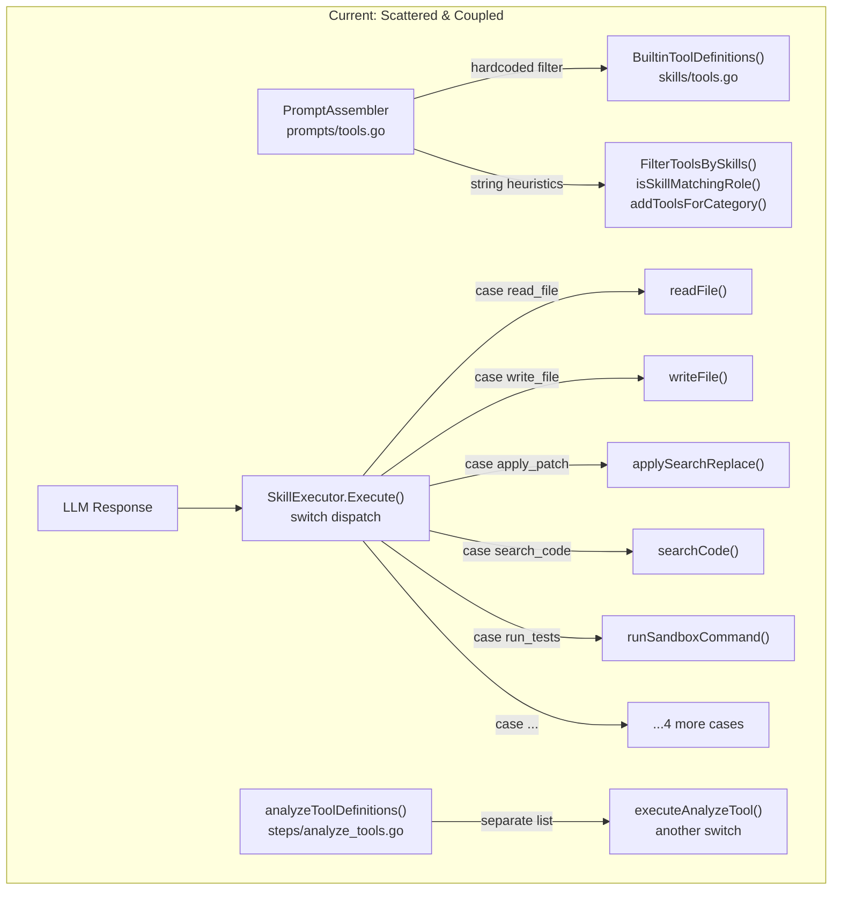
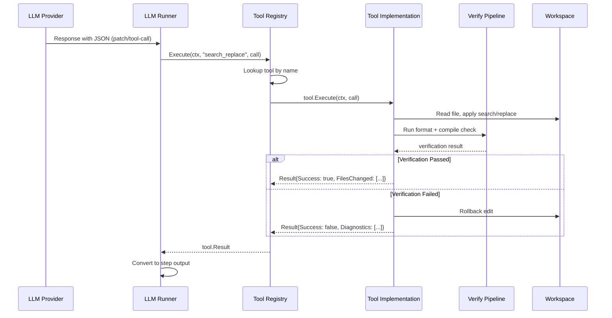

# Design: Tool Runtime Refactor

## Architecture

### Current Architecture (Before)



### Target Architecture (After)

```mermaid
flowchart TD
    subgraph "Tool Layer"
        TI["tool.Tool Interface<br/>Name() Schema() Execute()"]
        TR["tool.Registry<br/>Register() Execute() Definitions()"]
        TI --> TR
    end

    subgraph "Capability Layer"
        CM["CapabilityManager<br/>Role → Capabilities → Tools"]
        RP["Role Profiles<br/>(declarative YAML/Go map)"]
        RP --> CM
        CM -->|ToolsForRole()| TR
    end

    subgraph "Tool Implementations"
        direction LR
        FS["Filesystem<br/>read_file<br/>list_files<br/>file_exists"]
        ED["Editing<br/>search_replace<br/>insert_lines"]
        GT["Git<br/>git_diff<br/>git_status<br/>git_checkpoint"]
        SR["Search<br/>grep_search<br/>find_symbol<br/>find_definition"]
        BD["Build<br/>run_tests<br/>run_build<br/>run_lint"]
        CX["Context<br/>read_spec<br/>read_architecture<br/>read_affected_files"]
    end
    
    FS & ED & GT & SR & BD & CX --> TR

    subgraph "Verification Layer"
        VP["VerifyPipeline<br/>format → compile → lint"]
    end
    ED -->|post-edit| VP

    subgraph "Integration Points"
        PA2["PromptAssembler"] -->|ToolsForRole()| CM
        LR2["LLM Runner"] -->|Execute()| TR
        AS["AnalyzeStep"] -->|Execute()| TR
    end
```

### Execution Flow — Tool Call Lifecycle



---

## Data Models

### Core Interface

```go
package tool

import (
    "context"
    "encoding/json"

    "github.com/auto-code-os/auto-code-os/server/pkg/llm"
)

// Category groups tools by functional domain.
type Category string

const (
    CategoryFilesystem     Category = "filesystem"
    CategoryEditing        Category = "editing"
    CategoryGit            Category = "git"
    CategorySearch         Category = "search"
    CategoryBuild          Category = "build"
    CategoryContext        Category = "context"
    CategoryDocumentation  Category = "documentation"
)

// Capability represents a permission grant for a category subset.
type Capability string

const (
    CapRead       Capability = "read"
    CapEdit       Capability = "edit"
    CapCreate     Capability = "create"
    CapSearch     Capability = "search"
    CapBuild      Capability = "build"
    CapGit        Capability = "git"
    CapGitDiff    Capability = "git.diff"
    CapContext    Capability = "context"
    CapDocs       Capability = "docs"
    CapDependency Capability = "dependency"
)

// Tool is the core interface every tool must implement.
type Tool interface {
    // Name returns the tool's unique identifier (e.g. "read_file").
    Name() string

    // Description returns a human-readable description for the LLM.
    Description() string

    // Schema returns the JSON Schema for the tool's parameters.
    Schema() json.RawMessage

    // Category returns the tool's functional grouping.
    Category() Category

    // Capabilities returns the set of capabilities this tool requires.
    Capabilities() []Capability

    // Execute runs the tool and returns a structured result.
    Execute(ctx context.Context, call Call) (Result, error)
}

// Call contains the invocation context for a tool execution.
type Call struct {
    Input     map[string]any
    Workspace string
    TaskID    string
    AgentID   string
    AgentRole string
}

// Result is the standardized return type for all tools.
type Result struct {
    Success      bool           `json:"success"`
    Message      string         `json:"message,omitempty"`
    Output       string         `json:"output,omitempty"`
    FilesChanged []string       `json:"files_changed,omitempty"`
    Diagnostics  []Diagnostic   `json:"diagnostics,omitempty"`
    Metadata     map[string]any `json:"metadata,omitempty"`
}

// Diagnostic represents a structured error or warning from a tool.
type Diagnostic struct {
    Severity string `json:"severity"` // "error", "warning", "info"
    File     string `json:"file,omitempty"`
    Line     int    `json:"line,omitempty"`
    Message  string `json:"message"`
}
```

### Registry

```go
package tool

import (
    "context"
    "fmt"
    "sync"

    "github.com/auto-code-os/auto-code-os/server/pkg/llm"
)

// Registry manages tool registration and dispatch.
type Registry struct {
    mu    sync.RWMutex
    tools map[string]Tool
}

func NewRegistry() *Registry {
    return &Registry{tools: make(map[string]Tool)}
}

// Register adds a tool to the registry. Panics on duplicate name.
func (r *Registry) Register(t Tool) {
    r.mu.Lock()
    defer r.mu.Unlock()
    if _, exists := r.tools[t.Name()]; exists {
        panic(fmt.Sprintf("tool %q already registered", t.Name()))
    }
    r.tools[t.Name()] = t
}

// Execute dispatches a tool call by name.
func (r *Registry) Execute(ctx context.Context, name string, call Call) (Result, error) {
    r.mu.RLock()
    t, ok := r.tools[name]
    r.mu.RUnlock()
    if !ok {
        return Result{Success: false, Message: fmt.Sprintf("unknown tool: %s", name)}, 
               fmt.Errorf("unknown tool: %s", name)
    }
    return t.Execute(ctx, call)
}

// Definitions returns LLM-compatible tool definitions for all registered tools.
func (r *Registry) Definitions() []llm.ToolDefinition {
    r.mu.RLock()
    defer r.mu.RUnlock()
    defs := make([]llm.ToolDefinition, 0, len(r.tools))
    for _, t := range r.tools {
        defs = append(defs, llm.ToolDefinition{
            Name:        t.Name(),
            Description: t.Description(),
            Parameters:  t.Schema(),
        })
    }
    return defs
}

// ToolsForCapabilities returns definitions filtered by capability set.
func (r *Registry) ToolsForCapabilities(caps []Capability) []llm.ToolDefinition {
    capSet := make(map[Capability]bool, len(caps))
    for _, c := range caps {
        capSet[c] = true
    }
    r.mu.RLock()
    defer r.mu.RUnlock()
    var defs []llm.ToolDefinition
    for _, t := range r.tools {
        if toolMatchesCapabilities(t, capSet) {
            defs = append(defs, llm.ToolDefinition{
                Name:        t.Name(),
                Description: t.Description(),
                Parameters:  t.Schema(),
            })
        }
    }
    return defs
}

func toolMatchesCapabilities(t Tool, capSet map[Capability]bool) bool {
    for _, c := range t.Capabilities() {
        if capSet[c] {
            return true
        }
    }
    return false
}
```

### Capability Manager

```go
package tool

// RoleProfile defines the capabilities granted to an agent role.
type RoleProfile struct {
    Role         string
    Capabilities []Capability
}

// DefaultRoleProfiles returns the standard role → capability mapping.
func DefaultRoleProfiles() map[string]RoleProfile {
    return map[string]RoleProfile{
        "planner": {
            Role:         "planner",
            Capabilities: []Capability{CapRead, CapSearch, CapContext, CapDocs},
        },
        "backend": {
            Role:         "backend",
            Capabilities: []Capability{CapRead, CapEdit, CapBuild, CapGit, CapSearch, CapContext},
        },
        "frontend": {
            Role:         "frontend",
            Capabilities: []Capability{CapRead, CapEdit, CapBuild, CapSearch, CapContext},
        },
        "reviewer": {
            Role:         "reviewer",
            Capabilities: []Capability{CapRead, CapSearch, CapGitDiff, CapContext},
        },
        "qa": {
            Role:         "qa",
            Capabilities: []Capability{CapRead, CapSearch, CapBuild, CapContext},
        },
        "security-auditor": {
            Role:         "security-auditor",
            Capabilities: []Capability{CapRead, CapSearch, CapDependency},
        },
    }
}

// CapabilityManager resolves role → tool set.
type CapabilityManager struct {
    profiles map[string]RoleProfile
    registry *Registry
}

func NewCapabilityManager(registry *Registry, profiles map[string]RoleProfile) *CapabilityManager {
    return &CapabilityManager{profiles: profiles, registry: registry}
}

// ToolsForRole returns the LLM tool definitions available to a role.
func (cm *CapabilityManager) ToolsForRole(role string) []llm.ToolDefinition {
    profile, ok := cm.profiles[strings.ToLower(role)]
    if !ok {
        // Fallback: read + search
        return cm.registry.ToolsForCapabilities([]Capability{CapRead, CapSearch})
    }
    return cm.registry.ToolsForCapabilities(profile.Capabilities)
}
```

### Verification Pipeline

```go
package tool

import "context"

// VerifyHook runs a post-edit verification step.
type VerifyHook interface {
    Name() string
    Run(ctx context.Context, workspace string, files []string) []Diagnostic
}

// VerifyPipeline chains multiple verification hooks.
type VerifyPipeline struct {
    Hooks []VerifyHook
}

// Run executes all hooks in order, returning accumulated diagnostics.
func (vp *VerifyPipeline) Run(ctx context.Context, workspace string, files []string) []Diagnostic {
    var all []Diagnostic
    for _, hook := range vp.Hooks {
        diags := hook.Run(ctx, workspace, files)
        all = append(all, diags...)
        // Stop on first fatal error
        for _, d := range diags {
            if d.Severity == "error" {
                return all
            }
        }
    }
    return all
}
```

### Example Tool Implementation: `search_replace`

```go
package tools

import (
    "context"
    "crypto/sha256"
    "encoding/hex"
    "encoding/json"
    "fmt"
    "os"
    "strings"

    "github.com/auto-code-os/auto-code-os/server/internal/tool"
)

type SearchReplaceTool struct {
    Verify *tool.VerifyPipeline
}

func (t *SearchReplaceTool) Name() string        { return "search_replace" }
func (t *SearchReplaceTool) Category() tool.Category { return tool.CategoryEditing }
func (t *SearchReplaceTool) Capabilities() []tool.Capability { return []tool.Capability{tool.CapEdit} }

func (t *SearchReplaceTool) Description() string {
    return "Apply a targeted search-and-replace edit to a file. Finds the exact 'search' block and replaces it with 'replace'. Supports dry_run mode to preview changes."
}

func (t *SearchReplaceTool) Schema() json.RawMessage {
    return json.RawMessage(`{
        "type": "object",
        "required": ["path", "search", "replace"],
        "properties": {
            "path":    {"type": "string", "description": "Workspace-relative file path"},
            "search":  {"type": "string", "description": "Exact text to find (must match once)"},
            "replace": {"type": "string", "description": "Replacement text"},
            "dry_run": {"type": "boolean", "default": false, "description": "Preview without applying"},
            "verify":  {"type": "boolean", "default": true, "description": "Run post-edit verification"}
        }
    }`)
}

func (t *SearchReplaceTool) Execute(ctx context.Context, call tool.Call) (tool.Result, error) {
    path := call.Input["path"].(string)
    search := call.Input["search"].(string)
    replace := call.Input["replace"].(string)
    dryRun, _ := call.Input["dry_run"].(bool)
    verify := true
    if v, ok := call.Input["verify"].(bool); ok {
        verify = v
    }

    fullPath, err := tool.SafeWorkspacePath(call.Workspace, path)
    if err != nil {
        return tool.Result{Success: false, Diagnostics: []tool.Diagnostic{
            {Severity: "error", Message: err.Error()},
        }}, nil
    }

    data, err := os.ReadFile(fullPath)
    if err != nil {
        return tool.Result{Success: false, Diagnostics: []tool.Diagnostic{
            {Severity: "error", File: path, Message: fmt.Sprintf("cannot read: %v", err)},
        }}, nil
    }

    content := string(data)
    hashBefore := sha256Hash(data)

    count := strings.Count(content, search)
    if count == 0 {
        return tool.Result{Success: false, Diagnostics: []tool.Diagnostic{
            {Severity: "error", File: path, Message: "search block not found in file"},
        }}, nil
    }
    if count > 1 {
        return tool.Result{Success: false, Diagnostics: []tool.Diagnostic{
            {Severity: "error", File: path, Message: fmt.Sprintf("ambiguous: search block found %d times", count)},
        }}, nil
    }

    updated := strings.Replace(content, search, replace, 1)

    if dryRun {
        return tool.Result{
            Success: true,
            Message: "dry run - no changes applied",
            Metadata: map[string]any{"diff_preview": generateDiffPreview(content, updated, path)},
        }, nil
    }

    if err := os.WriteFile(fullPath, []byte(updated), 0o644); err != nil {
        return tool.Result{Success: false, Diagnostics: []tool.Diagnostic{
            {Severity: "error", File: path, Message: fmt.Sprintf("write failed: %v", err)},
        }}, nil
    }

    hashAfter := sha256Hash([]byte(updated))

    // Verification pipeline
    if verify && t.Verify != nil {
        diags := t.Verify.Run(ctx, call.Workspace, []string{path})
        hasError := false
        for _, d := range diags {
            if d.Severity == "error" {
                hasError = true
                break
            }
        }
        if hasError {
            // Rollback
            _ = os.WriteFile(fullPath, data, 0o644)
            return tool.Result{
                Success:     false,
                Message:     "edit rolled back due to verification failure",
                Diagnostics: diags,
            }, nil
        }
    }

    return tool.Result{
        Success:      true,
        Message:      fmt.Sprintf("replaced in %s", path),
        FilesChanged: []string{path},
        Metadata: map[string]any{
            "replaced_count": 1,
            "hash_before":    hashBefore,
            "hash_after":     hashAfter,
        },
    }, nil
}

func sha256Hash(data []byte) string {
    h := sha256.Sum256(data)
    return hex.EncodeToString(h[:8])
}
```

---

## Security & Execution Boundaries

| Agent | Tool Categories | Permissions |
|-------|----------------|-------------|
| Planner | Filesystem (read), Search, Context, Docs | Read only, no file mutation |
| Backend | Filesystem (read), Editing, Build, Git, Search, Context | Read + Write within worktree |
| Frontend | Filesystem (read), Editing, Build, Search, Context | Read + Write within worktree |
| Reviewer | Filesystem (read), Search, Git (diff only), Context | Read only, no mutation |
| QA | Filesystem (read), Search, Build, Context | Read + Execute tests |
| Security | Filesystem (read), Search, Dependency | Read only, dependency scan |

**Path Safety:**
- All filesystem tools use `SafeWorkspacePath()` to prevent directory traversal
- Tools operate within the task's sandbox workspace boundary
- `AgentPathContext` is respected for worktree isolation

---

## Risk Mitigation

| Risk | Severity | Mitigation |
|------|----------|------------|
| Migration breaks existing steps | HIGH | Backward-compatible `SkillExecutor` adapter wraps new registry. No step code changes in Phase 1. |
| LLM confused by new tool names | MEDIUM | Keep `read_file`, rename `apply_patch` → `search_replace` with alias support in registry. Update prompt tool description section. |
| Verification pipeline too slow | MEDIUM | Make verify hooks opt-in per tool call. Default to format-only (fast). Compile check only on explicit `verify: true`. |
| Too many tools overwhelm LLM context | HIGH | Capability manager limits tools per role to 8-12. Tool descriptions are concise. Category grouping reduces cognitive load. |
| Rollback fails after verification | LOW | Pre-read file content before edit. Atomic write pattern. Hash comparison ensures integrity. |
| Registry panics on duplicate registration | LOW | Panic-on-duplicate is intentional — catches developer errors at startup, not at runtime. |

---

## Package Layout

```
server/internal/tool/
├── tool.go              # Tool interface, Call, Result, Diagnostic, Category, Capability
├── registry.go          # Registry: Register, Execute, Definitions, ToolsForCapabilities
├── capability.go        # CapabilityManager, RoleProfile, DefaultRoleProfiles
├── verify.go            # VerifyHook interface, VerifyPipeline
├── helpers.go           # SafeWorkspacePath, hash utilities, diff preview
├── adapter.go           # SkillExecutor backward-compatibility adapter
├── tools/
│   ├── read_file.go
│   ├── search_replace.go
│   ├── grep_search.go
│   ├── list_files.go
│   ├── file_exists.go
│   ├── git_diff.go
│   ├── git_status.go
│   ├── git_checkpoint.go
│   ├── run_tests.go
│   ├── run_build.go
│   ├── run_lint.go
│   ├── find_symbol.go
│   ├── read_spec.go
│   ├── read_affected_files.go
│   ├── create_file.go          # gated write_file replacement
│   ├── generate_docs.go
│   └── create_migration.go
└── verify/
    ├── gofmt.go
    └── compile_check.go
```
