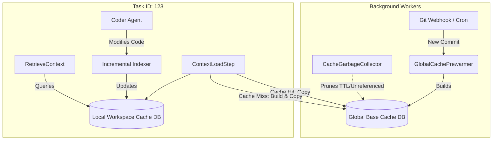

# Design: Two-Tier Context Cache Architecture

## Context
A single shared SQLite database for AST context indexing causes data leakage across isolated task workspaces. Strictly moving to local workspace databases causes massive CPU/time overhead due to re-indexing entire repositories on every task creation. A Two-Tier (Global Base + Local Copy) architecture resolves this.

## Architecture



## Data Models

```go
type GlobalCacheMeta struct {
    RepositoryID string    `json:"repository_id"`
    CommitHash   string    `json:"commit_hash"`
    CreatedAt    time.Time `json:"created_at"`
    LastAccessed time.Time `json:"last_accessed"`
}
```

## API Endpoints
N/A - Internal background workers and orchestrator steps.

## Security & Execution Boundaries

| Agent | Allowed Paths | Permissions |
|-------|---------------|-------------|
| Prewarmer Worker | `server/.data/database/global_cache/` | Read, Write |
| Task Agents | `workspaces/<task_id>/context/` | Read, Write (Local DB only) |
| Context Engine | `server/.data/database/global_cache/` | Read Only |

## Risk Mitigation

| Risk | Severity | Mitigation |
|------|----------|------------|
| Storage Bloat from many global caches | HIGH | Implement strict Reference Counting + 7-day TTL GC. |
| DB Locks during copy | MEDIUM | Global caches are treated as immutable (Read-Only) after initial build. Use OS-level fast file copy. |
| Prewarmer indexing fails | MEDIUM | Fall back to lazy indexing inside the task step, emitting a warning metric. |

## Open Questions
- Can we utilize hardlinks instead of actual file copying on supported file systems (Linux ext4/xfs) to save disk space for the local workspace databases?
