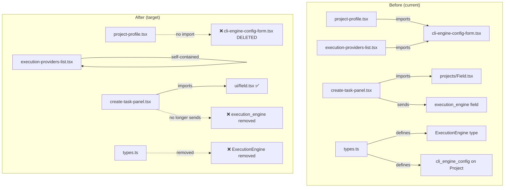

# Design: Web UI Cleanup & Enhancement

## Architecture

No new architecture — this is purely subtractive (dead code removal) and cosmetic (token replacement). No new components, no new APIs, no new state.



## Deletion Map

### Files to DELETE entirely

| File | Lines | Reason |
|------|-------|--------|
| `web/src/components/projects/cli-engine-config-form.tsx` | 224 | Only consumer is `execution-providers-list.tsx` which needs a small subset — extract, then delete |
| `web/src/components/projects/Field.tsx` | 24 | Duplicate of `ui/field.tsx`; only consumer is `create-task-panel.tsx` |

### Fields to REMOVE from types

| File | Field/Type | Reason |
|------|-----------|--------|
| `web/src/lib/types.ts` | `ExecutionEngine` type alias | No longer used anywhere in frontend |
| `web/src/lib/types.ts` | `Project.execution_engine` | Replaced by `execution_providers` |
| `web/src/lib/types.ts` | `Project.cli_engine_config` | Replaced by `execution_providers` |
| `web/src/lib/types.ts` | `Task.execution_engine` | No longer set from frontend |
| `web/src/lib/api/projects.ts` | `UpdateProjectInput.execution_engine` | No longer sent |
| `web/src/lib/api/projects.ts` | `UpdateProjectInput.cli_engine_config` | No longer sent |
| `web/src/lib/api/projects.ts` | `createTask` param `execution_engine` | No longer sent |

### Code blocks to REMOVE from components

| File | What to remove |
|------|---------------|
| `create-task-panel.tsx` | `ExecutionEngine` import, `cliConfigured` variable, `executionEngine` state, "Execution Engine" `<Field>` block (lines 257–270), `execution_engine` from payload/reset |
| `use-task-actions.ts` | `execution_engine` from the `createTask` call payload |
| `project-profile.tsx` | Residual `ExecutionEngine` import if still present |

## Extraction: `execution-providers-list.tsx` refactor

`execution-providers-list.tsx` currently imports from `cli-engine-config-form.tsx`:
```ts
import {
  CLIEngineConfigForm,
  cliConfigToFormValue,
  formValueToCLIConfig,
  type CLIEngineConfigFormValue,
} from "./cli-engine-config-form";
```

**Strategy**: Move **only** these 4 exports into `execution-providers-list.tsx` as private helpers (or a co-located types block at the top of the file). The `CLIEngineConfigForm` JSX component (~100 lines) renders the "Custom CLI" inline editor and must be kept; the converter functions are ~20 lines each. Total extraction ≈ 140 lines moved into `execution-providers-list.tsx`, which grows from 200 → ~340 lines — still well within a single-responsibility component. The original 224-line `cli-engine-config-form.tsx` is then deleted.

Alternative: create a `cli-engine-types.ts` with just the types/converters and keep `CLIEngineConfigForm` component inline. Either approach works; the key constraint is that `cli-engine-config-form.tsx` must not exist after this cleanup.

## Design Token Replacement Map

| Hardcoded class | Semantic replacement | Context |
|----------------|---------------------|---------|
| `bg-slate-950` | `bg-background` | Dialog overlays, code blocks, terminal backgrounds |
| `bg-slate-950/80` | `bg-background/80` | Backdrop overlays |
| `text-slate-200` | `text-foreground` | Primary text in dark contexts |
| `text-slate-300` | `text-foreground/80` or `text-content-muted` | Code block text |
| `text-slate-400` | `text-content-muted` | Muted/secondary text |
| `text-slate-500` | `text-content-muted/70` | Very muted text |
| `text-slate-500/80` | `text-content-muted/60` | Ultra-muted decorative text |
| `bg-slate-500/10` | `bg-surface-hover` | Disabled/inactive badges |
| `text-slate-950` | `text-background` | Inverted text (on warning bg) |
| `border-slate-500/20` | `border-stroke` | Badge borders |

## Per-Page Loop Process (Issue 5)

The original Issue 3 file list was hand-picked and missed 34 of 43 files with hardcoded colors. To avoid repeating that mistake and to fold in dead-code/accessibility/polish checks, the remaining work is restructured as a loop over every top-level page/section rather than a fixed file list:

1. Work one page at a time, in the order listed in `tasks.md` Phase 2 (roughly: low-risk UI primitives and small pages first, largest page — task detail — last).
2. For each page: fix known color-token occurrences (if any), then do a light dead-code/a11y/polish pass scoped to that page's own components only — no drive-by edits to shared components used by pages not yet reached, to keep diffs attributable to one page.
3. Verify (`next build`, `next lint`) and get review/approval before starting the next page.
4. Shared components (`components/ui/*`, `components/projects/*` used across pages) are fixed once, in the earliest page that touches them; later pages just confirm no regressions.

This keeps each reviewable unit small (one page) while guaranteeing full coverage, since the loop terminates only when every page in the list has been visited.

## Risk Mitigation

| Risk | Severity | Mitigation |
|------|----------|------------|
| Backend still sends `execution_engine`/`cli_engine_config` in responses; removing from TS type could hide future issues | LOW | Fields are optional (`?`) in the Go response struct, frontend simply ignores them. No runtime error possible — TypeScript types are compile-time only. |
| `execution-providers-list.tsx` extraction breaks Custom CLI form | MEDIUM | Verify with `next build` + manual browser test of Custom CLI row expand/collapse |
| Design token replacements alter visual appearance | LOW | Tokens already map to the same HSL values used in dark mode. Verify visually. |
| Per-page loop scope creeps into redesign/new features | MEDIUM | REQ-E03 explicitly caps scope to spacing/consistency; each page reviewed and approved before the next starts. |
| Shared component fixed twice by two different page passes | LOW | Design Token Replacement Map + "fix once, earliest page" rule in the Per-Page Loop Process above. |
