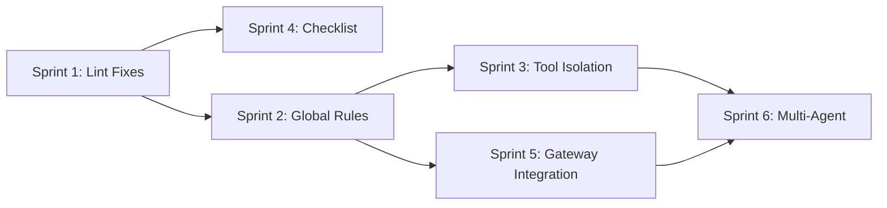

# PLAN: Core Features Hardening

> **Goal**: Implement the §4.3 Next priority features from `docs/ROADMAP.md` to stabilize the core platform before any expansion work.
>
> **Reference**: `docs/ROADMAP.md` §4.3, §5.2, §5.3, §5.6, §5.7; `docs/plans/ui-main-flow.md`
>
> **Priority**: 🔴 HIGH — these features must be complete before starting §4.4 Later or §4.5 Coming Soon items.

---

## Execution Order

```
Sprint 1 → Code Quality & Lint Cleanup          (1-2 hours)
Sprint 2 → Global Rules System                  (1-2 days)
Sprint 3 → Tool Isolation via Skills            (1 day)
Sprint 4 → Setup Checklist Alignment            (2-3 hours)
Sprint 5 → Agent Gateway Integration            (1 day)
Sprint 6 → Multi-Agent Orchestration Patterns   (2-3 days)
```

---

## Sprint 1: Code Quality & Lint Cleanup

**Scope**: Fix all lint warnings/errors across the web frontend. Zero-risk, high-confidence changes.

**Time**: 1-2 hours

### Tasks

| # | Task | File | Issue |
|---|---|---|---|
| 1.1 | Remove unused `AlertTriangle` import | `web/src/app/rules/page.tsx` | `@typescript-eslint/no-unused-vars` |
| 1.2 | Replace `<a href="/">` with `<Link href="/">` | `web/src/app/rules/page.tsx:195` | `@next/next/no-html-link-for-pages` |
| 1.3 | Fix setState in useEffect | `web/src/app/rules/page.tsx:30` | `react-hooks/set-state-in-effect` |
| 1.4 | Fix `any` type → `Record<string, unknown>` | `web/src/app/skills/page.tsx:86` | `@typescript-eslint/no-explicit-any` |
| 1.5 | Escape quotes in JSX | `web/src/app/skills/page.tsx:236` | `react/no-unescaped-entities` |
| 1.6 | Remove unused `useSWR` import | `web/src/app/analytics/page.tsx:3` | `@typescript-eslint/no-unused-vars` |
| 1.7 | Remove unused `session` variable | `web/src/app/gateway/page.tsx:20` | `@typescript-eslint/no-unused-vars` |
| 1.8 | Remove unused `Settings` import | `web/src/components/dashboard/home/home-sidebar.tsx:16` | `@typescript-eslint/no-unused-vars` |
| 1.9 | Remove unused `ShieldAlert` import | `web/src/components/dashboard/settings-tab.tsx:4` | `@typescript-eslint/no-unused-vars` |
| 1.10 | Fix `any` types in agents API | `web/src/lib/api/agents.ts:65,72` | `@typescript-eslint/no-explicit-any` |

### Acceptance
- [ ] `npx tsc --noEmit` → 0 errors
- [ ] `npm run lint` → 0 errors, 0 warnings

---

## Sprint 2: Global Rules System (ROADMAP §5.6)

**Scope**: Add organization-level immutable rules. These are injected into the agent system prompt and cannot be overridden by project rules.

**Time**: 1-2 days

### 2.1 — Database Migration

Create `server/migration/000013_org_global_rules.up.sql`:

```sql
-- Add org_id to rules table for org-level global rules
ALTER TABLE rules ADD COLUMN IF NOT EXISTS org_id UUID REFERENCES organizations(id);

-- Global rules have org_id set, project_id NULL, scope='global'
-- Project rules have project_id set, org_id NULL, scope='project'
CREATE INDEX IF NOT EXISTS idx_rules_org_id ON rules(org_id) WHERE org_id IS NOT NULL;
```

Create `server/migration/000013_org_global_rules.down.sql`:

```sql
DROP INDEX IF EXISTS idx_rules_org_id;
ALTER TABLE rules DROP COLUMN IF EXISTS org_id;
```

### 2.2 — Backend: Model Update

**File**: `server/pkg/models/rule.go`

- Add `OrgID *string` field to `Rule` struct (nullable UUID)
- Update `CreateRuleInput` to accept optional `OrgID`

### 2.3 — Backend: Repository Layer

**File**: `server/internal/repository/rule.go`

- Add `ListByOrgID(ctx, orgID)` → `WHERE org_id = ? AND scope = 'global'`
- Update `Create()` to accept org_id when scope is global

### 2.4 — Backend: Service Layer

**File**: `server/internal/service/rule.go`

- Add `ListByOrgID(ctx, orgID)` method
- Update `Create()` validation:
  - If scope = `global` → require org_id, reject project_id
  - If scope = `project` → require project_id, reject org_id
- Add `SeedDefaultGlobalRules(ctx, orgID)` with immutable security rules

### 2.5 — Backend: API Routes

**File**: `server/internal/handler/router.go`

Add under `/{orgID}`:
```go
r.Route("/rules", func(r chi.Router) {
    r.Get("/", ruleH.ListOrg)
    r.Post("/", ruleH.CreateOrg)
    r.Post("/seed", ruleH.SeedOrg)
})
```

**File**: `server/internal/handler/rule.go`

Add handlers:
- `ListOrg` — extract orgID from URL, call `svc.ListByOrgID`
- `CreateOrg` — extract orgID, set scope=global, call `svc.Create`
- `SeedOrg` — seed default global rules for org

### 2.6 — Backend: Orchestrator Prompt Injection

**File**: `server/internal/orchestrator/prompt.go`

Update `Assemble` / `AssembleForAgent`:
- Fetch global rules for the agent's org → inject into **system message** (position 0)
- Fetch project rules for the task's project → inject into **user context** (after system)
- Global rules marked as `[IMMUTABLE — DO NOT OVERRIDE]`

### 2.7 — Frontend: API Client

**File**: `web/src/lib/api/index.ts`

```typescript
listOrgRules(orgID: string, token: string): Promise<Rule[]>
createOrgRule(orgID: string, token: string, input: CreateRuleInput): Promise<Rule>
seedOrgRules(orgID: string, token: string): Promise<void>
```

### 2.8 — Frontend: Rules Page Update

**File**: `web/src/app/rules/page.tsx`

Layout change:
```
Rules Page
├── Section: Organization Rules (Global)
│   ├── List global rules (read-only badge, immutable icon)
│   ├── Add Global Rule form
│   └── Seed Default Global Rules button
│
├── Divider
│
└── Section: Project Rules (existing)
    ├── Project selector dropdown
    ├── List project rules (editable)
    └── Add Project Rule form
```

### 2.9 — Frontend: Project Settings Tab

**File**: `web/src/components/dashboard/settings-tab.tsx`

- Show global rules as read-only section above project rules
- Label: "Inherited from Organization (immutable)"

### Acceptance
- [ ] Admin can create a global rule at org level
- [ ] Global rules appear in `/rules` page under "Organization Rules"
- [ ] Global rules display as read-only in project Settings tab
- [ ] Orchestrator injects global rules into system prompt
- [ ] Orchestrator injects project rules into task context (separate layer)
- [ ] Seed button creates default security rules

---

## Sprint 3: Tool Isolation via Skills (ROADMAP §5.3 + §5.6)

**Scope**: Agents only see tools matching their assigned skills. Prevents Tool Overload.

**Time**: 1 day

### 3.1 — Backend: Filter Tools by Agent Skills

**File**: `server/internal/orchestrator/prompt.go`

In `AssembleForAgent()`:
1. Fetch agent's assigned skills from DB
2. Build a set of allowed tool names from skills
3. Filter the `[]ToolDefinition` to only include allowed tools
4. If agent has 0 skills → use a default safe set (read_file, write_file)

### 3.2 — Backend: Validate Skill Execution

**File**: `server/internal/orchestrator/skill_executor.go`

Before executing any tool call:
1. Check tool name is in agent's `allowed_tools` set
2. If not → return error: `"agent {name} is not authorized to use tool {tool_name}"`
3. Log unauthorized attempts for audit

### 3.3 — Frontend: Tool Access Display

**File**: `web/src/components/settings/members-panel.tsx`

On agent card (collapsed view):
```
Backend Specialist    backend  •  balanced  •  3 skills  •  4 tools
```

On expanded view, show tool list:
```
Tools: read_file, write_file, run_tests, git_commit
```

### Acceptance
- [ ] Agent with skills `[read_file, write_file]` only sees those tools in LLM prompt
- [ ] Unauthorized tool execution returns clear error
- [ ] UI shows tool count on agent card

---

## Sprint 4: Setup Checklist Alignment (Product Onboarding Flow)

**Scope**: Preserve the full "Getting Started" onboarding flow used by the product UI. This flow intentionally includes organization rules and global skills as first-class setup steps before project execution.

**Time**: 2-3 hours

### 4.1 — Step Definitions

**Target** (8 required steps):
```
Provider → Rules → Skills → Agents → Git → Project → Project Rule/Skill → Task
```

Detailed checks:
1. AI Provider Key — required
2. Organization Rules / Global Rules — required
3. Global Skills — required
4. Organization Agent — required
5. Git Account — required
6. Project — required
7. Project Rule + Agent Skill assignment — required
8. First Task — required

### 4.2 — Update Check Logic

**File**: `web/src/components/dashboard/setup-checklist.tsx`

Changes:
- Keep all 8 onboarding steps visible in the original sequence.
- `Rules` checks org-level global rules from `/rules`.
- `Skills` checks global skills from `/skills`.
- `Project Rule/Skill` checks the first project's project-scoped rules and whether any org agent has assigned skills.
- Auto-hide only when all 8 required checks pass.
- Skeleton shows 8 shimmer rows.

### Acceptance
- [ ] Checklist shows 8 items in the original product flow.
- [ ] Organization rules and global skills are separate required steps.
- [ ] Project rule/skill setup remains a separate project-level required step.
- [ ] Banner auto-hides when all 8 required checks pass.
- [ ] Skeleton shows 8 shimmer rows.

---

## Sprint 5: Agent Gateway Integration (ROADMAP §5.3.C)

**Scope**: Verify agents default to `gateway` provider and `model_route` resolves correctly.

**Time**: 1 day

### 5.1 — Default Fleet Uses Gateway

**Already done**: `members-panel.tsx` DEFAULT_FLEET uses `model_route: "fast"|"balanced"|"powerful"`.

**Verify**: Hire Agent Wizard defaults to `provider: "gateway"`.

**File**: `web/src/components/dashboard/hire-agent-wizard.tsx`

### 5.2 — Orchestrator Gateway Resolution

**File**: `server/internal/orchestrator/orchestrator.go`

Verify in `runLLMStep`:
1. Agent's `model_route` is passed to gateway
2. Gateway resolves route → selects provider credential → executes
3. Fallback: if gateway has no credentials, fall back to `.env` provider keys

### 5.3 — Virtual Key Budget Check

**File**: `server/internal/gateway/gateway.go`

Verify before each LLM call:
1. If agent has a virtual key assigned → check remaining budget
2. If budget exhausted → return error, don't call LLM
3. After call → deduct token cost from virtual key budget

### Acceptance
- [ ] New agents default to `provider: "gateway"`
- [ ] Orchestrator passes `model_route` to gateway
- [ ] Gateway resolves route → picks credential → calls LLM
- [ ] Budget-exhausted virtual key rejects LLM calls

---

## Sprint 6: Multi-Agent Orchestration (ROADMAP §5.3.B)

**Scope**: Add Fan-out and Cross-Harness Review patterns on top of existing Sequential pipeline.

**Time**: 2-3 days

### 6.1 — Complexity-Based Pattern Selection

**File**: `server/internal/orchestrator/orchestrator.go`

In `run()`, after analysis step:
```go
switch task.Complexity {
case "easy":
    // Sequential: single agent, auto-approve spec
    def = workflow.EasyWorkflow(runners)
case "medium":
    // Sequential + Cross-Harness Review
    def = workflow.MediumWorkflow(runners)
case "hard":
    // Fan-out (backend + frontend parallel) + Cross-Harness Review
    def = workflow.HardWorkflow(runners)
}
```

### 6.2 — Easy Workflow Definition

**File**: `server/internal/workflow/definition.go`

```
Analyze → Code(Backend) → Test → PR
```
Skip: Plan, CodeFrontend, Review, Fix, Merge steps.

### 6.3 — Medium Workflow Definition

```
Analyze → Plan → Code(Backend) → Code(Frontend) → Merge → Review → Fix → Test → PR
```
Same as current `DefaultWorkflow`.

### 6.4 — Hard Workflow with Fan-out

```
Analyze → Plan → [Code(Backend) || Code(Frontend)] → Merge → Review → Fix → Test → PR
```
Backend and Frontend run in parallel using existing `MaxParallel: 2`.

### 6.5 — Cross-Harness Review (Stretch)

After coding, assign a **different agent** (reviewer role) for the Review step:
- In `stepRunners`, the Review step should request an agent with `role=reviewer`
- If no reviewer agent exists, fall back to the same agent

### Acceptance
- [ ] Easy task uses simplified pipeline (analyze → code → test → PR)
- [ ] Medium task uses full sequential pipeline
- [ ] Hard task fans out backend + frontend in parallel
- [ ] Review step attempts to use a different agent (reviewer role)

---

## Dependencies & Constraints



| Sprint | Depends On | Blocking |
|---|---|---|
| Sprint 1 | Nothing | Everything (do first) |
| Sprint 2 | Sprint 1 | Sprint 3, Sprint 5 |
| Sprint 3 | Sprint 2 | Sprint 6 |
| Sprint 4 | Sprint 1 | Nothing (independent) |
| Sprint 5 | Sprint 2 | Sprint 6 |
| Sprint 6 | Sprint 3 + Sprint 5 | Nothing |

---

## What Is NOT In This Plan

These features are explicitly deferred per ROADMAP §4.4 and §4.5:

| Feature | Section | Why Deferred |
|---|---|---|
| Discord/Telegram/Slack | §5.11 | Core features must stabilize first |
| Temporal/LangGraph migration | §5.7 | Current engine works for MVP |
| Episodic memory & learning loops | §5.3.D | Requires stable agent pipeline |
| GitLab/Bitbucket support | §5.1 | GitHub covers 90% of use cases |
| Jira/Linear sync | §5.5 | External tracker — not core |
| AI PR Assistant | §5.8 | Nice-to-have after core |
| Langfuse/Helicone | §5.9 | Custom telemetry works for now |
