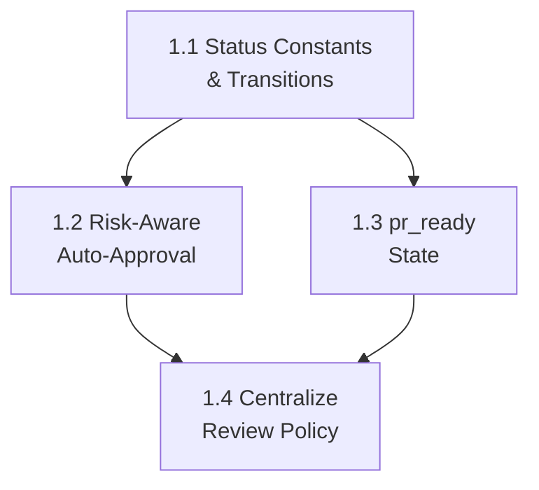

# PLAN: Phase 1 — Policy Correctness

**Source:** `docs/codebase-spec-gap-analysis.md` → Phase 1  
**Specs:** `docs/features/5.7-workflow-engine.md`, `docs/features/5.8-pr-human-review.md`  
**Goal:** Make the backend enforce correct task lifecycle policies: risk-aware auto-approval, `pr_ready` state, and centralized review policy evaluation.  
**Estimated sub-plans:** 4

---

## Sub-Plan 1.1: Add New Task Status Constants & Transition Rules

### Objective
Add `TaskStatusPrReady`, `TaskStatusContextLoading` to the task model and update the state machine transitions.

### Files to modify

| File | Change |
|:-----|:-------|
| `server/pkg/models/task.go` | Add constants + update `ValidTaskTransitions` map |
| `server/internal/workflow/state_machine_test.go` | Add test cases for new transitions |
| `server/pkg/models/task.go` → `TaskAnalysis` struct | Add `RiskDomains []string` field |

### Steps

1. **Add status constants** in `server/pkg/models/task.go`:
   ```go
   TaskStatusContextLoading = "context_loading"  // After: TaskStatusTodo
   TaskStatusPrReady        = "pr_ready"          // After: TaskStatusTesting
   ```

2. **Add `RiskDomains` to `TaskAnalysis`**:
   ```go
   type TaskAnalysis struct {
       // ... existing fields ...
       RiskDomains []string `json:"risk_domains,omitempty"`
   }
   ```

3. **Update `ValidTaskTransitions`**:
   ```go
   var ValidTaskTransitions = map[string][]string{
       TaskStatusTodo:           {TaskStatusContextLoading, TaskStatusAnalyzing, TaskStatusCoding},
       TaskStatusContextLoading: {TaskStatusAnalyzing, TaskStatusFailed},
       TaskStatusAnalyzing:      {TaskStatusSpecReview, TaskStatusCoding, TaskStatusReviewing, TaskStatusFixing, TaskStatusTesting, TaskStatusHumanReview, TaskStatusPrReady, TaskStatusMerged, TaskStatusFailed},
       TaskStatusSpecReview:     {TaskStatusCoding, TaskStatusTodo, TaskStatusFailed},
       TaskStatusCoding:         {TaskStatusReviewing, TaskStatusFailed},
       TaskStatusReviewing:      {TaskStatusFixing, TaskStatusTesting, TaskStatusFailed},
       TaskStatusFixing:         {TaskStatusReviewing, TaskStatusFailed},
       TaskStatusTesting:        {TaskStatusPrReady, TaskStatusFixing, TaskStatusFailed, TaskStatusMerged, TaskStatusReviewing},
       TaskStatusPrReady:        {TaskStatusHumanReview, TaskStatusMerged, TaskStatusFailed},
       TaskStatusHumanReview:    {TaskStatusMerged, TaskStatusFixing, TaskStatusFailed},
       TaskStatusMerged:         {},
       TaskStatusFailed:         {TaskStatusTodo, TaskStatusAnalyzing},
   }
   ```

4. **Add unit tests** in `state_machine_test.go`:
   - `todo -> context_loading` ✅
   - `context_loading -> analyzing` ✅
   - `testing -> pr_ready` ✅
   - `pr_ready -> human_review` ✅
   - `pr_ready -> merged` ✅ (for auto-merge policy cases)
   - `todo -> pr_ready` ❌ (should fail)
   - `coding -> pr_ready` ❌ (should fail)

### Acceptance criteria
- `cd server && go test ./pkg/models/... ./internal/workflow/...` passes.
- New constants are available for use in subsequent sub-plans.

---

## Sub-Plan 1.2: Risk-Aware Auto-Approval Gate

### Objective
Prevent auto-approval of easy tasks that touch high-risk domains. Both the orchestrator path (`StepAnalyze`) and the service path (`TaskService.Analyze`) must use the same policy function.

### Files to modify

| File | Change |
|:-----|:-------|
| `server/internal/policy/review_policy.go` | **NEW** — contains `HasHighRiskDomains()` and `ShouldAutoApproveSpec()` |
| `server/internal/policy/review_policy_test.go` | **NEW** — unit tests |
| `server/internal/orchestrator/orchestrator_steps.go` | Modify `StepAnalyze` auto-approve logic |
| `server/internal/service/task.go` | Modify `Analyze()` to call shared policy |
| `server/internal/orchestrator/orchestrator_steps.go` | Update LLM prompt to request `risk_domains` |

### Steps

1. **Create `server/internal/policy/review_policy.go`** with:
   ```go
   package policy

   var HighRiskPatterns = map[string][]string{
       "auth":           {"auth/", "login", "jwt", "oauth", "session", "token"},
       "payment":        {"payment", "billing", "stripe", "invoice", "pricing"},
       "data_migration": {"migration", "migrations/", "schema", "backfill", "etl"},
       "infra":          {"Dockerfile", "docker-compose", ".github/workflows", "deploy", "terraform", "k8s"},
       "security":       {"secret", "cors", "csp", "encryption", "vulnerability"},
       "rbac":           {"permission", "rbac", "role", "policy", "access_control"},
       "public_api":     {"api/", "openapi", "proto", "graphql"},
   }

   // HasHighRiskDomains checks affected files and risk_domains from analysis.
   func HasHighRiskDomains(affectedFiles []string, riskDomains []string) bool { ... }

   // ShouldAutoApproveSpec determines whether spec can be auto-approved.
   // Returns (specStatus, taskStatus).
   func ShouldAutoApproveSpec(
       complexity string,
       affectedFiles []string,
       riskDomains []string,
       agentAutonomy string,
       projectAutonomy string,
       projectReviewPolicy string,
       hasClarifications bool,
   ) (specStatus string, taskStatus string) { ... }
   ```

   Keep this outside `internal/orchestrator`. `server/internal/service/task.go` already imports `internal/workflow`, and importing `internal/orchestrator` from service code would couple the service layer to the orchestrator package and risk an import cycle as the orchestrator depends on service-like repository interfaces and models.

2. **Update `StepAnalyze`** in `orchestrator_steps.go` (lines ~230–256):
   - After parsing analysis, also request `risk_domains` from LLM.
   - Replace the autonomy/complexity switch with a call to `ShouldAutoApproveSpec()`.
   - Key behavior change: even `AgentAutonomyAutonomous` must **not** auto-approve high-risk tasks.

3. **Update LLM prompt schema** in `orchestrator_steps.go` (line ~38–53):
   - Add `"risk_domains"` to the JSON schema instruction:
     ```
     "risk_domains": ["auth", "payment", ...] // domains this task touches (empty if none)
     ```

4. **Update `TaskService.Analyze()`** in `service/task.go` (lines ~82–96):
   - Replace inline policy logic with call to `ShouldAutoApproveSpec()`.
   - This ensures both entry points (manual analyze via API, orchestrator analyze) use identical policy.

5. **Create `review_policy_test.go`** with test cases:
   - Easy + no risk domains → auto-approved
   - Easy + `["auth"]` → pending_review
   - Easy + affected file `server/internal/auth/handler.go` → pending_review
   - Medium + no risk domains → pending_review (medium always requires review)
   - Autonomous agent + Easy + `["payment"]` → pending_review (risk overrides autonomy)
   - `auto_merge` policy + Easy + `["security"]` → pending_review (risk overrides policy)

### Acceptance criteria
- `cd server && go test ./internal/policy/... ./internal/orchestrator/... ./internal/service/...` passes.
- An easy task with `affected_files: ["server/internal/auth/middleware.go"]` is NOT auto-approved.
- An easy task with `affected_files: ["server/internal/handler/health.go"]` IS auto-approved.

---

## Sub-Plan 1.3: Persist `pr_ready` After PR Creation

### Objective
Change `StepPR` to set task status to `pr_ready` instead of `human_review`. Add explicit transition to `human_review` when reviewer begins review.

### Files to modify

| File | Change |
|:-----|:-------|
| `server/internal/orchestrator/orchestrator_steps.go` | `StepPR` sets `pr_ready` instead of `human_review` |
| `server/internal/orchestrator/orchestrator.go` | `ApproveMerge` accepts both `pr_ready` and `human_review` |
| `server/internal/handler/pr.go` | Add handler to start review (transition `pr_ready → human_review`) |
| `server/internal/handler/router.go` | Add route for start-review endpoint |

### Steps

1. **Modify `StepPR`** in `orchestrator_steps.go` (line ~683):
   ```go
   // Before:
   status := models.TaskStatusHumanReview
   // After:
   status := models.TaskStatusPrReady
   ```

2. **Update `ApproveMerge`** in `orchestrator.go` (line ~252):
   ```go
   // Accept both pr_ready and human_review for backward compatibility
   if task.Status != models.TaskStatusHumanReview && task.Status != models.TaskStatusPrReady {
       return nil, fmt.Errorf("task is not waiting for human PR approval")
   }
   ```

3. **Add `StartReview` function** to orchestrator:
   ```go
   func (o *Orchestrator) StartReview(ctx context.Context, taskID string) (*models.Task, error) {
       task, err := o.tasks.GetByID(ctx, taskID)
       if err != nil { return nil, err }
       if task.Status != models.TaskStatusPrReady {
           return nil, fmt.Errorf("task is not in pr_ready state")
       }
       return o.updateTaskStatus(ctx, taskID, models.TaskStatusHumanReview)
   }
   ```

4. **Add `StartReview` handler** in `server/internal/handler/pr.go` and route it in `server/internal/handler/router.go`:
   ```go
   r.Post("/tasks/{taskID}/pr/start-review", prH.StartReview)
   ```

5. **Handle no-changes path**: When no code changes are generated and no PR is created, transition the task directly to `merged` and append `no_changes: true` to the task metadata. Do not require manual approval for a no-op task.

### Acceptance criteria
- After `StepPR` completes with PRs, task status is `pr_ready`.
- `POST /api/v1/tasks/{id}/pr/start-review` transitions to `human_review`.
- `POST /api/v1/tasks/{id}/pr/approve` works from both `pr_ready` and `human_review`, or the UI requires `start-review` before approval.

---

## Sub-Plan 1.4: Centralize Review Policy Evaluation

### Objective
Unify the spec approval decision so both `TaskService.Analyze()` and orchestrator `StepAnalyze` use the same review policy function, respecting `AutoReviewPolicy` and `DefaultAutonomy` consistently.

### Files to modify

| File | Change |
|:-----|:-------|
| `server/internal/policy/review_policy.go` | Extend `ShouldAutoApproveSpec()` to accept project review policy |
| `server/internal/orchestrator/orchestrator_steps.go` | Read `AutoReviewPolicy` from project in `StepAnalyze` |
| `server/internal/service/task.go` | Import and use shared policy from `internal/policy` |

### Steps

1. **Ensure `ShouldAutoApproveSpec`** handles all three review policies:
   - `always_review` → always `pending_review`
   - `auto_merge` → auto-approve UNLESS high-risk (risk overrides auto_merge)
   - `complexity_based` (default) → easy + low-risk = auto, else review

2. **In `StepAnalyze`**, load project and pass `project.AutoReviewPolicy` into `ShouldAutoApproveSpec()`.

3. **In `TaskService.Analyze()`**, replace the inline policy switch (lines 87–96) with:
   ```go
   specStatus, status := policy.ShouldAutoApproveSpec(
       analysis.Complexity,
       analysis.AffectedFiles,
       nil, // no risk_domains from heuristic analysis
       "",  // no agent in service path
       project.DefaultAutonomy,
       project.AutoReviewPolicy,
       len(analysis.ClarificationQuestions) > 0,
   )
   ```

4. **Add integration test** that verifies:
   - Project with `always_review` → easy task gets `pending_review`
   - Project with `auto_merge` + easy + high-risk → `pending_review`
   - Project with `complexity_based` + easy + low-risk → `auto_approved`

### Acceptance criteria
- Both code paths produce identical spec approval decisions for the same inputs.
- `auto_merge` policy no longer bypasses high-risk gates.
- `cd server && go test ./internal/policy/... ./internal/orchestrator/... ./internal/service/...` passes.

---

## Dependency Graph



## Migration Notes

- No database migration required. `TaskStatusPrReady` and `TaskStatusContextLoading` are stored in the existing `status` VARCHAR column.
- `RiskDomains` is stored inside the `analysis` JSONB column (no schema change).
- Frontend will show `pr_ready` as "unknown" badge until Phase 2 UI updates are applied.
