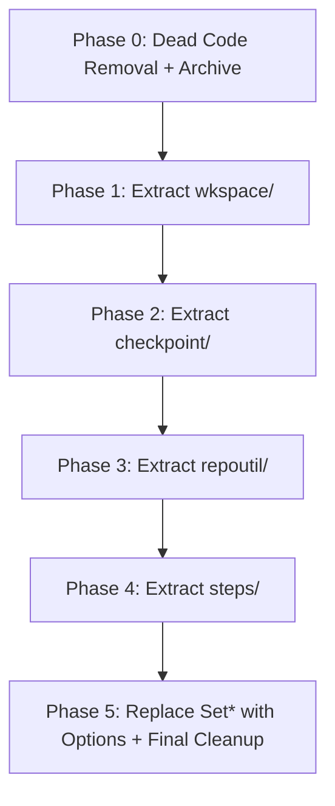

# PLAN: Phase 10 — Orchestrator Sub-Package Extraction

> **Supersedes**: `PLAN-phase9-orchestrator-cleanup.md` (move to `archives/`)
> **Goal**: Break the orchestrator god-struct (17 fields, 80+ methods, 7,911 lines) into composable, testable domain sub-packages.
> **Strategy**: Option A from brainstorm — Domain Sub-Package Extraction.

---

## 0. Pre-Refactor Audit (2026-06-25)

### Dead Code Inventory (to be removed)

| Item | Location | Evidence |
|------|----------|----------|
| `ResolveRepoWorkspace()` | `workspace_lifecycle.go:162` | 0 callers (internal or external) |
| `ports.go` (entire file) | `ports.go:1-39` | All 5 interfaces (`WorkspaceResolver`, `PatchApplier`, `DiffProvider`, `TestRunner`, `LLMStepRunner`) use **unexported method names** and are referenced only by their `var _ = (*Orchestrator)(nil)` compile-time checks. No code uses them as interface types. |
| `PLAN-phase9-orchestrator-cleanup.md` | `docs/plans/` | Fully completed — all checkboxes checked. Move to `archives/`. |

### Internal-Only Exported Methods (can become unexported in sub-packages)

These methods are exported but have **zero external callers** — they exist only because all code is in one flat package:

| Method | Internal Callers | External Callers |
|--------|:---:|:---:|
| `GetTaskWorkspace()` | 6 | 0 |
| `InitTaskWorkspace()` | 2 | 0 |
| `LoadTaskWorkspace()` | 21 | 0 |
| `SaveTaskWorkspaceMetadata()` | 11 | 0 |
| `FindRepoWorkspaceByPath()` | 1 | 0 |

### 10 `Set*()` Methods (to be replaced by Options Pattern)

Currently the `Orchestrator` is constructed with `New()` + 10 setter calls. This will be replaced by a functional options constructor.

---

## 1. Target Architecture

```text
server/internal/orchestrator/
├── orchestrator.go              # Composition root: Orchestrator struct, Options, constructors, public API
├── worker.go                    # Worker loop + run() + fail() + checkpoint() + log()
├── interfaces.go                # ALL exported interfaces (current interfaces.go content, cleaned up)
├── step_registry.go             # stepRunners() mapping only
│
├── steps/                       # NEW: Step execution implementations
│   ├── deps.go                  # StepDeps struct — shared dependency bag for all steps
│   ├── analyze.go               # executeStepAnalyze + runAnalyzeProcess + buildAnalyze* + policy
│   ├── analyze_tools.go         # analyzeToolDefinitions + executeAnalyzeTool + source roots + sandbox
│   ├── context_load.go          # executeStepContextLoad + all context gathering
│   ├── code_backend.go          # executeStepCodeBackend
│   ├── code_frontend.go         # executeStepCodeFrontend
│   ├── plan.go                  # executeStepPlan
│   ├── merge.go                 # executeStepMerge
│   ├── review.go                # executeStepReview
│   ├── fix.go                   # executeStepFix
│   ├── testing.go               # executeStepTest
│   └── pr.go                    # executeStepPR
│
├── wkspace/                     # NEW: Workspace lifecycle domain
│   ├── lifecycle.go             # Init, Load, Save, GetTaskWorkspace, ensureCloned, cleanup
│   ├── locking.go               # acquireWorkspaceLock, releaseWorkspaceLock, heartbeat
│   ├── pruner.go                # StartWorkspacePruner, StartLogPruner, pruneWorkspaces
│   └── helpers.go               # resetExistingWorkspace, getRoleFromSuffix
│
├── checkpoint/                  # NEW: Checkpoint & artifact persistence
│   ├── checkpoint.go            # getSuccessfulCheckpoint, countSuccessfulCheckpoints, getSavedPatch
│   └── recovery.go              # withCheckpointRecovery, saveArtifact
│
├── repoutil/                    # NEW: Repository path resolution + worktrees + diffs
│   ├── paths.go                 # getTaskRepoHostPath, hostWorktreePath, repoHostPath, repoNameFromURL
│   ├── worktrees.go             # setupRoleBranches, setupRoleWorktrees, commitRoleWorktrees
│   ├── diffs.go                 # applyPatch, captureWorkspaceDiff, capturePRDiff, getChangedFiles
│   └── repos.go                 # loadTargetRepositories, targetRepositoriesForTask
│
├── sandbox.go                   # runSandboxStep, runSandboxStepInWorktree, readAffectedFileContent
├── llm_step.go                  # runLLMStep, deriveWorkflowAnalysis
├── llm_trace.go                 # writeLLMCallTrace, redactSecrets
├── agent_manager.go             # AgentManager (stays — external ref from main.go)
├── test_runner.go               # runTargetedTests (thin delegator to tester/)
│
├── [Existing sub-packages — untouched]
│   ├── codecontext/
│   ├── gitops/
│   ├── learning/
│   ├── llmrunner/
│   ├── patch/
│   ├── prompt/
│   ├── skills/
│   ├── tester/
│   └── workspace/
```

### Files to be DELETED after extraction

| File | Reason |
|------|--------|
| `ports.go` | Dead interfaces with unexported methods. Replaced by sub-package exported interfaces. |
| `step_analyze.go` | Moved to `steps/analyze.go` + `steps/analyze_tools.go` |
| `step_code_backend.go` | Moved to `steps/code_backend.go` |
| `step_code_frontend.go` | Moved to `steps/code_frontend.go` |
| `step_context_load.go` | Moved to `steps/context_load.go` |
| `step_context_load_test.go` | Moved to `steps/context_load_test.go` |
| `step_fix.go` | Moved to `steps/fix.go` |
| `step_merge.go` | Moved to `steps/merge.go` |
| `step_plan.go` | Moved to `steps/plan.go` |
| `step_pr.go` | Moved to `steps/pr.go` |
| `step_review.go` | Moved to `steps/review.go` |
| `step_testing.go` | Moved to `steps/testing.go` |
| `checkpoint.go` | Moved to `checkpoint/checkpoint.go` + `checkpoint/recovery.go` |
| `repo_paths.go` | Moved to `repoutil/paths.go` + `repoutil/diffs.go` |
| `repo_worktrees.go` | Moved to `repoutil/worktrees.go` |
| `workspace_lifecycle.go` | Moved to `wkspace/lifecycle.go` + `wkspace/helpers.go` |
| `workspace_lifecycle_test.go` | Moved to `wkspace/lifecycle_test.go` |
| `workspace_locking.go` | Moved to `wkspace/locking.go` |
| `workspace_pruner.go` | Moved to `wkspace/pruner.go` |

---

## 2. Implementation Phases



---

### Phase 0: Dead Code Removal + Archive Old Plans
**Goal**: Clean slate before structural changes.

- [x] **0.1** Delete `ResolveRepoWorkspace()` from `workspace_lifecycle.go` (0 callers).
- [x] **0.2** Delete `ports.go` (entire file — all interfaces are dead).
- [x] **0.3** Move `PLAN-phase9-orchestrator-cleanup.md` to `docs/plans/archives/`.
- [x] **0.4** Run `go build ./internal/orchestrator/...` to confirm no compile errors.
- [x] **0.5** Run `make test` to confirm all tests still pass.

---

### Phase 1: Extract `wkspace/` (Workspace Lifecycle)
**Goal**: Move ~797 lines of workspace management to its own sub-package.

**1.1 — Create `wkspace/` sub-package structure:**
- [x] **1.1.1** Create `wkspace/wkspace.go` with a `Manager` struct holding the workspace-specific dependencies:
  ```go
  type Manager struct {
      Tasks        TaskLookup           // interface { GetByID(...) }
      Workflows    WorkflowCheckpointer // interface subset
      Repos        RepoLister           // interface { ListByProjectID(...) }
      GitOps       GitCloner            // interface subset
      Artifacts    ArtifactLister       // interface subset
      Root         string
      Retention    RetentionConfig
      LockCancels  sync.Map
      LockConns    sync.Map
      Log          func(ctx, taskID, jobID, level, message)
      ApplyPatch   func(ctx, task, agent, stepID, patchText, suffix) error
  }
  ```
- [x] **1.1.2** Define minimal interfaces in `wkspace/interfaces.go` for only what `wkspace/` needs (not the full `WorkflowRepository`).

**1.2 — Move functions:**
- [x] **1.2.1** Move `workspace_lifecycle.go` functions to `wkspace/lifecycle.go`:
  `GetTaskWorkspace`, `InitTaskWorkspace`, `LoadTaskWorkspace`, `SaveTaskWorkspaceMetadata`, `FindRepoWorkspaceByPath`, `ensureWorkspaceCloned`, `cleanupWorkspaceAfterFinalState`, `partialCleanupWorkspace`, `RemoveWorkspace`, `resetExistingWorkspace`, `getRoleFromSuffix`.
- [x] **1.2.2** Move `workspace_locking.go` functions to `wkspace/locking.go`:
  `acquireWorkspaceLock`, `releaseWorkspaceLock`, `localWorkspaceLock` struct.
- [x] **1.2.3** Move `workspace_pruner.go` functions to `wkspace/pruner.go`:
  `StartWorkspacePruner`, `StartLogPruner`, `pruneWorkspaces`, `pruneLogFiles`.

**1.3 — Rewire callers in root package:**
- [x] **1.3.1** Add `wkspace *wkspace.Manager` field to `Orchestrator` struct.
- [x] **1.3.2** Replace all `o.LoadTaskWorkspace(...)` calls with `o.wkspace.LoadTaskWorkspace(...)`.
- [x] **1.3.3** Replace all other workspace calls similarly.
- [x] **1.3.4** Delete old files: `workspace_lifecycle.go`, `workspace_lifecycle_test.go`, `workspace_locking.go`, `workspace_pruner.go`.

**1.4 — Tests:**
- [x] **1.4.1** Move `workspace_lifecycle_test.go` to `wkspace/lifecycle_test.go`, update package declaration.
- [x] **1.4.2** Run `go test ./internal/orchestrator/...` — all must pass.

---

### Phase 2: Extract `checkpoint/` (Checkpoint & Recovery)
**Goal**: Move 162 lines of checkpoint logic to an isolated sub-package.

- [x] **2.1** Create `checkpoint/checkpoint.go` with a `Store` struct:
  ```go
  type Store struct {
      Workflows  CheckpointRepo  // interface { ListCheckpoints, CreateCheckpoint }
      Artifacts  ArtifactRepo    // interface { ListByTaskID, Create }
      Log        func(ctx, taskID, jobID, level, message)
  }
  ```
- [x] **2.2** Move: `getSuccessfulCheckpoint`, `countSuccessfulCheckpoints`, `getSavedPatch`, `saveArtifact` → `checkpoint/checkpoint.go`.
- [x] **2.3** Move: `withCheckpointRecovery` → `checkpoint/recovery.go`. This needs a `PatchApplier` and `StatusUpdater` func/interface injected.
- [x] **2.4** Rewire callers in root package: `o.getSuccessfulCheckpoint(...)` → `o.checkpoints.GetSuccessful(...)`.
- [x] **2.5** Delete old file: `checkpoint.go`.
- [x] **2.6** Run `go test ./internal/orchestrator/...`.

---

### Phase 3: Extract `repoutil/` (Repo Paths, Worktrees, Diffs)
**Goal**: Move ~380 lines of path resolution and git worktree logic.

- [x] **3.1** Create `repoutil/paths.go`:
  Move `getTaskRepoHostPath`, `hostWorktreePath`, `repoHostPath`, `repoNameFromURL` from `repo_paths.go`.
- [x] **3.2** Create `repoutil/worktrees.go`:
  Move `setupRoleBranches`, `setupRoleWorktrees`, `commitRoleWorktrees` from `repo_worktrees.go`.
- [x] **3.3** Create `repoutil/diffs.go`:
  Move `applyPatch`, `captureWorkspaceDiff`, `capturePRDiff`, `getChangedFiles` from `repo_paths.go`.
- [x] **3.4** Create `repoutil/repos.go`:
  Move `loadTargetRepositories`, `targetRepositoriesForTask` from `repo_paths.go`.
- [x] **3.5** Rewire callers: `o.getTaskRepoHostPath(...)` → `o.repoutil.GetTaskRepoHostPath(...)`.
- [x] **3.6** Delete old files: `repo_paths.go`, `repo_worktrees.go`.
- [x] **3.7** Run `go test ./internal/orchestrator/...`.

---

### Phase 4: Extract `steps/` (Step Implementations)
**Goal**: Move ~1,800 lines of step execution logic. The most impactful change.

**4.1 — Create shared dependency struct:**
- [x] **4.1.1** Create `steps/deps.go` with a `Deps` struct that steps receive instead of `*Orchestrator`:
  ```go
  type Deps struct {
      Tasks       TaskRepository
      Workflows   WorkflowRepository
      Projects    ProjectRepository
      Repos       RepositoryRepository
      Agents      AgentAssigner
      LLM         llm.Provider
      Prompts     PromptBuilder
      Runtime     sandbox.Runtime
      Wkspace     *wkspace.Manager
      Checkpoints *checkpoint.Store
      RepoUtil    *repoutil.Manager
      // Function delegates for capabilities that stay on root Orchestrator:
      RunLLMStep              func(ctx, task, agent, jobID, stepID, instruction) (map[string]any, error)
      RunSandboxStep          func(ctx, task, agent, stepID, command) (map[string]any, error)
      RunSandboxStepInWorktree func(...)
      RunTargetedTests        func(...)
      SaveArtifact            func(...)
      UpdateTaskStatus        func(ctx, taskID, newStatus) (*models.Task, error)
      Log                     func(ctx, taskID, jobID, level, message)
      ContainerPathForHostPath func(...)
      ReadAffectedFileContent func(...)
      WriteLLMCallTrace       func(...)
  }
  ```

**4.2 — Move step files (one by one):**

Each step follows the same pattern:
1. Change `func (o *Orchestrator) executeStep*(...)` → `func Execute*(deps *Deps, ...)`
2. Replace `o.xxx` calls with `deps.Xxx` calls
3. Move file to `steps/` directory
4. Update `step_registry.go` to call `steps.Execute*(deps, ...)` instead

- [x] **4.2.1** Move `step_plan.go` → `steps/plan.go` (smallest, 50 lines — good pilot).
- [x] **4.2.2** Move `step_testing.go` → `steps/testing.go` (72 lines).
- [x] **4.2.3** Move `step_review.go` → `steps/review.go` (82 lines).
- [x] **4.2.4** Move `step_code_backend.go` → `steps/code_backend.go` (81 lines).
- [x] **4.2.5** Move `step_code_frontend.go` → `steps/code_frontend.go` (101 lines).
- [x] **4.2.6** Move `step_fix.go` → `steps/fix.go` (127 lines).
- [x] **4.2.7** Move `step_merge.go` → `steps/merge.go` (166 lines).
- [x] **4.2.8** Move `step_pr.go` → `steps/pr.go` (223 lines).
- [x] **4.2.9** Move `step_context_load.go` + test → `steps/context_load.go` + `steps/context_load_test.go` (433 lines).
- [x] **4.2.10** Move `step_analyze.go` → `steps/analyze.go` (policy + LLM loop, ~400 lines) + `steps/analyze_tools.go` (tool defs + execution, ~270 lines).

**4.3 — Update `step_registry.go`:**
- [x] **4.3.1** Update `stepRunners()` to call `steps.ExecutePlan(deps, ...)` etc. instead of `o.executeStepPlan(...)`.
- [x] **4.3.2** Delete all old `step_*.go` files from root.

**4.4 — Tests:**
- [x] **4.4.1** Move `step_context_load_test.go` to `steps/`.
- [x] **4.4.2** Run `go test ./internal/orchestrator/...`.

---

### Phase 5: Replace `Set*()` with Options Pattern + Final Cleanup
**Goal**: Clean constructor API and final file audit.

- [x] **5.1** Replace 10 `Set*()` methods with functional `Option` pattern:
  ```go
  type Option func(*Orchestrator)

  func WithLLMProvider(p llm.Provider) Option { return func(o *Orchestrator) { o.llm = p } }
  func WithGitOpsClient(c GitOpsClient) Option { ... }
  // ... etc

  func New(taskRepo TaskRepository, workflowRepo WorkflowRepository, agentMgr AgentAssigner, runtime sandbox.Runtime, opts ...Option) *Orchestrator {
      o := &Orchestrator{...defaults...}
      for _, opt := range opts { opt(o) }
      o.sandboxGit = gitops.NewSandboxGitClient(o.runSandboxStep, o.log)
      return o
  }
  ```
- [x] **5.2** Update `cmd/api/main.go` to use `orchestrator.New(..., WithLLMProvider(...), WithGitOpsClient(...), ...)`.
- [x] **5.3** Delete `NewOrchestratorWithPrompt()` (replaced by `New()` + `WithPrompts()`).
- [x] **5.4** Final audit: ensure no `step_*.go` or `workspace_*.go` files remain in root.
- [x] **5.5** Run `goimports -w` on all changed files.
- [x] **5.6** Run full test suite: `make test`.

---

## 3. Import Cycle Prevention Rules

Sub-packages **MUST NOT** import the root `orchestrator` package. All dependencies flow downward:

```
orchestrator (root)
    ├── imports → steps/
    ├── imports → wkspace/
    ├── imports → checkpoint/
    ├── imports → repoutil/
    ├── imports → gitops/
    ├── imports → patch/
    ├── imports → llmrunner/
    ├── imports → tester/
    └── imports → workspace/

steps/ → imports wkspace/, checkpoint/, repoutil/ (via deps.go interfaces)
wkspace/ → imports workspace/ (pure helpers only)
repoutil/ → imports patch/, gitops/, workspace/
checkpoint/ → (no orchestrator sub-package imports)
```

**Rule**: If a sub-package needs root orchestrator behavior, it receives it as a **function parameter** or **interface**, never as an import.

---

## 4. Success Criteria

1. **Root package ≤ 9 files (excluding tests)**: `orchestrator.go`, `worker.go`, `interfaces.go`, `step_registry.go`, `sandbox.go`, `llm_step.go`, `llm_trace.go`, `agent_manager.go`, `test_runner.go`.
2. **No file > 600 lines** in root package (excluding tests).
3. **`step_*.go` files exist only inside `steps/`**, not in root.
4. **`workspace_*.go` files exist only inside `wkspace/`**, not in root.
5. **`ports.go` deleted**: Dead interfaces removed.
6. **Zero dead code**: `ResolveRepoWorkspace` and any other 0-caller functions removed.
7. **Options pattern constructor**: No `Set*()` methods on `Orchestrator`.
8. **Green build**: `make test` passes (Go tests + Playwright E2E).
9. **Sub-packages independently testable**: Each can be unit tested with mock interfaces.

---

## 5. Risk Assessment

| Risk | Severity | Mitigation |
|------|----------|------------|
| Import cycle between `steps/` and root | High | `steps/` receives `Deps` struct, never imports root. All callbacks are function types. |
| `step_context_load_test.go` breaks on move | Medium | Test uses package-level functions; update package declaration and imports. |
| `orchestrator_test.go` (50KB, 1200+ lines) breaks | High | Keep in root package. It tests the integrated flow through `stepRunners()`, which stays in root. |
| External callers of `NewOrchestratorWithPrompt` break | Low | Search all callers (only `main.go`), update atomically. |
| `wkspace.Manager` circular dep through `ApplyPatch` callback | Medium | `ApplyPatch` is injected as a `func(...)` — no import needed. |

---

## 6. Per-Phase Commit Strategy

| Phase | Commit Message |
|-------|---------------|
| Phase 0 | `refactor(orchestrator): remove dead code (ResolveRepoWorkspace, ports.go)` |
| Phase 1 | `refactor(orchestrator): extract wkspace/ sub-package` |
| Phase 2 | `refactor(orchestrator): extract checkpoint/ sub-package` |
| Phase 3 | `refactor(orchestrator): extract repoutil/ sub-package` |
| Phase 4 | `refactor(orchestrator): extract steps/ sub-package` |
| Phase 5 | `refactor(orchestrator): Options pattern constructor + final cleanup` |
