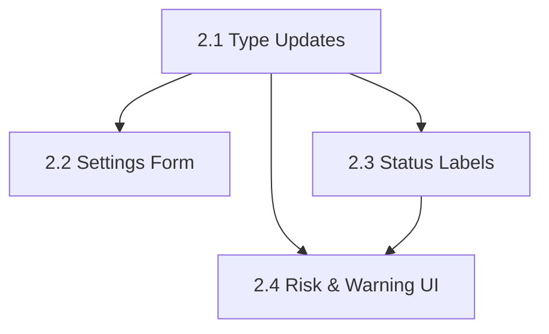

# PLAN: Phase 2 — UI and Reviewer Visibility

**Source:** `docs/codebase-spec-gap-analysis.md` → Phase 2  
**Specs:** `docs/features/5.7-workflow-engine.md`, `docs/features/5.8-pr-human-review.md`  
**Depends on:** Phase 1 (new status constants, risk domains, `pr_ready`)  
**Goal:** Surface new policy states and review metadata in the Next.js frontend so reviewers can see risk domains, review-fix cycle warnings, and new task lifecycle states.  
**Estimated sub-plans:** 4

---

## Sub-Plan 2.1: Frontend Type Updates

### Objective
Add missing fields to TypeScript types so the frontend can consume new backend data.

### Files to modify

| File | Change |
|:-----|:-------|
| `web/src/lib/types.ts` → `Project` | Add `max_review_fix_cycles?: number` |
| `web/src/lib/types.ts` → `TaskAnalysis` | Add `risk_domains?: string[]` |

### Steps

1. **Update `Project` type**:
   ```ts
   export type Project = {
     // ... existing fields ...
     max_review_fix_cycles?: number;
   };
   ```

2. **Update `TaskAnalysis` type**:
   ```ts
   export type TaskAnalysis = {
     // ... existing fields ...
     risk_domains?: string[];
   };
   ```

### Acceptance criteria
- TypeScript compiles without errors.
- Types match the backend JSON shape from Phase 1.

---

## Sub-Plan 2.2: Project Settings — Max Review Fix Cycles

### Objective
Expose `max_review_fix_cycles` in the project settings form alongside `max_retries`.

### Files to modify

| File | Change |
|:-----|:-------|
| `web/src/components/projects/project-profile.tsx` | Add form field, state, and submit logic for `max_review_fix_cycles` |

### Steps

1. **Add state** for `maxReviewFixCycles`:
   ```ts
   const [maxReviewFixCycles, setMaxReviewFixCycles] = useState(project?.max_review_fix_cycles ?? 3);
   ```

2. **Add `useEffect` sync** from `project` prop (alongside existing `setMaxRetries`):
   ```ts
   setMaxReviewFixCycles(project.max_review_fix_cycles ?? 3);
   ```

3. **Add form input** inside the "AI Workflow Defaults" grid, next to "Max Retries":
   ```tsx
   <div className="flex flex-col gap-1.5">
     <label className="text-xs font-mono font-bold uppercase tracking-wider text-content-muted">
       Max Review-Fix Cycles
     </label>
     <input
       type="number" min={1} max={10}
       value={maxReviewFixCycles}
       onChange={(e) => setMaxReviewFixCycles(Number(e.target.value))}
       ...
     />
   </div>
   ```

4. **Update `onUpdateProject` call** to include `max_review_fix_cycles: maxReviewFixCycles`.

5. **Update `ProjectProfileProps` interface** to accept `max_review_fix_cycles` in the update payload.

### Acceptance criteria
- Settings page shows "Max Review-Fix Cycles" input.
- Saving the form sends the value to the backend.
- Reloading the page shows the persisted value.

---

## Sub-Plan 2.3: Task Status Labels for `context_loading` and `pr_ready`

### Objective
Make the task detail page, task list, and workflow monitor recognize and render the new status values.

### Files to modify

| File | Change |
|:-----|:-------|
| `web/src/components/ui/badge.tsx` | Add color mappings for `context_loading` and `pr_ready` |
| `web/src/app/projects/[id]/tasks/[taskID]/page.tsx` | Handle `pr_ready` in action buttons and status badges |
| `web/src/app/projects/[id]/tasks/[taskID]/monitor/page.tsx` | Add `context_load` step to the STEPS array |
| `web/src/lib/hooks/use-task-workflow.ts` | Expose `startReview` action for `pr_ready` state |
| `web/src/lib/api/projects.ts` | Add `tasks.startReview(taskID, token)` API call |
| `web/src/lib/api/index.ts` | Re-export `startReview` through the top-level `api` object |

### Steps

1. **Update Badge component** with new status colors:
   ```ts
   "context_loading": "bg-indigo-500/10 text-indigo-600 dark:text-indigo-400 border-indigo-500/20",
   "pr_ready": "bg-purple-500/10 text-purple-600 dark:text-purple-400 border-purple-500/20",
   ```

2. **Add `context_load` to monitor STEPS array** (insert before `analyze`):
   ```ts
   const STEPS = [
     { id: "context_load", label: "Context", icon: Database },
     { id: "analyze", label: "Analyze", icon: Circle },
     // ... rest unchanged
   ];
   ```

3. **Update task detail and monitor page action buttons**:
   - When `task.status === "pr_ready"`, show "Start Review" button that calls `startReview()`.
   - When `task.status === "pr_ready"`, also show "Approve & Merge" as a quick action.

4. **Add `startReview` to `web/src/lib/api/projects.ts`**:
   ```ts
   startReview(taskID: string, token: string) {
     return request<Task>(`/tasks/${taskID}/pr/start-review`, { method: "POST", token });
   }
   ```

5. **Add `startReview` to `web/src/lib/api/index.ts` and `use-task-workflow` hook**.

6. **Update project update payload types** in both `web/src/lib/api/projects.ts` and `ProjectProfileProps` so `max_review_fix_cycles` can be submitted.

### Acceptance criteria
- Monitor page shows 10 steps (Context → Analyze → ... → PR).
- Task in `pr_ready` state shows "Start Review" button.
- Task in `pr_ready` state shows purple badge.
- `context_loading` badge appears as indigo.

---

## Sub-Plan 2.4: Risk Domains & Review-Limit Warnings in UI

### Objective
Display risk domain tags and review-limit-exceeded warnings in the task detail page and PR review section.

### Files to modify

| File | Change |
|:-----|:-------|
| `web/src/app/projects/[id]/tasks/[taskID]/page.tsx` | Show risk domain badges in spec summary; show review_limit_exceeded warning in PR section |
| `web/src/lib/utils/tasks.ts` | Update `getRiskAssessment` to incorporate `risk_domains` |

### Steps

1. **Display risk domain badges** in the spec summary section:
   ```tsx
   {analysisData.risk_domains && analysisData.risk_domains.length > 0 && (
     <div>
       <h3 className="...">Risk Domains</h3>
       <div className="flex flex-wrap gap-1.5">
         {analysisData.risk_domains.map((domain) => (
           <span key={domain} className="rounded-full border border-amber-500/20 bg-amber-500/10 px-2 py-0.5 text-[10px] font-semibold text-amber-600 dark:text-amber-400">
             {domain}
           </span>
         ))}
       </div>
     </div>
   )}
   ```

2. **Show review_limit_exceeded warning** in the PR review banner:
   ```tsx
   {prSummaries[0]?.review_limit_exceeded && (
     <div className="rounded-lg border border-amber-400/30 bg-amber-950/30 p-3 text-xs text-amber-200">
       ⚠️ Review-fix cycle limit was reached. Some findings may remain unresolved. 
       Review carefully before approving.
     </div>
   )}
   ```

3. **Include risk domains in `getRiskAssessment`**:
   - If `risk_domains` contains high-severity entries (`auth`, `payment`, `security`), bump the risk level.

4. **Update PR risk assessment section** to show risk domains:
   ```tsx
   <div>
     <span className="font-sans text-[10px] font-bold uppercase tracking-wider">
       Risk Domains: {riskAssessment.domains?.join(", ") || "none"}
     </span>
   </div>
   ```

### Acceptance criteria
- Task with `risk_domains: ["auth", "payment"]` shows two amber badges.
- PR section shows ⚠️ warning when `review_limit_exceeded` is true.
- Risk assessment section shows domain tags from analysis.

---

## Dependency Graph


