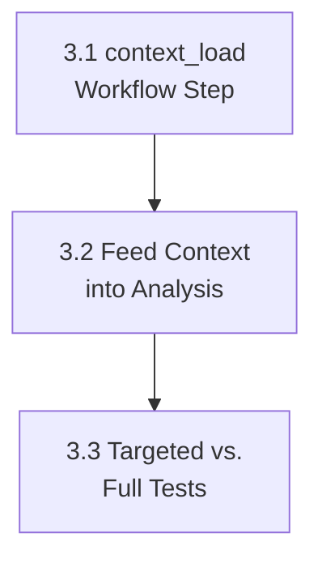

# PLAN: Phase 3 — Workflow Completeness

**Source:** `docs/codebase-spec-gap-analysis.md` → Phase 3  
**Specs:** `docs/features/5.7-workflow-engine.md` → Steps 0, 9  
**Depends on:** Phase 1 (status constants), Phase 2 (UI labels)  
**Goal:** Add the `context_load` workflow step and split targeted vs. full test execution.  
**Estimated sub-plans:** 3

---

## Sub-Plan 3.1: Add `context_load` Workflow Step

### Objective
Insert a `StepContextLoad` before `StepAnalyze` in all workflow definitions. The step collects repository metadata, CI config, test commands, conventions, and architecture docs — then persists them as a checkpoint artifact for downstream steps.

### Files to modify

| File | Change |
|:-----|:-------|
| `server/internal/workflow/step.go` | Add `StepContextLoad` constant; update `StepNameOrder()`, `EasyWorkflow()`, `MediumWorkflow()`, `DescribeStep()` |
| `server/internal/orchestrator/orchestrator_steps.go` | Add `StepContextLoad` runner to `stepRunners()` |
| `server/internal/orchestrator/orchestrator_worker.go` | Set initial task status to `context_loading` instead of `analyzing` |
| `web/src/app/projects/[id]/tasks/[taskID]/monitor/page.tsx` | Phase 2 should add the visible `context_load` step; keep backend and UI step IDs aligned |

### Steps

1. **Add constant** in `step.go`:
   ```go
   StepContextLoad = "context_load"
   ```

2. **Update `StepNameOrder()`**:
   ```go
   return []string{
       StepContextLoad, StepAnalyze, StepPlan, StepCodeBackend, StepCodeFrontend, StepMerge, StepReview, StepFix, StepTest, StepPR,
   }
   ```

3. **Update `EasyWorkflow()`** — insert `context_load` before `analyze`:
   ```go
   steps := []StepDefinition{
       {ID: StepContextLoad, Name: "Context", OutputSchema: statusSchema, Run: runners[StepContextLoad]},
       {ID: StepAnalyze, Name: "Analyze", DependsOn: []string{StepContextLoad}, ...},
       // ... rest
   }
   ```

4. **Update `MediumWorkflow()`** — same pattern.

5. **Update `DescribeStep()`** — add `"context_load": "Load repository context and conventions"`.

6. **Add runner** in `orchestrator_steps.go`:
   ```go
   workflow.StepContextLoad: func(ctx context.Context, _ workflow.StepContext) (map[string]any, error) {
       if _, err := o.updateTaskStatus(ctx, task.ID, models.TaskStatusContextLoading); err != nil {
           return nil, err
       }

       localPath := sandbox.WorkspacePath(o.workspaceRoot, task.ID)
       result := map[string]any{}

       // 1. Detect repository roots
       // 2. Read current branch and recent commits (git log -5 --oneline)
       // 3. Detect test commands (Makefile targets, package.json scripts, go test)
       // 4. Detect CI config (.github/workflows/, .gitlab-ci.yml)
       // 5. Read convention files (.editorconfig, .eslintrc, .golangci.yml)
       // 6. Read ARCHITECTURE.md if exists
       // 7. Read CONTRIBUTING.md if exists

       // Persist as artifact. saveArtifact accepts structured payloads.
       _ = o.saveArtifact(ctx, jobID, task.ID, workflow.StepContextLoad, "context", result)

       return result, nil
   },
   ```

7. **Update worker** in `orchestrator_worker.go` (line ~129):
   ```go
   // Before:
   if _, err := o.updateTaskStatus(ctx, task.ID, models.TaskStatusAnalyzing); err != nil {
   // After:
   if _, err := o.updateTaskStatus(ctx, task.ID, models.TaskStatusContextLoading); err != nil {
   ```

### Acceptance criteria
- Workflow DAG starts with `context_load` for all complexity levels.
- Checkpoint artifact for `context_load` step contains repo structure metadata.
- `cd server && go test ./internal/workflow/... ./internal/orchestrator/...` passes.

---

## Sub-Plan 3.2: Feed Context into Analysis

### Objective
Pass the context-load output into the `StepAnalyze` prompt so the LLM has repository structure, CI config, and conventions available during analysis.

### Files to modify

| File | Change |
|:-----|:-------|
| `server/internal/orchestrator/orchestrator_steps.go` | Read `StepContextLoad` output from `stepCtx.Inputs` in `StepAnalyze` runner |

### Steps

1. **In `StepAnalyze` runner**, read context from step inputs:
   ```go
   var repoContext string
   if contextOut, ok := stepCtx.Inputs[workflow.StepContextLoad]; ok {
       contextJSON, _ := json.Marshal(contextOut)
       repoContext = string(contextJSON)
   }
   ```

2. **Append context to LLM instruction**:
   ```go
   if repoContext != "" {
       instruction += "\n\n=== REPOSITORY CONTEXT ===\n" + repoContext
   }
   ```

3. **Note:** The `StepAnalyze` runner currently uses `func(ctx context.Context, _ workflow.StepContext)`. The `_` must be changed to `stepCtx` to receive inputs.

### Acceptance criteria
- When context-load succeeds, the analysis prompt includes repository metadata.
- When context-load produces empty output (new repo), analysis still works.

---

## Sub-Plan 3.3: Split Targeted vs. Full Test Execution

### Objective
Add optional targeted test execution after `StepCodeBackend`, `StepCodeFrontend`, and `StepFix`. Keep `StepTest` as the full pre-PR verification step.

### Files to modify

| File | Change |
|:-----|:-------|
| `server/internal/orchestrator/orchestrator_steps.go` | Add targeted test runs at end of `StepCodeBackend`, `StepCodeFrontend`, and `StepFix` |
| `server/internal/orchestrator/orchestrator_steps.go` | Update `StepTest` to explicitly run full suite + lint + build verification |
| `server/internal/orchestrator/pr_generator.go` | Update PR body to distinguish targeted vs. full test results |

### Steps

1. **Add targeted test helper**:
   ```go
   func (o *Orchestrator) runTargetedTests(ctx context.Context, task *models.Task, agent *models.Agent, stepName string, changedFiles []string) (map[string]any, error) {
       // Build targeted test command based on changed files
       // For Go: go test ./path/to/package/...
       // For JS: npm test -- --testPathPattern=...
       // Store results as artifact with type "targeted_test"
   }
   ```

2. **Call at end of `StepCodeBackend`** and `StepCodeFrontend`**:
   ```go
   // After code generation and patch application, extract changed files:
   diffResult, _ := o.runSandboxStep(ctx, task, agent, "get_diff", fmt.Sprintf("git -C %s diff --name-only HEAD~1 HEAD", localPath))
   var changedFiles []string
   if diffResult != nil {
       if stdout, ok := diffResult["stdout"].(string); ok && stdout != "" {
           changedFiles = strings.Split(strings.TrimSpace(stdout), "\n")
       }
   }
   
   if len(changedFiles) > 0 {
       if targetedResult, err := o.runTargetedTests(ctx, task, agent, "code_backend_test", changedFiles); err != nil {
           o.log(ctx, task.ID, &jobID, "warn", fmt.Sprintf("targeted tests failed: %v", err))
           // Don't fail the step — targeted test failures are informational at this stage
       }
   }
   ```

3. **Call at end of `StepFix`**:
   ```go
   // After fix patches applied:
   if targetedResult, err := o.runTargetedTests(ctx, task, agent, "fix_test", changedFiles); err != nil {
       o.log(ctx, task.ID, &jobID, "warn", fmt.Sprintf("post-fix targeted tests failed: %v", err))
   }
   ```

4. **Update `StepTest`** to explicitly run full suite + lint + build:
   ```sh
   # Full test suite
   if [ -f go.mod ]; then go test ./...; fi
   if [ -f package.json ]; then npm test; fi
   # Lint (best-effort)
   if [ -f .golangci.yml ]; then golangci-lint run; fi
   if [ -f package.json ] && grep -q '"lint"' package.json; then npm run lint; fi
   # Build verification
   if [ -f go.mod ]; then go build ./...; fi
   if [ -f package.json ] && grep -q '"build"' package.json; then npm run build; fi
   ```

   In multi-repo workspaces, run this per cloned repository root, not only from the top-level task workspace.

   **Crucial:** Failures in `StepTest` (test suite, lint, or build) must return a workflow error (pausing the workflow or triggering a fix loop). As the pre-PR gate, failures here are blocking.

5. **Update PR generator** to include separate sections:
   ```markdown
   ### Test Results
   - ✅ Targeted tests (post-code): passed
   - ✅ Targeted tests (post-fix): passed
   - ✅ Full test suite: passed
   - ✅ Lint: passed
   - ✅ Build verification: passed
   ```

### Acceptance criteria
- Targeted tests run after code and fix steps (non-blocking).
- `StepTest` runs full suite + lint + build.
- PR body distinguishes targeted vs. full test results.
- Targeted test failures are logged as warnings but don't fail the step.

---

## Dependency Graph


