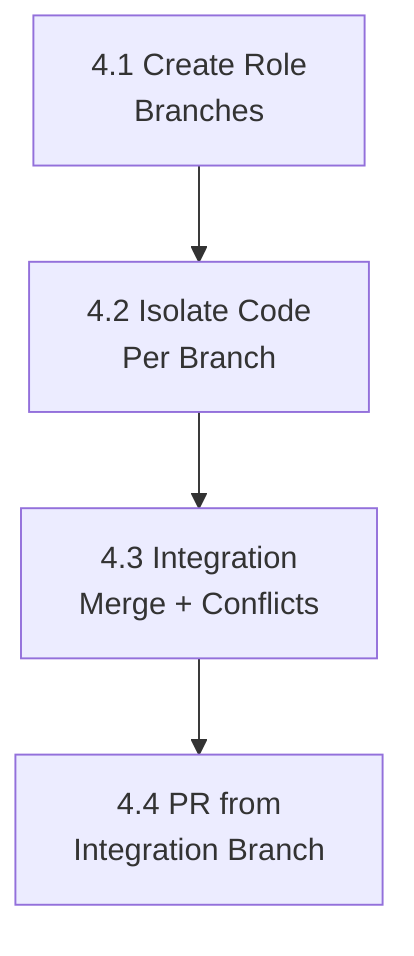

# PLAN: Phase 4 — Multi-Agent Branch Isolation

**Source:** `docs/codebase-spec-gap-analysis.md` → Phase 4  
**Specs:** `docs/features/5.7-workflow-engine.md` → Parallel Coding & Ownership, Step 5  
**Depends on:** Phase 1 + Phase 3 (context loading)  
**Goal:** Implement per-role branch/worktree isolation for parallel backend/frontend coding, with integration merge and conflict detection.  
**Estimated sub-plans:** 4

> [!WARNING]
> This phase has the largest blast radius. It modifies git operations, workspace layout, merge logic, and PR creation.
> Thorough testing in a sandbox environment is essential before deployment.

---

## Sub-Plan 4.1: Allocate Per-Role Branches Before Coding

### Objective
Create separate branches for backend and frontend agents before the coding steps begin, instead of creating a single branch at PR time.

### Files to modify

| File | Change |
|:-----|:-------|
| `server/internal/orchestrator/orchestrator_steps.go` | Modify `StepPlan` to create role branches after planning |
| `server/internal/orchestrator/orchestrator_workspace.go` | Add `createRoleBranch()` helper |
| `server/internal/gitops/gitops.go`, `server/internal/gitops/adapter.go` | Ensure `CreateBranch` supports creating from current HEAD/default branch |
| `server/pkg/models/task.go` or `models/workflow.go` | (Optional) Add `BranchMetadata` type |

### Steps

1. **Define branch naming convention**:
   ```
   feature/{task-id}-be    — backend agent branch
   feature/{task-id}-fe    — frontend agent branch
   feature/{task-id}       — integration branch (merge target)
   ```

2. **At end of `StepPlan`**, create branches safely without modifying the main checkout state:
   ```go
   // After planning completes, define names
   localPath := sandbox.WorkspacePath(o.workspaceRoot, task.ID)
   integrationBranch := fmt.Sprintf("feature/%s", task.ID)
   beBranch := fmt.Sprintf("feature/%s-be", task.ID)
   feBranch := fmt.Sprintf("feature/%s-fe", task.ID)
   
   // Create integration branch from default
   o.gitOps.CreateBranch(ctx, localPath, repoURL, integrationBranch)
   // Create role branches from integration directly without checking them out (idempotent)
   script := fmt.Sprintf("git -C %[1]s show-ref --verify --quiet refs/heads/%[2]s || git -C %[1]s branch %[2]s %[3]s && git -C %[1]s show-ref --verify --quiet refs/heads/%[4]s || git -C %[1]s branch %[4]s %[3]s", 
       localPath, beBranch, integrationBranch, feBranch)
   o.runSandboxStep(ctx, task, agent, "create_branches", script)
   ```

3. **For easy tasks** (single agent, no plan step), branch is created before `StepCodeBackend`:
   - `autocode/task-{task-id}` — same as current behavior, single branch.

4. **Store branch metadata** in checkpoint output:
   ```go
   return map[string]any{
       "subtasks": plan,
       "branches": map[string]string{
           "integration": integrationBranch,
           "backend":     beBranch,
           "frontend":    feBranch,
       },
   }, nil
   ```

### Acceptance criteria
- After `StepPlan` for medium/hard tasks, 3 branches exist in the local clone or remote-ready local refs.
- Branch names stored in checkpoint.
- Easy tasks still use single branch.

---

## Sub-Plan 4.2: Isolate Code Execution Per Branch

### Objective
Make `StepCodeBackend` and `StepCodeFrontend` work on their respective branches using separate git worktrees. The workflow engine allows backend and frontend steps to be runnable from the same dependency level, so a single working tree with plain `git checkout` is not safe.

### Files to modify

| File | Change |
|:-----|:-------|
| `server/internal/orchestrator/orchestrator_steps.go` | `StepCodeBackend` uses `feature/{id}-be` worktree; `StepCodeFrontend` uses `feature/{id}-fe` worktree |
| `server/internal/orchestrator/orchestrator_workspace.go` | Add `createWorktree()` and cleanup helpers |

### Steps

1. **Use Git worktree idempotently for medium/hard role branches**:
   ```go
   bePath := localPath + "-be-worktree"
   // Check if valid worktree exists; if not, remove directory and recreate
   script := fmt.Sprintf("if [ -d %[1]s ] && grep -q '^gitdir:' %[1]s/.git 2>/dev/null; then echo 'worktree valid'; else rm -rf %[1]s; git -C %[2]s worktree add %[1]s %[3]s; fi",
       bePath, localPath, beBranch)
   o.runSandboxStep(ctx, task, agent, "worktree_be", script)
   ```

2. **Run role-specific code generation in the role worktree path**. Existing helpers such as `applyPatch`, `captureWorkspaceDiff`, and `runLLMStep` currently derive paths from `sandbox.WorkspacePath(o.workspaceRoot, task.ID)`, so this phase needs a small path-routing abstraction before role steps can safely use worktrees.

3. **After code generation**, commit changes to the role branch:
   ```go
   commitMsg := fmt.Sprintf("AutoCodeOS [%s]: %s", "backend", task.Title)
   o.gitOps.CommitAndPush(ctx, bePath, repoURL, beBranch, commitMsg, nil, "backend")
   ```

4. **Easy tasks** can keep the current single-workspace branch path because only one coding branch is active.

5. **Cleanup worktrees** when the task reaches a final state or workspace pruning runs.

### Acceptance criteria
- Backend code changes are committed to `feature/{id}-be`.
- Frontend code changes are committed to `feature/{id}-fe`.
- Changes do not overlap unless shared files are involved.
- Backend and frontend code steps can run concurrently without sharing one mutable checkout.

---

## Sub-Plan 4.3: Integration Merge with Conflict Detection

### Objective
Make `StepMerge` perform actual git merge of role branches into the integration branch, detect conflicts, and handle resolution or escalation.

### Files to modify

| File | Change |
|:-----|:-------|
| `server/internal/orchestrator/orchestrator_steps.go` | Rewrite `StepMerge` to perform real merge |
| `server/internal/workflow/step.go` | (Optional) Add `StepConflictResolve` constant |

### Steps

1. **Rewrite `StepMerge` for medium/hard tasks**:
   ```go
   // 1. Checkout integration branch
   integrationBranch := fmt.Sprintf("feature/%s", task.ID)
   o.runSandboxStep(ctx, task, agent, "checkout_integration",
       fmt.Sprintf("git -C %s checkout %s", localPath, integrationBranch))

   // 2. Merge backend branch (without auto-committing)
   mergeResult, err := o.runSandboxStep(ctx, task, agent, "merge_be",
       fmt.Sprintf("git -C %s merge --no-commit %s", localPath, beBranch))
   
   // 3. Merge frontend branch (without auto-committing)
   mergeResult, err = o.runSandboxStep(ctx, task, agent, "merge_fe",
       fmt.Sprintf("git -C %s merge --no-commit %s", localPath, feBranch))

   // 4. Check for conflict markers
   conflictCheck, _ := o.runSandboxStep(ctx, task, agent, "conflict_check",
       fmt.Sprintf("git -C %s diff --name-only --diff-filter=U", localPath))
   ```

2. **If conflicts detected**:
   ```go
   if conflictFiles != "" {
       // Save conflict details as artifact
       _ = o.saveArtifact(ctx, jobID, task.ID, workflow.StepMerge, "conflict", conflictDetails)
       
       // Try agent auto-resolution based on ownership
       // If auto-resolution fails:
       return nil, workflow.PauseError{
           Step:   workflow.StepMerge,
           Reason: fmt.Sprintf("merge conflict in files: %s — manual resolution required", conflictFiles),
       }
   }
   ```

3. **If no conflicts (or after resolution), commit the merge**:
   ```go
   o.runSandboxStep(ctx, task, agent, "commit_merge",
       fmt.Sprintf("git -C %s commit -m 'Merge role branches into integration'", localPath))
   ```

4. **For easy tasks**, skip merge (single branch, same as current behavior).

5. **Save merge artifact** with before/after diff.

### Acceptance criteria
- Backend and frontend branches are merged into integration branch.
- Merge conflicts pause the workflow with a descriptive message.
- Conflict files are listed in the artifact.
- Easy tasks skip merge entirely.

---

## Sub-Plan 4.4: PR Creation from Integration Branch

### Objective
Change `StepPR` to create PRs from the integration branch instead of creating a new branch at PR time.

### Files to modify

| File | Change |
|:-----|:-------|
| `server/internal/orchestrator/orchestrator_steps.go` | `StepPR` uses integration branch for medium/hard; existing behavior for easy |

### Steps

1. **For medium/hard tasks**, use integration branch:
   ```go
   var branchName string
   if task.Complexity == models.TaskComplexityEasy {
       branchName = fmt.Sprintf("autocode/task-%s", task.ID)
       // Create branch + commit (current behavior)
   } else {
       branchName = fmt.Sprintf("feature/%s", task.ID)
       // Branch already exists with merged code
       // Just push and create PR
   }
   ```

2. **Push integration branch** to remote. Make `StepMerge` explicitly commit the merge result. Then, `StepPR` only needs to push the integration branch and open the PR without creating a redundant commit:
   ```go
   // In StepPR (for medium/hard tasks):
   o.runSandboxStep(ctx, task, agent, "push_integration", 
       fmt.Sprintf("git -C %s push -u origin %s", localPath, branchName))
   ```

3. **Create PR** from integration branch to default branch.

4. **Include branch metadata** in PR summary:
   ```markdown
   ### Branch Strategy
   - Backend: `feature/{id}-be` (N commits)
   - Frontend: `feature/{id}-fe` (M commits)
   - Integration: `feature/{id}` (merged)
   ```

### Acceptance criteria
- Medium/hard task PRs are created from `feature/{task-id}`.
- Easy task PRs still use `autocode/task-{task-id}`.
- PR body includes branch strategy information.

---

## Dependency Graph



## Risk Notes

- **Git state corruption:** If agent fails mid-checkout/merge, the workspace may be in an inconsistent state. The existing `resetExistingWorkspace()` function should handle cleanup on retry.
- **Worktree cleanup:** If using git worktrees, they must be removed on task completion/failure.
- **Single-repo vs. multi-repo:** Current code supports multi-repo projects. Branch isolation should work per-repo in the multi-repo case — each repo gets its own set of role branches.
