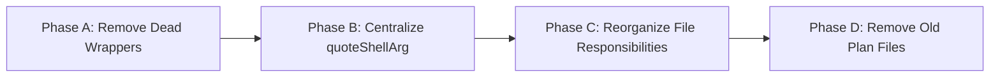

# PLAN: Phase 9 Orchestrator Final Cleanup

> **Supersedes**: `PLAN-phase9-orchestrator-enhancements.md` + `orchestrator_review_report.md`
> Both files will be removed at the end of this plan.

---

## 0. Current State Audit (2026-06-25)

### What was completed (from the two old plans):
- ✅ Native LLM Tool Calling (Phase 1)
- ✅ Sub-package extraction: `workspace/`, `tester/`, `llmrunner/`, `patch/`, `gitops/`
- ✅ Bug fixes: cycle counting, path resolution, affected file context, analyze root noise
- ✅ Workflow Engine HitL: `ErrWaitingApproval`, `Engine.Resume()`, pause in `step_pr.go`/`step_review.go`
- ✅ Interface boundaries in `ports.go`
- ✅ Test coverage for all bug fixes

### What is still messy (new audit findings):

| # | Problem | Severity | Details |
|---|---------|----------|---------|
| 1 | **Dead wrapper functions** | High | After sub-package extraction, the root package still has thin wrappers that just call sub-packages in a single line. They add indirection without value. |
| 2 | **`quoteShellArg` duplicated 4 times** | Medium | Same 3-line function exists in `workspace_paths.go`, `patch/applier.go`, `gitops/client.go`, `tester/test_engine.go`. Should be exported once from `workspace/`. |
| 3 | **File responsibilities are unclear** | High | `workspace_paths.go` (135 lines) contains sandbox runners + affected-file-content + thin wrappers — it's not really "workspace paths" anymore. `orchestrator_steps.go` (225 lines) mixes the step registry with analyze sandbox tool logic. `orchestrator_steps_helpers.go` (296 lines) is still a grab-bag of checkpoint helpers + patch delegators + worktree logic. |
| 4 | **`shouldSkipAnalyzeDir` is orphaned** | Low | Only called from within `orchestrator_steps.go` itself but the old `listFiles`/`grepSearch` functions that used it were deleted. Now unused. |
| 5 | **Two outdated plan files** | Low | `orchestrator_review_report.md` (338 lines) and `PLAN-phase9-orchestrator-enhancements.md` (103 lines) are fully completed and should be archived/removed. |

### Dead wrapper inventory:

| Wrapper (root package) | Delegates to | Callers |
|------------------------|-------------|---------|
| `quoteShellArg(s)` in `workspace_paths.go:85` | `orchestratorworkspace.QuoteShellArg` | `orchestrator_steps.go`, `step_context_load.go`, `orchestrator_steps_repos.go` |
| `readLimitedFile(path, max)` in `workspace_paths.go:89` | `orchestratorworkspace.ReadLimitedFile` | `workspace_paths.go:102,119`, `step_context_load.go` |
| `isSafeRelativeSourcePath(path)` in `orchestrator_steps.go:207` | `orchestratorworkspace.IsSafeRelativeSourcePath` | `orchestrator_steps.go:135` |
| `parseJSONMarkdown(content)` in `llm_step.go:74` | `llmrunner.ParseJSONMarkdown` | `step_analyze.go:198`, `orchestrator_test.go` |
| `sanitizeJSON(input)` in `llm_step.go:78` | `llmrunner.SanitizeJSON` | *None* (zero callers) |

---

## 1. Implementation Phases



### Phase A: Remove Dead Wrappers
**Goal**: Eliminate all single-line wrapper functions. Callers import sub-packages directly.

- [x] **A.1** Remove `sanitizeJSON` wrapper from `llm_step.go` (zero callers)
- [x] **A.2** Replace all `parseJSONMarkdown(...)` calls with `llmrunner.ParseJSONMarkdown(...)`, then remove wrapper from `llm_step.go`. Update `orchestrator_test.go` import.
- [x] **A.3** Replace all `isSafeRelativeSourcePath(...)` calls with `orchestratorworkspace.IsSafeRelativeSourcePath(...)`, then remove wrapper from `orchestrator_steps.go`.
- [x] **A.4** Replace all `readLimitedFile(...)` calls with `orchestratorworkspace.ReadLimitedFile(...)`, then remove wrapper from `workspace_paths.go`.
- [x] **A.5** Remove orphaned `shouldSkipAnalyzeDir()` from `orchestrator_steps.go` (no longer called after listFiles/grepSearch deletion).
- [x] **A.6** Run `goimports -w` on all changed files, then `go test ./internal/orchestrator/...`

### Phase B: Centralize `quoteShellArg`
**Goal**: Export `QuoteShellArg` from `workspace/helpers.go` (already exists), then delete all 4 private copies.

- [x] **B.1** In `workspace_paths.go`: replace `quoteShellArg` calls with `orchestratorworkspace.QuoteShellArg`, remove the local definition.
- [x] **B.2** In `orchestrator_steps.go`: same — use `orchestratorworkspace.QuoteShellArg` (already imports the package).
- [x] **B.3** In `orchestrator_steps_repos.go`: add import, use `orchestratorworkspace.QuoteShellArg`, remove local def if present.
- [x] **B.4** In `step_context_load.go`: add import, use `orchestratorworkspace.QuoteShellArg`.
- [x] **B.5** In `patch/applier.go`: import `workspace` package, use exported `QuoteShellArg`, delete local copy.
- [x] **B.6** In `gitops/client.go`: import `workspace` package, use exported `QuoteShellArg`, delete local copy.
- [x] **B.7** In `tester/test_engine.go`: import `workspace` package, use exported `QuoteShellArg`, delete local copy.
- [x] **B.8** Run `go test ./internal/orchestrator/...`

### Phase C: Reorganize File Responsibilities
**Goal**: Each file in the root package has a single clear responsibility. No file is a grab-bag.

Target file structure:
```text
server/internal/orchestrator/
├── orchestrator.go              # Orchestrator struct, constructors, public API
├── worker.go                    # Worker loop, job dispatch
├── step_registry.go             # stepRunners() — ONLY the step↔runner mapping
├── step_analyze.go              # Analyze step (keep analyze sandbox tools here)
├── step_code_backend.go         # ...
├── step_code_frontend.go        # ...
├── step_context_load.go         # ...
├── step_fix.go                  # ...
├── step_merge.go                # ...
├── step_plan.go                 # ...
├── step_pr.go                   # ...
├── step_review.go               # ...
├── step_testing.go              # ...
├── checkpoint.go                # Checkpoint and artifact helpers
├── sandbox.go                   # runSandboxStep, path resolution wrappers
├── repo_paths.go                # getTaskRepoHostPath, hostWorktreePath, etc.
├── repo_worktrees.go            # setupRoleBranches, setupRoleWorktrees, etc.
├── llm_step.go                  # runLLMStep, deriveWorkflowAnalysis (keep)
├── ports.go                     # Interface boundaries (keep)
├── workspace_lifecycle.go       # Workspace initialization and cleanup
├── agent_manager.go             # Agent assignment (keep)
├── test_runner.go               # runTargetedTests wrapper (keep, tiny)
└── [Sub-packages]               # codecontext/, gitops/, learning/, llmrunner/, patch/, prompt/, skills/, tester/, workspace/
```

Changes:
- [x] **C.1** Rename `orchestrator_steps.go` → `step_registry.go`. Move only `stepRunners()` function. Move `analyzeSourceRoot` type + all analyze sandbox methods (`analyzeSourceRoots`, `listAnalyzeFiles`, `readAnalyzeFile`, `grepAnalyzeFiles`, `runAnalyzeSandboxCommand`) into `step_analyze.go`.
- [x] **C.2** Create `checkpoint.go`. Move from `orchestrator_steps_helpers.go`: `getSuccessfulCheckpoint`, `countSuccessfulCheckpoints`, `getSavedPatch`, `withCheckpointRecovery`, `saveArtifact`.
- [x] **C.3** Create `sandbox.go`. Move from `workspace_paths.go`: `runSandboxStep`, `runSandboxStepInWorktree`, `containerPathForHostPath`, `readAffectedFileContent`, `affectedFileRoots`.
- [x] **C.4** Create `repo_paths.go`. Move from `orchestrator_steps_helpers.go`: `getTaskRepoHostPath`, `hostWorktreePath`. Move from `orchestrator_steps_repos.go`: `repoHostPath`, `repoNameFromURL`, `targetRepositoriesForTask`, `loadTargetRepositories`.
- [x] **C.5** Rename `orchestrator_steps_repos.go` → `repo_worktrees.go`. Keep only: `setupRoleBranches`, `setupRoleWorktrees`, `commitRoleWorktrees`.
- [x] **C.6** Move remaining `getChangedFiles` from `orchestrator_steps_helpers.go` into `repo_paths.go` (it's a patch.Runner delegator that belongs with repo path logic).
- [x] **C.7** Delete now-empty `orchestrator_steps_helpers.go` and `workspace_paths.go`.
- [x] **C.8** Run `goimports -w` on all changed files, then `go test ./internal/orchestrator/...`

### Phase D: Remove Old Plan Files
- [x] **D.1** Delete `docs/plans/PLAN-phase9-orchestrator-enhancements.md`
- [x] **D.2** Delete `docs/plans/orchestrator_review_report.md`
- [x] **D.3** Run full test suite: `go test ./...`

---

## 2. Success Criteria

1. **Zero dead wrappers**: No function in the root `orchestrator` package exists solely to delegate to a sub-package in a single line.
2. **`quoteShellArg` defined once**: Only `workspace.QuoteShellArg` exists. All other copies are deleted.
3. **Clear file responsibilities**: Every `.go` file in `server/internal/orchestrator/` has a clear, single domain. No file named `*_helpers.go` exists.
4. **`orchestrator_steps_helpers.go` deleted**: The original god-file no longer exists.
5. **`workspace_paths.go` deleted**: Sandbox execution lives in `sandbox.go`, paths live in `repo_paths.go`.
6. **Green build**: `go test ./internal/orchestrator/... ./internal/workflow/...` passes.
7. **Functional fixes included**: Fixed workflow transition errors, HitL approval gate pausing, and PR no-change bugs alongside refactoring.

---

## 3. Risk Assessment

| Risk | Mitigation |
|------|-----------|
| Import cycle between sub-packages | `workspace/` is pure (no orchestrator imports). Sub-packages only import `workspace/`, never each other. |
| Test breakage from file renames | Go tests are package-scoped; moving functions between files in the same package doesn't break tests. |
| Merge conflicts if other work is in progress | Plan is designed for a single focused session. Each phase can be committed independently. |
