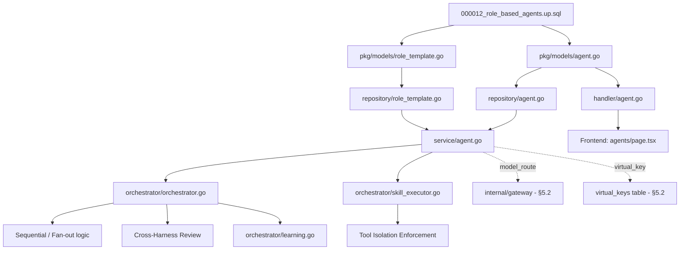

# PLAN: Role-Based Capability Agents

> **Roadmap Reference:** [ROADMAP.md §5.3](file:///home/ubuntu/my_projects/auto_code_os/docs/ROADMAP.md)
> **Status:** In Progress — Backend/API migration implemented; orchestration patterns and full tool UI pending
> **Created:** 2026-06-03
> **Migration:** `000012_role_based_agents`
> **Depends on:** [PLAN-unified-ai-gateway.md](file:///home/ubuntu/my_projects/auto_code_os/docs/plans/PLAN-unified-ai-gateway.md) (§5.2 — `model_route`, `virtual_keys`)

> **Implementation note:** The first implementation slice is complete: migration `000012`, role-based domain models, repositories, services, API handlers, role templates, role-based assignment lookup, analytics compatibility, and the main frontend agent management flow are implemented. Remaining work is runtime tool isolation inside orchestration, the sequential/fan-out/cross-harness patterns, self-improving learning, and full allowed-tools UI.

---

## 🎯 Objective

Transition the current `Agent` system from a basic "Difficulty Level" model (Easy/Medium/Hard) to a **Role-Based Capability Architecture** inspired by CrewAI and AutoGen. Each agent will be defined by its `Role`, `Goal`, `Allowed Tools` (via existing Skills), `Context Config`, and `Autonomy Level`. The orchestrator will coordinate these agents using core multi-agent patterns (Sequential, Fan-out, Cross-Harness Review).

**Acceptance criteria (from ROADMAP §5.3):**
> Agent config uses Role, Goal, Allowed Tools, Context Config, Autonomy Level, and `model_route`; orchestrator only exposes tools assigned through `agent_skills`.

## Baseline And Target

| Area | Implemented State | Remaining Target |
| :--- | :---------------- | :--------------- |
| Agent schema | `goal`, `autonomy_level`, `context_config`, `model_route`; project assignment via `project_agents` | Keep analytics and downstream features aligned with this schema |
| Assignment | Role-based lookup via `FindAvailableByRole(projectID, role)` with fallback to any available agent | Richer dispatch patterns for planner/backend/reviewer/QA pipelines |
| Tool exposure | Skills can be assigned through `agent_skills`; template roles can auto-assign matching default skills | Orchestrator execution must expose only skills mapped through `agent_skills` |
| Model selection | Agent stores a stable gateway `model_route`; agent creation loads selectable routes from the gateway model-route API | Keep route management aligned with gateway configuration |
| Frontend | Agent pool and project assignment forms manage role, goal, autonomy, model route, assignment strategy, and allowed tools | Add richer agent detail metrics after autonomy tracking exists |

## Roadmap Mapping

| ROADMAP §5.3 Requirement | Plan Coverage |
| :----------------------- | :------------ |
| Role + Goal based agent definition | Phase 1 migration, Phase 2 models, Phase 3 service validation |
| Allowed Tools | Phase 1 `agent_skills`, Phase 3 tool isolation, Phase 7 allowed-tools UI |
| Context Config | Phase 1 schema, Phase 2 model/DTO, Phase 7 frontend |
| Autonomy Level | Phase 1 schema, Phase 2 model/DTO, Phase 6 autonomy metrics |
| `model_route` | Phase 1 schema, Phase 2 model/DTO, Phase 3 defaults, Phase 7 gateway route dropdown |
| Orchestrator patterns | Phase 4 sequential, fan-out, cross-harness review |
| Self-improving loop | Phase 6 DRAFT skill extraction and autonomy tracking |

## Recommended Execution Order

1.  Implement Phase 1-3 first as a single backend migration slice: schema, model/repository/service rewrite, and tool isolation.
2.  Add Phase 5 API handler changes and tests before touching frontend.
3.  Rebuild the frontend agent management flow in Phase 7 after the new API contract is stable.
4.  Implement Phase 4 orchestration patterns incrementally: Sequential first, Cross-Harness Review second, Fan-out third.
5.  Keep Phase 6 learning/autonomy metrics behind the orchestration work; it depends on reliable success/rejection signals.

## Implementation Status

| Area | Status | Notes |
| :--- | :----- | :---- |
| Schema migration | Implemented | `000012_role_based_agents` applies, rolls back, and reapplies cleanly against local Postgres; seven role templates are seeded. |
| Backend model/repository/service | Implemented | `Agent` now uses role, goal, autonomy, context config, and `model_route`; legacy provider/model/level agent fields are removed. |
| Role templates | Implemented | Templates are stored in `role_templates`, exposed via API, and used to auto-fill goals and default skills when available. |
| API handlers | Implemented | Agent create/hire/list/delete and `GET /api/v1/role-templates` use the new contract. |
| Assignment lookup | Implemented | Orchestrator assignment now searches by role and falls back to any available agent. |
| Frontend agent pool | Implemented | Settings/member and project assignment flows use role, goal, autonomy, model route, and assignment strategy. |
| Analytics compatibility | Implemented | Agent performance uses `model_route` instead of removed provider/model columns. |
| Runtime tool isolation | Implemented | Prompt assembly now loads tools via `SkillRepo.ListByAgentID` for the executing agent; agents with no assigned skills receive no tools. |
| Orchestrator patterns | Pending | Sequential, fan-out, and cross-harness review are not implemented in this slice. |
| Learning loop | Pending | DRAFT skill extraction and autonomy metrics remain future work. |
| Full allowed-tools UI | Implemented | Agent creation and organization agent cards include editable allowed-tool multi-select controls backed by `agent_skills`. |

## 📐 Architecture Decisions

1.  **Fresh Start (Migration `000012`):** Drop old agent schema + data entirely since it's largely unused and incompatible with the capability model. Clean up all legacy code (`provider`, `model`, `level` fields).
2.  **Custom Roles with Templates:** Support freeform custom roles, but provide default **role templates** (Planner, Backend, Frontend, Reviewer, QA, Security Auditor, DB Architect) with pre-configured goals and tool sets to bootstrap agents easily.
3.  **Tool Isolation via `agent_skills`:** Use the existing `agent_skills` join table to define Allowed Tools. Agents will *only* have access to skills assigned to them in the LLM context — preventing Tool Overload (AutoGen pattern).
4.  **Core Orchestration Patterns only:** Sequential, Fan-out (parallel), Cross-Harness Review. Handoff and Group Chat deferred to backlog.
5.  **Gateway Integration:** Agent uses `model_route` (from §5.2) instead of raw `provider`/`model`. Virtual Key per Agent enables per-agent budget cap.
6.  **Rule Compliance:** Agents must comply with rule contract defined in ROADMAP §5.6 until a dedicated rule manual is created.

---

## 📋 Scope

| In Scope | Out of Scope (Backlog) |
| :------- | :--------------------- |
| Drop old agent schema & data + legacy code cleanup | Handoff Pattern |
| New Agent model (Role, Goal, Autonomy, ContextConfig, ModelRoute) | Group Chat Pattern |
| Default role templates with auto-assigned skills | Dynamic Team Formation |
| Tool Isolation enforcement via `agent_skills` | Hierarchical Pattern (Manager→Worker) |
| Sequential Orchestration Pattern | Per-user virtual key assignment |
| Fan-out Orchestration Pattern (Parallel) | |
| Cross-Harness Review Pattern (Attestation) | |
| Model Route integration (from Gateway §5.2) | |
| Virtual Key per Agent (budget cap) | |
| Self-Improving Learning Loop (DRAFT skill extraction) | |
| Autonomy Tracking | |
| Frontend Agent CRUD rebuild | |
| Legacy code deletion (old agent files) | |

---

## Phase 0: Legacy Code Cleanup

> **Rationale:** Per user decision — old agent data is unused. Clean delete before migration avoids confusion.

### Task 0.1: Delete legacy code files

The following files contain old `provider`/`model`/`level` logic and must be **replaced** in later phases (not just edited):

| File | Action | Reason |
|:-----|:-------|:-------|
| `server/pkg/models/agent.go` | **Rewrite** (Phase 2) | Remove `Level`, `Provider`, `Model` fields; add `Goal`, `AutonomyLevel`, `ContextConfig`, `ModelRoute` |
| `server/internal/repository/agent.go` | **Rewrite** (Phase 2) | Remove `agentLevelOrderSQL`, `FindAvailableForTask`; add `FindAvailableByRole` |
| `server/internal/service/agent.go` | **Rewrite** (Phase 3) | Update validation; add role template logic |
| `server/internal/service/agent_test.go` | **Rewrite** (Phase 3) | Tests for new validation |
| `server/internal/handler/agent.go` | **Update** (Phase 5) | Update input/output DTOs |

### Task 0.2: Identify all references to old agent fields

Search codebase for `agent.Level`, `agent.Provider`, `agent.Model`, `AgentLevelEasy`, `AgentLevelMedium`, `AgentLevelHard` and update/remove all occurrences:
- `server/internal/orchestrator/orchestrator.go` — agent selection by complexity
- `server/internal/orchestrator/agent_manager.go` — agent lifecycle
- `server/internal/repository/agent.go` — `agentLevelOrderSQL()`
- `server/internal/handler/services.go` — `AgentService` interface
- `web/src/` — frontend agent creation forms

**Verification:**
- [x] `rg "AgentLevel|agent\.Level|agent\.Provider|agent\.Model" server/` returns no agent-field references after cleanup
- [x] `go test ./...` compiles and passes

---

## Phase 1: Database Migration (`000012`)

**File:** `server/migration/000012_role_based_agents.up.sql`

### Task 1.1: Drop old agent tables and recreate

```sql
-- Drop old tables dependent on agents
DROP TABLE IF EXISTS project_agents CASCADE;
DROP TABLE IF EXISTS agent_skills CASCADE;
DROP TABLE IF EXISTS agents CASCADE;

-- Recreate agents with capability-based schema
CREATE TABLE agents (
    id                  UUID PRIMARY KEY DEFAULT uuid_generate_v4(),
    org_id              UUID NOT NULL REFERENCES organizations(id) ON DELETE CASCADE,
    name                VARCHAR(100) NOT NULL,
    role                VARCHAR(100) NOT NULL,           -- freeform: 'backend-specialist', 'security-auditor', custom
    goal                TEXT NOT NULL,                    -- 'Write clean Go backend code following clean architecture'
    autonomy_level      VARCHAR(50) NOT NULL DEFAULT 'supervised',  -- autonomous, supervised, approval_required
    context_config      JSONB NOT NULL DEFAULT '{"max_input_tokens": 128000}',
    model_route         VARCHAR(100) NOT NULL DEFAULT 'balanced',   -- links to AI Gateway (§5.2)
    status              VARCHAR(20) NOT NULL DEFAULT 'idle',        -- idle, busy, assigned, running, offline
    assignment_strategy VARCHAR(50) NOT NULL DEFAULT 'manual',      -- manual, auto_join
    created_at          TIMESTAMPTZ NOT NULL DEFAULT NOW(),
    updated_at          TIMESTAMPTZ NOT NULL DEFAULT NOW()
);

CREATE INDEX idx_agents_org_id ON agents(org_id);
CREATE INDEX idx_agents_org_role ON agents(org_id, role);
CREATE INDEX idx_agents_status ON agents(org_id, status) WHERE status IN ('idle', 'assigned');
```

### Task 1.2: Recreate join tables

```sql
CREATE TABLE project_agents (
    project_id UUID REFERENCES projects(id) ON DELETE CASCADE,
    agent_id   UUID REFERENCES agents(id) ON DELETE CASCADE,
    created_at TIMESTAMPTZ NOT NULL DEFAULT NOW(),
    PRIMARY KEY (project_id, agent_id)
);

CREATE TABLE agent_skills (
    agent_id   UUID REFERENCES agents(id) ON DELETE CASCADE,
    skill_id   UUID REFERENCES skills(id) ON DELETE CASCADE,
    created_at TIMESTAMPTZ NOT NULL DEFAULT NOW(),
    PRIMARY KEY (agent_id, skill_id)
);
```

### Task 1.3: Seed default role templates

```sql
-- Insert role templates as a reference table (optional — can also be in-code constants)
CREATE TABLE IF NOT EXISTS role_templates (
    id              UUID PRIMARY KEY DEFAULT uuid_generate_v4(),
    role            VARCHAR(100) NOT NULL UNIQUE,
    default_goal    TEXT NOT NULL,
    default_tools   JSONB NOT NULL DEFAULT '[]',  -- skill names to auto-assign
    created_at      TIMESTAMPTZ NOT NULL DEFAULT NOW()
);

INSERT INTO role_templates (role, default_goal, default_tools) VALUES
    ('planner',          'Analyze tasks, create specs, and decompose into sub-tasks',       '["analyze_codebase", "create_spec", "decompose_task"]'),
    ('backend',          'Develop backend code following clean architecture principles',     '["read_file", "write_file", "run_tests", "git_commit"]'),
    ('frontend',         'Develop user interface components',                                '["read_file", "write_file", "run_tests", "git_commit"]'),
    ('reviewer',         'Review code changes and provide quality feedback',                 '["read_file", "analyze_diff", "add_review_comment"]'),
    ('qa',               'Test and ensure code quality through automated testing',           '["run_tests", "analyze_logs", "read_file"]'),
    ('security-auditor', 'Scan for vulnerabilities and verify secret safety',                '["scan_vulnerabilities", "read_file", "analyze_logs"]'),
    ('db-architect',     'Design schemas, create migrations, optimize queries',              '["read_file", "write_file", "create_migration", "run_tests"]');
```

### Task 1.4: Down migration

**File:** `server/migration/000012_role_based_agents.down.sql`

```sql
DROP TABLE IF EXISTS role_templates CASCADE;
DROP TABLE IF EXISTS agent_skills CASCADE;
DROP TABLE IF EXISTS project_agents CASCADE;
DROP TABLE IF EXISTS agents CASCADE;

-- Restore legacy schema (for rollback only)
CREATE TABLE agents (
    id                  UUID PRIMARY KEY DEFAULT uuid_generate_v4(),
    org_id              UUID NOT NULL REFERENCES organizations(id) ON DELETE CASCADE,
    project_id          UUID REFERENCES projects(id),
    name                VARCHAR(100) NOT NULL,
    role                VARCHAR(50) DEFAULT 'backend',
    provider            VARCHAR(50) DEFAULT 'openai',
    model               VARCHAR(100) DEFAULT 'gpt-4o',
    level               VARCHAR(20) DEFAULT 'easy',
    status              VARCHAR(20) DEFAULT 'idle',
    assignment_strategy VARCHAR(50) DEFAULT 'manual',
    created_at          TIMESTAMPTZ NOT NULL DEFAULT NOW(),
    updated_at          TIMESTAMPTZ NOT NULL DEFAULT NOW()
);

CREATE TABLE project_agents (
    project_id UUID REFERENCES projects(id) ON DELETE CASCADE,
    agent_id   UUID REFERENCES agents(id) ON DELETE CASCADE,
    created_at TIMESTAMPTZ NOT NULL DEFAULT NOW(),
    PRIMARY KEY (project_id, agent_id)
);

CREATE TABLE agent_skills (
    agent_id   UUID REFERENCES agents(id) ON DELETE CASCADE,
    skill_id   UUID REFERENCES skills(id) ON DELETE CASCADE,
    created_at TIMESTAMPTZ NOT NULL DEFAULT NOW(),
    PRIMARY KEY (agent_id, skill_id)
);
```

**Verification:**
- [x] Migration up runs without error
- [x] Migration down rolls back cleanly
- [x] `role_templates` seeded with 7 default roles
- [x] Indexes on `org_id`, `org_role`, `status` created

---

## Phase 2: Domain Models & Repository

### Task 2.1: Rewrite `pkg/models/agent.go`

**Remove:**
- Constants: `AgentLevelEasy`, `AgentLevelMedium`, `AgentLevelHard`
- Fields: `Provider`, `Model`, `Level`, `ProjectID`

**Add:**
```go
// Autonomy levels.
const (
    AutonomyAutonomous      = "autonomous"
    AutonomySupervised      = "supervised"
    AutonomyApprovalRequired = "approval_required"
)

type Agent struct {
    ID                 string          `json:"id" gorm:"type:uuid;default:uuid_generate_v4();primaryKey"`
    OrgID              string          `json:"org_id" gorm:"type:uuid;not null"`
    Name               string          `json:"name" gorm:"not null"`
    Role               string          `json:"role" gorm:"not null"`
    Goal               string          `json:"goal" gorm:"not null"`
    AutonomyLevel      string          `json:"autonomy_level" gorm:"default:'supervised'"`
    ContextConfig      json.RawMessage `json:"context_config" gorm:"type:jsonb;default:'{}'"`
    ModelRoute         string          `json:"model_route" gorm:"default:'balanced'"`
    Status             string          `json:"status" gorm:"default:'idle'"`
    AssignmentStrategy string          `json:"assignment_strategy" gorm:"default:'manual'"`
    CreatedAt          time.Time       `json:"created_at"`
    UpdatedAt          time.Time       `json:"updated_at"`
}

type CreateAgentInput struct {
    Name               string          `json:"name"`
    Role               string          `json:"role"`
    Goal               string          `json:"goal"`
    AutonomyLevel      string          `json:"autonomy_level"`
    ContextConfig      json.RawMessage `json:"context_config,omitempty"`
    ModelRoute         string          `json:"model_route"`
    AssignmentStrategy string          `json:"assignment_strategy"`
    SkillIDs           []string        `json:"skill_ids,omitempty"` // optional: auto-assign skills
    AgentID            string          `json:"agent_id,omitempty"` // for assign-to-project
}

type RoleTemplate struct {
    ID           string          `json:"id" gorm:"type:uuid;default:uuid_generate_v4();primaryKey"`
    Role         string          `json:"role" gorm:"uniqueIndex;not null"`
    DefaultGoal  string          `json:"default_goal" gorm:"not null"`
    DefaultTools json.RawMessage `json:"default_tools" gorm:"type:jsonb;default:'[]'"`
    CreatedAt    time.Time       `json:"created_at"`
}
```

### Task 2.2: Rewrite `repository/agent.go`

**Remove:**
- `agentLevelOrderSQL()` — no longer needed
- `FindAvailableForTask()` — replaced by role-based lookup

**Add:**
- `FindAvailableByRole(ctx, projectID, role) → *Agent` — find idle agent matching role for a project
- `ListByRole(ctx, orgID, role) → []Agent` — list all agents of a role in org

**Update:**
- `CreateForOrg()` — map new fields (`Goal`, `AutonomyLevel`, `ContextConfig`, `ModelRoute`)
- `Update()` — handle new partial update fields

### Task 2.3: Create `repository/role_template.go`

**Methods:**
- `ListAll(ctx) → []RoleTemplate`
- `GetByRole(ctx, role) → *RoleTemplate`

**Verification:**
- [x] CRUD paths compile and pass service/repository test suite
- [x] `FindAvailableByRole` returns idle agent matching role
- [x] Old fields (`Level`, `Provider`, `Model`) are absent from the agent model and repository

---

## Phase 3: Service & Tool Isolation

### Task 3.1: Rewrite `service/agent.go`

**Validation updates:**
- `role` is required (freeform, no allowlist restriction — custom roles OK)
- `goal` is required
- `model_route` defaults to `"balanced"` if empty
- `autonomy_level` must be one of: `autonomous`, `supervised`, `approval_required`
- `assignment_strategy` must be: `manual` or `auto_join`

**Role template auto-fill:**
- On `Create`, if `Role` matches a known template and `Goal` is empty → auto-fill from `RoleTemplate`
- If `SkillIDs` is empty and `Role` matches a template → auto-assign default skills from template

### Task 3.2: Enforce Tool Isolation in Orchestrator

**File:** `server/internal/orchestrator/skill_executor.go`

Current behavior: loads all system skills into the LLM context.
New behavior:
1. Query `agent_skills` for the executing agent's ID
2. Load only those skills into the tool definitions sent to the LLM
3. If an agent has zero skills assigned → load no tools (pure text agent)

```go
// Before (old):
allSkills, _ := skillRepo.List(ctx)
tools := buildTools(allSkills)

// After (new):
agentSkills, _ := skillRepo.ListByAgentID(ctx, agent.ID)
tools := buildTools(agentSkills)
```

### Task 3.3: Update `handler/services.go` interface

Add to `AgentService` interface:
- `ListRoleTemplates(ctx) → []RoleTemplate`

Remove from `CreateAgentInput` handling: any reference to `Provider`, `Model`, `Level`.

**Verification:**
- [x] Creating agent with template role auto-fills goal and assigns skills
- [x] Creating agent with custom role works with explicit goal
- [x] Orchestrator only binds agent-specific skills (tool isolation)
- [x] `go test ./...` succeeds with zero legacy agent field references

---

## Phase 4: Core Orchestrator Patterns

**File:** `server/internal/orchestrator/orchestrator.go`

### Task 4.1: Sequential Pattern

Implement sequential task pipeline: output of agent A becomes input context for agent B.

```
Planner → Backend → Reviewer → QA
```

- When a task is dispatched, the orchestrator checks if the task has dependencies (parent sub-task completed)
- If yes → inject parent task's artifact/diff context into the current agent's prompt
- Wait for completion before dispatching next step

### Task 4.2: Fan-out Pattern (Parallel)

When Planner decomposes a task into independent sub-tasks:

1. Planner agent generates sub-tasks via `decompose_task` tool
2. Orchestrator identifies which sub-tasks are independent (no shared files/modules)
3. For each independent sub-task: spawn a goroutine, find available specialized agent by role, dispatch
4. Use `sync.WaitGroup` or channel-based coordination
5. Merge results after all goroutines complete (reference: OpenSpec parallel merge strategy)

### Task 4.3: Cross-Harness Review

When an implementation task is marked complete:

1. Orchestrator triggers a `Reviewer` agent
2. Reviewer receives the diff (git diff output as tool_result)
3. Reviewer verifies: tests pass, code meets spec, no security issues
4. **If approved:** Pipeline proceeds, attestation recorded (timestamp + reviewer agent ID)
5. **If rejected:** Feedback fed back to original agent → retry loop (max 3 retries)

**Verification:**
- [ ] Sequential pipeline passes artifacts between agents correctly
- [ ] Fan-out dispatches independent sub-tasks to parallel goroutines
- [ ] Cross-Harness Review blocks pipeline on rejection
- [ ] Rejection triggers retry with reviewer feedback injected

---

## Phase 5: API Handlers

### Task 5.1: Update Agent CRUD handlers

**File:** `server/internal/handler/agent.go`

Update input/output DTOs to use new fields. Key changes:
- `Create` / `Hire` accept: `role`, `goal`, `autonomy_level`, `context_config`, `model_route`, `skill_ids`
- Remove any handling of `provider`, `model`, `level`
- Add validation error responses for missing `goal`

### Task 5.2: Add Role Templates endpoint

**File:** `server/internal/handler/agent.go` (or new file)

| Method | Route | Description |
|:-------|:------|:------------|
| `GET` | `/api/v1/role-templates` | List all available role templates |

### Task 5.3: Register routes

**File:** `server/internal/handler/router.go` — add role-templates route.

**Verification:**
- [x] POST agent with new schema returns correct response
- [x] GET role-templates returns seeded templates
- [x] POST agent with missing `goal` returns 400

---

## Phase 6: Self-Improving Learning Loop

### Task 6.1: Skill Extraction (DRAFT state)

**File:** `server/internal/orchestrator/learning.go`

Upon successful task completion (verified by Cross-Harness review):
1. Trigger background process to summarize procedural steps
2. Save as new `Skill` with status `DRAFT` in database
3. DRAFT skills are not auto-assigned to agents — require Human/Reviewer Gate

### Task 6.2: Autonomy Tracking

**File:** `server/internal/service/analytics.go` or new dedicated file

Track per-agent metrics:
- Success rate (tasks completed successfully / total tasks assigned)
- Average retry count
- Cross-Harness approval rate
- Store in existing `analytics` infrastructure or new `agent_metrics` table

**Verification:**
- [ ] Successful task with cross-harness review creates DRAFT skill
- [ ] Agent metrics are recorded and queryable

---

## Phase 7: Frontend — Agent Management Rebuild

### Task 7.1: Agent Creation UI

**File:** `web/src/app/dashboard/[orgId]/agents/page.tsx` & modals

Rebuild the creation form to support capabilities:
1. **Name** — text input
2. **Role** — Freeform input with dropdown for templates (Planner, Backend Specialist, QA Engineer, etc.). Selecting a template auto-fills Goal and Allowed Tools.
3. **Goal** — Textarea explaining what the agent should achieve
4. **Autonomy Level** — Radio buttons (Autonomous, Supervised, Approval Required)
5. **Model Route** — Dropdown selecting a route from the AI Gateway (`balanced`, `coding-default`, etc. — fetched from `model_routes` API §5.2)
6. **Assignment Strategy** — Toggle (Auto-Join / Manual)

### Task 7.2: Allowed Tools UI

- Multi-select interface to manage `Allowed Tools` (Skills) mapped to the agent
- Display assigned tools clearly on the Agent's detail page
- When a role template is selected, pre-populate with default tools (editable)

### Task 7.3: Agent Detail Page

- Show agent config: role, goal, autonomy level, model route, status
- Show assigned skills (tools) with add/remove
- Show metrics: success rate, tasks completed, token usage (from analytics)

**Verification:**
- [x] Role template selection auto-fills goal
- [x] Custom role creation works with explicit goal
- [x] Allowed Tools can be added/removed per agent
- [x] Model route dropdown loads from gateway API

---

## 📁 File Dependency Map



## ✅ Final Verification Checklist

| # | Done | Check | Phase |
| :-- | :--- | :------ | :------ |
| 1 | [x] | All legacy agent field references removed from server agent code and frontend agent flows | Phase 0 |
| 2 | [x] | Migration `000012` applies cleanly and drops old schema | Phase 1 |
| 3 | [x] | `role_templates` seeded with 7 default roles | Phase 1 |
| 4 | [x] | Agent model has `Goal`, `Role`, `AutonomyLevel`, `ContextConfig`, `ModelRoute` | Phase 2 |
| 5 | [x] | Old fields (`Level`, `Provider`, `Model`) removed from agent model/repository/API usage | Phase 2 |
| 6 | [x] | `FindAvailableByRole` replaces old complexity-based assignment | Phase 2 |
| 7 | [x] | Role template auto-fills goal and skills on creation | Phase 3 |
| 8 | [x] | Agents can only access tools mapped via `agent_skills` (Tool Isolation) | Phase 3 |
| 9 | [ ] | Sequential pipeline passes artifacts between agents | Phase 4 |
| 10 | [ ] | Fan-out dispatches parallel sub-tasks to goroutines | Phase 4 |
| 11 | [ ] | Cross-Harness Review blocks completion on rejection | Phase 4 |
| 12 | [x] | API handlers accept new schema and reject missing required role/goal data | Phase 5 |
| 13 | [ ] | DRAFT skill extraction after successful cross-harness review | Phase 6 |
| 14 | [ ] | Autonomy metrics tracked per agent | Phase 6 |
| 15 | [x] | UI supports custom roles, API-loaded model route selection, and allowed-tool multi-select | Phase 7 |

**Current verification run (2026-06-03):**
- [x] `go test ./...`
- [x] `npm run lint` (passes with three existing unused-variable warnings)
- [x] `npm run build`
- [x] Migration up/down/up against local Postgres `autocodeosdb`
- [x] `role_templates` query returned: `backend`, `db-architect`, `frontend`, `planner`, `qa`, `reviewer`, `security-auditor`

## 📚 References

| Source | Relevant Pattern | Path |
| :------- | :---------------- | :----- |
| CrewAI | Role/Goal/Backstory, Hierarchical & Sequential flows | Online documentation |
| AutoGen | Actor Model — Fan-out, Tool Overload prevention, Context Window Saturation | [Learning Report](file:///home/ubuntu/my_projects/auto_code_os/docs/references/Learning_Report.md) |
| AI-SDLC | Cross-Harness Review, Autonomy Tracker, Definition of Ready gate | [Learning Report §3](file:///home/ubuntu/my_projects/auto_code_os/docs/references/Learning_Report.md) |
| Multica | Task claiming (ClaimTask), daemon-based agent execution | [Learning Report §1](file:///home/ubuntu/my_projects/auto_code_os/docs/references/Learning_Report.md) |
| Hermes Agent | Closed Learning Loop — self-improving skill extraction | [Learning Report §8](file:///home/ubuntu/my_projects/auto_code_os/docs/references/Learning_Report.md) |
| OpenHands | Runtime sandbox isolation, smart masking | [Learning Report](file:///home/ubuntu/my_projects/auto_code_os/docs/references/Learning_Report.md) |
| OpenClaw | Sandboxing with strict permissions | [Learning Report §2](file:///home/ubuntu/my_projects/auto_code_os/docs/references/Learning_Report.md) |
