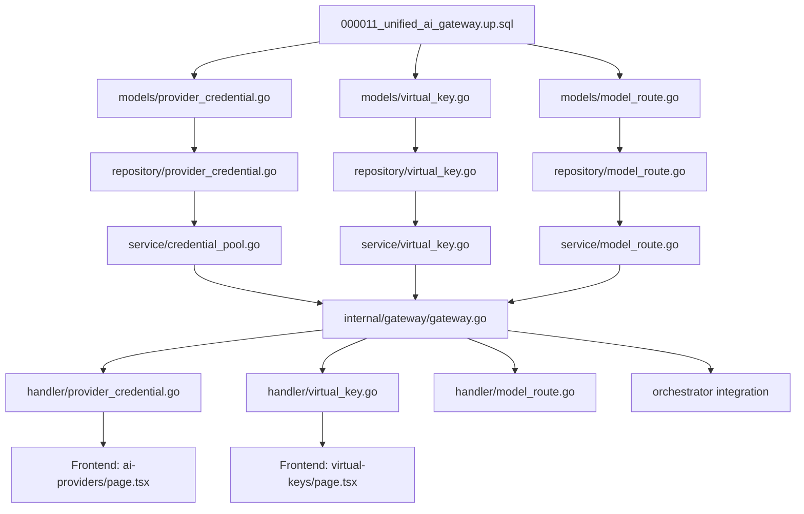

# PLAN: Unified AI Gateway

> **Roadmap Reference:** [ROADMAP.md §5.2](file:///home/ubuntu/my_projects/auto_code_os/docs/ROADMAP.md)
> **Status:** Draft
> **Created:** 2026-06-03
> **Migration:** `000011_unified_ai_gateway`

> **Implementation note:** Checked items below mean the backend implementation exists and `go test ./...` passes. Items that require live PostgreSQL migration, frontend work, dedicated integration tests, or audit logging remain unchecked.

---

## 🎯 Objective

Implement the Unified AI Gateway as described in ROADMAP §5.2 — a centralized gateway layer managing **multi-key provider credentials**, **virtual keys** with budget/rate-limit enforcement, **credential pool rotation**, and **tier/combo routing** through a new `internal/gateway` package that wraps the existing `pkg/llm`.

## 📐 Architecture Decision

**Option B selected:** New `internal/gateway` package wrapping `pkg/llm` (policy ↔ protocol separation).

```
┌─────────────────────────────────────────────────┐
│              Orchestrator / Handlers             │
│                                                  │
│  ctx = WithRouteOptions(ctx, opts)               │
│  resp, err := gatewayService.Chat(ctx, messages) │
└──────────────────────┬──────────────────────────┘
                       │
         ┌─────────────▼──────────────┐
         │    internal/gateway        │
         │                            │
         │  1. Validate Virtual Key   │
         │  2. Check Budget Cap       │
         │  3. Resolve Model Route    │
         │  4. Select Credential      │
         │     (multi-key pool)       │
         │  5. Delegate to pkg/llm    │
         │  6. Record Usage           │
         └─────────────┬─────────────┘
                       │
         ┌─────────────▼──────────────┐
         │       pkg/llm (existing)   │
         │                            │
         │  Provider.Chat()           │
         │  FallbackChain             │
         │  Circuit Breaker           │
         └────────────────────────────┘
```

## 📋 Scope

| In Scope | Out of Scope (Future) |
|:---------|:---------------------|
| Multi-key per provider (CRUD + pool rotation) | Per-user virtual key assignment |
| Virtual keys per Project + Agent | AWS Secrets Manager / Vault integration |
| Budget cap (USD) + RPM rate limiting | Format Translation (OpenAI↔Anthropic) |
| Credential selection strategy (fill-first / round-robin) | Token Saver (RTK compression) |
| Combo route definition (DB-backed) | OAuth token refresh for subscription providers |
| Frontend AI Providers page rebuild | |
| Audit logging for credential lifecycle | |

---

## Phase 1: Database Migration (`000011`)

**File:** `server/migration/000011_unified_ai_gateway.up.sql`

### Task 1.1: Create `provider_credentials` table

Replaces the current pattern of storing provider keys in `secrets` table or `.env`.

```sql
CREATE TABLE IF NOT EXISTS provider_credentials (
    id              UUID PRIMARY KEY DEFAULT uuid_generate_v4(),
    org_id          UUID NOT NULL REFERENCES organizations(id) ON DELETE CASCADE,
    provider        VARCHAR(50) NOT NULL,  -- 'openai', 'anthropic', 'gemini', '9router'
    label           VARCHAR(100) NOT NULL DEFAULT 'default',
    encrypted_key   TEXT NOT NULL,          -- AES-256-GCM encrypted
    base_url        TEXT,                   -- custom endpoint (self-hosted / proxy)
    status          VARCHAR(20) NOT NULL DEFAULT 'active',  -- active, rate_limited, disabled
    priority        INT NOT NULL DEFAULT 0, -- lower = higher priority for fill-first
    cooldown_until  TIMESTAMPTZ,           -- NULL = available, set when rate-limited
    metadata        JSONB DEFAULT '{}',    -- provider-specific config
    created_at      TIMESTAMPTZ NOT NULL DEFAULT NOW(),
    updated_at      TIMESTAMPTZ NOT NULL DEFAULT NOW(),
    UNIQUE(org_id, provider, label)
);

CREATE INDEX idx_provider_credentials_org_provider
    ON provider_credentials(org_id, provider, status);
```

### Task 1.2: Create `virtual_keys` table

```sql
CREATE TABLE IF NOT EXISTS virtual_keys (
    id              UUID PRIMARY KEY DEFAULT uuid_generate_v4(),
    org_id          UUID NOT NULL REFERENCES organizations(id) ON DELETE CASCADE,
    project_id      UUID REFERENCES projects(id) ON DELETE CASCADE,
    agent_id        UUID REFERENCES agents(id) ON DELETE CASCADE,
    key_hash        VARCHAR(64) NOT NULL UNIQUE,  -- SHA-256 hash for lookup
    key_prefix      VARCHAR(20) NOT NULL,          -- 'sk-aco-xxxx' (last 4 chars)
    name            VARCHAR(100) NOT NULL,
    budget_limit_usd    DECIMAL(10,4),   -- NULL = unlimited
    budget_used_usd     DECIMAL(10,4) NOT NULL DEFAULT 0,
    rpm_limit           INT,              -- requests per minute, NULL = unlimited
    tpm_limit           INT,              -- tokens per minute, NULL = unlimited
    status              VARCHAR(20) NOT NULL DEFAULT 'active', -- active, exhausted, revoked
    expires_at          TIMESTAMPTZ,
    created_at          TIMESTAMPTZ NOT NULL DEFAULT NOW(),
    updated_at          TIMESTAMPTZ NOT NULL DEFAULT NOW()
);

CREATE INDEX idx_virtual_keys_lookup ON virtual_keys(key_hash) WHERE status = 'active';
CREATE INDEX idx_virtual_keys_project ON virtual_keys(project_id) WHERE project_id IS NOT NULL;
CREATE INDEX idx_virtual_keys_agent ON virtual_keys(agent_id) WHERE agent_id IS NOT NULL;
```

### Task 1.3: Create `credential_usage_logs` table

> **Current implementation note:** The table exists in migration `000011`, but runtime lifecycle auditing currently writes to the shared immutable `audit_logs` table through `AuditService`. Keep `credential_usage_logs` reserved for future high-volume, credential-specific usage telemetry, or remove it in a follow-up migration if the shared audit log remains the canonical store.

```sql
CREATE TABLE IF NOT EXISTS credential_usage_logs (
    id              UUID PRIMARY KEY DEFAULT uuid_generate_v4(),
    credential_id   UUID NOT NULL REFERENCES provider_credentials(id),
    virtual_key_id  UUID REFERENCES virtual_keys(id),
    action          VARCHAR(30) NOT NULL,  -- 'created', 'used', 'rate_limited', 'recovered', 'deleted'
    actor_type      VARCHAR(20) NOT NULL,  -- 'user', 'agent', 'system'
    actor_id        VARCHAR(100),
    detail          JSONB DEFAULT '{}',
    created_at      TIMESTAMPTZ NOT NULL DEFAULT NOW()
);

CREATE INDEX idx_credential_usage_logs_cred ON credential_usage_logs(credential_id, created_at DESC);
```

### Task 1.4: Create `model_routes` table

```sql
CREATE TABLE IF NOT EXISTS model_routes (
    id              UUID PRIMARY KEY DEFAULT uuid_generate_v4(),
    org_id          UUID NOT NULL REFERENCES organizations(id) ON DELETE CASCADE,
    name            VARCHAR(50) NOT NULL,     -- 'coding-default', 'premium-coding'
    route_type      VARCHAR(20) NOT NULL,     -- 'tier', 'combo'
    config          JSONB NOT NULL,           -- combo: ordered list of {provider, model, priority}
    is_default      BOOLEAN NOT NULL DEFAULT FALSE,
    created_at      TIMESTAMPTZ NOT NULL DEFAULT NOW(),
    updated_at      TIMESTAMPTZ NOT NULL DEFAULT NOW(),
    UNIQUE(org_id, name)
);
```

### Task 1.5: Create down migration

**File:** `server/migration/000011_unified_ai_gateway.down.sql`

```sql
DROP TABLE IF EXISTS credential_usage_logs;
DROP TABLE IF EXISTS model_routes;
DROP TABLE IF EXISTS virtual_keys;
DROP TABLE IF EXISTS provider_credentials;
```

**Verification:**
- [x] `go run ./cmd/migrate` runs without error against local PostgreSQL
- [x] `migrate down 1` rolls back `000011` cleanly
- [x] Indexes created on correct columns

---

## Phase 2: Domain Models & Repository Layer

### Task 2.1: Create domain models

**File:** `server/pkg/models/provider_credential.go`

| Model | Fields | Notes |
|:------|:-------|:------|
| `ProviderCredential` | id, org_id, provider, label, encrypted_key, base_url, status, priority, cooldown_until, metadata | Gorm struct with JSON tags |
| `CreateProviderCredentialInput` | provider, label, api_key (plaintext), base_url | Validation: provider ∈ allowlist |
| `UpdateProviderCredentialInput` | label, api_key, base_url, status, priority | Pointer fields for partial update |
| `ProviderCredentialResponse` | id, provider, label, base_url, status, priority, configured, key_suffix | Never exposes real key |

**File:** `server/pkg/models/virtual_key.go`

| Model | Fields |
|:------|:-------|
| `VirtualKey` | id, org_id, project_id, agent_id, key_hash, key_prefix, name, budget_limit_usd, budget_used_usd, rpm_limit, tpm_limit, status, expires_at |
| `CreateVirtualKeyInput` | name, project_id, agent_id, budget_limit_usd, rpm_limit, tpm_limit |
| `VirtualKeyResponse` | id, name, key_prefix, project_id, agent_id, budget_limit_usd, budget_used_usd, rpm_limit, status |

**File:** `server/pkg/models/model_route.go`

| Model | Fields |
|:------|:-------|
| `ModelRoute` | id, org_id, name, route_type, config (JSONB), is_default |
| `ComboEntry` | provider, model, priority |

### Task 2.2: Create repository layer

**File:** `server/internal/repository/provider_credential.go`

Methods:
- `Create(ctx, orgID, input) → *ProviderCredential`
- `GetByID(ctx, id) → *ProviderCredential`
- `ListByOrg(ctx, orgID) → []ProviderCredential`
- `ListActiveByOrgAndProvider(ctx, orgID, provider) → []ProviderCredential` ← **multi-key pool query**
- `Update(ctx, id, input) → *ProviderCredential`
- `SetCooldown(ctx, id, until) → error` ← **cooldown lock**
- `ClearExpiredCooldowns(ctx) → int64` ← **background recovery**
- `Delete(ctx, id) → error`

**File:** `server/internal/repository/virtual_key.go`

Methods:
- `Create(ctx, orgID, input) → *VirtualKey`
- `FindByHash(ctx, keyHash) → *VirtualKey` ← **runtime lookup**
- `ListByOrg(ctx, orgID) → []VirtualKey`
- `ListByProject(ctx, projectID) → []VirtualKey`
- `IncrementBudgetUsed(ctx, id, amount) → error` ← **atomic budget update**
- `Revoke(ctx, id) → error`
- `Delete(ctx, id) → error`

**File:** `server/internal/repository/model_route.go`

Methods:
- `Create(ctx, orgID, input) → *ModelRoute`
- `ListByOrg(ctx, orgID) → []ModelRoute`
- `GetDefault(ctx, orgID) → *ModelRoute`
- `Update(ctx, id, input) → *ModelRoute`
- `Delete(ctx, id) → error`

**Verification:**
- [ ] All CRUD operations pass unit tests
- [x] `ListActiveByOrgAndProvider` correctly filters `status = 'active'` AND `cooldown_until IS NULL OR cooldown_until < NOW()`
- [x] `IncrementBudgetUsed` uses `UPDATE ... SET budget_used_usd = budget_used_usd + $amount` (atomic)

---

## Phase 3: Credential Pool Service

### Task 3.1: Create `CredentialPoolService`

**File:** `server/internal/service/credential_pool.go`

Responsibilities:
- Encrypt/decrypt API keys (reuse `SecretService.encrypt/decrypt` via shared `cipher.AEAD`)
- CRUD for `ProviderCredential` with encryption at write, masking at read
- **`SelectCredential(ctx, orgID, provider, strategy) → *DecryptedCredential`** — the core multi-key selection
- `TestConnection(ctx, id)` currently verifies encrypted key decryptability only. Real provider connectivity checks remain a follow-up because each provider needs a low-cost, provider-specific ping/list-models implementation.

```go
type CredentialStrategy string

const (
    StrategyFillFirst  CredentialStrategy = "fill_first"
    StrategyRoundRobin CredentialStrategy = "round_robin"
)

type DecryptedCredential struct {
    ID       string
    Provider string
    APIKey   string // decrypted — only used in-memory, never serialized
    BaseURL  string
}
```

**Selection algorithm:**
1. Query `ListActiveByOrgAndProvider(ctx, orgID, provider)`
2. Filter out credentials with `cooldown_until > NOW()`
3. If `excludeIDs` provided (from retry), filter those out
4. Sort by `priority ASC` (fill-first) or rotate index (round-robin)
5. Return first available credential
6. If none available → return `ErrNoCredentialsAvailable`

### Task 3.2: Create `VirtualKeyService`

**File:** `server/internal/service/virtual_key.go`

Responsibilities:
- Generate virtual key (`sk-aco-` + 32 random chars)
- Hash with SHA-256 for storage, store only hash + last 4 chars
- Validate virtual key at runtime: lookup by hash, check status, check budget, check expiry
- `RecordUsage(ctx, virtualKeyID, costUSD)` — atomic budget increment

### Task 3.3: Create `ModelRouteService`

**File:** `server/internal/service/model_route.go`

Responsibilities:
- CRUD for model routes
- `ResolveRoute(ctx, orgID, routeName, complexity) → (provider, model)` — resolve tier/combo to concrete provider+model

**Verification:**
- [x] `SelectCredential` with fill-first returns lowest-priority active credential
- [x] `SelectCredential` with round-robin rotates across credentials
- [x] Excluded credentials (cooldown/disabled) are never returned
- [x] Virtual key validation rejects exhausted/revoked/expired keys
- [x] Budget increment is atomic (concurrent safe)
- [x] Virtual key reads do not create false `virtual_key.updated` audit events

---

## Phase 4: Internal Gateway Package

### Task 4.1: Create `internal/gateway/gateway.go`

**File:** `server/internal/gateway/gateway.go`

This wraps `pkg/llm.Gateway` with policy enforcement:

```go
type AIGateway struct {
    llmGateway       *llm.Gateway
    credentialPool   *service.CredentialPoolService
    virtualKeyService *service.VirtualKeyService
    routeService     *service.ModelRouteService
    auditService     AuditRecorder
    cfg              *config.Config
}

func (g *AIGateway) Chat(ctx context.Context, messages []llm.Message) (*llm.Response, error) {
    // 1. Extract RouteOptions from ctx
    // 2. If virtual key present → validate + check budget
    // 3. Resolve model route (tier/combo/specific)
    // 4. Select credential from pool (with retry loop on failure)
    // 5. Build llm.Provider from credential
    // 6. Delegate to pkg/llm provider.Chat()
    // 7. Record usage (telemetry + budget decrement)
    // 8. On rate-limit error → set cooldown on credential → retry with next
    // 9. Audit log
}
```

### Task 4.2: Credential retry loop

When a provider returns 429 (rate limit) or 402 (quota exceeded):
1. Set `cooldown_until` on current credential (e.g., +5 min)
2. Add credential ID to `excludeIDs`
3. Call `SelectCredential` again with `excludeIDs`
4. If no more credentials for this provider → try next provider in combo chain
5. If all exhausted → return error with details

> **Implementation note:** Rate-limit detection now supports a typed `HTTPStatusError` path and retains string fallback for current provider wrappers. A future provider-client refactor should return typed HTTP status errors directly instead of relying on message parsing.

### Task 4.3: Budget enforcement

Before dispatch:
- Check `virtual_key.budget_used_usd + estimated_cost <= budget_limit_usd`
- If exceeded → return `ErrBudgetExhausted`

After successful response:
- Atomic `IncrementBudgetUsed(ctx, virtualKeyID, actualCost)`
- If new total exceeds limit → set virtual key status to `exhausted`

### Task 4.4: Cooldown recovery background job

**File:** `server/internal/gateway/cooldown_worker.go`

Periodic goroutine (every 60s):
- `ClearExpiredCooldowns(ctx)` — set `status = 'active'` where `cooldown_until < NOW()`

**Verification:**
- [x] Chat with valid virtual key succeeds and decrements budget
- [x] Chat with exhausted budget returns `ErrBudgetExhausted`
- [x] Rate-limited credential triggers retry with next credential
- [x] All credentials exhausted returns detailed error
- [x] Cooldown worker recovers credentials after cooldown period
- [x] `internal/gateway` has unit tests for fallback, virtual key usage recording, credential rotation, exhausted routes, and typed/string rate-limit detection

---

## Phase 5: API Handlers

### Task 5.1: Provider Credentials CRUD

**File:** `server/internal/handler/provider_credential.go`

| Method | Route | Description |
|:-------|:------|:------------|
| `POST` | `/api/v1/organizations/{orgID}/provider-credentials` | Add credential (multi-key) |
| `GET` | `/api/v1/organizations/{orgID}/provider-credentials` | List all (masked keys) |
| `PUT` | `/api/v1/organizations/{orgID}/provider-credentials/{id}` | Update label/key/status/priority |
| `DELETE` | `/api/v1/organizations/{orgID}/provider-credentials/{id}` | Remove credential |
| `POST` | `/api/v1/organizations/{orgID}/provider-credentials/{id}/test` | Test connectivity |

Response never exposes real key — only `configured: true` + last 4 chars.

### Task 5.2: Virtual Keys CRUD

**File:** `server/internal/handler/virtual_key.go`

| Method | Route | Description |
|:-------|:------|:------------|
| `POST` | `/api/v1/organizations/{orgID}/virtual-keys` | Create virtual key (returns full key ONCE) |
| `GET` | `/api/v1/organizations/{orgID}/virtual-keys` | List all (prefix only) |
| `GET` | `/api/v1/organizations/{orgID}/virtual-keys/{id}` | Get detail + usage stats |
| `PUT` | `/api/v1/organizations/{orgID}/virtual-keys/{id}` | Update budget/limits |
| `DELETE` | `/api/v1/organizations/{orgID}/virtual-keys/{id}` | Revoke key |

### Task 5.3: Model Routes CRUD

**File:** `server/internal/handler/model_route.go`

| Method | Route | Description |
|:-------|:------|:------------|
| `POST` | `/api/v1/organizations/{orgID}/model-routes` | Create combo/tier route |
| `GET` | `/api/v1/organizations/{orgID}/model-routes` | List all routes |
| `PUT` | `/api/v1/organizations/{orgID}/model-routes/{id}` | Update route config |
| `DELETE` | `/api/v1/organizations/{orgID}/model-routes/{id}` | Delete route |

### Task 5.4: Register routes

**File:** `server/internal/handler/router.go` — add routes under authenticated org middleware.

### Task 5.5: Update `services.go` interfaces

**File:** `server/internal/handler/services.go` — add `ProviderCredentialService`, `VirtualKeyService`, `ModelRouteService` interfaces.

**Verification:**
- [x] All gateway handler endpoints covered for response shape/status in focused tests
- [x] POST credential with duplicate `(org_id, provider, label)` maps Postgres unique violation to 409
- [x] GET credentials never exposes real API key
- [x] POST virtual-key returns full key only on creation
- [ ] Auth middleware enforces org membership

---

## Phase 6: Frontend — AI Providers Page Rebuild

### Task 6.1: API client functions

**File:** `web/src/lib/api/gateway.ts`

Functions: `providerCredentials.create`, `providerCredentials.list`, `providerCredentials.update`, `providerCredentials.remove`, `providerCredentials.test`

**File:** `web/src/lib/api/gateway.ts`

Functions: `virtualKeys.create`, `virtualKeys.list`, `virtualKeys.get`, `virtualKeys.update`, `virtualKeys.revoke`

**File:** `web/src/lib/api/gateway.ts`

Functions: `modelRoutes.create`, `modelRoutes.list`, `modelRoutes.update`, `modelRoutes.remove`

### Task 6.2: Provider Credentials Management page

**File:** `web/src/app/ai-providers/page.tsx` (rebuild)

UI requirements:
- Provider cards (OpenAI, Anthropic, Gemini, 9router) — each expandable
- **Multi-key list** per provider: table showing `label`, `status` (active ✓ / rate-limited ⚠ / disabled ✗), `key_suffix`, `priority`, `created_at`
- **Add Key** button per provider → modal with: label, API key input, base URL (optional)
- **Credential Strategy** selector per provider: fill-first / round-robin
- **Test Connection** button per credential
- **Model Tier config** per provider: fast / balanced / powerful dropdowns

### Task 6.3: Virtual Keys Management page

**File:** `web/src/app/settings/virtual-keys/page.tsx`

UI requirements:
- Table: name, key_prefix (`sk-aco-****`), scope (project name / agent name / org-wide), budget (used/limit), status
- **Create Key** → modal: name, scope (project/agent), budget limit, RPM/TPM limits
- Show full key **only once** on creation (copy button + warning)
- Budget usage progress bar
- Revoke button with confirmation

### Task 6.4: Sidebar navigation update

**File:** `web/src/components/dashboard/home/home-sidebar.tsx`

Add entries under Settings:
- AI Providers (rebuild existing)
- Virtual Keys (new)
- Model Routes (new, optional — can be Phase 2)

**Verification:**
- [x] Multi-key list/add/delete/test implemented per provider
- [x] Credential status displays correctly (active/rate-limited/disabled)
- [x] Frontend API client includes provider credential update
- [x] Frontend API client includes virtual key and model route methods
- [x] Virtual key shows full key only on creation
- [x] Virtual key management page supports create/list/update/revoke with budget and rate-limit controls
- [x] Sidebar links to Virtual Keys
- [ ] Budget progress bar reflects actual usage
- [x] Test Connection returns pass/fail feedback

---

## Phase 7: Gateway Integration

### Task 7.1: Wire `AIGateway` into DI

**File:** `server/cmd/api/main.go`

Replace direct `llm.NewGatewayFromConfig(cfg)` with:
1. Create `CredentialPoolService`, `VirtualKeyService`, `ModelRouteService`
2. Create `gateway.NewAIGateway(...)` wrapping `pkg/llm`
3. Pass `AIGateway` to orchestrator and handlers

### Task 7.2: Update Orchestrator to use `AIGateway`

**File:** `server/internal/orchestrator/` — update agent execution to:
1. Resolve agent's `model_route` via `AIGateway`
2. Pass agent's virtual key in `RouteOptions`
3. Gateway handles credential selection, budget, fallback

### Task 7.3: Fallback from DB to .env

If no `provider_credentials` exist for an org, the gateway falls back to `config.Config.LLM.*APIKey` environment variables — maintaining backward compatibility.

### Task 7.4: Start cooldown recovery worker

**File:** `server/cmd/api/main.go` — start `cooldown_worker` goroutine alongside queue worker.

**Verification:**
- [x] Existing `.env`-based config continues to work (backward compat)
- [x] Agent execution uses DB credentials when available
- [x] Credential rotation works under rate-limit simulation
- [x] Cooldown worker recovers credentials after timeout

---

## 📁 File Dependency Map



## ✅ Final Verification Checklist

| # | Done | Check | Phase |
|:--|:-----|:------|:------|
| 1 | [x] | Migration up/down runs cleanly | Phase 1 |
| 2 | [x] | Multi-key CRUD with encryption works | Phase 2-3 |
| 3 | [x] | `SelectCredential` fill-first and round-robin work correctly | Phase 3 |
| 4 | [x] | Virtual key generation, hashing, and validation work | Phase 3 |
| 5 | [x] | Budget enforcement blocks over-limit requests | Phase 4 |
| 6 | [x] | Rate-limit triggers credential rotation | Phase 4 |
| 7 | [x] | Cooldown recovery restores credentials | Phase 4 |
| 8 | [x] | All API endpoints return correct responses | Phase 5 |
| 9 | [x] | Frontend multi-key UI works end-to-end | Phase 6 |
| 10 | [x] | Orchestrator uses AIGateway with credential pool | Phase 7 |
| 11 | [x] | `.env` fallback works when no DB credentials exist | Phase 7 |
| 12 | [x] | Audit logs record credential lifecycle events | Phase 3-5 |
| 13 | [x] | `internal/gateway` has unit tests for critical `AIGateway.Chat` paths | Phase 4 |
| 14 | [x] | Provider credential test endpoint validates actual provider connectivity | Phase 5 |
| 15 | [ ] | Distributed round-robin works across multiple API instances | Phase 3 |
| 16 | [ ] | `credential_usage_logs` is either wired for usage telemetry or removed | Phase 1 / Telemetry |

## 📚 References

| Source | Relevant Pattern | Path |
|:-------|:----------------|:-----|
| 9router | Credential selection, combo routing, cooldown/fallback | [9router report](file:///home/ubuntu/my_projects/auto_code_os/docs/references/9router-agent-connection-report.md) |
| LLM Key Manager | Hybrid AI Gateway, Browser-native routing, Multi-key failover | [LLM Key Manager](file:///home/ubuntu/my_projects/auto_code_os/resources/llm-key-manager/README.md) |
| Learning Report §4 | RTK Token Saver, Format Translation, 3-Tier Fallback | [Learning Report](file:///home/ubuntu/my_projects/auto_code_os/docs/references/Learning_Report.md) |
| Research Report | Virtual Key Architecture (LiteLLM), Audit (Langfuse) | [Research Report](file:///home/ubuntu/my_projects/auto_code_os/docs/backlog/research_report_ai_architecture.md) |
| Brainstorm | Option C (Hybrid Package) recommendation | Brainstorm artifact from current conversation |
