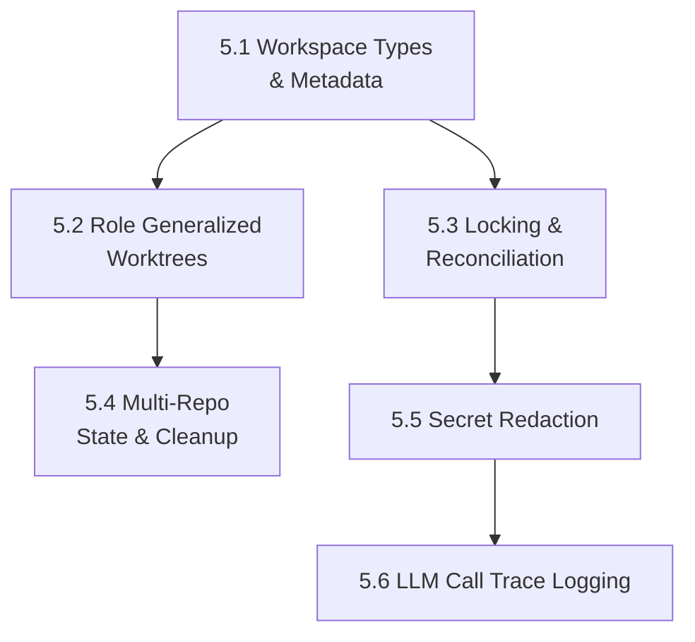

# PLAN: Phase 5 — Workspace Structure & Resume Semantics

**Source:** `docs/plans/task-workspace-structure-report.md`
**Goal:** Refactor the workflow workspace engine to enforce strict directory structures, explicit `.workspace.lock` files, per-repo tracking, robust checkpoint-based resumption, secrets redaction, and per-call LLM trace observability.
**Estimated sub-plans:** 6

---

## Sub-Plan 5.1: Workspace Types & Metadata Layout [COMPLETED]

### Objective
Migrate path generation from ad-hoc strings to explicit `TaskWorkspace` and `RepoWorkspace` Go structs, and persist these via `task.json` and `metadata.json`.

### Files to Modify
- `server/internal/orchestrator/orchestrator_workspace.go`
- `server/pkg/models/workspace.go` (NEW)

### Steps
1. [x] Define `TaskWorkspace` and `RepoWorkspace` structs with `RoleBranches` and `WorktreePaths` maps.
2. [x] Add `Status struct { MergeStatus string, TestStatus string }` per repo to track multi-repo integration.
3. [x] Update `setupWorkspace` to generate `task.json` (including `title`, `description`, `spec_status`, etc.) and `metadata.json`.
4. [x] Create an adapter layer (e.g., `LoadTaskWorkspace(taskID)` and `ResolveRepoWorkspace(repoID, role)`) to abstract path logic safely.
5. [x] Step-by-step, replace string-based paths (e.g., `sandbox.WorkspacePath(...)`) in the orchestrator helpers with lookups from the initialized `TaskWorkspace` adapter.

### Acceptance Criteria
- [x] Starting any task creates a fully populated `metadata.json` and `task.json`.
- [x] Unit tests cover all path resolution edge cases, utilizing explicit single-repo and multi-repo fixtures.
- [x] Backward compatibility is maintained, enabling workspaces initialized prior to this update to be gracefully resolved or migrated.
- [x] The structures strictly follow the updated `task-workspace-structure-report.md`.

---

## Sub-Plan 5.2: Role Generalized Worktrees & Branching [COMPLETED]

### Objective
Support generic `{role}` patterns (e.g., `backend`, `frontend`, `database`) rather than hardcoding. Simplify branch isolation for `easy` tasks.

### Files to Modify
- `server/internal/orchestrator/orchestrator_steps.go`

### Steps
1. [x] In workspace path resolution, dynamically support worktrees based on the roles assigned, rather than hardcoded backend/frontend string constants. Note that the workflow DAG steps themselves (e.g., `code_backend`, `code_frontend`) remain fixed for now; only the workspace path logic is generalized.
2. [x] For `easy` tasks, skip worktree creation entirely and utilize `main/` checked out to `feature/{task_id}`.
3. [x] Update diff generation and patch storage paths to use `{role}` (e.g., `artifacts/diffs/{role}.diff` and `patches/{role}/patch.diff`).

### Acceptance Criteria
- [x] Medium/Hard tasks dynamically create role worktrees (e.g., `worktrees/backend`).
- [x] Easy tasks execute entirely within the `main/` directory.

---

## Sub-Plan 5.3: Distributed Locking & DB/FS Reconciliation [COMPLETED]

### Objective
Ensure tasks cannot be concurrently processed by multiple workers across a distributed environment, and enforce safe resumption by reconciling database control-plane state with durable filesystem artifacts.

### Files to Modify
- `server/internal/orchestrator/orchestrator_worker.go`
- `server/internal/orchestrator/orchestrator_workspace.go`

### Steps
1. [x] Implement distributed worker locking using the Database (e.g., DB advisory/row lock) as the primary execution lock authority.
2. [x] Mirror this lock locally in a `.workspace.lock` file containing lock owner ID, hostname/container ID, heartbeat timestamp, and TTL for audit and diagnostic purposes.
3. [x] Release the DB lock and clear `.workspace.lock` upon workflow completion, error, worker termination, or if the heartbeat TTL expires.
4. [x] During resume, implement a reconciliation step: treat filesystem artifacts as durable execution records and the DB as the query/index/control-plane state. Resume logic must reconcile both (e.g., verifying that the DB's current step matches the last successful checkpoint file) instead of trusting one exclusively.

### Acceptance Criteria
- [x] Two workers on different containers attempting to run the same task ID simultaneously will result in one blocking/failing due to strict atomic locking.
- [x] Resumption correctly reconciles DB state with checkpoint files, safely handling any split-brain inconsistencies.

---

## Sub-Plan 5.4: Multi-Repo Integration State & Safe Cleanup [COMPLETED]

### Objective
Track merge/test status per repository to prevent mismatched integration states across multiple repos, and ensure worktrees are deleted safely.

### Files to Modify
- `server/internal/orchestrator/orchestrator_steps.go` (Merge & Test runners)
- `server/internal/orchestrator/orchestrator_workspace.go` (Cleanup routines)

### Steps
1. [x] During `StepMerge`, update `metadata.json` for each `RepoWorkspace` with comprehensive statuses: `pending`, `merged`, `conflict`, `failed`, or `skipped`.
2. [x] Do the same for `test_status` in `StepTest` using: `pending`, `passed`, `failed`, or `skipped`.
3. [x] Refactor `cleanupWorkspaceAfterFinalState`, `pruneWorkspaces`, and `removeWorkspace` in `orchestrator_workspace.go` to stop using `os.RemoveAll` on the workspace root. Implement **Partial Cleanup** instead: only delete `code/repos/*/worktrees/*`.
4. [x] Before deleting a worktree during workspace pruning, run `git status --porcelain`. If unstaged/uncommitted files exist, save the diffs to `artifacts/diffs/cleanup-{repo}-{role}.diff` (using `git diff`, `git status`, and `git diff --cached`).
5. [x] Fail the cleanup process unless explicitly forced if uncommitted work exists without saved diffs.

### Acceptance Criteria
- [x] Multi-repo tasks record independent merge and test statuses.
- [x] The workspace root, `specs/`, `artifacts/`, `logs/`, and metadata JSONs are strictly preserved after a task completes or fails.
- [x] Cleanup scripts exclusively target source code worktrees and persist uncommitted state to durable cleanup diff artifacts before deletion.

---

## Sub-Plan 5.5: Secret Redaction & Log Integrity [COMPLETED]

### Objective
Never persist credentials to logs or artifacts.

### Files to Modify
- `server/internal/sandbox/docker.go` or `command.go`
- `server/internal/orchestrator/orchestrator_steps.go`

### Steps
1. [x] Ensure all shell executions (e.g., git push with tokens, environment variable injections) utilize a `redactSecrets()` interceptor on `stdout` and `stderr` before logging to `logs/commands.log` or workflow artifacts.
2. [x] Redact `.env` values or private keys from LLM prompts before they are saved into `artifacts/checkpoints/` or `logs/llm/`.

### Acceptance Criteria
- [x] `git push` commands with embedded tokens output `https://***@github.com/` in logs.
- [x] Workflow execution logs contain zero sensitive data.

---

## Sub-Plan 5.6: LLM Call Trace Logging [COMPLETED]

### Objective
Persist redacted per-call LLM request/response traces for every workflow step.

### Files to Modify
- `server/internal/orchestrator/orchestrator_steps.go`
- `server/pkg/llm/provider.go` or gateway/router layer
- `server/pkg/models/workspace.go`

### Output Layout
```text
logs/llm/call-{nnn}-{step}/
  request.json
  response.json
  prompt.md
  output.md
  parsed.json
  metadata.json
```

### Steps
1. [x] Capture raw request/response payloads at the `llm.Provider` or gateway layer, but delegate the actual trace writing to an orchestrator trace service (e.g., inside `runLLMStep`) where full `task_id`, `step`, and parsed output contexts are available.
2. [x] Allocate `call-{nnn}-{step}` deterministically by scanning existing `logs/llm/call-*` directories before each call, ensuring global chronological ordering across all steps and cycles without colliding after worker restarts.
3. [x] Render raw AI prompts into `prompt.md` and raw outputs into `output.md` for human readability and exact formatting preservation.
4. [x] Redact sensitive values (API keys, env vars) explicitly during the trace write sequence before persisting to disk.
5. [x] Record telemetry such as token usage, duration, retry count, and runtime errors in `metadata.json`, ensuring failures and retries are logged identically to successful executions.

### Acceptance Criteria
- [x] Every LLM call stores redacted input, output, model, provider, token usage, duration, retry count, and parse result.
- [x] Secrets never appear in trace files.
- [x] Multiple calls in one step are ordered by call number.

---

## Dependency Graph


