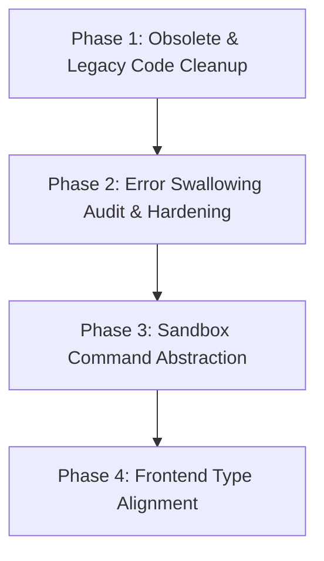

# PLAN: Clean Code Refactoring & Codebase Hardening

This plan outlines a phased approach to auditing, refactoring, and cleaning up the `auto_code_os` codebase, aligning it with the clean-coding principles defined in the workspace global configuration.

---

## 1. Executive Summary & Goals

The Auto Code OS codebase is well-structured but contains several areas of technical debt, legacy placeholders, swallowed errors, and hardcoded command invocation scripts. By systematically addressing these, we will:
*   **Remove Legacy Dead Code (YAGNI/KISS)**: Eliminate unused step definitions and graph configurations.
*   **Harden Error Handling**: Ensure no errors are silently swallowed without at least warning-level telemetry/logging.
*   **Encapsulate Sandbox Git/Shell Scripts (SRP/DRY)**: Abstract direct shell command string construction from high-level orchestration workflows.
*   **Align Frontend Types & Lint Rules (TS/React Standards)**: Refactor any loose `any` types and simplify components.

---

## 2. Refactoring Phases & Tasks



### Phase 1: Obsolete & Legacy Code Cleanup (YAGNI)
**Context**: We migrated workflow steps execution to isolated packages/files under `server/internal/orchestrator`. In the original implementation, the test runner was named `step_test.go`. Since Go build targets exclude any files ending in `_test.go` from production binaries, this caused compilation errors and test runner method undefined issues (`o.executeStepTest` undefined). The test runner must be renamed to `step_testing.go` to restore a green baseline before Phase 1 proceeds. Once a green baseline is restored, we can clean up the legacy `server/internal/workflow/steps.go` which still contains original unused step builders (`NewAnalyzeStep`, `NewCodeStep`, etc.) and `DefaultWorkflowDefinition`.

- [x] **1.0. Restore Green Baseline (Production Build Rename)**:
    - Ensure `server/internal/orchestrator/step_test.go` is renamed to `step_testing.go` to solve build exclusion issues.
- [x] **1.1. Audit `server/internal/workflow/` unused references**:
    - Confirm that no other services, tests, or handlers depend on `DefaultWorkflowDefinition` or the individual `New*Step` functions in `steps.go`.
- [x] **1.2. Refactor `server/internal/workflow/steps.go`**:
    - Strip the legacy, unused step runners and DAG helpers.
    - Consolidate any remaining necessary constants or models into `step.go` or `engine.go`.
- [x] **1.3. Clean up `server/internal/workflow/graph.go`**:
    - Review `graph.go` and remove any references or obsolete comments pointing to `steps.go`.
- [x] **1.4. Run local test verification**:
    - Execute `go test ./internal/workflow` and `go test ./internal/orchestrator` to ensure zero breakages.

---

### Phase 2: Error Swallowing Audit & Hardening (Error Handling)
**Context**: Several operations (such as saving artifacts, cleaning up workspaces, writing spec files) swallow errors using the blank identifier `_ =`. If writing a spec file or saving a test report fails, the orchestrator should not continue silently.

- [x] **2.1. Audit `server/internal/orchestrator/` for blank identifiers**:
    - Scan for `_ =` on database, file I/O, and external client calls.
- [x] **2.2. Replace silent swallows with warn logs or propagation**:
    - In `step_analyze.go`, log warnings if writing `proposal.md`, `specs.md`, `design.md`, or `tasks.md` fails:
      ```go
      if err := os.WriteFile(path, data, 0o644); err != nil {
          o.log(ctx, task.ID, nil, "warn", fmt.Sprintf("failed to save proposal.md: %v", err))
      }
      ```
    - Check the workspace lock releases and logging in `orchestrator_worker.go` to ensure failures are properly recorded.
- [x] **2.3. Run full verification**:
    - Run package builds and tests to verify no regressions in error control paths.

---

### Phase 3: Sandbox Git/Shell Abstraction (SRP / DRY)
**Context**: Several step runners construct direct git/shell command strings using `fmt.Sprintf` and invoke them inside sandboxes. This violates SRP by coupling high-level task workflows to low-level shell script strings.

- [x] **3.1. Design a `SandboxGitClient` interface**:
    - Define a clean interface for executing git operations inside a sandbox container supporting multi-repo worktrees and agent configurations:
      ```go
      type SandboxGitClient interface {
          CheckoutBranch(ctx context.Context, task *models.Task, agent *models.Agent, containerPath, branch string) error
          MergeBranch(ctx context.Context, task *models.Task, agent *models.Agent, containerPath, branch string) (models.MergeStatus, error)
          CommitChanges(ctx context.Context, task *models.Task, agent *models.Agent, containerPath, message string) error
          GetDiff(ctx context.Context, task *models.Task, agent *models.Agent, containerPath string) (string, error)
      }
      ```
- [x] **3.2. Implement and inject `SandboxGitClient`**:
    - Implement a concrete struct implementing this interface, delegating execution to the `sandbox.Runtime` with correct path and environment mapping.
- [x] **3.3. Refactor steps**:
    - Update `step_merge.go`, `step_fix.go`, and `step_pr.go` to use the abstracted client instead of raw shell array commands.

---

### Phase 4: Frontend UI Refactoring & Component Deconstruction
**Context**: Ensure frontend TS/JS aligns with the clean code guidelines. The dashboard homepage (`web/src/app/page.tsx` at 668 lines) and task detail screen (`web/src/app/projects/[id]/tasks/[taskID]/page.tsx` at 1103 lines) are currently "god-pages" that mix state hooks, side effects, utility functions, and massive nested JSX nodes.

- [x] **4.1. Deconstruct Home Dashboard page (`web/src/app/page.tsx`)**:
    - Extract `ProjectCard` and `ProjectCardsSkeleton` into a separate sub-component file inside `web/src/components/dashboard/home/`.
    - Extract modal dialog forms (Create Project & Link Repo steps) into a standalone component under `web/src/components/dashboard/home/create-project-modal.tsx`.
- [x] **4.2. Deconstruct Task Detail page (`web/src/app/projects/[id]/tasks/[taskID]/page.tsx`)**:
    - Extract `parseUnifiedDiff` and unified diff presentation into a standalone component: `web/src/components/projects/task-diff-viewer.tsx`.
    - Extract PR Review & Action Section into a separate component: `web/src/components/projects/task-pr-review.tsx`.
    - Extract Clarification Questions answer panel into: `web/src/components/projects/task-clarification-form.tsx`.
- [x] **4.3. Centralize Utility Functions**:
    - Move layout helpers, status mapping functions, and datetime formatters (e.g. `formatRelativeTime`, `isDoneStatus`, `latestActivity`) into `web/src/lib/utils/`.
- [x] **4.4. Audit TypeScript `any` occurrences**:
    - Search for `any` type usage in `web/src/` components and replace with proper typed schema models or `unknown` where applicable.
- [x] **4.5. Verify page layout structure**:
    - Validate Next.js 15 App Router routing files, ensuring clean code structure and no residual navigation links for deleted/deprecated routes (e.g. virtual keys).

---

## 3. Success Criteria & Quality Gates

1. **Compilation**: `go build ./...` in `server/` and `npm run build` in `web/` pass cleanly without warning logs or TypeScript emit errors.
2. **Coverage & Tests**: All backend package unit tests pass via `go test ./...` run from the workspace backend root (to catch cross-package compilation and method undefined errors).
3. **No Unused Code**: Legacy steps builders are completely eliminated from `server/internal/workflow`.
