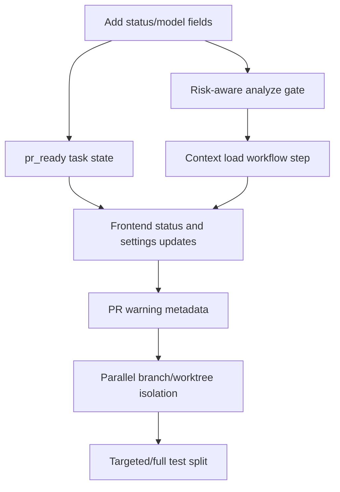

# Codebase vs. Specification Gap Analysis

This report compares the current Go backend and Next.js frontend against the workflow and PR review targets described in:

- `docs/features/5.7-workflow-engine.md`
- `docs/features/5.8-pr-human-review.md`
- `docs/ARCHITECTURE.md`

The focus is the workflow execution path from task analysis through PR creation and final human review.

## Executive Summary

The codebase has a solid baseline for the workflow and PR review pipeline, but several spec-required behaviors are still missing or only partially implemented. The current state is mixed:

- **Context loading** is still missing as a first-class workflow step and persisted task state.
- **Risk-aware auto-approval** is not fully enforced at analysis time.
- **`pr_ready`** is referenced in the spec but is not yet a durable task state.
- **Parallel branch and worktree isolation** is described in the workflow shape, but not yet implemented as actual per-role git branches.
- **Review loop limits** exist in the backend, but the UI and PR warnings are only partially surfaced.
- **Test execution** is still a single baseline step rather than a staged targeted/full split.
- **Merge conflict escalation** is not yet implemented as an actual merge-and-pause flow.

## Gap Matrix

| Area | Spec Requirement | Final Status | Severity | Primary Files |
| :--- | :--- | :--- | :--- | :--- |
| Context loading | Workflow starts with Step 0: load repository structure, branch conventions, CI config, test commands, and architecture docs before analysis. | **Open** (No first-class context-load step yet) | High | `server/internal/workflow/step.go`, `server/internal/orchestrator/orchestrator_worker.go`, `server/internal/orchestrator/orchestrator_steps.go`, `web/src/app/projects/[id]/tasks/[taskID]/monitor/page.tsx` |
| Risk-aware auto-approval | Easy tasks that touch high-risk domains must pause for human spec review. | **Open** (Only partial risk gating exists) | High | `server/internal/orchestrator/orchestrator_steps.go`, `server/pkg/models/task.go` |
| Task completion policy | PR creation should set `pr_ready`; final review then moves to `human_review`; only merge completes the task. | **Open** (`pr_ready` is not persisted as a durable task state) | High | `server/pkg/models/task.go`, `server/internal/orchestrator/orchestrator_steps.go`, task detail/monitor UI |
| Parallel FE/BE branch isolation | Backend and frontend agents use separate branches/worktrees, then merge into an integration branch. | **Open** (Workflow shape exists, but git branch isolation does not) | High | `server/internal/workflow/step.go`, `server/internal/orchestrator/orchestrator_steps.go`, `server/internal/orchestrator/orchestrator_workspace.go` |
| Review policy enforcement | Project review policy should control spec review, PR review, auto-merge, and reviewer requirements. | **Partially implemented** (Policy exists, but enforcement is inconsistent) | Medium | `server/internal/service/task.go`, `server/internal/orchestrator/orchestrator_steps.go`, `server/internal/handler/pr.go`, `server/internal/orchestrator/orchestrator.go`, `web/src/components/projects/project-profile.tsx` |
| Bounded review-fix loop visibility | Enforce `max_review_fix_cycles`; when exceeded, mark metadata and warn reviewers in PR/UI. | **Partially implemented** (Backend exists; UI and durable warning metadata are incomplete) | Medium | `server/internal/orchestrator/orchestrator_steps.go`, `server/internal/orchestrator/pr_generator.go`, `server/pkg/models/project.go`, `web/src/components/projects/project-profile.tsx`, `web/src/lib/types.ts` |
| Test strategy fidelity | Specs call for targeted tests after code/fix and full relevant tests before PR. | **Open** (Only a single baseline test step exists) | Medium | `server/internal/orchestrator/orchestrator_steps.go`, `server/internal/workflow/step.go` |
| Conflict escalation | Parallel merge conflicts should be auto-resolved based on ownership or paused for human resolution. | **Open** (No real merge/conflict pause flow yet) | High | `server/internal/orchestrator/orchestrator_steps.go`, `server/internal/workflow/step.go`, workflow UI |

## Detailed Findings

### 1. Context Loading Is Not a First-Class Step

The spec requires a dedicated Step 0 before analysis:

```text
Context Load -> Analyze -> Human Gate -> Plan/Code...
```

Current code:

- `workflow.StepNameOrder()` starts with `StepAnalyze`.
- `EasyWorkflow()` and `MediumWorkflow()` also start with `StepAnalyze`.
- No `StepContextLoad` constant exists.
- The monitor page `STEPS` list starts at `Analyze`.
- The worker sets task execution into the analysis path rather than a `context_loading` state.

Important nuance: context support is not completely absent. There is prompt assembly and source context retrieval through code such as `server/internal/orchestrator/context.go`, `server/internal/retrieval/retriever.go`, and `runLLMStep`. The missing piece is a persisted workflow step that collects and stores repo/CI/test/architecture context before analysis.

Recommended implementation:

1. Add `workflow.StepContextLoad = "context_load"`.
2. Add `TaskStatusContextLoading = "context_loading"`.
3. Insert `context_load` before `analyze` in `EasyWorkflow`, `MediumWorkflow`, and `StepNameOrder`.
4. Implement a runner that records:
   - repository root(s)
   - current/default branch
   - recent commits
   - detected test commands
   - CI config files
   - coding convention files
   - relevant architecture/spec docs
5. Persist that output as a checkpoint/artifact and feed it into `StepAnalyze`.
6. Add `Context` to the monitor UI step list.

### 2. Risk-Aware Auto-Approval Is Missing

The spec says easy tasks are only auto-approved when low risk. High-risk domains include auth, payment, migration, infra, security, RBAC, and public API contracts.

Current code in `StepAnalyze`:

- The LLM analysis schema includes `risks`, but not `risk_domains`.
- `models.TaskAnalysis` has `Risks []string`, but no `RiskDomains []string`.
- Easy tasks can be auto-approved based on complexity alone under the default branch of the autonomy logic.
- Autonomous agents can auto-approve regardless of complexity/risk.
- The separate service-level analysis path in `server/internal/service/task.go` also auto-approves easy tasks or `auto_merge` tasks without a high-risk gate.

The PR generator has a separate `assessRisk()` function, but it runs at PR time. That is too late for the spec gate because the task may already have been implemented.

Recommended implementation:

1. Add `RiskDomains []string json:"risk_domains,omitempty"` to `models.TaskAnalysis`.
2. Update the analyze prompt schema to require `risk_domains`.
3. Add deterministic risk detection from both `analysis.AffectedFiles` and planned scope text.
4. Treat either LLM-tagged risk domains or deterministic matches as high risk.
5. Make spec approval depend on both complexity and risk:

```go
if analysis.Complexity == models.TaskComplexityEasy && !hasHighRiskDomains(analysis) {
    specStatus = models.TaskSpecStatusAutoApproved
    status = models.TaskStatusCoding
} else {
    specStatus = models.TaskSpecStatusPendingReview
    status = models.TaskStatusSpecReview
}
```

6. Decide whether `AgentAutonomyAutonomous` is allowed to bypass high-risk gates. The current specs imply it should not.

Suggested initial high-risk matcher:

| Domain | Example patterns |
| :--- | :--- |
| `auth` | `auth/`, `login`, `jwt`, `oauth`, `session` |
| `payment` | `payment`, `billing`, `stripe`, `invoice`, `pricing` |
| `data_migration` | `migration`, `migrations/`, `schema`, `backfill`, `etl` |
| `infra` | `Dockerfile`, `docker-compose`, `.github/workflows`, `deploy`, `terraform`, `k8s` |
| `security` | `secret`, `cors`, `csp`, `encryption`, `vulnerability` |
| `rbac` | `permission`, `rbac`, `role`, `policy`, `access_control` |
| `public_api` | `api/`, `openapi`, `proto`, `graphql`, route/handler contracts |

### 3. `pr_ready` Is Specified but Not Persisted

The specs separate these states:

- `pr_ready`: PR exists and is ready for human review.
- `human_review`: reviewer is actively reviewing or approval flow is underway.
- `merged`: PR was approved and merged.

Current code:

- `TaskStatusPrReady` is not defined.
- `ValidTaskTransitions` has no `pr_ready` state.
- `StepPR` returns `"status": "pr_ready_for_human_approval"` in the step output, but persists `models.TaskStatusHumanReview`.
- If no PR is created, `StepPR` currently sets the task to `merged`, which may be too optimistic for a “no changes detected” path.

Recommended implementation:

1. Add `TaskStatusPrReady = "pr_ready"`.
2. Update `ValidTaskTransitions`:
   - `testing -> pr_ready`
   - `pr_ready -> human_review`
   - `human_review -> merged | fixing | failed`
3. Change `StepPR` to persist `pr_ready` after successful PR creation.
4. Add an explicit action or event that moves `pr_ready` to `human_review` when review begins.
5. Revisit the no-changes path. Prefer a distinct terminal status or explicit human confirmation instead of automatically marking `merged`.
6. Update frontend status labels, task detail actions, and monitor badges.

### 4. Parallel Branching Exists in the Workflow Shape, Not in Git Behavior

The workflow has separate `code_backend`, `code_frontend`, and `merge` steps, which matches the intended DAG shape. However, the branch model is still effectively single-branch at PR time.

Current code:

```go
branchName := fmt.Sprintf("autocode/task-%s", task.ID)
```

That branch is created during `StepPR`, after code/review/test work has already happened. The spec expects branch isolation earlier, while backend/frontend agents are coding:

- `feature/{task-id}-be`
- `feature/{task-id}-fe`
- merged into `feature/{task-id}`

Recommended implementation:

1. Introduce branch/worktree allocation before coding begins.
2. Store branch metadata in workflow checkpoints or task PR metadata.
3. Give `code_backend` and `code_frontend` separate worktrees or isolated branch checkouts.
4. Make `StepMerge` merge role branches into an integration branch.
5. Make `StepPR` create the PR from the integration branch, not from a branch created at the end.

This should be implemented after context loading and risk gating, because it has a larger blast radius.

### 5. Review Policy Is Stored but Not Consistently Enforced

The specs describe review policy as more than a project setting. It should shape when specs pause, how PRs are reviewed, whether auto-merge is allowed, and what gates must pass before merge.

Current code:

- `Project.AutoReviewPolicy` exists and the settings UI exposes `complexity_based`, `always_review`, and `auto_merge`.
- `TaskService.Analyze()` uses `AutoReviewPolicy`.
- Orchestrator `StepAnalyze` does not use `AutoReviewPolicy` directly; it primarily uses agent autonomy and task complexity.
- PR approval endpoints only check that the task is in `human_review`.
- `ApproveMerge()` merges immediately and then marks the task `merged`.
- There is no enforcement for reviewer count, required test/lint/build pass status, unresolved comments, conflicts, or explicit acknowledgement of `review_limit_exceeded`.

This creates two problems:

1. Tasks analyzed through different entry points can get different approval behavior.
2. The UI can present review policies that the actual workflow does not fully honor.

Recommended implementation:

1. Centralize the approval decision in one policy function used by both `TaskService.Analyze()` and orchestrator `StepAnalyze`.
2. Rename or constrain `auto_merge`; the current specs still require human final review for PR completion except where explicitly designed otherwise.
3. Persist PR review state separately from task lifecycle state if reviewer counts, acknowledgements, and unresolved comments need to be tracked.
4. Gate `ApproveMerge()` on required test/lint/build metadata and any required warning acknowledgement.
5. Update the settings UI to expose only policies that the backend enforces.

### 6. Review-Fix Loop Limit Is Enforced but Poorly Surfaced

Backend support exists:

- `Project.MaxReviewFixCycles` exists in `server/pkg/models/project.go`.
- Migration `000005_add_review_fix_cycles` adds the column.
- `StepReview` reads `p.MaxReviewFixCycles`.
- When the cycle count reaches the limit, `StepReview` sets `cycle_limit_reached` and proceeds to testing.

Missing pieces:

- `web/src/lib/types.ts` lacks `max_review_fix_cycles` on `Project`.
- `ProjectProfile` does not show or submit `max_review_fix_cycles`.
- `PRGenerator.GenerateSummary()` does not include a warning when the review limit was exceeded.
- There is no durable task/PR metadata field named `review_limit_exceeded`; `cycle_limit_reached` is currently only step output.

Recommended implementation:

1. Add `max_review_fix_cycles?: number` to the frontend `Project` type.
2. Add it to `ProjectProfileProps.onUpdateProject`.
3. Add form state and a numeric input beside `Max Retries`.
4. When the review limit is reached, persist `review_limit_exceeded: true` in task or PR metadata.
5. Add a warning block to the PR body and task detail UI when that flag is present.

### 7. Testing Strategy Is Less Granular Than the Spec

The spec expects:

- targeted tests after code
- targeted tests after fix
- full relevant test/lint/build before PR

Current code has one `StepTest` with a generic script:

```sh
if [ -f go.mod ]; then go test ./...; elif [ -f package.json ]; then npm test; ...
```

That is useful as a baseline, but it does not capture the spec's staged test strategy.

Recommended implementation:

1. Keep `StepTest` as the pre-PR full verification step.
2. Add optional targeted test execution after `StepCodeBackend`, `StepCodeFrontend`, and `StepFix`.
3. Store targeted/full test results separately in artifacts.
4. Update PR summaries to distinguish targeted tests, full tests, lint, and build verification.

### 8. Merge Conflict Escalation Is Not Implemented

The workflow spec says conflicts during integration should be resolved by the agent when possible, or paused for human resolution when not.

Current code:

- `StepMerge` skips easy tasks.
- For medium/hard tasks, it captures a workspace diff and returns `"changes_reconciled"`.
- It does not perform real branch merges because role branches/worktrees are not created.
- It does not detect Git conflict markers, persist a conflict artifact, or pause the workflow for human intervention.

Recommended implementation:

1. After branch isolation exists, make `StepMerge` perform an actual merge into the integration branch.
2. Detect merge failures and conflict markers.
3. Save conflict details as artifacts.
4. Try an ownership-aware automated resolution only when the ownership plan is explicit.
5. Add a paused conflict state and resume path for human resolution.

## Recommended Implementation Order



### Phase 1: Policy correctness

1. Add `TaskStatusPrReady`, `TaskStatusContextLoading`, and `TaskAnalysis.RiskDomains`.
2. Centralize review policy evaluation across service and orchestrator analysis paths.
3. Add risk-domain detection and block high-risk auto-approval.
4. Make PR approval/merge respect enforced review gates.
5. Persist `pr_ready` after successful PR creation.
6. Add unit tests for status transitions, review policy, and high-risk easy-task gating.

### Phase 2: UI and reviewer visibility

1. Add `max_review_fix_cycles` to frontend project types and settings form.
2. Add `context_loading` and `pr_ready` labels/actions to task views.
3. Persist and display `review_limit_exceeded`.
4. Include risk domains and review-limit warnings in generated PR bodies.

### Phase 3: Workflow completeness

1. Add the `context_load` step and store its artifact/checkpoint.
2. Feed context-load output into analysis.
3. Split targeted tests from final full verification.

### Phase 4: Multi-agent branch isolation

1. Allocate per-role branches/worktrees before coding.
2. Store branch ownership metadata.
3. Merge role branches into an integration branch.
4. Add conflict detection, conflict artifacts, and human conflict-resume flow.
5. Create PRs from the integration branch.

## Notes on Current Report Accuracy

The previous version of this report was directionally correct, but a few claims needed refinement:

- Context is not entirely missing; first-class context loading is missing.
- Review-fix limits are more than partial in the backend; the main gap is visibility and durable warning metadata.
- Adding a separate database column for `risk_domains` is optional. Storing it inside the existing task `analysis` JSON is lower-risk and matches the current model shape.
- Parallel branch support should not be described as only a `StepPR` problem; branch isolation must happen before coding, not only during PR creation.
- The report should not describe the workflow as fully implemented until the remaining gaps above are closed.
