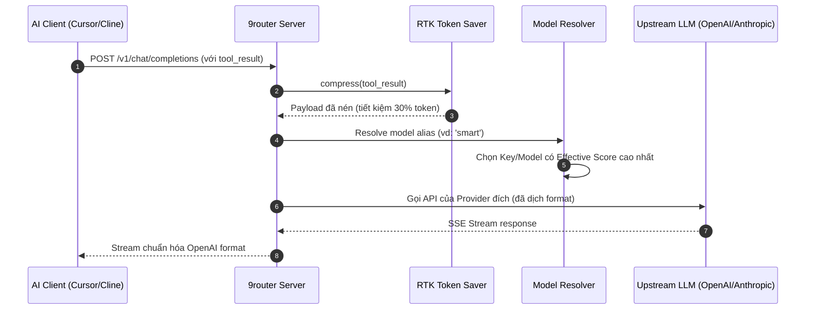

# 🧭 9router: Local AI Routing Gateway & Dashboard

## 🌟 Điểm Sáng & Tính Năng Hay Nhất (Best Features)

*   **RTK Token Saver (Bộ Nén Ngữ Cảnh Dòng Lệnh):** Tự động phát hiện các output công cụ có độ dài lớn (ví dụ: `git diff`, `ls -la`, `grep`) trước khi gửi lên LLM. Bộ nén sử dụng regex/rules thông minh để lược bỏ khoảng trắng, các dòng lặp lại, hoặc nén code cũ để tiết kiệm **20-40%** lượng input token.
*   **Format Translation (Dịch API Thời Gian Thực):** Khả năng chuyển đổi qua lại giữa các API định dạng khác nhau (OpenAI Chat Completions ➔ Anthropic Messages ➔ Gemini API). Nhờ đó, bất kỳ IDE/Client nào (như Cursor, Claude Code) cũng có thể kết nối đến 9router và chạy mượt mà với bất kỳ model upstream nào.
*   **Smart 3-Tier Fallback:** Chiến lược định tuyến 3 tầng (Subscription Key ➔ Cheap API Key ➔ Free accounts) kết hợp cooldown tự động. Nếu một key bị rate limit (429) hoặc lỗi (5xx), hệ thống lập tức rotate sang key khác mà không làm đứt quãng kết nối của client.

---

## 🧠 Bài Học & Cải Tiến Cho Auto Code OS (Takeaways & Improvements)

1.  **Nén Terminal / Tool Output trước khi gọi LLM:**
    *   *Chi tiết:* Đầu ra của terminal chạy test hoặc `git diff` thường rất lớn và tốn token. 9router chỉ giữ lại các dòng lỗi chính và nén code cũ xung quanh.
    *   *Áp dụng:* Thêm một middleware nén output trong Auto Code OS tại tầng `pkg/llm` để lọc bớt dữ liệu rác từ các lệnh terminal trước khi đẩy vào context.
2.  **Định Tuyến Model Trừu Tượng (Model Route Abstraction):**
    *   *Chi tiết:* Agent chỉ cần gửi request đến endpoint `http://localhost:20128/v1` và gọi model `smart` hoặc `fast`, 9router sẽ tự động map ra model tốt nhất có sẵn trong pool.
    *   *Áp dụng:* Cải tiến `pkg/llm` của Auto Code OS để hỗ trợ pool key và xoay vòng tự động thay vì hardcode một API key duy nhất trong cấu hình `.env`.

---

## 🏗️ Kiến Trúc & Các File Quan Trọng (Architecture & Key Paths)

*   `src/proxy.js` & `custom-server.js`: Server proxy chính và middleware bảo mật.
*   `open-sse/handlers/chatCore.js`: Core xử lý SSE stream, dịch định dạng API và xử lý fallback.
*   `open-sse/rtk/`: Thư mục xử lý RTK Token Saver (bộ nén log/tool).
*   `open-sse/services/accountFallback.js`: Thuật toán cooldown và chọn tài khoản dự phòng.

---

## 🔄 Luồng Hoạt Động (Main Flow)

