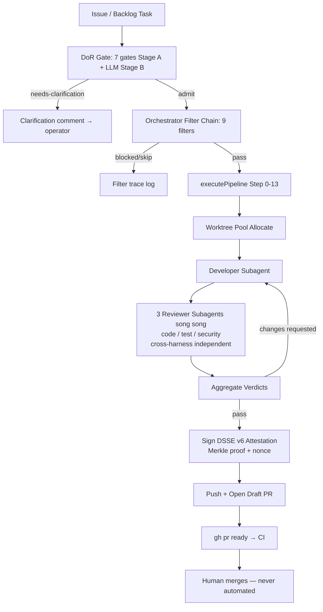
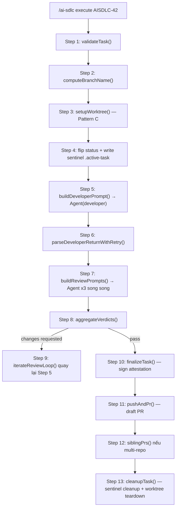

# Báo Cáo Phân Tích — AI-SDLC Framework

## Tổng Quan
"Decision Engine" cho spec-driven AI workflows — không phải "AI viết code" mà là "AI thực thi contract đã được đặc tả kỹ càng một cách tất định". Gồm Definition-of-Ready (DoR) gate 7-cổng, autonomous pipeline orchestrator (Step 0-13), cross-harness review (Claude × Codex bắt buộc độc lập), DSSE/Merkle attestation.
Stack: TypeScript monorepo (pnpm workspaces, không Turborepo) — `pipeline-cli` (Step 0-13 + DoR + orchestrator + TUI), `orchestrator/` (admission, harness registry, deploy, multi-repo), `ai-sdlc-plugin` (Claude Code plugin: hooks, slash commands, MCP server), cộng thêm `sdk-go`, `sdk-python`, `sdk-typescript` (SDK đa ngôn ngữ + K8s operator CRDs).
Quy mô: ~1245 commit, 41 RFC đã hợp nhất trong `spec/rfcs/`, 586 backlog task đã hoàn thành (tự dogfood chính framework của mình), hàng trăm file `.ts` trong `pipeline-cli/src` + `orchestrator/src`. Maturity: production-grade, nhiều lớp phòng thủ (injection hardening, fork-PR safety, replay protection) — rõ ràng đã va vấp thực tế nhiều lần (thấy trong các code comment kiểu "AISDLC-218 fixed CI double-run").

## Tính Năng Nổi Bật (Best Features)
1. **Definition-of-Ready (DoR) Gate — 7 cổng tất định + auto-pass rule**: `evaluateIssue()` chạy tuần tự 7 gate (AC binary-testable, no markers, references resolve, scope bounded, surface named, done-state describable, no invisible deps); bất kỳ `verdict: fail` + `severity: block` nào → `needs-clarification`, chặn dispatch. `autoPassRules` trong `.ai-sdlc/dor-config.yaml` cho phép task sinh tự động (vd: signal pipeline) bỏ qua 4 gate nội dung nhưng vẫn giữ 3 gate cấu trúc — first-match-wins. Ngân sách hiệu năng ràng buộc rõ: <100ms/issue (Stage A). (`pipeline-cli/src/dor/evaluate.ts`, `pipeline-cli/src/dor/gates/gate-1-ac-testable.ts`, `.ai-sdlc/dor-config.yaml`)
2. **Cross-Harness Review Independence bằng cấu trúc, không phải quy ước**: `enforceIndependence()` lọc harness chain của reviewer để loại bỏ bất kỳ harness nào đã chạy stage `requiresIndependentHarnessFrom` — nếu Claude implement thì Claude không thể review lại chính nó, kể cả khi fallback harness khác đã âm thầm đổi. Có luôn `validateIndependenceGraph()` kiểm tra graph phụ thuộc không có chu trình ở compile-time-ish. (`orchestrator/src/harness/independence.ts`)
3. **DSSE v6 Attestation với Merkle inclusion proof**: mỗi PR được ký bằng envelope chứa transcript-leaf hash của từng reviewer + Merkle proof (RFC-6962 domain separation 0x00/0x01 để né CVE-2012-2459) + nonce chống replay gắn với PR, root ký bởi khóa operator (any-of-N key). File `.ai-sdlc/attestations/<head-sha>.v6.dsse.json` là bằng chứng bất biến rằng đúng 3 reviewer độc lập đã review commit đó. (`pipeline-cli/src/attestation/sign-v6.ts`, `pipeline-cli/src/attestation/merkle.ts`)
4. **Prompt-Injection Hardening cho reviewer bên thứ 3 (untrusted PR)**: `trust-classifier.ts` phân loại tác giả PR TRUSTED/UNTRUSTED thuần tất định từ file tĩnh `.ai-sdlc/trusted-reviewers.yaml` (không gọi GitHub API live trên critical path — tránh rate-limit DoS và tránh live-inference risk). `reviewer-matrix.ts` bọc diff untrusted trong delimiter `<<<UNTRUSTED_PR_DIFF>>>...<<<END...>>>`, có `detectInjectionAttempts()` phát hiện 5 loại injection (direct instruction, hidden zero-width char, code-comment, markdown blockquote, đa ngôn ngữ), severity khác nhau theo role (`security-reviewer: critical`). (`pipeline-cli/src/pipeline/trust-classifier.ts`, `pipeline-cli/src/pipeline/reviewer-matrix.ts`)
5. **Orchestrator Filter Chain tường minh + có trace log**: `runFilterChain()` chạy 9 filter riêng biệt (already-in-flight, blocked, dependency-readiness, DoR-readiness, dispatchability, blast-radius-overlap, captures-pending, external-dependencies, orphan-parent, open-PR-exists) trước khi dispatch một task — mỗi filter là 1 file độc lập test được riêng, và mọi candidate bị loại đều ghi filter-trace log để operator biết chính xác vì sao 1 task chưa chạy. Có exponential-backoff sleep + stuck-candidate detector (>5 tick cùng lý do → cảnh báo). (`pipeline-cli/src/orchestrator/loop.ts`, `pipeline-cli/src/orchestrator/filters/`)

## Áp Dụng Cho Auto Code OS (Applied Takeaways — ranked)
1. **DoR-style Readiness Gate trước khi vào DAG** — What: 7 gate tất định (AC testable, no TODO markers, references resolve, scope bounded, surface named, done-state describable, no invisible deps) chạy <100ms trước khi issue được admit vào pipeline; verdict `needs-clarification` sinh câu hỏi cụ thể trả về cho operator thay vì để agent tự đoán giữa chừng. Apply: Thêm bước "readiness check" trước `server/internal/orchestrator/steps/plan.go` (hoặc trước khi `workflow/engine.go` bắt đầu chạy DAG) — validate task description có AC rõ ràng, không chứa placeholder, scope không quá rộng; nếu fail thì trả về `handler/task.go` một verdict "needs clarification" thay vì cho LLM plan mù. Impact: H · Effort: M · Risk: L · Est: 3-4 days.
2. **Cross-Harness / Cross-Model Review Independence bằng code, không quy ước** — What: `enforceIndependence()` loại trừ harness đã chạy implement ra khỏi candidate reviewer chain bằng cách so khớp `resolvedHarness` thực tế (không phải khai báo), kèm graph-cycle validation. Apply: Trong `server/internal/orchestrator/steps/review.go`, khi chọn model/provider cho review step, filter theo credential/provider đã dùng ở `code_backend.go`/`code_frontend.go` (lưu trong `server/internal/service/credential_router.go` hoặc DB) — không cho phép cùng model review lại patch của chính nó. Impact: H · Effort: M · Risk: L · Est: 2-3 days.
3. **Filter-Chain Admission tách rời + có trace log** — What: 9 filter độc lập, mỗi filter 1 file, mỗi candidate ghi lại vì-sao-bị-loại vào event log; giúp debug orchestrator "tại sao task X không chạy" cực nhanh. Apply: Refactor điều kiện dispatch hiện có trong `server/internal/orchestrator/orchestrator.go`/`worker.go` thành package `admission/` với các filter riêng (blocked, dependency-ready, in-flight, blast-radius) implement 1 interface chung, log kết quả filter vào `server/internal/observability/`. Impact: M · Effort: M · Risk: L · Est: 3 days.
4. **DSSE-style Attestation cho PR đã review** — What: Envelope ký chứa transcript hash từng reviewer + Merkle proof + nonce chống replay, lưu file bất biến bên cạnh commit — cho phép audit "PR này thực sự được N reviewer độc lập duyệt" mà không cần tin tưởng log trên server. Apply: Sau khi `server/internal/orchestrator/steps/pr.go` mở PR, thêm bước ký một JSON attestation tối giản (SHA + reviewer verdicts + timestamp, ký bằng khóa server) lưu trong `server/internal/gitops/pr.go` flow hoặc bảng audit (`server/internal/service/audit.go`); chưa cần Merkle proof đầy đủ, version 1 chỉ cần hash + chữ ký để có audit trail chống chỉnh sửa ngược. Impact: M · Effort: M · Risk: L · Est: 3-4 days.
5. **Trust Classifier tất định cho input không tin cậy (issue từ bên ngoài / webhook)** — What: Phân loại trusted/untrusted THUẦN từ file tĩnh, không gọi API live trên critical path — tránh rate-limit và tránh live-inference risk; áp dụng sandwich-delimiter framing khi đưa diff/nội dung untrusted vào prompt LLM. Apply: `server/internal/handler/webhook.go` nhận GitHub webhook/issue — bọc mọi nội dung untrusted (issue body, PR diff) trong delimiter rõ ràng trước khi đưa vào `server/internal/prompts/assembler.go`, và kiểm tra allowlist tác giả tĩnh trước khi admit vào orchestrator. Impact: M · Effort: L · Risk: M (nếu bỏ qua, rủi ro prompt injection) · Est: 1-2 days.

## Kiến Trúc (Architecture)
- **Layered pipeline, không phải service-oriented**: `pipeline-cli/src/steps/00-*.ts` đến `13-cleanup.ts` là các pure step function độc lập, được compose lại theo 2 cách — Tier 1 (slash command body chạy inline trong Claude Code session, dùng `Agent` tool trực tiếp) và Tier 2 (`executePipeline()` composite dùng injected `SubagentSpawner`). Cả 2 tier chạy CÙNG step function, khác nhau ở LLM-dispatch boundary — tránh code trùng lặp behavior.
- **Filter-chain admission tách biệt khỏi dispatch**: `orchestrator/loop.ts` đọc dependency-graph frontier (RFC-0014), chạy filter chain, rồi mới gọi `executePipeline()`. Filter chain và pipeline execution là 2 concern tách rời hoàn toàn — filter không biết gì về step 0-13, step 0-13 không biết gì về filter.
- **Dependency injection triệt để cho I/O**: `Runner`, `SubagentSpawner`, `DispatchFn`, `FrontierFn`, `EscalateFn` đều được inject — cho phép test hoàn toàn hermetic (không cần git/gh/LLM thật). Confidence: High (thấy rõ trong signature của `executePipeline(opts: PipelineOptions)` và `__test-helpers/fake-runner.ts`).
- **Worktree-per-task isolation (Pattern C)**: Working tree gốc là read-only; mọi work thực sự chạy trong `.worktrees/<task-id>/`, quản lý bởi `WorktreePoolManager` với ownership guard (`strict`/`advisory`) và stale-sweep threshold — cho phép nhiều pipeline chạy song song không đụng nhau. Confidence: High.

### ADR Suy Luận (Inferred ADRs)
| Quyết Định | Bằng Chứng | Lợi Ích | Đánh Đổi | Confidence |
|---|---|---|---|---|
| DoR gate tất định trước, LLM sau (Stage A → Stage B) | `evaluate.ts` chạy 7 gate regex/structural trước, comment "Stage B (LLM) lands in AISDLC-115.3" | Chặn 80% case rõ ràng với chi phí ~0, dành LLM cho case mơ hồ | Gate cứng có thể false-positive với AC hợp lệ nhưng không đúng format | High |
| Không dùng Turborepo, dùng pnpm `-r --parallel` thuần | `package.json` scripts gọi `pnpm -r` trực tiếp, không có `turbo.json` | Đơn giản hơn, ít layer build cache phải debug | Build cache kém hơn ở repo lớn | High |
| Attestation ký bằng operator key, không CI-bot ký | Comment trong `execute.md`: "the attestor itself was removed in AISDLC-140... attestation is now audit-only" | Không ai (kể cả CI) có thể tự ký giả attestation của chính commit mình | Đòi hỏi operator setup signing key local — ma sát onboarding | High |
| Pattern C worktree, parent tree read-only | `CLAUDE.md`, `execute.md` "the parent working tree is read-only" | An toàn khi chạy N pipeline song song, không trạng thái chung bị đè | Tốn disk, phải sweep định kỳ | High |
| Reviewer prompt luôn sandwich-delimiter framing | `reviewer-matrix.ts` DIFF_OPEN_MARKER/DIFF_CLOSE_MARKER | Giảm injection risk khi review PR từ fork/untrusted | Không loại bỏ hoàn toàn injection, chỉ giảm bề mặt tấn công | Medium |

## Luồng Chính (Main Flow)

## Design Patterns & Chất Lượng Code
- **Pure step functions + composite orchestration**: mỗi step (`01-validate.ts` … `13-cleanup.ts`) là hàm async thuần nhận input/trả output có type — không side effect ẩn ngoài opts đã khai báo, giúp compose theo 2 tier khác nhau (`pipeline-cli/src/steps/index.ts`).
- **Strategy/adapter pattern cho harness & spawner**: `SubagentSpawner` interface có 3 implementation (`ShellClaudePSpawner`, `ClaudeCodeSDKSpawner`, `MockSpawner`) — subscription billing vs API-key billing vs test, chọn qua injection (`pipeline-cli/src/runtime/subagent-spawner.ts`).
- **Filter/Chain-of-Responsibility rõ ràng**: mỗi filter trả `FilterResult` có discriminated union theo `FilterName`, `runFilterChain()` gộp lại; dễ thêm filter mới mà không đụng filter cũ (`pipeline-cli/src/orchestrator/filters/`).
- **Docstring-as-design-doc**: hầu hết file lớn (`loop.ts`, `execute-pipeline.ts`, `reviewer-matrix.ts`) có JSDoc đầu file dài, trích dẫn RFC number + AISDLC task ID cụ thể cho từng quyết định — traceability cực tốt nhưng khiến file "nặng chữ", đọc lâu hơn code thuần.
- **Naming convention nhất quán**: `gate-N-<slug>.ts` cho DoR gates, `NN-<slug>.ts` cho pipeline steps (số thứ tự = thứ tự chạy) — tự tài liệu hoá trình tự mà không cần đọc code.
- **Nhược điểm**: một số file (`orchestrator/loop.ts` 3069 dòng) đã phình to đáng kể — nhiều concern (backoff, escalation, DoR bridge, HC-cost) gộp vào 1 module dù có tách filter riêng; test coverage rất dày (mỗi file gần như có `.test.ts` song song) nhưng đọc-hiểu cho người mới sẽ mất thời gian đáng kể vì lượng RFC cross-reference lớn.

## Kỹ Thuật Thú Vị & Thực Hành Kỹ Thuật
- **Testing**: mỗi module gần như bắt buộc có file `.test.ts`/`.test.mjs` song song (thấy rõ qua tên file trong mọi thư mục); có cả `bin-invocation.test.ts` để guard regression cụ thể (spawn từng `bin/cli-*.mjs` thật với `--help`, đồng thời assert dạng gọi sai `pnpm --filter ... exec` VẪN fail — chống ai đó "sửa lại" workflow về dạng lỗi cũ).
- **Config-as-code cho policy**: `.ai-sdlc/dor-config.yaml`, `agent-role.yaml`, `trusted-reviewers.yaml`, `autonomy-policy.yaml` — toàn bộ policy vận hành khai báo dạng YAML, có JSON Schema validate (`spec/schemas/dor-config.v1.schema.json`).
- **PreToolUse hook enforcement (`enforce-blocked-actions.js`)**: chặn Bash command / Write-Edit path theo `blockedActions`/`blockedPaths` trong `agent-role.yaml`, fail-safe theo hướng "allow on error" (không bao giờ block session vì policy file parse lỗi) — triết lý "gate nên fail open cho availability, fail closed cho action nguy hiểm cụ thể".
- **Error/observability**: escalation qua GitHub label `needs-human-attention` thay vì throw exception im lặng; orchestrator loop catch mọi exception từ `executePipeline()`, ghi lại task ID + error, KHÔNG crash toàn bộ loop — "một task hỏng không giết cả pipeline".
- **Security**: injection-corpus 5 loại tấn công test được (`reviewer-matrix-injection.test.ts`), trust classification hoàn toàn offline/tất định để tránh DoS qua rate-limit, domain-separated Merkle tree né CVE-2012-2459 kinh điển.
- **CI-skip-token defense-in-depth**: chặn cả trực tiếp lẫn qua backtick-wrap các magic string `[skip ci]` để tránh agent vô tình tắt toàn bộ workflow verify-attestation qua commit message.

## Engineering Gems
1. `orchestrator/src/harness/independence.ts` — Vấn đề: đảm bảo reviewer thực sự độc lập với implementer, kể cả khi fallback harness âm thầm thay đổi giữa chừng. Cách làm phổ biến (yếu hơn): chỉ khai báo "reviewer khác model" trong config rồi tin tưởng runtime tuân thủ. Vì sao elegant: `enforceIndependence()` so khớp `resolvedHarness` THỰC TẾ (không phải khai báo) từ `upstreamRuns`, và có `validateIndependenceGraph()` riêng để phát hiện self-reference/cycle trong khai báo `requiresIndependentHarnessFrom` trước khi chạy. Đánh đổi: thêm 1 lớp indirection (candidate chain → filtered chain) khiến debug "tại sao reviewer X bị loại" cần đọc thêm 1 tầng. Bài học rút ra: độc lập review nên được validate bằng dữ liệu runtime thực tế, không phải bằng khai báo tĩnh.
2. `pipeline-cli/src/dor/evaluate.ts` + `gates/gate-1-ac-testable.ts` — Vấn đề: chặn LLM "cắm đầu code" khi task chưa đủ rõ, mà không tốn LLM call để phát hiện điều hiển nhiên. Cách làm phổ biến (yếu hơn): để agent tự "hỏi lại nếu cần" giữa chừng — không tất định, dễ bị agent lười bỏ qua. Vì sao elegant: 7 gate tất định (regex/structural) chạy trước với ngân sách <100ms, LLM chỉ vào cuộc ở Stage B cho phần thực sự cần phán đoán ngữ nghĩa (AC có thực sự binary-testable không) — tách bạch rạch ròi "cái gì máy tự kiểm được" khỏi "cái gì cần LLM". Đánh đổi: gate cứng (vd đúng 1-20 AC, đúng format `- [ ] #N`) có thể false-positive với task hợp lệ nhưng viết sai định dạng. Bài học rút ra: luôn tách lớp kiểm tra tất định rẻ ra khỏi lớp phán đoán LLM đắt, chạy lớp rẻ trước.
3. `pipeline-cli/src/attestation/sign-v6.ts` — Vấn đề: chứng minh "N reviewer độc lập đã review commit này" theo cách không thể giả mạo ngược, kể cả khi lịch sử git bị rebase. Cách làm phổ biến (yếu hơn): ghi log "đã review" vào DB, tin tưởng DB không bị sửa. Vì sao elegant: Merkle inclusion proof domain-separated (RFC-6962) + nonce gắn với PR (chống replay) + operator ký root bằng khóa cục bộ (any-of-N) — verifier có thể xác minh transcript-leaf nằm trong root đã ký mà không cần trust server nào giữ transcript gốc. Đánh đổi: đòi hỏi operator quản lý signing key cục bộ, thêm ma sát setup; toàn bộ hệ thống phức tạp hơn nhiều so với 1 dòng "reviewed_by" trong DB. Bài học rút ra: khi audit trail phải chống lại chính hệ thống ghi log (insider threat / compromised CI), cryptographic attestation đáng giá phần phức tạp thêm vào.

## Top 10 Điều Đáng Học
| # | Khái Niệm | File | Vì Sao Hữu Ích | Độ Khó | Thứ Tự |
|---|---|---|---|---|---|
| 1 | DoR 7-gate + auto-pass rule | `pipeline-cli/src/dor/evaluate.ts`, `.ai-sdlc/dor-config.yaml` | Chặn work chưa đủ rõ trước khi tốn LLM, ngân sách <100ms | ⭐⭐ | 1 |
| 2 | Harness independence bằng runtime match | `orchestrator/src/harness/independence.ts` | Review độc lập thực sự, không chỉ theo quy ước | ⭐⭐⭐ | 2 |
| 3 | Filter-chain admission tách rời + trace log | `pipeline-cli/src/orchestrator/filters/` | Debug "vì sao task chưa chạy" tức thì | ⭐⭐ | 3 |
| 4 | Pure step function 2-tier composition | `pipeline-cli/src/execute-pipeline.ts`, `steps/index.ts` | Cùng 1 logic chạy interactive lẫn unattended | ⭐⭐⭐ | 4 |
| 5 | DSSE v6 Merkle attestation | `pipeline-cli/src/attestation/sign-v6.ts`, `merkle.ts` | Audit trail chống giả mạo cho review chain | ⭐⭐⭐⭐ | 5 |
| 6 | Trust classifier tất định offline | `pipeline-cli/src/pipeline/trust-classifier.ts` | Tránh live-API trên critical path, tránh DoS | ⭐⭐ | 6 |
| 7 | Sandwich-delimiter injection hardening | `pipeline-cli/src/pipeline/reviewer-matrix.ts` | Giảm bề mặt prompt-injection khi review PR lạ | ⭐⭐ | 7 |
| 8 | Worktree pool + ownership guard | `orchestrator/src/runtime/worktree-pool.ts` | Chạy N pipeline song song an toàn | ⭐⭐⭐ | 8 |
| 9 | PreToolUse hook fail-safe policy enforcement | `ai-sdlc-plugin/hooks/enforce-blocked-actions.js` | Chặn hành động nguy hiểm mà không risk block session vì lỗi config | ⭐⭐ | 9 |
| 10 | Dependency-injected Runner/Spawner cho hermetic test | `pipeline-cli/src/types.ts`, `__test-helpers/fake-runner.ts` | Test toàn bộ pipeline không cần git/gh/LLM thật | ⭐⭐ | 10 |

## Hướng Dẫn Đọc (Reading Guide)
**L0 Build & Run:** `README.md` → `VISION.md` → `CLAUDE.md` (bắt buộc đọc trước khi động vào code) → `pipeline-cli/README.md`.
**L1 Entry Points:** `ai-sdlc-plugin/commands/execute.md` (slash command body, Tier 1) và `pipeline-cli/src/execute-pipeline.ts` (`executePipeline()`, Tier 2).
**L2 Core Abstractions:** `pipeline-cli/src/steps/` (Step 0-13), `pipeline-cli/src/dor/` (DoR gate), `pipeline-cli/src/orchestrator/filters/` (admission).
**L3 Architecture Glue:** `orchestrator/src/harness/` (independence + registry), `orchestrator/src/runtime/worktree-pool.ts`, `pipeline-cli/src/attestation/`.
**L4 Engineering Gems:** `harness/independence.ts`, `attestation/sign-v6.ts`, `pipeline/reviewer-matrix.ts` (injection hardening).
**L5 Reimplement:** thử viết lại DoR 7-gate evaluator tối giản (chỉ 3 gate: AC-count, no-marker, scope-bound) áp cho `server/internal/orchestrator/steps/plan.go`, rồi mở rộng dần.

## Anti-Patterns & Không Nên Copy
1. **Độ phức tạp cấu hình cực lớn**: hơn chục file YAML policy (`dor-config.yaml`, `agent-role.yaml`, `autonomy-policy.yaml`, `decision-policy.md`, `review-policy.md`...) cộng RFC cross-reference dày đặc trong mọi comment — onboarding một dev mới vào repo này tốn nhiều ngày chỉ để hiểu "luật chơi". Với Auto Code OS, nên giữ policy tập trung vào 1-2 file config thay vì phân mảnh, và không bắt buộc mọi comment phải trích RFC number.
2. **Monolithic loop file (`orchestrator/loop.ts` 3069 dòng)**: dù đã tách filter ra module riêng, phần orchestration chính vẫn gộp backoff, escalation, DoR-bridge, HC-cost vào 1 file — vi phạm chính nguyên tắc tách-concern mà framework này rao giảng ở chỗ khác. Auto Code OS nên giữ `server/internal/orchestrator/orchestrator.go` mỏng, đẩy backoff/escalation/cost-tracking ra package riêng ngay từ đầu.
3. **Quá nhiều package/SDK song song (Go + Python + TypeScript SDK, K8s operator) cho 1 framework còn ở `v1alpha1`**: bề mặt bảo trì rất lớn so với giá trị mang lại ở giai đoạn early — dấu hiệu over-engineering trước khi có đủ adopter thực tế. Auto Code OS nên trì hoãn multi-SDK cho tới khi có nhu cầu tích hợp cụ thể.
4. **Không merge PR tự động là nguyên tắc cứng nhưng không có cơ chế kỹ thuật enforce ngoài quy ước + hook**: nếu agent bỏ qua hook (hoặc hook bug), không có gì chặn `gh pr merge` ở tầng server. Auto Code OS nên enforce việc này ở tầng credential/permission (server không cấp quyền merge cho service account) thay vì chỉ dựa vào "Hard rules" trong markdown.

## Câu Hỏi Đáng Suy Ngẫm
- Framework đặt cược lớn vào "operator frontload mọi quyết định trước khi dispatch" — nhưng với domain có nhiều bất định thực sự (không chỉ do operator lười), liệu DoR gate có trở thành nút thắt cổ chai buộc operator viết AC dài dòng cho việc vốn dĩ cần explore trước?
- Cross-harness independence yêu cầu ít nhất 2 harness (Claude + Codex) sẵn có — nếu Auto Code OS chỉ có 1 nhà cung cấp LLM khả dụng, "độc lập" có thể giả lập bằng cách nào khác (khác temperature/seed, khác prompt template, review 2 lần cách nhau) mà vẫn có giá trị thực?
- Attestation Merkle/DSSE giải quyết bài toán "chống giả mạo review log" — nhưng Auto Code OS có thực sự cần chống insider/CI-compromise ở giai đoạn hiện tại, hay 1 audit log ký đơn giản trong Postgres là đủ cho vài năm tới?
- 586 backlog task hoàn thành để dogfood chính framework — đây là tín hiệu mạnh về độ trưởng thành, nhưng cũng là bằng chứng chi phí vận hành framework này không nhỏ; Auto Code OS có đủ nguồn lực để duy trì mức "framework tự ăn thịt mình" tương tự không?

## Đánh Giá Tổng Thể
| Architecture | Maintainability | Scalability | Clean Code | Learning Value |
|---|---|---|---|---|
| 9/10 | 6/10 | 8/10 | 7/10 | 9/10 |

## Lộ Trình Học Tập
- **Tuần 1**: Đọc `VISION.md`, `README.md`, `CLAUDE.md` để nắm triết lý Decision Engine + git flow conventions. Đọc `ai-sdlc-plugin/commands/execute.md` để hiểu luồng Step 0-13 ở mức vận hành.
- **Tuần 2**: Đọc sâu `pipeline-cli/src/dor/` (7 gate + evaluate.ts + dor-config.yaml) và `pipeline-cli/src/orchestrator/filters/` — đây là 2 cụm giá trị nhất, dễ tách rời để học/port riêng.
- **Tuần 3**: Đọc `orchestrator/src/harness/independence.ts`, `pipeline-cli/src/pipeline/reviewer-matrix.ts`, `pipeline-cli/src/pipeline/trust-classifier.ts` — cụm cross-harness review + injection hardening.
- **Tuần 4**: Prototype trong Auto Code OS: viết 1 readiness-gate tối giản (3-4 gate tất định) chèn trước `server/internal/orchestrator/steps/plan.go`; đo latency, đo tỷ lệ chặn task thiếu rõ ràng trên tập task thật.
- **Tuần 5**: Prototype filter-chain admission có trace log cho `server/internal/orchestrator/orchestrator.go`, thay thế điều kiện dispatch if/else hiện tại; đo khả năng debug "task X kẹt ở đâu" trước/sau.
- **Tuần 6**: Đánh giá có cần cross-harness independence không (tuỳ số lượng LLM provider Auto Code OS đang tích hợp trong `server/pkg/llm/`); nếu có ≥2 provider, thử enforce độc lập review bằng dữ liệu runtime giống `independence.ts`.
