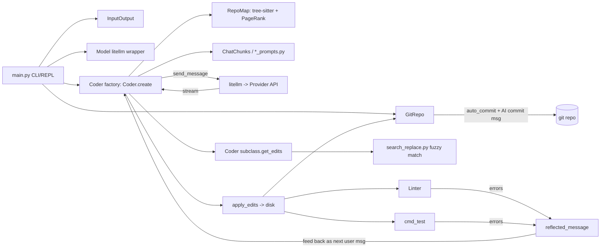
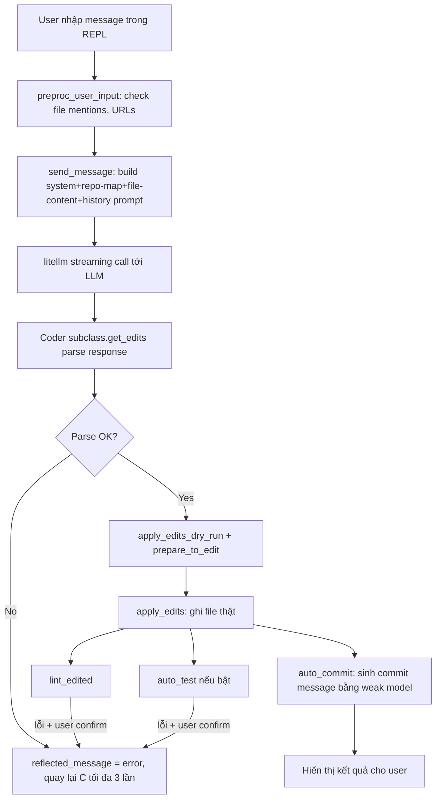

# Báo Cáo Phân Tích — Aider

## Tổng Quan (TL;DR)
Aider là một trợ lý AI chạy trong cửa sổ dòng lệnh (terminal), giúp lập trình viên chỉnh sửa code trực tiếp bằng cách trò chuyện — thay vì tự gõ từng dòng, bạn mô tả yêu cầu và AI tự sửa file trên máy bạn. Điểm hay là nó biết "đọc lướt" cả một dự án lớn để chỉ tập trung vào những phần code liên quan, giống như một đồng nghiệp giỏi biết ngay nên xem file nào khi bạn hỏi.

## Tổng Quan (Kỹ Thuật)
Aider là công cụ AI pair-programming chạy trong terminal, cho phép LLM chỉnh sửa trực tiếp file trong git repo cục bộ. Stack: Python thuần (~26K dòng core, không đếm tests/benchmark), phụ thuộc chính là `litellm` (multi-provider LLM gateway), `tree-sitter` + `grep-ast` (repo map), `networkx` (PageRank), `GitPython`. Quy mô vừa (một package `aider/` với `coders/` là submodule lớn nhất — 2485 dòng cho `base_coder.py`), maturity rất cao (dự án production, hàng chục nghìn sao GitHub, nhiều edit-format qua nhiều năm iterate). Không có server/API — chạy như CLI/REPL đơn tiến trình, một Python process quản lý toàn bộ vòng đời chat.

## Tính Năng Nổi Bật (Best Features)
1. **RepoMap — Context Selection bằng PageRank trên Tag Graph**
   - *Là gì:* Thay vì nhét toàn bộ dự án vào bộ nhớ của AI (vừa chậm vừa tốn kém), Aider tự động chọn ra những phần code quan trọng nhất liên quan tới câu hỏi, giống như cách một người có kinh nghiệm sẽ biết ngay "cần xem file nào" khi được hỏi về một tính năng.
   - *Cách triển khai:* Aider parse mọi file bằng tree-sitter (32 ngôn ngữ, file `.scm` query riêng cho từng ngôn ngữ ở `aider/queries/tree-sitter-language-pack/`) để trích xuất "tags" (định nghĩa symbol = `def`, tham chiếu = `ref`). Từ đó dựng `networkx.MultiDiGraph` với cạnh `referencer -> definer`, trọng số nhân theo: identifier có trong tin nhắn user (×10), tên "có ý nghĩa" dài ≥8 ký tự dạng snake/camel/kebab (×10), file đang mở trong chat (×50), định nghĩa bị trùng lặp nhiều nơi giảm trọng số (×0.1). Chạy Personalized PageRank (`get_ranked_tags`, `aider/repomap.py:365-574`) rồi binary-search số lượng tag đưa vào để khớp ngân sách token (`get_ranked_tags_map_uncached`, dòng 629-706, dùng binary search giữa `lower_bound`/`upper_bound` với sai số 15%). Kết quả đo được: repo map luôn nằm sát ngân sách token cấu hình (mặc định 1024, ×8 khi chưa có file nào trong chat) mà vẫn ưu tiên đúng phần code liên quan tới câu hỏi.
2. **Nhiều Edit Format cắm được (Pluggable Coders)**
   - *Là gì:* AI có nhiều "phong cách" khác nhau để sửa code (viết lại cả file, chỉ ghi phần thay đổi, v.v.), và Aider tự chọn phong cách phù hợp nhất tuỳ theo model AI đang dùng mạnh hay yếu — model yếu thì cho viết lại cả file cho chắc, model mạnh thì cho ghi diff ngắn gọn để tiết kiệm.
   - *Cách triển khai:* `aider/coders/` có ~15 `Coder` subclass (`EditBlockCoder`, `UnifiedDiffCoder`, `PatchCoder`, `WholeFileCoder`, `ArchitectCoder`...) đăng ký qua `Coder.create()` (factory pattern ở `base_coder.py:125`). Mỗi coder tách biệt: (a) prompt riêng (`*_prompts.py`), (b) `get_edits()` để parse output LLM thành edit objects, (c) `apply_edits()` để ghi xuống đĩa. Cho phép chọn định dạng theo khả năng model (model yếu → `whole` file rewrite, model mạnh → `diff` search/replace tiết kiệm token, GPT-4 Turbo → `udiff`).
3. **Fuzzy Search/Replace với Multi-Strategy Fallback**
   - *Là gì:* Đôi khi AI mô tả sai một chút chỗ cần sửa (lệch khoảng trắng, thụt lề khác đi) — thay vì báo lỗi ngay, Aider kiên nhẫn thử nhiều cách "đoán" xem AI thực sự muốn sửa chỗ nào trước khi bỏ cuộc.
   - *Cách triển khai:* `aider/coders/search_replace.py` implement chuỗi chiến lược từ chính xác → mờ dần khi SEARCH block LLM sinh ra không khớp 100% với file gốc: thử khớp trực tiếp → khớp sau khi "de-indent tương đối" (`RelativeIndenter`, dòng 18-140, thuật toán mã hoá lại indentation tương đối để so khớp bất chấp mức thụt lề tổng thể khác nhau) → `diff-match-patch` (Google's dmp) áp theo kiểu cherry-pick → SequenceMatcher tìm dòng gần giống để gợi ý "Did you mean...". Đây là lớp phòng thủ chống lỗi định dạng phổ biến nhất của LLM.
4. **Reflection Loop tự sửa lỗi (Self-Healing Edit Loop)**
   - *Là gì:* Khi AI sửa code bị lỗi (parse sai, lint fail, test fail), Aider không dừng lại chờ người dùng — nó tự đưa lỗi đó ngược lại cho AI để AI tự sửa tiếp, giống như một vòng lặp tự học từ chính sai lầm của mình.
   - *Cách triển khai:* `run_one()` (`base_coder.py:924-946`) lặp tối đa `max_reflections=3` lần: nếu `apply_updates()` gặp lỗi parse/apply (`ValueError`), lỗi được set vào `self.reflected_message` và gửi ngược lại LLM như user message tiếp theo — không cần con người can thiệp. Tương tự, sau khi áp dụng edit thành công, `lint_edited()` (dòng 1681) và `cmd_test()` chạy tự động; nếu có lỗi lint/test, code hỏi user `confirm_ask("Attempt to fix lint errors?")` rồi feed lỗi ngược vào LLM qua cùng cơ chế reflection (dòng 1600-1620).
5. **Architect/Editor Two-Model Pattern**
   - *Là gì:* Với việc phức tạp, Aider dùng một AI "giỏi nhưng đắt tiền" để lập kế hoạch, rồi giao việc thực thi chi tiết cho một AI "rẻ hơn" — giống như kiến trúc sư vẽ bản thiết kế, còn thợ xây thực hiện theo bản vẽ đó, giúp tiết kiệm chi phí mà vẫn giữ chất lượng.
   - *Cách triển khai:* `ArchitectCoder` (`aider/coders/architect_coder.py`) dùng 1 model "mạnh nhưng đắt" (vd. o1) chỉ để bàn kế hoạch, sau khi user confirm mới spawn 1 `Coder` instance mới với `editor_model` (rẻ hơn, edit format tối ưu token) để thực thi patch — tách "reasoning" khỏi "diff generation" giúp tối ưu chi phí mà vẫn giữ chất lượng plan.

## Áp Dụng Cho Auto Code OS (Applied Takeaways — ranked)
1. **PersonalizedPageRank cho RepoMap — bổ sung trọng số theo mention/identifier** — What: Aider nhân trọng số cạnh theo `mentioned_idents` (×10), file đang active trong chat (×50), độ dài & kiểu đặt tên identifier (×10), giảm trọng số definer trùng lặp (×0.1) — xem `aider/repomap.py:481-514`. Apply: **Đã verify trực tiếp** `server/internal/context/repomap/ranking.go` (`CalculatePageRank`, 100 dòng) — có personalization vector theo `activeFiles` y hệt cơ chế của Aider (dòng 15-22: boost `1.0/len(activeFiles)` cho các node active) **cộng thêm 1 multiplier ×50 áp trực tiếp lên kết quả cuối** (dòng 96-101, comment "Apply massive multiplier (50x) for active files") — trùng khớp con số 50x của Aider. Tuy nhiên **hoàn toàn không có mention-boost**: không có logic nào parse identifier từ task description và nhân trọng số cạnh liên quan (khác với `mentioned_idents` ×10 của Aider). Gap thực sự chỉ còn ở phần mention-boost. Apply: Thêm tầng "mention boost" vào `ranking.go` — parse identifier từ mô tả task (đã có `server/internal/context/symbol/extractor.go` để trích xuất symbol) và nhân trọng số cạnh liên quan (`outWeightSum`/edge weight trước power-iteration ở dòng 32-44) trước khi chạy PageRank. Impact: H · Effort: M · Risk: L · Est: 2-3 ngày.
2. **Binary-search token budget cho repo map / context packing** — What: `get_ranked_tags_map_uncached` (dòng 629-706) binary-search số lượng tag đưa vào tree/text output để bám sát `max_map_tokens` với sai số 15%, tránh phải đếm token tuần tự từng bước (chậm với model lớn). Apply: **Đã verify — Auto Code OS đã implement đúng pattern này, không có gap**: `server/internal/context/repomap/pruning.go:32-77` (`PruneTags`) đã dùng chính xác binary search (`low`/`high`/`mid`, dòng 58-76) trên số lượng tag đã sort theo PageRank score, gọi `countFn` (wrap `CountTokens` dùng `tiktoken-go` cl100k_base thật, không phải ước lượng heuristic) mỗi vòng lặp để tìm subset tag lớn nhất vừa `maxTokens`. Đây là 1 trong số ít chỗ Auto Code OS đã ngang bằng hoặc tốt hơn Aider (dùng tokenizer chính xác thay vì sample-estimate). Không cần hành động — giữ nguyên. Impact: — (đã có sẵn) · Effort: — · Risk: —.
3. **Reflection Loop cho lỗi apply-patch / lint / test** — What: Vòng lặp `run_one()` tự động feed lỗi parse/apply-edit hoặc lỗi lint/test ngược lại LLM làm user message tiếp theo, giới hạn `max_reflections=3` để tránh vòng lặp vô hạn (`base_coder.py:924-946`, `1600-1620`). Auto Code OS đã có `server/internal/orchestrator/patch/validator.go` và `applier.go` cho search/replace patch, cùng `server/internal/orchestrator/tester/`. Apply: Thêm bước "self-heal" trong DAG orchestrator (`server/internal/orchestrator/orchestrator.go` / `steps/`) — khi `patch.ApplySearchReplace` hoặc test step fail, tự động tạo 1 LLM step retry với error message làm input, giới hạn cứng số lần retry (tránh cost runaway), log via `llm_trace.go`. Impact: H · Effort: M · Risk: M (cần cap chi phí LLM) · Est: 3-4 ngày.
4. **Fuzzy Search/Replace fallback đa tầng** — What: `flexible_search_and_replace` (`search_replace.py:565`) thử nhiều "preprocessor" (giữ nguyên, strip blank lines, relative-indent) × nhiều "strategy" (exact match, diff-match-patch cherry-pick) trước khi báo lỗi, cộng thêm gợi ý "did you mean" bằng `SequenceMatcher` khi thất bại hoàn toàn. Apply: **Đã verify — xác nhận gap thực sự**: `server/internal/orchestrator/patch/search_replace.go:97-140` (`ApplySearchReplace`) chỉ normalize `\r\n`→`\n` rồi dùng `strings.Count(content, search)` — nếu `count == 0` thì `return fmt.Errorf("search block not found in %s", relPath)` **ngay lập tức**, không thử preprocessor nào khác (không strip blank lines, không normalize indent tương đối, không diff-match-patch), và không có gợi ý "did you mean" khi fail. Đây là điểm yếu thực sự đáng ưu tiên — lệch 1 khoảng trắng/tab trong search block do LLM sinh ra sẽ làm cả patch fail cứng, tốn 1 vòng lặp retry LLM đắt hơn nhiều so với thử thêm 2-3 preprocessor rẻ trước. Apply: Thêm tầng fallback fuzzy (thử lại với `strings.TrimSpace` mỗi dòng, thử relative-indent match) vào `ApplySearchReplace` trước khi trả lỗi, và khi vẫn fail thì tính similarity (Go: `github.com/agnivade/levenshtein` hoặc tự viết) để trả lỗi kèm dòng gần giống nhất — giảm tỉ lệ patch fail vì lệch khoảng trắng. Impact: H · Effort: M · Risk: L · Est: 2-3 ngày.
5. **Two-model Architect/Editor split cho task phức tạp** — What: Model mạnh lập kế hoạch (`ArchitectCoder`), model rẻ hơn thực thi diff cụ thể — tối ưu chi phí LLM mà giữ chất lượng reasoning (`architect_coder.py:1-48`). Apply: Trong `server/pkg/llm/router.go`/`fallback.go`, thêm route "planning model" khác "execution model" cho các step DAG dạng `plan` vs `code_edit` trong `server/internal/orchestrator/steps/` — model rẻ (vd Haiku/GPT-mini) cho step sinh patch theo plan đã có, model mạnh chỉ cho step lập kế hoạch. Impact: M · Effort: M · Risk: L · Est: 2 ngày.
6. **AI-generated Commit Message với weak-model fallback chain** — What: `GitRepo.get_commit_message` (`aider/repo.py:326-370`) thử tuần tự nhiều model (`self.models`, thường weak model trước) tới khi 1 model sinh được commit message trong giới hạn `max_input_tokens`, tự strip dấu ngoặc kép thừa. Apply: `server/internal/gitops/` hiện có `gitops.go`/`pr.go` — bổ sung hàm sinh commit message tự động dùng model rẻ (route qua `server/pkg/llm/router.go`) với chuỗi fallback nếu context quá dài, thay vì template tĩnh. Impact: L · Effort: S · Risk: L · Est: 0.5 ngày.

## Kiến Trúc (Architecture)
Aider là kiến trúc **single-process, layered pipeline** — không phải microservices/DAG. Lớp entry (`main.py`) khởi tạo `InputOutput`, `GitRepo`, `Model`, rồi build 1 `Coder` (factory `Coder.create`) theo edit-format phù hợp với model. `Coder` (base_coder.py) là "God object" điều phối: build prompt (`ChatChunks`) → gọi LLM qua `litellm` → nhận stream → gọi `get_edits()`/`apply_edits()` của subclass tương ứng → auto-lint/test/commit → reflection loop nếu lỗi. `RepoMap` và `GitRepo` là các service độc lập được `Coder` gọi vào, không có dependency ngược. Không có network boundary nội bộ — mọi thứ chạy trong 1 tiến trình Python, giao tiếp qua gọi hàm trực tiếp; phù hợp với use-case CLI cá nhân, không cần scale multi-tenant. (Confidence: High — đọc trực tiếp `base_coder.py`, `repomap.py`, `repo.py`, `models.py`, `coders/*.py`.)



### ADR Suy Luận (Inferred ADRs)
| Quyết Định | Bằng Chứng | Lợi Ích | Đánh Đổi | Confidence |
|---|---|---|---|---|
| Dùng tree-sitter + PageRank thay vì embeddings/RAG cho context selection | `aider/repomap.py` toàn bộ, không có vector store nào trong repo | Không cần hạ tầng vector DB, chạy offline, giải thích được (explainable ranking) | Chỉ nắm được quan hệ cú pháp (def/ref), không hiểu ngữ nghĩa sâu như embeddings | High |
| Nhiều Edit Format thay vì 1 format chuẩn | `aider/coders/` có 15+ subclass, `args.py` cho phép chọn `--edit-format` | Chọn định dạng tối ưu theo khả năng từng model (model yếu dùng whole-file, model mạnh dùng diff tiết kiệm token) | Tăng độ phức tạp bảo trì (mỗi format cần prompt + parser + applier riêng) | High |
| Single-process, không server | Không có `server/`, `api/`; toàn bộ state trong RAM của tiến trình CLI | Đơn giản, dev nhanh, không cần lo concurrency/multi-tenant | Không scale multi-user/multi-task đồng thời, không có checkpoint/resume qua network | High |
| litellm làm lớp trừu tượng model | `from aider.llm import litellm` xuyên suốt `models.py`, `base_coder.py` | Hỗ trợ hàng trăm model/provider miễn phí, không tự viết adapter | Phụ thuộc breaking changes của thư viện bên thứ 3 (thấy rõ qua các đoạn code xử lý tương thích ngược tree-sitter API ở `repomap.py:266-277`) | Medium |

## Luồng Chính (Main Flow)


### 🔬 Deep Dive: Tool Loop Implementation (file:line xác nhận)

**Vòng lặp reflection** — `Coder.run_one()` (`base_coder.py:924-943`):
```python
while message:
    self.reflected_message = None
    list(self.send_message(message))
    if not self.reflected_message:
        break
    if self.num_reflections >= self.max_reflections:  # mặc định giới hạn cứng
        self.io.tool_warning(...); return
    self.num_reflections += 1
    message = self.reflected_message  # tự động gửi lại lỗi cho LLM như 1 "user message" mới
```
Đây chính là tool-loop của Aider: không có khái niệm "tool call" JSON riêng như OpenAI function-calling (trừ `*_func_coder.py` legacy) — thay vào đó **response text chứa edit-block, được parse trực tiếp**, và mọi lỗi (parse fail, lint fail, test fail) đều biến thành 1 `reflected_message` mới đưa lại vào vòng `while`.

**Build prompt** — `format_messages()` (`base_coder.py:1333`) gọi `format_chat_chunks()` trả về `ChatChunks` (`chat_chunks.py`) gồm các phần: system prompt, few-shot examples, repo-map, nội dung file trong chat, lịch sử hội thoại, message hiện tại → `chunks.all_messages()` ghép thành list message chuẩn OpenAI-style.

**Gọi LLM** — `send_message()` (`base_coder.py:1419`) → vòng `while True` (`base_coder.py:1454`) gọi `self.send(messages, functions=...)` qua `litellm`, có retry với exponential backoff cho lỗi transient (`ContextWindowExceededError` thì dừng ngay, lỗi khác thì retry tối đa `RETRY_TIMEOUT`), xử lý streaming qua `mdstream`.

**Parse & apply edit** — `apply_updates()` (`base_coder.py:2296`):
```python
edits = self.get_edits()                 # parse response text theo edit-format (diff/whole/udiff...)
edits = self.apply_edits_dry_run(edits)   # validate trước khi ghi thật
edits = self.prepare_to_edit(edits)       # confirm với user nếu cần
self.apply_edits(edits)                   # ghi file thật
```
Nếu `get_edits()` raise `ValueError` (LLM không tuân thủ format) → `self.reflected_message = str(err)` (dòng 2315) → vòng lặp ở `run_one` tự gửi lỗi format lại cho LLM, không cần user can thiệp.

**Reflection sau khi edit** (`base_coder.py:1595-1622`): sau `apply_updates()`, nếu `auto_lint` bật và có lỗi → hỏi user `confirm_ask("Attempt to fix lint errors?")`, nếu đồng ý thì `self.reflected_message = lint_errors`; tương tự cho `auto_test`. Đây là điểm khác biệt lớn với tool-loop tự động hoàn toàn: Aider **luôn hỏi user trước khi tự sửa lỗi lint/test**, không tự động retry vô hạn.

**Architect/Editor two-model pattern** (`architect_coder.py`): `ArchitectCoder.reply_completed()` — sau khi model "kiến trúc sư" (thường là reasoning model đắt, vd o1) trả lời xong và user confirm `"Edit the files?"`, code tạo **1 `Coder` instance hoàn toàn mới** (`Coder.create(...)`, dòng 33) với `main_model=editor_model` (rẻ hơn, tối ưu token cho edit) và `edit_format=self.main_model.editor_edit_format`, rồi gọi `editor_coder.run(with_message=content, preproc=False)` — nội dung plan của architect trở thành "user message" đầu vào cho editor coder. Hai model không share cùng 1 conversation loop, chỉ share nội dung plan qua biến trung gian `content`.

## Design Patterns & Chất Lượng Code
- **Strategy Pattern rõ ràng cho Edit Format**: mỗi `Coder` subclass override `get_edits()`/`apply_edits()`, `base_coder.py` chỉ định nghĩa "khung" (`get_edits()`/`apply_edits()` trả rỗng ở base, dòng 2425-2431) — dễ thêm format mới mà không đụng code chung.
- **Factory + kwargs propagation**: `Coder.create()` (dòng 125-203) nhận `from_coder=` để "clone" state (messages, cost, repo) sang coder khác khi đổi edit-format giữa chừng — hữu ích cho pattern Architect→Editor.
- **Caching nhiều tầng**: `TAGS_CACHE` (SQLite qua `diskcache`, versioned bằng `CACHE_VERSION`), `tree_cache`/`tree_context_cache`/`map_cache` trong RAM (`repomap.py:78-82`) — tránh re-parse tree-sitter mỗi lần gọi repo map. Cache key gồm cả `mtime` file để tự invalidate.
- **Đặt tên rõ ràng, code dày comment giải thích lý do** (không chỉ giải thích "làm gì"), ví dụ toàn bộ docstring của `RelativeIndenter` (dòng 18-79) vẽ ASCII art giải thích thuật toán indent tương đối — hiếm gặp trong codebase Python thông thường, chất lượng tài liệu hoá cao.
- **Nhược điểm**: `base_coder.py` là "God Object" 2485 dòng, hơn 80 method trộn lẫn nhiều trách nhiệm (IO, cost tracking, prompt building, git, linting) — khó test đơn vị cô lập, phải test qua integration với `Coder.create()` đầy đủ.

## Kỹ Thuật Thú Vị & Thực Hành Kỹ Thuật
- **Token estimate bằng sampling**: `RepoMap.token_count()` (dòng 89-101) không gọi tokenizer trên toàn văn bản dài, mà lấy mẫu 1% số dòng, đếm token mẫu rồi ngoại suy tỷ lệ theo độ dài ký tự — giảm chi phí tính toán đáng kể khi ước lượng token cho hàng trăm file.
- **SQLite cache tự phục hồi**: `tags_cache_error()` (dòng 177-215) xử lý lỗi SQLite (file corrupt, lock...) bằng cách xoá và tạo lại cache dir, nếu vẫn lỗi thì fallback về dict in-memory — không bao giờ crash vì cache hỏng.
- **Reasoning-tag handling đa provider**: `aider/reasoning_tags.py` (import ở base_coder) tách riêng xử lý `<think>` reasoning content khác nhau giữa các model (DeepSeek R1, Claude extended thinking...) — một concern vận hành thực tế khi hỗ trợ nhiều LLM.
- **Graceful context-window overflow**: `show_exhausted_error()` (dòng 1628-1680) tính toán chi tiết input/output/total token với "fudge factor" 0.7 để cảnh báo sớm trước khi thật sự vượt giới hạn, kèm gợi ý hành động cụ thể cho user (`/drop`, `/clear`, dùng model khác).
- **Testing**: bộ `tests/basic/` bao phủ từng coder riêng biệt (test edit format parsing độc lập với LLM thật), cộng `benchmark/` chạy so sánh nhiều model trên bộ bài toán chuẩn (Exercism) để đo tỷ lệ edit-format thành công theo model — coupling giữa benchmark và design decisions (chọn edit format mặc định theo model) khá chặt chẽ và có dữ liệu thực đo (`benchmark/benchmark.py`, `problem_stats.py`).

## Engineering Gems
1. `aider/repomap.py:676-706` — Vấn đề: cần chọn số lượng tag/tree đưa vào context sao cho vừa khít ngân sách token, mà đếm token chính xác cho mỗi ứng viên rất chậm. Cách làm phổ biến (yếu hơn): lặp tuyến tính thêm/bớt tag cho tới khi vừa, hoặc cắt cứng theo số dòng. Vì sao elegant: binary search trực tiếp trên "middle" (số tag), chấp nhận nghiệm gần đúng khi sai số < 15% để dừng sớm, tận dụng tính đơn điệu (nhiều tag hơn → nhiều token hơn). Đánh đổi: giả định đơn điệu không luôn đúng tuyệt đối (tree-sitter context có thể trùng lặp dòng cha), nhưng đủ tốt trong thực tế. Bài học rút ra: khi bài toán "chọn N sao cho hàm chi phí gần một target" và chi phí đơn điệu theo N, binary search rẻ hơn nhiều so với vét cạn hoặc heuristic tĩnh.
2. `aider/coders/search_replace.py:18-140` (`RelativeIndenter`) — Vấn đề: LLM sinh SEARCH block có thể lệch mức thụt lề tuyệt đối so với file gốc (vd thêm/bớt 1 tab ở đầu) dù nội dung logic giống hệt. Cách làm phổ biến (yếu hơn): so khớp string tuyệt đối, fail ngay khi lệch whitespace. Vì sao elegant: mã hoá lại indent thành "tương đối với dòng trước" (kèm ký tự đặc biệt cho outdent), khiến 2 khối code lệch tổng thể nhưng logic giống nhau trở thành chuỗi giống hệt nhau, rồi decode ngược sau khi match. Đánh đổi: thêm 1 tầng biến đổi qua lại, có thể có edge-case với tab/space trộn lẫn. Bài học rút ra: đôi khi thay vì làm matcher "thông minh hơn", hãy biến đổi dữ liệu về không gian bất biến (invariant space) trước khi so khớp.
3. `aider/coders/base_coder.py:924-946` (`run_one` reflection loop) — Vấn đề: LLM output edit sai định dạng hoặc code không lint/test pass; muốn tự sửa mà không văng lỗi cho user xử lý thủ công. Cách làm phổ biến (yếu hơn): trả lỗi trực tiếp cho user, hoặc retry vô hạn không giới hạn gây runaway cost. Vì sao elegant: vòng `while message` đơn giản, dùng chính cơ chế "reflected_message trở thành user message tiếp theo" để tái sử dụng toàn bộ pipeline gửi/nhận đã có, chỉ cần đếm `num_reflections` so với `max_reflections=3` để chặn vòng lặp vô hạn. Đánh đổi: giới hạn cứng 3 lần có thể không đủ cho lỗi phức tạp, và mỗi lần reflect tốn thêm 1 lượt gọi LLM đầy đủ (cost). Bài học rút ra: self-healing loop không cần cơ chế riêng — tái dùng vòng lặp hội thoại chính là đủ, miễn có circuit breaker rõ ràng.

## Top 10 Điều Đáng Học
| # | Khái Niệm | File | Vì Sao Hữu Ích | Độ Khó | Thứ Tự |
|---|---|---|---|---|---|
| 1 | Personalized PageRank cho context ranking | `aider/repomap.py:365-574` | Context selection có giải thích được, không cần vector DB | ⭐⭐⭐⭐ | 1 |
| 2 | Binary-search token budget | `aider/repomap.py:629-706` | Bám sát ngân sách token hiệu quả, tránh vét cạn | ⭐⭐⭐ | 2 |
| 3 | Reflection loop tự sửa lỗi patch/lint/test | `aider/coders/base_coder.py:924-946`,`1600-1620` | Giảm can thiệp thủ công, tăng tỉ lệ task tự hoàn thành | ⭐⭐⭐ | 3 |
| 4 | Fuzzy search/replace đa chiến lược | `aider/coders/search_replace.py:565-611` | Tăng tỉ lệ apply patch thành công với LLM output không hoàn hảo | ⭐⭐⭐⭐ | 4 |
| 5 | RelativeIndenter | `aider/coders/search_replace.py:18-140` | Kỹ thuật biến đổi dữ liệu để matcher đơn giản hơn | ⭐⭐⭐⭐⭐ | 5 |
| 6 | Strategy pattern cho Edit Format | `aider/coders/*_coder.py` + `base_coder.py:2425-2431` | Cho phép chọn định dạng patch tối ưu theo model | ⭐⭐⭐ | 6 |
| 7 | Two-model Architect/Editor | `aider/coders/architect_coder.py` | Tối ưu chi phí LLM cho plan vs execute | ⭐⭐ | 7 |
| 8 | Token estimate bằng sampling | `aider/repomap.py:89-101` | Ước lượng token nhanh cho nhiều file lớn | ⭐⭐ | 8 |
| 9 | Weak-model fallback chain cho commit message | `aider/repo.py:326-370` | Tối ưu chi phí, chống lỗi context-length | ⭐⭐ | 9 |
| 10 | Self-recovering SQLite cache | `aider/repomap.py:177-215` | Hệ thống không crash khi cache hỏng | ⭐⭐ | 10 |

## Hướng Dẫn Đọc (Reading Guide)
**L0 Build & Run:** `pyproject.toml`, `aider/main.py` (entrypoint), `README.md`.
**L1 Entry Points:** `aider/main.py`, `aider/coders/base_coder.py:299` (`__init__`), `run()`/`run_one()` (dòng 876-946).
**L2 Core Abstractions:** `aider/models.py` (class `Model`), `aider/coders/__init__.py` (danh sách Coder), `aider/repomap.py` (class `RepoMap`).
**L3 Architecture Glue:** `Coder.create()` (`base_coder.py:125-203`), `format_chat_chunks`/`format_messages` (dòng 1226-1340), `aider/repo.py` (`GitRepo`).
**L4 Engineering Gems:** `aider/coders/search_replace.py` toàn bộ, `aider/repomap.py:629-706`.
**L5 Reimplement:** Viết lại Personalized PageRank ranking + binary-search token budget bằng Go cho `server/internal/context/repomap/`, so sánh với `ranking.go`/`pruning.go` hiện có.

## Anti-Patterns & Không Nên Copy
1. **God Object `Coder`**: 2485 dòng, 80+ method trộn IO/cost/git/lint/prompt trong 1 class kế thừa tuyến tính bởi 15 subclass — khó test cô lập, thay đổi 1 concern (vd cost tracking) có rủi ro ảnh hưởng coder khác. Với Auto Code OS (Go, đã có tách domain rõ theo package `orchestrator/steps`, `patch`, `tester`...), tránh lặp lại pattern này — giữ nguyên nguyên tắc chia nhỏ theo step/package hiện tại thay vì gộp về 1 "Orchestrator god struct".
2. **Single-process, không có checkpoint/resume qua mạng**: Aider phù hợp cho phiên làm việc tương tác 1 người dùng, không thiết kế cho multi-tenant hay resume sau crash giữa DAG dài. Auto Code OS cần orchestrator có checkpoint (đã có `server/internal/orchestrator/checkpoint/`) — đây là điểm Aider yếu mà Auto Code OS đã làm đúng, không nên hạ cấp xuống mô hình đơn giản của Aider.
3. **Cấu hình phụ thuộc quá nhiều vào litellm's model registry JSON động** (`ModelInfoManager` fetch từ URL, dòng 161-329) — dễ vỡ khi mạng lỗi hoặc provider đổi format, dù có cache local. Auto Code OS nên giữ pricing/model info tĩnh, versioned trong code (như `server/pkg/llm/pricing.go`) thay vì fetch runtime.

## Câu Hỏi Đáng Suy Ngẫm
- PageRank trên tag graph chỉ nắm quan hệ cú pháp def/ref — với codebase có kiến trúc phân lớp mạnh (DI, interface), liệu ranking này có bỏ sót các file quan trọng về mặt kiến trúc nhưng ít được "gọi trực tiếp" (vd config, wiring)?
- Reflection loop giới hạn cứng 3 lần — với Auto Code OS chạy task tự động không có người giám sát trực tiếp (khác với Aider CLI có user confirm mỗi bước), giới hạn retry nên đặt theo cost budget hay theo số lần cố định?
- Nhiều Edit Format (15+ coder) tối ưu theo từng model — Auto Code OS có nên duy trì đa dạng edit-format tương tự, hay chuẩn hoá về 1 format duy nhất (search/replace) để đơn giản hoá orchestrator, chấp nhận đánh đổi token efficiency với vài model?

## Đánh Giá Tổng Thể
| Architecture | Maintainability | Scalability | Clean Code | Learning Value |
|---|---|---|---|---|
| 7/10 | 6/10 | 5/10 | 7/10 | 9/10 |

## Lộ Trình Học Tập
- **Tuần 1**: Đọc `aider/repomap.py` toàn bộ, chạy thử `python -m aider.repomap <thư mục>` để quan sát output thực tế; đối chiếu với `server/internal/context/repomap/ranking.go` và `pruning.go` hiện có trong Auto Code OS.
- **Tuần 2**: Đọc `aider/coders/base_coder.py` (tập trung `run_one`, `send_message`, `apply_updates`) và 1 coder cụ thể (`editblock_coder.py` + `search_replace.py`) để hiểu trọn vẹn 1 vòng edit từ LLM response tới ghi file.
- **Tuần 3**: Prototype "mention-boost PageRank" — thêm tầng nhân trọng số theo identifier trích từ task description vào `ranking.go`, so sánh chất lượng context trước/sau bằng vài task mẫu.
- **Tuần 4**: Prototype reflection loop cho `orchestrator/patch` — khi `ApplySearchReplace` fail, tự tạo 1 retry step với giới hạn cứng số lần và cost cap, đo tỷ lệ task tự phục hồi thành công so với baseline hiện tại.
