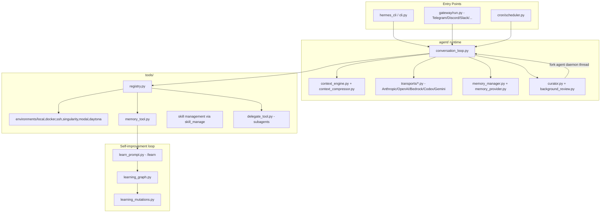
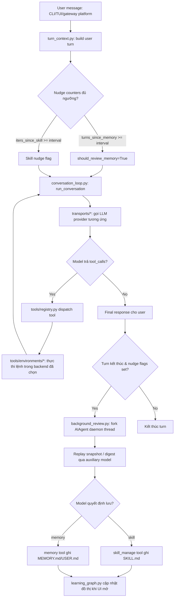

# Báo Cáo Phân Tích — Hermes Agent

## Tổng Quan (TL;DR)
Hermes Agent là một trợ lý AI có khả năng "tự học" theo thời gian — nó có thể tự rút kinh nghiệm từ những gì đã làm, tự ghi chú lại kỹ năng mới để dùng cho lần sau, và tự nhớ những điều quan trọng về người dùng, giống như một nhân viên mới dần trở nên thành thạo hơn sau mỗi ngày làm việc. Nó có thể trò chuyện qua nhiều nền tảng khác nhau như Telegram, Discord, Slack.

## Tổng Quan (Kỹ Thuật)
Hermes Agent (Nous Research) là một AI agent tự cải thiện ("self-improving"), chạy như CLI/TUI + gateway đa nền tảng (Telegram, Discord, Slack, WhatsApp, Signal...), với vòng lặp học tập khép kín: tự tạo skill từ kinh nghiệm, tự cải thiện skill khi dùng, tự nhắc bản thân lưu memory, tìm lại hội thoại cũ qua FTS5, và mô hình hoá user qua Honcho. Stack: Python 3.11 monolith rất lớn (`cli.py` ~16.4k dòng, `agent/conversation_loop.py` ~5.5k dòng, `agent/context_compressor.py` ~3.3k dòng), OpenAI-compatible transport layer đa provider, SQLite cho session/kanban, filesystem Markdown cho memory/skills. Maturity cao — pin phiên bản dependency nghiêm ngặt, nhiều test, changelog kỷ luật (comment giải thích lý do từng pin, kể cả CVE).

## Tính Năng Nổi Bật (Best Features)
1. **Skill self-authoring qua `/learn` — không có "distillation engine" riêng**
   - *Là gì:* Khi agent học được một cách làm mới, nó không cần gọi thêm một AI phụ để tóm tắt lại — chính nó tự viết ra "hướng dẫn sử dụng kỹ năng mới" cho bản thân, dùng ngay những công cụ nó đã có sẵn.
   - *Cách triển khai:* `agent/learn_prompt.py::build_learn_prompt()` không gọi model riêng để tóm tắt; nó build MỘT prompt buộc chính agent đang chạy dùng lại tool sẵn có (`read_file`, `web_extract`, `skill_manage`) để tự viết `SKILL.md` theo chuẩn "HARDLINE" (description ≤60 ký tự vì system-prompt index cắt chuỗi ở đó, không dùng từ marketing, không bịa flag). Kết quả: hoạt động y hệt trên local/Docker/remote backend vì không thêm tool-footprint mới.
2. **Background review fork — vòng lặp "nudge" sau mỗi turn**
   - *Là gì:* Sau mỗi lượt trò chuyện, agent âm thầm tự hỏi lại chính mình ở "hậu trường": "mình có nên ghi nhớ hoặc học thêm gì từ lượt vừa rồi không?" — mà không làm gián đoạn hay làm chậm cuộc trò chuyện chính đang diễn ra.
   - *Cách triển khai:* `agent/background_review.py::spawn_background_review()` fork một `AIAgent` con daemon-thread sau mỗi turn, replay lại snapshot hội thoại (cùng model → tái dùng prompt-cache ấm; khác model → chỉ replay digest để tránh cold-write tốn token), hỏi "có nên lưu/sửa skill hoặc memory không?" và ghi thẳng vào store — không đụng conversation chính hay cache chính. Được trigger định kỳ theo bộ đếm turn/iteration (`agent/turn_context.py:336-344` cho memory nudge dựa trên `_memory_nudge_interval`; `agent/conversation_loop.py:697-700` cho skill nudge dựa trên `_skill_nudge_interval`, đếm theo số iteration gọi tool và reset khi `skill_manage` thực sự được dùng).
3. **Frozen-snapshot memory với instant durability**
   - *Là gì:* Trí nhớ của agent được "chụp ảnh đông cứng" ngay đầu mỗi phiên làm việc để giữ cho AI phản hồi nhanh và ổn định, nhưng vẫn ghi lại ngay lập tức mọi thay đổi mới ra đĩa để không bao giờ mất dữ liệu — kể cả khi có ai đó vô tình sửa file trí nhớ cùng lúc, hệ thống sẽ phát hiện và từ chối ghi đè thay vì âm thầm làm mất thông tin.
   - *Cách triển khai:* `tools/memory_tool.py` — `MEMORY.md`/`USER.md` nạp vào system prompt như snapshot đông cứng tại đầu session (giữ prompt cache ổn định suốt session); ghi giữa chừng cập nhật file ngay (durable) nhưng KHÔNG đổi system prompt — chỉ refresh ở session sau. Có drift-detection: nếu file trên đĩa không round-trip qua parser (bị sửa tay/patch song song), tool từ chối ghi và trỏ user tới bản `.bak.<ts>` thay vì âm thầm mất dữ liệu (`tools/memory_tool.py::_drift_error`).
4. **Learning graph "làm hiển thị việc học"**
   - *Là gì:* Một sơ đồ trực quan cho thấy agent đã học được những kỹ năng gì và ghi nhớ những gì, giúp người dùng "nhìn thấy" quá trình agent trưởng thành theo thời gian thay vì phải đoán.
   - *Cách triển khai:* `agent/learning_graph.py::build_learning_graph()` gộp skill đã học (agent-created hoặc có use_count>0) + memory chunks (`MEMORY.md`/`USER.md`, tách theo delimiter `§`) thành đồ thị node/edge cho desktop UI — cạnh skill↔skill từ `related_skills` khai báo trong frontmatter, cạnh memory↔skill suy ra bằng lexical overlap (token Jaccard-ish, có bonus khi tên skill xuất hiện literal trong memory).
5. **6 backend thực thi lệnh cắm-được (pluggable execution environments)**
   - *Là gì:* Agent có thể chạy lệnh trên nhiều "nơi" khác nhau (máy cục bộ, Docker, máy chủ từ xa, dịch vụ cloud...) mà không cần đổi cách nó hoạt động — giống như một người thợ có thể làm việc ở nhiều công trường khác nhau với cùng một bộ đồ nghề.
   - *Cách triển khai:* `tools/environments/{local,docker,ssh,singularity,modal,daytona}.py` đều kế thừa `tools/environments/base.py` (abstract, "spawn-per-call": mỗi lệnh spawn `bash -c` mới, session snapshot env/alias/function chụp 1 lần rồi re-source, CWD giữ qua marker stdout hoặc temp file). Daytona/Modal hỗ trợ "serverless persistence" — môi trường hibernate khi idle, wake khi cần, gần như free khi rảnh.

## Áp Dụng Cho Auto Code OS (Applied Takeaways — ranked)
1. **Nudge-based self-review fork thay vì chỉ HITL suggestion queue** — What: Hermes tự động fork một agent con sau mỗi N turn (`agent/background_review.py`, `agent/turn_context.py:336-344`) để tự hỏi "có nên lưu skill/memory không?" và ghi thẳng, không chờ end-of-task. Apply: **Đã verify + sửa 1 chi tiết đọc sai**: `server/internal/orchestrator/learning/patterns.go:19` (`DetectPatterns`) gọi `le.memorySvc.ListByAgent(ctx, agentID, models.MemoryTierWorking, 50, 0)` — con số `50` ở đây là **limit của query** (lấy tối đa 50 memory working-tier gần nhất mỗi lần gọi), **không phải ngưỡng "chỉ chạy sau khi tích luỹ ≥50 memory"** như mô tả trước đó; ngưỡng phát hiện pattern thực sự nằm ở dòng 33: `if count >= 3` (một loại lỗi/theme xuất hiện ≥3 lần trong batch 50 memory gần nhất thì mới coi là pattern). Trigger point đã xác định: `server/internal/orchestrator/worker.go:566`, gọi trong 1 goroutine chỉ khi task kết thúc với `finalStatus == models.WorkflowJobStatusDone` (bên cạnh `SuggestRuleFromErrors`) — tức là confirmed end-of-task only, đúng như takeaway giả định ban đầu, không có nudge giữa chừng. Apply: thêm hook nhẹ trong DAG worker (cùng khu vực `worker.go:557-569`) gọi `LearningEngine.DetectPatterns` định kỳ theo số step đã chạy trong task (giống `_skill_nudge_interval` của Hermes) thay vì chỉ chạy ở `WorkflowJobStatusDone` — vẫn giữ gate HITL approval hiện có, chỉ đổi tần suất trigger. Impact: M · Effort: M · Risk: L · Est: 2-3 ngày.
2. **`/learn` không cần model phụ, chỉ prompt buộc agent tự viết skill** — What: `agent/learn_prompt.py` build 1 prompt chuẩn hoá (description ≤60 ký tự, cấm invented API, section order cố định) và giao agent chính tự chạy qua tool sẵn có. Apply: `server/internal/orchestrator/skills/executor.go` hiện chỉ có `SkillCall`/`SkillResult` (thực thi legacy tool) — chưa có đường tạo skill mới từ kinh nghiệm. Thêm 1 prompt template trong `server/internal/prompts/templates/` (theo cơ chế `assembler.go`/`compiler.go` sẵn có) để agent tự soạn skill definition (JSON schema + description) từ task vừa hoàn thành, ghi qua `LearningService` (`server/internal/service/learning.go`) với trạng thái "proposed" chờ duyệt. Impact: H · Effort: M · Risk: L · Est: 3-4 ngày.
3. **Frozen-snapshot + drift-detection cho memory injection** — What: system prompt chỉ đọc snapshot đầu session, tool ghi ngay ra đĩa nhưng không phá cache; phát hiện drift từ ghi đè song song và từ chối thay vì mất dữ liệu (`tools/memory_tool.py::_drift_error`). Apply: `server/internal/service/memory.go` + prompt injection trong `server/internal/prompts/assembler.go` nên áp dụng cùng pattern — build system prompt 1 lần/task từ `MemoryTierWorking/Episodic/Semantic/Procedural` (`server/pkg/models/memory.go`), rồi mid-task writes chỉ update DB, không rebuild prompt giữa chừng (giữ ổn định cho LLM prompt caching của provider, xem `server/pkg/llm/pricing.go`). Impact: M · Effort: S · Risk: L · Est: 1-2 ngày.
4. **Learning graph để hiển thị "agent đã học gì"** — What: `agent/learning_graph.py` build node/edge graph (skill + memory) render lên desktop UI. Apply: Auto Code OS đã có bảng `memories` + `LearningService`; thêm 1 endpoint REST trong `server/cmd/api` trả về graph tương tự (skills đã được HITL approve + memory liên quan), hiển thị trong `web/src/app/projects/[id]/tasks/[taskID]/components/` như một panel mới bên cạnh `SupportingAccordion.tsx`/`CheckpointsPanel.tsx` hiện có. Impact: M · Effort: M · Risk: L · Est: 3 ngày.
5. **Pluggable execution-environment abstraction (base.py + 6 backend)** — What: 1 abstract base `spawn-per-call` cho Local/Docker/SSH/Singularity/Modal/Daytona, cùng interface thống nhất. Apply: `server/internal/sandbox/sandbox.go` hiện chủ yếu nhắm Docker (`docker.go`, `policy.go`, `workspace.go`); tách 1 interface `Environment` giống `tools/environments/base.py` để dễ thêm SSH-remote-worker hoặc serverless backend sau này mà không sửa `orchestrator/worker.go`. Impact: L (chưa cấp thiết) · Effort: H · Risk: M · Est: 1-2 tuần — chỉ làm nếu có nhu cầu multi-backend thật.

## Kiến Trúc (Architecture)
- **Kiểu**: Monolith Python theo layer chức năng phẳng (không package theo domain-driven mà theo "concern" — `agent/`, `tools/`, `gateway/`, `hermes_cli/`, `cron/`, `skills/`), rất nhiều file lớn (`cli.py` 16.4k dòng, `conversation_loop.py` 5.5k dòng) — trái ngược phong cách Go module hoá nhỏ của Auto Code OS.
- **Layers**: `hermes_cli/` (CLI/TUI, entry point người dùng) → `agent/` (agent runtime: conversation loop, transports đa provider, context compression, memory/curator/skill logic) → `tools/` (function-calling tool implementations, kể cả `environments/` backend) → `gateway/` (multi-platform messaging relay, chạy độc lập, gọi vào `agent/`) → `cron/` (scheduler chạy job nền, tái dùng agent runtime).
- **Dependency direction**: `gateway` và `hermes_cli` đều phụ thuộc `agent` + `tools`; `agent` phụ thuộc `tools` (gọi tool schemas) nhưng KHÔNG phụ thuộc ngược lại `gateway`/`cli` — điểm nối duy nhất là `agent/skill_commands.py` được cả CLI và gateway share để tránh trùng logic slash-command.
- **Không có DB quan hệ**: state hầu hết là file Markdown (`MEMORY.md`, `USER.md`, `SKILL.md`) + JSON (`.usage.json`, `.curator_state`) + SQLite cục bộ cho session search (FTS5) — phù hợp mô hình "chạy trên VPS $5", không cần Postgres.

### ADR Suy Luận (Inferred ADRs)
| Quyết Định | Bằng Chứng | Lợi Ích | Đánh Đổi | Confidence |
|---|---|---|---|---|
| Skill/memory là file Markdown + frontmatter thay vì DB | `agent/skill_utils.py::parse_frontmatter`, `tools/memory_tool.py` đọc ghi `.md` trực tiếp | Portable, dễ đọc/sửa tay, dễ sync qua git, không cần DB server | Không có transaction thật, phải tự cài drift-detection (`_drift_error`) và file locking (`fcntl`/`msvcrt`) | High |
| Background review chạy fork thread thay vì cron job riêng | `agent/background_review.py` docstring: "fire off a daemon thread" | Không cần daemon process riêng, tái dùng warm prompt cache của model chính | Review có thể trễ nếu process chính thoát trước khi thread hoàn tất; không có retry/queue bền | High |
| Không có "distillation model" riêng cho `/learn` | `agent/learn_prompt.py` — agent chính tự chạy prompt | Không cần thêm inference call/model config; hoạt động đồng nhất trên mọi backend | Chất lượng skill phụ thuộc hoàn toàn vào model chính đang dùng (yếu hơn nếu model rẻ) | Medium |
| Pin dependency chính xác (`==X.Y.Z`), không dùng range | `pyproject.toml` — comment giải thích vụ "Mini Shai-Hulud worm hitting mistralai 2.4.6" | Chặn supply-chain attack tự động qua PyPI | Update thủ công tốn công, dễ bị lag CVE fix nếu không theo dõi | High |
| 6 execution-environment backend cùng 1 abstract base | `tools/environments/base.py` (ABC) + 6 subclass | Người dùng chọn nơi chạy (local/VPS/serverless) không đổi code agent | Bảo trì 6 backend song song, một số tính năng (activity callback, interrupt) phải đồng bộ ở mọi backend | High |

## Luồng Chính (Main Flow)

### 🔬 Deep Dive: Tool Loop Implementation (file:line xác nhận)

**Vòng lặp chính** — `run_conversation()` (`agent/conversation_loop.py:537`): 1 turn setup 1 lần qua `build_turn_context()` (`agent/turn_context.py`) — dựng system prompt, hydrate todo/nudge counter, khôi phục hoặc build lại conversation history, chuẩn bị prefetch memory ngoài — rồi vào `while (api_call_count < agent.max_iterations and agent.iteration_budget.remaining > 0)` (dòng 654). Mỗi vòng lặp là **1 API call**, không phải 1 tool call — nếu response chứa nhiều tool call thì tất cả được xử lý trong cùng 1 iteration trước khi gọi model lần tiếp theo. Vòng lặp thoát khi: hết `max_iterations`, hết `iteration_budget`, bị interrupt (`agent._interrupt_requested`, dòng 658), hoặc model trả response không có `tool_calls`.

**Nhánh rẽ Codex app-server** (dòng 642-650): nếu `agent.api_mode == "codex_app_server"`, toàn bộ turn được giao cho `agent._run_codex_app_server_turn()` — 1 subprocess Codex app-server đảm nhiệm terminal/file-ops/patching, **bỏ qua hoàn toàn** vòng lặp Hermes native. Đây là 1 dạng "escape hatch" sang mô hình subprocess-CLI ngay bên trong 1 project vốn theo API-native.

**Gọi LLM qua transport adapter** — `agent._get_transport()` (gọi lại nhiều lần trong vòng lặp, vd dòng 1201, 4344) trả về instance implement `agent/transports/base.py` — mỗi provider (`anthropic.py`, `bedrock.py`, `chat_completions.py`, `codex.py`) tự chuẩn hoá response về `NormalizedResponse` qua `normalize_response()` (`base.py:60`), giúp phần còn lại của vòng lặp không cần biết đang nói chuyện với provider nào.

**Xử lý tool_calls** — sau `normalized = _transport.normalize_response(response)` (dòng 4344), nếu `assistant_message.tool_calls` khác rỗng (dòng 4586): validate tên tool có tồn tại trong `agent.valid_tool_names` (tự "agent-repair" tên gõ sai qua `agent._repair_tool_call`, dòng 4599), validate arguments là JSON hợp lệ (dòng 4670+, tự sửa `{}` nếu rỗng), rồi dispatch thực thi qua `agent/tool_executor.py` — có **3 chiến lược thực thi**: `execute_tool_calls_concurrent()` (dòng 327, thread pool — kết quả được sắp xếp lại đúng thứ tự gốc trước khi append vào `messages`), `execute_tool_calls_sequential()` (dòng 1028), và `execute_tool_calls_segmented()` (dòng 1742, batch hỗn hợp). Lỗi tool-call (tên sai, JSON hỏng) được trả về model dưới dạng `role: "tool"` message chứa lỗi thay vì crash — cho phép model tự sửa ở vòng kế tiếp (tối đa 3 lần, dòng ~4615).

**Nudge-based learning loop**: bộ đếm `agent._iters_since_skill` / `agent._turns_since_memory` tăng mỗi iteration (dòng ~708), reset khi `skill_manage`/`memory` tool thực sự được gọi (`tool_executor.py` dòng ~380). Khi đạt ngưỡng, `background_review.py::spawn_background_review()` fork 1 `AIAgent` con chạy daemon-thread riêng sau khi turn chính kết thúc — replay lại snapshot hội thoại qua 1 auxiliary model, tự quyết định có nên ghi skill/memory hay không, **không đụng vào `messages` hay cache của conversation chính**.

**Context compression**: `agent/context_compressor.py` (3486 dòng) được gọi khi context vượt ngưỡng — vòng lặp có cờ `restart_with_compressed_messages` (dòng ~4300) để retry lại API call sau khi nén, và `restart_with_length_continuation` boost dần `max_tokens` (2×, 4×, 8×... tới trần 32768) khi response bị cắt do giới hạn output token — cả 2 đều **refund lại `iteration_budget`** để không phạt user vì lỗi hạ tầng.

## Design Patterns & Chất Lượng Code
- **Provider adapter pattern**: `agent/transports/{anthropic,bedrock,chat_completions,codex,codex_app_server,gemini_native_adapter,vertex_adapter}.py` — mỗi provider 1 adapter cùng interface `base.py`, cho phép switch model bằng lệnh `hermes model` không đổi code (`README.md` xác nhận claim này khớp code).
- **Registry pattern cho tools**: `tools/registry.py` là nơi tất cả tool implementation đăng ký; `toolsets.py` (root) định nghĩa nhóm tool theo use-case (vd `DELEGATE_BLOCKED_TOOLS` trong `tools/delegate_tool.py` chặn subagent gọi lại `delegate_task`, `memory`, `cronjob`... để tránh đệ quy/leak).
- **Frozen snapshot + explicit drift-detection**: thấy lại ở cả `memory_tool.py` lẫn context compression (`context_compressor.py` — "protecting head and tail context", tách rõ phần đã cache vs phần mới).
- **Naming/style**: snake_case nhất quán, docstring module-level rất chi tiết (giải thích "why", không chỉ "what") — đặc biệt tốt ở các file liên quan an toàn dữ liệu (`memory_tool.py`, `learning_mutations.py`).
- **Điểm yếu chất lượng code**: một số file khổng lồ vượt xa chuẩn maintainability thông thường (`cli.py` 16.4k dòng, `conversation_loop.py` 5.5k dòng đảm nhận cả retry, steer injection, nudge, streaming...) — vi phạm single-responsibility rõ rệt dù được bù bằng docstring/comment tốt.

## Kỹ Thuật Thú Vị & Thực Hành Kỹ Thuật
- **Threat scanning cho memory content**: `tools/memory_tool.py::_scan_memory_content` gọi `tools/threat_patterns.py::first_threat_message(scope="strict")` để chặn prompt-injection/exfiltration patterns TRƯỚC khi ghi vào memory — vì memory vào system prompt như frozen snapshot, một entry bị poison sẽ tồn tại suốt session và các session sau.
- **File locking cross-platform**: `tools/memory_tool.py` dùng `fcntl` (Unix) hoặc `msvcrt` (Windows) tuỳ platform để tránh race-condition khi nhiều tiến trình cùng ghi memory.
- **Test khẳng định hợp đồng byte-identical giữa các module**: `agent/skill_commands.py` comment nói rõ marker string (`_SKILL_INVOCATION_PREFIX`...) PHẢI khớp byte-identical với `agent/skill_bundles.py`, được assert bởi `tests/openviking_plugin/test_openviking.py::test_skill_markers_match_hermes_scaffolding` — một dạng "contract test" giữa 2 module không import lẫn nhau.
- **Config**: `~/.hermes/config.yaml` cho curator/skills/nudge intervals, đọc qua `hermes_cli.config.load_config()`, mọi module đọc config đều tolerant với file thiếu/malformed (trả `{}` an toàn thay vì crash) — pattern lặp lại nhất quán ở `curator.py::_load_config`, `learning_graph.py`, v.v.
- **Error handling**: nhiều nơi log ở mức `debug` cho lỗi non-fatal (`logger.debug(..., exc_info=True)`) thay vì raise, giữ agent chạy tiếp — triết lý "graceful degradation" xuyên suốt.

## Engineering Gems
1. `agent/turn_context.py:301-309` — Vấn đề: khi 1 session dài được resume từ conversation_history đã lưu (crash restart, hoặc reload), bộ đếm nudge (`_turns_since_memory`) bị reset về 0 trong bộ nhớ dù đã có N turn trước đó trong lịch sử. Cách làm phổ biến (yếu hơn): reset counter về 0 mỗi lần khởi động lại process, khiến nudge luôn trễ N turn sau mỗi restart. Vì sao elegant: hydrate counter bằng `prior_user_turns % agent._memory_nudge_interval` — khôi phục đúng "pha" (phase) của chu kỳ nudge từ lịch sử, không cần lưu counter riêng ra đĩa. Đánh đổi: giả định modulo đơn giản đúng nếu interval không đổi giữa các session; nếu user đổi `nudge_interval` giữa chừng, phase bị lệch (chấp nhận được vì chỉ ảnh hưởng thời điểm nudge kế tiếp). Bài học rút ra: có thể suy ra state từ dữ liệu đã có (số turn trong history) thay vì phải persist thêm 1 trường mới.
2. `tools/memory_tool.py::_drift_error` (khoảng dòng 77-95) — Vấn đề: 1 process khác (patch tool, shell append, sister-session) có thể sửa `MEMORY.md` trực tiếp trong lúc agent định ghi qua tool, khiến "replace/remove theo substring" của agent xoá nhầm dữ liệu vừa được thêm bên ngoài. Cách làm phổ biến (yếu hơn): ghi đè thẳng theo nội dung agent nắm giữ trong bộ nhớ (last-write-wins), mất silent data. Vì sao elegant: tool tự parse lại nội dung trên đĩa, nếu không round-trip đúng qua parser/serializer của chính nó thì TỪ CHỐI ghi và trỏ user tới bản `.bak.<ts>` — biến silent-data-loss thành lỗi tường minh có đường phục hồi. Đánh đổi: thêm 1 bước đọc-lại-để-so-sánh trước mỗi ghi (chi phí I/O nhỏ), và agent phải xử lý case bị từ chối (retry hoặc báo user). Bài học rút ra: với state không có transaction thật (file), luôn kiểm tra round-trip trước khi ghi đè thay vì tin tưởng bộ nhớ cache của mình.
3. `agent/background_review.py` (docstring dòng 29-41, policy chọn full-replay vs digest) — Vấn đề: review fork cần "nhìn thấy" toàn bộ hội thoại để quyết định lưu skill/memory gì, nhưng replay full transcript vào 1 model khác (không cùng prompt-cache key với model chính) sẽ cold-write toàn bộ token mỗi lần — tốn kém nếu chạy sau MỌI turn. Cách làm phổ biến (yếu hơn): luôn dùng transcript đầy đủ bất kể model nào, hoặc luôn dùng digest (mất chi tiết). Vì sao elegant: policy 2 nhánh đơn giản — "same model → full replay (cache ấm, gần như free); different model (khi user route review sang model rẻ hơn) → digest nén (chấp nhận mất chi tiết đổi lấy rẻ)". Quyết định dựa hoàn toàn vào việc prompt-cache có tái dùng được hay không. Đánh đổi: cần theo dõi đúng "parent runtime" để biết khi nào cache còn ấm. Bài học rút ra: chi phí thực của "replay context" phụ thuộc cache-hit, không phải độ dài văn bản — thiết kế policy theo cache-key match, không theo kích thước dữ liệu.

## Top 10 Điều Đáng Học
| # | Khái Niệm | File | Vì Sao Hữu Ích | Độ Khó | Thứ Tự |
|---|---|---|---|---|---|
| 1 | Nudge counter dựa trên turn/iteration, hydrate lại từ history | `agent/turn_context.py:301-344` | Tự động hoá việc "nhắc" agent lưu kiến thức mà không cần cron riêng | ⭐⭐⭐ | 1 |
| 2 | Background review fork tái dùng prompt cache | `agent/background_review.py` | Self-improvement gần như miễn phí về token khi cùng model | ⭐⭐⭐⭐ | 2 |
| 3 | `/learn` không cần model phụ, chỉ prompt chuẩn hoá | `agent/learn_prompt.py` | Giảm 1 tầng phức tạp (không cần distillation service riêng) | ⭐⭐ | 3 |
| 4 | Frozen-snapshot memory + drift detection | `tools/memory_tool.py` | Giữ prompt cache ổn định mà vẫn durable + an toàn dữ liệu | ⭐⭐⭐⭐ | 4 |
| 5 | Learning graph từ file Markdown + usage stats | `agent/learning_graph.py` | Biến state phẳng (file) thành insight trực quan không cần DB | ⭐⭐⭐ | 5 |
| 6 | Provider adapter thống nhất đa transport | `agent/transports/*.py` | Đổi model/provider không sửa business logic | ⭐⭐⭐ | 6 |
| 7 | Pluggable execution environment (6 backend, 1 base ABC) | `tools/environments/base.py` | Mẫu tốt để mở rộng sandbox đa nơi chạy | ⭐⭐⭐⭐ | 7 |
| 8 | Subagent delegation với blocked-tools whitelist | `tools/delegate_tool.py` | Ngăn đệ quy/leak side-effect khi spawn agent con | ⭐⭐⭐ | 8 |
| 9 | Contract test giữa 2 module không import lẫn nhau (marker string) | `agent/skill_commands.py` + test liên quan | Bảo vệ hợp đồng ngầm giữa module mà không cần coupling code | ⭐⭐ | 9 |
| 10 | Pin dependency tuyệt đối kèm lý do CVE trong comment | `pyproject.toml` | Best practice supply-chain security, dễ audit lại quyết định | ⭐⭐ | 10 |

## Hướng Dẫn Đọc (Reading Guide)
**L0 Build & Run:** `pyproject.toml`, `README.md` (Quick Install), `docker-compose.yml`.
**L1 Entry Points:** `hermes_cli/main.py` (CLI), `gateway/run.py` (multi-platform), `cron/scheduler.py` (automation).
**L2 Core Abstractions:** `agent/conversation_loop.py`, `agent/turn_context.py`, `tools/registry.py`, `tools/environments/base.py`.
**L3 Architecture Glue:** `agent/memory_manager.py`, `agent/skill_commands.py` (shared CLI/gateway), `agent/transports/*`.
**L4 Engineering Gems:** `agent/background_review.py`, `tools/memory_tool.py`, `agent/turn_context.py:280-360`.
**L5 Reimplement:** Bắt đầu bằng việc tự viết 1 nudge counter turn-based + fork review đơn giản trên Go, không cần copy toàn bộ 6 execution backend.

## Anti-Patterns & Không Nên Copy
1. **File khổng lồ (`cli.py` 16.4k dòng, `conversation_loop.py` 5.5k dòng)**: dù có docstring tốt, đây là smell rõ ràng cho maintainability — khó review, khó test đơn vị, khó phân công song song. Với Auto Code OS (Go, đã module hoá theo package nhỏ trong `server/internal/orchestrator/steps/`), tuyệt đối không nên gom logic theo kiểu này; giữ nguyên convention 1 file/1 trách nhiệm hiện có.
2. **State hoàn toàn dựa file Markdown không transaction thật**: hợp lý cho Hermes (mục tiêu chạy trên VPS $5, không cần Postgres) nhưng KHÔNG phù hợp Auto Code OS — hệ thống đã có Postgres + `MemoryTier*` model rõ ràng (`server/pkg/models/memory.go`); không nên lùi về file-based storage chỉ vì Hermes làm vậy. Giữ Postgres làm source of truth, chỉ học cơ chế "frozen snapshot" ở tầng application logic.
3. **Background review chạy trong daemon thread không có queue bền**: nếu process chính exit trước khi thread review xong, kết quả review mất luôn, không retry. Auto Code OS nên dùng job/step riêng trong DAG orchestrator (đã có `worker.go`, `queue.go`) thay vì thread nền không giám sát được.
4. **Self-authored skill không có review gate bắt buộc trước khi apply**: `background_review.py` ghi thẳng vào skill/memory store sau khi model con quyết định — không có approval loop giống "Option B / HITL" mà Auto Code OS đã chọn trong `learning/engine.go`. Đây là điểm Auto Code OS đang làm ĐÚNG hơn Hermes về an toàn — không nên hạ chuẩn xuống auto-apply không kiểm soát.

## Câu Hỏi Đáng Suy Ngẫm
- Nudge theo turn/iteration-count có tối ưu bằng nudge theo "độ mới lạ của thông tin" (novelty-based) không, hay đơn giản đủ tốt trong thực tế?
- Frozen-snapshot prompt caching đánh đổi độ tươi của memory lấy chi phí token — ngưỡng nào (số turn, độ dài session) khiến đánh đổi này không còn đáng giá?
- Nếu Auto Code OS thêm review fork tương tự, review fork nên chạy trong cùng DAG (có checkpoint, replay được) hay ngoài DAG (nhanh nhưng mất khi crash) như Hermes đang làm?
- 6 execution-environment backend cùng 1 interface có đáng giá độ phức tạp bảo trì nếu Auto Code OS chỉ thực sự cần Docker sandbox trong trung hạn?

## Đánh Giá Tổng Thể
| Architecture | Maintainability | Scalability | Clean Code | Learning Value |
|---|---|---|---|---|
| 6/10 | 5/10 | 7/10 | 6/10 | 9/10 |

## Lộ Trình Học Tập
- **Tuần 1**: Đọc `agent/turn_context.py`, `agent/conversation_loop.py` (phần liên quan nudge, dòng 690-710) và `tools/memory_tool.py` để hiểu cơ chế frozen-snapshot + nudge counter.
- **Tuần 2**: Đọc `agent/background_review.py`, `agent/learn_prompt.py`, `agent/skill_bundles.py`, `agent/skill_commands.py` để hiểu vòng lặp self-improvement đầy đủ (nudge → fork review → skill_manage → learning_graph).
- **Tuần 3**: Đọc `tools/environments/base.py` + 2 backend cụ thể (`docker.py`, `ssh.py`) để hiểu mẫu abstraction pluggable-environment; đối chiếu với `server/internal/sandbox/` của Auto Code OS.
- **Tuần 4**: Prototype trên Go: viết 1 nudge counter turn-based trong `server/internal/orchestrator/worker.go` gọi `LearningEngine.DetectPatterns` định kỳ (Takeaway #1), và 1 prompt template `/learn`-style trong `server/internal/prompts/templates/` (Takeaway #2) — chạy thử trên 1 task thật, đo số skill được đề xuất/approve.
