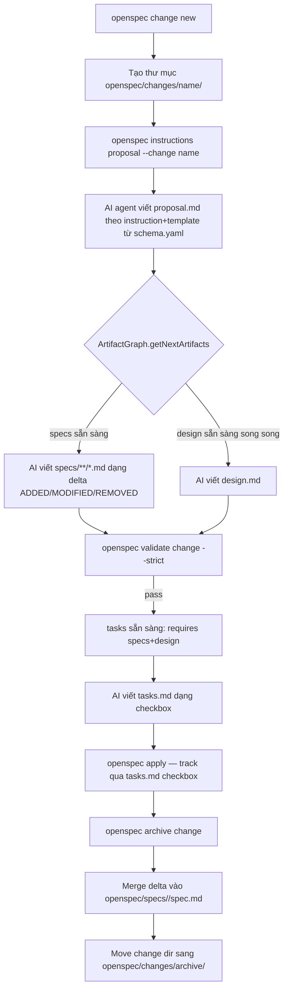

# Báo Cáo Phân Tích — OpenSpec

## Tổng Quan
CLI mã nguồn mở (`@fission-ai/openspec`, npm) triển khai quy trình "spec-driven development" cho AI coding agents — tách "specs" (nguồn sự thật hiện tại) khỏi "changes" (đề xuất thay đổi dạng delta), với một artifact-dependency graph (proposal → specs/design → tasks) điều phối thứ tự tạo tài liệu và validate chúng bằng Zod schema + parser Markdown riêng.
Stack: TypeScript (Node ≥20, ESM), Commander.js cho CLI, Zod v4 cho schema, Vitest cho test (~24k dòng test / ~32k dòng src). Không có backend/DB — toàn bộ state nằm trên filesystem (`openspec/` trong repo của người dùng).
Quy mô: ~32.400 dòng `src/`, hỗ trợ sinh slash-command cho hơn 20 AI tool khác nhau (Claude Code, Cursor, Windsurf, Codex, Cline, Gemini CLI…) qua adapter pattern. Rất trưởng thành: versioning bằng Changesets, CI Nix, telemetry PostHog opt-out.

## Tính Năng Nổi Bật (Best Features)
1. **Artifact Dependency Graph (DAG) khai báo bằng YAML, không phải code**: `schemas/spec-driven/schema.yaml` định nghĩa 4 artifact (`proposal`, `specs`, `design`, `tasks`) với `requires: []` (dependency list) và `generates:` (glob output). `ArtifactGraph` (`src/core/artifact-graph/graph.ts:8-167`) build order bằng Kahn's algorithm (topological sort, `getBuildOrder()` dòng 72-113), tính "next ready artifacts" (`getNextArtifacts()`, dòng 118-134) và "blocked" (`getBlocked()`, dòng 151-166) — hoàn toàn generic, có thể định nghĩa schema khác (vd bớt `design` cho thay đổi nhỏ) mà không sửa code lõi.
2. **Filesystem-là-state-machine**: Không có DB hay JSON trạng thái riêng — `detectCompleted()` (`src/core/artifact-graph/state.ts:14-29`) chỉ đơn giản kiểm tra file output (`artifact.generates`, hỗ trợ cả glob) có tồn tại trên đĩa hay không để suy ra artifact đã "complete". Trạng thái luôn nhất quán với thực tế, không bao giờ "desync" giữa DB và file.
3. **Delta-based Spec Editing (brownfield-first)**: Thay vì viết lại toàn bộ spec, mỗi change chỉ khai báo phần thay đổi qua 4 operation: `## ADDED/MODIFIED/REMOVED/RENAMED Requirements` (`schemas/spec-driven/schema.yaml:41-79`, parser tại `src/core/parsers/requirement-blocks.ts`). Khi `archive` change, deltas được merge vào `openspec/specs/<capability>/spec.md` — spec chính luôn phản ánh "hệ thống hiện tại hoạt động ra sao", tách bạch khỏi "đề xuất đang review" (`docs/concepts.md:29-46`).
4. **Validator 2 tầng (Zod schema + rule-based content check)**: `Validator` (`src/core/validation/validator.ts:22-543`) trước tiên parse Markdown → object rồi `SpecSchema.safeParse`/`ChangeSchema.safeParse` (structural), sau đó áp thêm rule ngữ nghĩa không biểu diễn được bằng Zod thuần (bắt buộc SHALL/MUST trong requirement, tối thiểu 1 scenario, phát hiện trùng tên requirement giữa ADDED/MODIFIED/REMOVED, sai định dạng heading `#### Scenario:` — dòng 341-543). Lỗi được "enrich" với hướng dẫn sửa cụ thể (`enrichTopLevelError`, dòng 441-453) thay vì chỉ báo lỗi Zod khô khan.
5. **Multi-tool Command Generation qua Adapter Pattern**: `src/core/command-generation/adapters/` có 20+ adapter (claude.ts, cursor.ts, codex.ts, windsurf.ts...) implement chung interface `ToolCommandAdapter` (`getFilePath`, `formatFile`). `generateCommand()` (`src/core/command-generation/generator.ts:15-23`) sinh slash-command file đúng format cho từng tool từ 1 `CommandContent` tool-agnostic — một nguồn nội dung, N định dạng đích.

## Áp Dụng Cho Auto Code OS (Applied Takeaways — ranked)
1. **Tách "specs sống" (living source of truth) khỏi "task snapshot"** — What: OpenSpec giữ `openspec/specs/<capability>/spec.md` là spec hiện tại của hệ thống, còn mỗi `openspec/changes/<name>/specs/<capability>/spec.md` chỉ chứa delta (ADDED/MODIFIED/REMOVED). Khi archive, delta merge vào spec chính (`src/core/specs-apply.ts`, `src/core/archive.ts`). Auto Code OS hiện có `docs/openspecs/<task>/specs.md` phẳng, mỗi task tự chứa toàn bộ đặc tả, không có nơi tổng hợp "trạng thái hệ thống hiện tại" theo capability. Apply: thêm `docs/openspecs/_specs/<capability>/spec.md` làm nguồn sự thật, và khi 1 task hoàn tất (đổi trạng thái `done` trong `server/internal/orchestrator`), chạy 1 bước "archive" merge phần spec liên quan — có thể triển khai như 1 tool trong `server/internal/tool/` gọi bởi orchestrator ở bước cuối DAG. Impact: H · Effort: H · Risk: M · Est: 1-2 tuần.
2. **Artifact Dependency Graph khai báo YAML thay vì hard-code thứ tự phase** — What: `schema.yaml` với `requires: []` + Kahn's algorithm quyết định artifact nào sẵn sàng tạo tiếp theo (`ArtifactGraph.getNextArtifacts`). Auto Code OS's orchestrator DAG (`server/internal/orchestrator/`) hiện định nghĩa các bước (context_loading, analyzing, coding...) trong Go code. Apply: tách một YAML/JSON config tương tự cho các "planning artifact" (proposal.md → specs.md/design.md → tasks.md) trong `server/internal/orchestrator/`, cho phép override per-project (vd bỏ design.md cho task nhỏ) mà không sửa code Go — map tới cơ chế "task complexity" đã có. Impact: M · Effort: M · Risk: L · Est: 3-4 ngày.
3. **Validator 2 tầng (schema + rule ngữ nghĩa) với thông báo lỗi có hướng dẫn sửa** — What: Zod structural check + rule bổ sung (SHALL/MUST enforcement, scenario count, duplicate detection) + `enrichTopLevelError` gắn gợi ý sửa cụ thể vào message lỗi (`validator.ts:441-453`). Apply: khi orchestrator hoặc reviewer-agent validate `docs/openspecs/<task>/specs.md`/`tasks.md` trước khi cho phép code, dùng cùng pattern 2 tầng: parse checkbox `tasks.md` bằng regex tương tự `TASK_PATTERN` (`src/utils/task-progress.ts:7-27`) để tính % tiến độ hiển thị trên `web/src/app/projects/[id]/tasks/[taskID]/components/ExecutionPanel.tsx`, thay vì chỉ đọc text tự do. Impact: M · Effort: L · Risk: L · Est: 1-2 ngày.
4. **Command/Prompt Adapter Pattern cho multi-tool** — What: 1 nội dung tool-agnostic (`CommandContent`) → N adapter sinh output cho từng AI tool (`src/core/command-generation/adapters/*.ts`). Apply: `server/internal/prompts/` của Auto Code OS hiện sinh Go template cho 1 provider LLM; nếu roadmap có multi-agent-tool export (vd sinh Claude Code slash-command hoặc Cursor rules từ cùng 1 task template), áp dụng adapter interface tương tự thay vì nhân bản logic sinh prompt. Impact: L · Effort: M · Risk: L · Est: 2-3 ngày (chỉ khi có nhu cầu multi-tool thực sự).
5. **Filesystem-is-state cho completion tracking** — What: `detectCompleted()` suy completion từ sự tồn tại file thay vì cờ DB riêng (`state.ts:14-29`), tránh desync. Apply: với các checkpoint nhẹ trong `server/internal/orchestrator/gitops/` (vd đã tạo PR draft, đã ghi log file), cân nhắc kiểm tra trực tiếp trạng thái Git/filesystem thay vì thêm cột DB mới khi 2 nguồn có thể lệch nhau — chỉ áp dụng cho state derive được, KHÔNG áp dụng cho task status chính (Postgres vẫn nên là source of truth transactional). Impact: L · Effort: L · Risk: M (dễ nhầm lẫn nguồn sự thật) · Est: 0.5 ngày/case.

## Kiến Trúc (Architecture)
- **Layered CLI**: `src/cli/index.ts` (Commander.js, 589 dòng) đăng ký command → `src/commands/*.ts` (thin controller, parse flags) → `src/core/*.ts` (business logic, pure/testable) → `src/core/parsers/*` + `src/core/schemas/*` (Markdown ⇄ object ⇄ Zod validate). Không có network/DB layer — toàn bộ I/O là filesystem (`node:fs`).
- **Dependency direction**: `commands/` → `core/` → `parsers/` + `schemas/` + `artifact-graph/`. `artifact-graph/` không phụ thuộc ngược vào `commands/`, đúng nguyên tắc core không biết UI. `utils/` là leaf layer (file-system, id, match) được cả `core` và `commands` dùng.
- **Config-as-code cho workflow**: Toàn bộ vòng đời "phase nào sinh ra file gì, phụ thuộc gì" nằm trong `schemas/spec-driven/schema.yaml`, không hard-code trong TypeScript — cho phép người dùng tự định nghĩa schema khác trong `openspec/config.yaml` (`resolveSchema`, `src/core/artifact-graph/resolver.ts`).
- **Multi-store/multi-root (opsx)**: `src/core/store/` + `src/core/root-selection.ts` cho phép 1 project tham chiếu "store" bên ngoài (context-store) — mở rộng từ "1 repo = 1 openspec/" sang có thể chia sẻ specs giữa nhiều repo. Đây là phần mới, đang phát triển mạnh (nhiều thư mục `openspec/changes/` liên quan workspace/store).

```mermaid
flowchart LR
    CLI[src/cli/index.ts] --> CMD[src/commands/*]
    CMD --> CORE[src/core/*]
    CORE --> AG[artifact-graph/ graph.ts + schema.ts + state.ts]
    CORE --> VAL[validation/validator.ts]
    CORE --> PAR[parsers/ markdown-parser, change-parser, requirement-blocks]
    VAL --> SCHEMAS[schemas/ spec.schema.ts + change.schema.ts (Zod)]
    AG --> YAML[schemas/spec-driven/schema.yaml]
    CORE --> CGEN[command-generation/adapters/*.ts]
    CORE --> FS[(openspec/ trên filesystem người dùng)]
```
Confidence: High — xác nhận qua đọc trực tiếp `src/cli/index.ts`, `src/core/artifact-graph/*.ts`, `src/core/validation/validator.ts`, cấu trúc import.

### ADR Suy Luận (Inferred ADRs)
| Quyết Định | Bằng Chứng | Lợi Ích | Đánh Đổi | Confidence |
|---|---|---|---|---|
| Filesystem là source of truth, không DB | `src/core/artifact-graph/state.ts` chỉ dùng `fs.existsSync`; không có SQLite/JSON state file nào trong `src/core` | Zero setup, dễ diff/review trong Git, không lo desync state-vs-file | Không query được lịch sử/thống kê nhanh; phải scan filesystem mỗi lần | High |
| Workflow graph định nghĩa bằng YAML, không code | `schemas/spec-driven/schema.yaml` + `ArtifactGraph.fromYaml/fromSchema` (`graph.ts:20-38`) | Người dùng tự custom pipeline (bớt/thêm artifact) không sửa TypeScript | Cần validate schema.yaml runtime (Zod) — thêm 1 tầng lỗi có thể xảy ra | High |
| Delta spec thay vì full rewrite | 4 operation ADDED/MODIFIED/REMOVED/RENAMED trong `schema.yaml:41-79`, parser `requirement-blocks.ts` | Review diff nhỏ, rõ ràng; giữ lịch sử lý do thay đổi (`**Reason**`/`**Migration**`) | Cú pháp phức tạp hơn Markdown thường, dễ sai heading (`####` vs `###`) — validator phải bù bằng cảnh báo `INFO` cho header lệch (`validator.ts:150-160`) | High |
| Adapter pattern cho 20+ AI tool | `src/core/command-generation/adapters/*.ts` cùng interface `ToolCommandAdapter` | Thêm tool mới chỉ cần 1 adapter file, không đụng logic core | Diện tích bảo trì lớn khi từng tool đổi định dạng slash-command | High |

## Luồng Chính (Main Flow)


## Design Patterns & Chất Lượng Code
- **Strategy/Adapter Pattern**: `ToolCommandAdapter` cho 20+ AI tool (`src/core/command-generation/adapters/`), `Validator` tách `applySpecRules`/`applyChangeRules` theo loại tài liệu.
- **Builder qua static factory**: `ArtifactGraph.fromYaml/fromYamlContent/fromSchema` (`graph.ts:20-38`) — 3 điểm vào khác nhau nhưng cùng constructor private, đảm bảo luôn qua validate.
- **Explicit Error Types**: `TemplateLoadError` (`instruction-loader.ts:28-36`), `ArchiveBlockedError` (`archive.ts:74-87`) — lỗi domain-specific có `diagnostic` object có cấu trúc (`code`, `message`, `fix`) thay vì string chung chung, rất hợp để build UI/JSON output máy đọc được.
- **Comment-as-documentation kỷ luật cao**: Rất nhiều comment giải thích "tại sao" gắn số issue GitHub (`#1182b`, `#1202`, `#1280`, `#1156` trong `validator.ts`, `task-progress.ts`) — cho thấy codebase theo dõi rất sát bug thực tế đã sửa, comment không mô tả "cái gì" mà mô tả lý do quyết định.
- **Naming nhất quán**: `*.schema.ts` (Zod), `*-parser.ts`, `*.ts` cho core logic thuần, tách rõ types (`types.ts`) khỏi implementation.
- **Nhược điểm**: một số file lớn (`schema.ts` command 1005 dòng, `store/operations.ts` 1229 dòng) — dấu hiệu God File cần tách thêm khi feature "store/opsx" tiếp tục phình to.

## Kỹ Thuật Thú Vị & Thực Hành Kỹ Thuật
- **Testing**: ~24.000 dòng test (`test/`) so với ~32.400 dòng src — tỷ lệ test/code rất cao (~74%), dùng Vitest, test cả unit (parser, validator) lẫn integration CLI.
- **Structured JSON output cho mọi command**: hầu hết command hỗ trợ `--json` (`shared-output.ts`, `asStatus`) để agent AI có thể parse kết quả máy-đọc-được thay vì chỉ đọc text console — quan trọng khi CLI được driven bởi AI agent chứ không phải người.
- **Config layering**: `project-config.ts` (462 dòng) đọc `openspec/config.yaml` + validate rules (`validateConfigRules`) — cho phép agent-specific context/rules chèn vào instruction mà không lẫn vào output cuối (trường `context`/`rules` trong `ArtifactInstructions`, `instruction-loader.ts:89-92`, có ghi chú rõ "not to be included in output").
- **Graceful degradation**: nhiều nơi dùng `try/catch` trả về giá trị mặc định an toàn thay vì throw (`resolveTrackedTasksGlob` trong `task-progress.ts:50-58`, `countSingleTopLevelTasksFile` dòng 60-68) — ưu tiên "never crash CLI khi thiếu file" hơn strict-fail.
- **Telemetry opt-out rõ ràng**: `src/telemetry/` dùng PostHog nhưng có `maybeShowTelemetryNotice` — tôn trọng người dùng, thông báo minh bạch trước khi gửi.

## Engineering Gems
1. `src/core/artifact-graph/graph.ts:72-113` (`getBuildOrder`) — Vấn đề: cần thứ tự tạo tài liệu tôn trọng dependency (`tasks` cần cả `specs` và `design`). Cách làm phổ biến (yếu hơn): hard-code thứ tự if/else theo tên artifact. Vì sao elegant: cài Kahn's algorithm chuẩn (in-degree + queue), sort tại mỗi bước để đảm bảo **determinism** (không phụ thuộc thứ tự Map iteration) — chi tiết dễ bị bỏ quên nhưng cực kỳ quan trọng cho test snapshot ổn định. Đánh đổi: O(V+E) mỗi lần gọi thay vì cache, chấp nhận được vì graph rất nhỏ (~4-10 artifact). Bài học rút ra: khi build dependency resolver, luôn sort các tập "ready" để kết quả deterministic, không chỉ đúng.
2. `src/core/validation/validator.ts:522-528` (`buildMissingShallOrMustMessage`) — Vấn đề: lỗi "phải chứa SHALL/MUST" gây bối rối khi từ khóa đã xuất hiện ở header requirement (`### Requirement: The system SHALL...`) nhưng lại thiếu ở phần thân. Cách làm phổ biến (yếu hơn): trả 1 message tĩnh chung cho mọi trường hợp thiếu SHALL/MUST. Vì sao elegant: hàm kiểm tra keyword có nằm trong header không rồi build message khác nhau, chỉ đúng người dùng cần sửa dòng nào. Đánh đổi: thêm nhánh logic, nhưng đổi lại giảm hẳn thời gian debug cho AI agent tự sửa lỗi validate. Bài học rút ra: thông báo lỗi cho AI agent (không phải chỉ cho người) nên trỏ thẳng vào vị trí sửa, không chỉ mô tả rule bị vi phạm.
3. `src/utils/task-progress.ts:36-58` (`findTrackedTasksArtifact` + `resolveTrackedTasksGlob`) — Vấn đề: cần đếm % hoàn thành task nhưng schema.yaml có thể định nghĩa file tracks khác `tasks.md` (custom schema) hoặc nested `specs/<area>/tasks.md`. Cách làm phổ biến (yếu hơn): hard-code đường dẫn `tasks.md`. Vì sao elegant: resolve động artifact nào được `apply.tracks` trỏ tới, dùng đúng glob resolver (`resolveArtifactOutputs`) mà `openspec status` cũng dùng — 1 nguồn logic cho cả 2 command, và luôn có fallback an toàn không bao giờ throw. Đánh đổi: nhiều lớp gián tiếp (resolve schema → resolve artifact → resolve glob) cho 1 việc tưởng đơn giản là "đếm checkbox". Bài học rút ra: khi behavior phụ thuộc config có thể tùy biến, đừng hard-code file path mặc định — nhưng luôn giữ fallback rõ ràng để không phá tính năng cũ.

## Top 10 Điều Đáng Học
| # | Khái Niệm | File | Vì Sao Hữu Ích | Độ Khó | Thứ Tự |
|---|---|---|---|---|---|
| 1 | Artifact Dependency Graph (Kahn's algorithm) | `src/core/artifact-graph/graph.ts` | Mẫu tổng quát cho mọi pipeline "tài liệu A cần B trước" | ⭐⭐⭐ | 1 |
| 2 | Schema-as-YAML cho workflow | `schemas/spec-driven/schema.yaml` | Tách cấu hình quy trình khỏi code, dễ tùy biến per-project | ⭐⭐ | 2 |
| 3 | Delta Spec Format (ADDED/MODIFIED/REMOVED/RENAMED) | `src/core/parsers/requirement-blocks.ts` | Cách review "thay đổi hành vi hệ thống" nhỏ gọn, có audit trail | ⭐⭐⭐⭐ | 3 |
| 4 | Validator 2 tầng (Zod + rule ngữ nghĩa) | `src/core/validation/validator.ts` | Kết hợp structural + semantic validation, message hướng dẫn sửa | ⭐⭐⭐ | 4 |
| 5 | Filesystem-derived completion state | `src/core/artifact-graph/state.ts` | Tránh desync state, đơn giản hóa mô hình dữ liệu | ⭐⭐ | 5 |
| 6 | Adapter Pattern cho 20+ AI tool | `src/core/command-generation/adapters/` | Case study thực tế mở rộng "1 nguồn → N định dạng" | ⭐⭐⭐ | 6 |
| 7 | Archive = merge delta vào spec chính | `src/core/archive.ts`, `src/core/specs-apply.ts` | Mô hình "living spec" tách biệt "proposal đang review" | ⭐⭐⭐⭐ | 7 |
| 8 | Structured `--json` cho mọi command | `src/commands/shared-output.ts` | CLI thiết kế để agent AI (không phải người) tiêu thụ output | ⭐⭐ | 8 |
| 9 | Task progress qua regex checkbox | `src/utils/task-progress.ts` | Cách nhẹ để track % tiến độ implementation không cần DB | ⭐ | 9 |
| 10 | Config context/rules tách khỏi output | `src/core/artifact-graph/instruction-loader.ts` | Bơm ngữ cảnh riêng cho AI mà không rò rỉ vào tài liệu cuối | ⭐⭐⭐ | 10 |

## Hướng Dẫn Đọc (Reading Guide)
**L0 Build & Run:** `package.json` (`pnpm build`, `pnpm test`), `bin/openspec.js`.
**L1 Entry Points:** `src/cli/index.ts` (đăng ký toàn bộ command Commander.js).
**L2 Core Abstractions:** `src/core/artifact-graph/{types,graph,schema,state}.ts`, `src/core/schemas/{spec,change}.schema.ts`.
**L3 Architecture Glue:** `src/core/artifact-graph/instruction-loader.ts` (ghép graph + state + config thành instruction cho AI), `src/core/archive.ts` (merge delta → spec chính).
**L4 Engineering Gems:** `src/core/validation/validator.ts`, `src/utils/task-progress.ts`, `src/core/parsers/requirement-blocks.ts`.
**L5 Reimplement:** thử viết lại `ArtifactGraph` (Kahn's algorithm) và validator 2 tầng bằng Go cho `server/internal/orchestrator/`.

## Anti-Patterns & Không Nên Copy
1. **Cú pháp delta-spec dễ sai (heading `####` vs `###`, tên phải khớp tuyệt đối)**: Nhiều comment trong `validator.ts` (`#1182b`, `#1280`) tồn tại chỉ để vá các lỗi parse do người dùng gõ sai heading level — chứng tỏ format quá "fragile" với con người/AI viết tay. Với Auto Code OS, nếu áp dụng delta spec, nên ưu tiên format JSON/YAML có schema strict hơn Markdown tự do, hoặc validate ngay tại thời điểm AI generate (trong prompt template) thay vì chỉ validate sau khi ghi file.
2. **File lớn dần theo tính năng "opsx/store"**: `src/commands/store.ts` (799 dòng), `src/core/store/operations.ts` (1229 dòng) — tính năng multi-root/multi-store mới được thêm nhưng chưa refactor tách nhỏ, dấu hiệu feature creep. Auto Code OS nên tách domain sớm hơn (package riêng trong `server/internal/`) khi 1 feature vượt ~500 dòng thay vì để phình trong 1 file.
3. **Không có backend/DB nghĩa là không có concurrency control thực sự**: Vì state là filesystem, 2 agent cùng sửa 1 `openspec/changes/<name>/` cùng lúc có thể conflict âm thầm (last-write-wins). Auto Code OS có Postgres nên giữ nguyên transactional state cho task chính; chỉ nên học ý tưởng "derive state từ filesystem" cho phần phụ trợ, không áp dụng cho core task lifecycle.

## Câu Hỏi Đáng Suy Ngẫm
1. Auto Code OS có nên tách rõ "spec sống của hệ thống" (theo capability/module) khỏi "snapshot task" như OpenSpec, hay giữ mô hình 1-task-1-bộ-tài-liệu hiện tại đã đủ vì đơn vị làm việc là task chứ không phải capability dài hạn?
2. Nếu áp dụng delta-spec, format nào chịu được AI-generated content tốt hơn Markdown heading tự do — JSON có schema, hay Markdown nhưng validate ngay trong vòng lặp sinh code trước khi ghi file?
3. Việc dùng filesystem làm state có phù hợp với Auto Code OS (vốn đã có Postgres + orchestrator DAG chạy song song nhiều task) hay sẽ tạo thêm 1 nguồn sự thật thứ hai cần đồng bộ?

## Đánh Giá Tổng Thể
| Architecture | Maintainability | Scalability | Clean Code | Learning Value |
|---|---|---|---|---|
| 8/10 | 7/10 | 6/10 | 8/10 | 9/10 |

## Lộ Trình Học Tập
- **Tuần 1**: Đọc `docs/concepts.md`, `docs/writing-specs.md`, `docs/workflows.md` để nắm triết lý specs-vs-changes; chạy thử CLI (`openspec init`, `openspec change new`) trên 1 repo nhỏ để cảm nhận vòng đời thực tế.
- **Tuần 2**: Đọc kỹ `src/core/artifact-graph/*.ts` (graph, schema, state, instruction-loader) và `schemas/spec-driven/schema.yaml` — hiểu cách 1 YAML điều khiển toàn bộ pipeline tài liệu.
- **Tuần 3**: Đọc `src/core/validation/validator.ts` + `src/core/parsers/requirement-blocks.ts` — hiểu cách validate 2 tầng và parser delta-spec; đối chiếu với `src/core/archive.ts`/`specs-apply.ts` để thấy vòng khép kín merge.
- **Tuần 4**: Thử reimplement bản rút gọn của `ArtifactGraph` (Kahn's algorithm) bằng Go trong 1 package thử nghiệm, áp cho `server/internal/orchestrator/` — kiểm chứng ý tưởng "workflow graph khai báo YAML" có khả thi cho Auto Code OS hay không trước khi đưa vào production.
