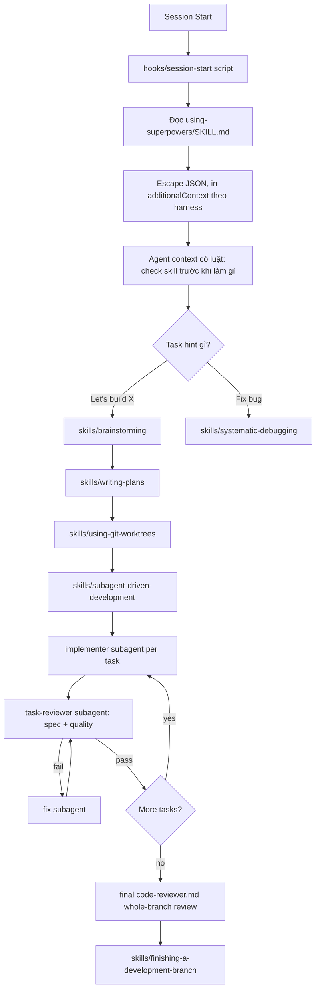
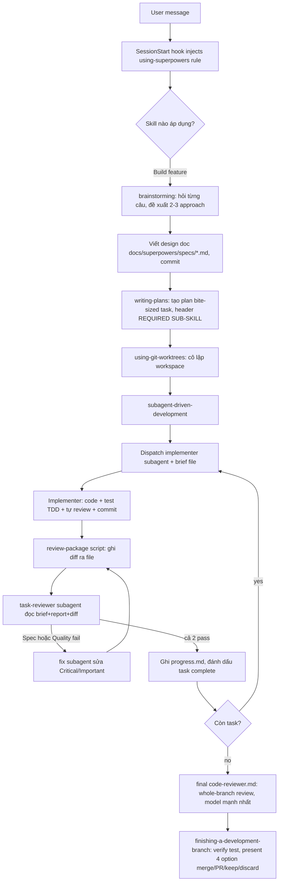

# Báo Cáo Phân Tích — Superpowers

## Tổng Quan
Superpowers không phải một ứng dụng chạy được — nó là một **plugin methodology** cho coding agent (Claude Code, Antigravity, Codex, Cursor, Kimi, OpenCode, Pi...), đóng gói toàn bộ quy trình phát triển phần mềm (brainstorm → spec → plan → subagent-driven implementation → review → merge) thành 14 file `SKILL.md` composable, tự động kích hoạt qua một session-start hook. Zero-dependency, 100% markdown + vài script bash tiện ích (`task-brief`, `review-package`). Repo ~7.8MB, 628 commit, rất trưởng thành (v6.1.1), kỷ luật cực cao với quy trình đóng góp (94% PR bị từ chối — xem `CLAUDE.md`).

## Tính Năng Nổi Bật (Best Features)

1. **Session-Start Hook Injection (bootstrap bắt buộc)**: `hooks/session-start` là một shell script polyglot (chạy được cả trên bash lẫn được `hooks/run-hook.cmd` bọc cho Windows) được đăng ký trong `hooks/hooks.json` (event `SessionStart`, matcher `startup|clear|compact`). Nó đọc toàn bộ nội dung `skills/using-superpowers/SKILL.md`, escape thành JSON, rồi in ra `hookSpecificOutput.additionalContext` (định dạng khác nhau tùy harness: Cursor dùng `additional_context`, Claude Code dùng `hookSpecificOutput.additionalContext`, Copilot CLI dùng `additionalContext` top-level — xem 3 nhánh `if` ở dòng 38-46). Kết quả: mọi phiên mới đều được "tiêm" luật "kiểm tra skill trước khi làm bất cứ điều gì" vào system context ngay từ đầu, không phụ thuộc agent có tự đọc file hay không.
2. **Skill Priming (`using-superpowers` là skill duy nhất luôn load)**: `skills/using-superpowers/SKILL.md` là skill "gốc" duy nhất được nạp cứng qua hook; mọi skill khác (13 skill còn lại) chỉ được nạp on-demand qua tool `Skill`. Nó dùng khối `<EXTREMELY-IMPORTANT>` + bảng "Red Flags" (12 dòng liệt kê chính xác các câu tự biện minh: "This is just a simple question", "I need more context first"...) để chặn agent bỏ qua bước tra skill. Đây là kỹ thuật "prompt injection có kỷ luật" chống lại xu hướng agent nhảy thẳng vào code.
3. **Subagent-Driven Development Loop**: `skills/subagent-driven-development/SKILL.md` định nghĩa vòng lặp Implementer → Task Reviewer (2 verdict: spec compliance + code quality) → Fix subagent → re-review, lặp cho từng task độc lập trong plan, kết thúc bằng 1 broad whole-branch review. Có `scripts/task-brief` (trích 1 task từ file plan ra file riêng bằng `awk`, tránh paste toàn bộ plan vào context subagent) và `scripts/review-package` (dùng `git diff -U10 BASE..HEAD` ghi ra file duy nhất, base là commit ghi lại trước khi dispatch — không dùng `HEAD~1` vì sẽ cắt mất các task nhiều commit). Model Selection section quy định rõ: cheap model cho task cơ học, standard cho integration, capable nhất cho architecture/final-review — tránh lãng phí token.
4. **Durable Progress Ledger chống mất tiến độ khi compact**: file `.superpowers/sdd/progress.md` ghi từng task hoàn thành (`Task N: complete (commits <base7>..<head7>, review clean)`). Sau compaction, agent được lệnh tin ledger + `git log` hơn là trí nhớ hội thoại — giải quyết đúng lỗi thực tế "controller mất chỗ, dispatch lại toàn bộ chuỗi task đã xong" (skill ghi nhận đây là "single most expensive failure observed").
5. **Discipline skills chống rationalization (systematic-debugging, verification-before-completion)**: cả hai đều theo cấu trúc "Iron Law" tuyệt đối (`NO FIXES WITHOUT ROOT CAUSE INVESTIGATION FIRST`, `NO COMPLETION CLAIMS WITHOUT FRESH VERIFICATION EVIDENCE`) + bảng "Common Rationalizations" (excuse ↔ reality) + "Red Flags" liệt kê nguyên văn suy nghĩ nguy hiểm. Đây là kỹ thuật hành vi học được kiểm chứng bằng eval (xem `skills/writing-skills/SKILL.md` — toàn bộ methodology viết skill chính là TDD áp dụng cho tài liệu: RED = baseline agent vi phạm, GREEN = skill khiến agent tuân thủ, REFACTOR = vá lỗ hổng rationalization mới).

## Áp Dụng Cho Auto Code OS (Applied Takeaways — ranked)

1. **Composable Skill Library cho prompt steps** — What: Superpowers tách hành vi thành các file `SKILL.md` độc lập, có `description` là điều kiện kích hoạt (không phải tóm tắt quy trình — tránh agent "đọc description rồi bỏ qua nội dung", bài học ghi rõ ở `skills/writing-skills/SKILL.md` dòng 150-172), nạp on-demand qua tool riêng thay vì nhồi hết vào system prompt. Apply: Auto Code OS đã có `server/internal/prompts/roles/{coder,reviewer,qa,planner,docs}.md` và `server/internal/prompts/steps/{analyze,plan,review,fix_review,fix_test,test,...}.md` nhưng chúng là template tĩnh compile 1 lần (`server/internal/prompts/compiler.go`, `assembler.go`). Có thể thêm 1 lớp "skill injection" — ví dụ khi step `fix_review`/`fix_test` chạy, chèn thêm khối nội dung tương đương `systematic-debugging` (root-cause trước khi fix) vào prompt được `assembler.go` build, thay vì để LLM tự quyết. Impact: H · Effort: M · Risk: L · Est: 3-4 ngày.
2. **Task Reviewer với 2 verdict tách biệt (spec compliance + code quality)** — What: `skills/subagent-driven-development/task-reviewer-prompt.md` buộc reviewer trả về CẢ 2 verdict riêng (✅/❌ spec, Approved/Needs fixes quality), không cho gộp làm một, và cấm gợi ý "đừng flag X" trong dispatch prompt (tránh pre-judge). Apply: `server/internal/prompts/steps/review.md` hiện chỉ có 1 khối review chung. Sửa để review step sinh JSON/markdown có 2 trường tách biệt `spec_compliance` và `code_quality`, orchestrator (`server/internal/orchestrator/orchestrator.go`, `step_registry.go`) route riêng: spec fail → quay lại `fix_review` step; quality fail (Critical/Important) → cũng fix nhưng log riêng để dashboard phân biệt loại lỗi. Impact: H · Effort: M · Risk: L · Est: 2-3 ngày.
3. **Durable progress ledger cho DAG recovery** — What: `.superpowers/sdd/progress.md` là single source-of-truth cho task đã xong, đọc lại sau mỗi compact/resume thay vì tin bộ nhớ hội thoại. Apply: Auto Code OS đã có `server/internal/orchestrator/checkpoint/checkpoint.go` + `recovery.go` cho phục hồi orchestrator process crash — nhưng chưa chắc có cơ chế tương tự ở tầng "đã review xong hay chưa" khi 1 sub-step gọi LLM lặp lại (fix_review loop). Thêm 1 bảng nhỏ hoặc trường trong checkpoint ghi `last_reviewed_commit`/`review_verdict` theo từng attempt, để `recovery.go` không dispatch lại LLM step đã pass review khi resume sau crash. Impact: M · Effort: S-M · Risk: L · Est: 1-2 ngày.
4. **Diff-as-file thay vì diff-in-context cho review step** — What: `scripts/review-package` ghi `git diff -U10 BASE..HEAD` ra 1 file duy nhất reviewer đọc 1 lần, tránh diff lớn tràn context của controller. Apply: `server/internal/orchestrator/gitops/` và `server/internal/orchestrator/patch` đã thao tác diff/patch; khi build prompt cho step `review`/`fix_review` (`server/internal/prompts/steps/review.md`), nên ghi diff ra artifact file (đã có PR diff artifact storage theo commit gần nhất "Task 1.2") và trỏ prompt tới path đó thay vì nhúng toàn bộ diff string vào prompt template — giảm token đáng kể cho task lớn. Impact: M · Effort: S · Risk: L · Est: 1 ngày (một phần đã có sẵn hạ tầng artifact).
5. **Model tiering theo độ khó task (cheap/standard/capable)** — What: `SKILL.md` của subagent-driven-development quy định rõ ràng khi nào dùng model rẻ (mechanical, 1-2 file, spec đầy đủ) vs model mạnh nhất (architecture, final review) — và nhấn mạnh "omitted model silently inherits the most expensive one". Apply: `server/pkg/llm/` (multi-provider LLM gateway) và `server/internal/orchestrator/llmrunner`/`llm_step.go` nên có policy tương tự: step `analyze`/`plan` dùng model mạnh, step `code_backend`/`code_frontend` cơ học dùng model rẻ hơn nếu task nhỏ (dựa trên số file/diff size ước tính), step `review` dùng model theo risk. Impact: M · Effort: M · Risk: M (cần benchmark chất lượng) · Est: 3-5 ngày.

## Kiến Trúc (Architecture)

Superpowers không có runtime process — kiến trúc của nó là **content-addressable behavior injection**: 1 hook nhỏ ở biên (session start) nạp 1 "bootstrap skill", bootstrap skill đó ra lệnh cho agent tự tra cứu các skill khác qua tool `Skill` khi cần (lazy-load, tránh nhồi hết 14 skill vào context). Các skill tham chiếu chéo nhau bằng convention `superpowers:<skill-name>` (không dùng `@file` để tránh force-load — ghi rõ trong `writing-skills/SKILL.md` dòng 286-288). Dependency direction là **một chiều từ hook → skill gốc → skill khác**, không có state runtime ngoài file trên đĩa (`.superpowers/sdd/*` cho ledger, git commit cho lịch sử).


Confidence: High — toàn bộ luồng suy ra trực tiếp từ nội dung SKILL.md, không cần suy đoán runtime vì không có runtime.

### ADR Suy Luận (Inferred ADRs)
| Quyết Định | Bằng Chứng | Lợi Ích | Đánh Đổi | Confidence |
|---|---|---|---|---|
| Zero-dependency, pure markdown + bash | `AGENTS.md`: "Superpowers is a zero-dependency plugin by design"; `.claude-plugin/plugin.json` không khai báo runtime deps | Portable trên mọi harness (Claude Code, Codex, Cursor, Kimi...), không cần cài đặt | Không tận dụng được structured tooling (JSON schema validation, type-safety) cho skill content | High |
| Session-start hook thay vì tin agent tự đọc README | `hooks/hooks.json` matcher `startup\|clear\|compact`; `AGENTS.md` mục "New Harness Support": "Without it, the skills are dead weight" | Đảm bảo skill LUÔN active, không phụ thuộc agent random đọc file | Phải maintain polyglot script cho từng harness JSON schema khác nhau (`hooks/session-start` dòng 38-46) | High |
| Description field KHÔNG tóm tắt workflow | `writing-skills/SKILL.md` dòng 150-172, dẫn chứng test thực tế agent bỏ qua flowchart 2-review khi description tóm tắt sai | Buộc agent đọc full skill body thay vì đoán từ description | Description khó viết hơn, dễ bị PR "compliance" muốn sửa lại (bị cấm rõ trong `AGENTS.md`) | High |
| Fresh subagent/task, không dispatch song song trong SDD | `subagent-driven-development/SKILL.md` Red Flags: "Dispatch multiple implementation subagents in parallel (conflicts)" | Tránh race condition khi nhiều agent sửa cùng codebase | Chậm hơn so với `dispatching-parallel-agents` (chỉ dùng khi task thực sự độc lập) | High |
| Diff/brief handoff qua file, không paste vào prompt | `scripts/task-brief`, `scripts/review-package`, mục "File Handoffs" trong SKILL.md | Giữ context controller sạch, review 1 lần đọc trọn | Cần filesystem chung giữa controller và subagent (không hoạt động thuần API-only) | High |

## Luồng Chính (Main Flow)


## Design Patterns & Chất Lượng Code
- **Template Method qua Markdown**: mỗi `SKILL.md` là 1 "template" hành vi có frontmatter YAML (`name`, `description`) bắt buộc + cấu trúc chuẩn (Overview → When to Use → Process → Red Flags → Integration). Tính nhất quán này giúp agent parse mọi skill theo cùng 1 schema tinh thần.
- **Strategy qua flowchart Graphviz nhỏ**: các quyết định rẽ nhánh non-trivial (VD: `subagent-driven-development` vs `executing-plans`) được biểu diễn bằng khối ```dot``` ngắn thay vì văn xuôi — quy tắc rõ ràng trong `writing-skills/SKILL.md`: chỉ dùng flowchart cho quyết định dễ sai, không dùng cho danh sách tuyến tính.
- **Decorator/Composition qua cross-reference `superpowers:<skill>`**: skill không kế thừa nhau bằng include-file mà bằng "REQUIRED SUB-SKILL"/"REQUIRED BACKGROUND" markers, giữ mỗi file độc lập, dễ test riêng lẻ (test bằng subagent pressure-scenario, không phải unit test truyền thống).
- **Ưu điểm**: naming rất nhất quán (gerund: `writing-plans`, `using-git-worktrees`, `dispatching-parallel-agents`), mỗi skill có "Red Flags"/"Common Mistakes" table giúp dễ debug hành vi agent lệch hướng.
- **Nhược điểm**: không có type-safety hay validation tự động cho skill content (chỉ có eval harness ngoài repo `superpowers-evals`), độ tin cậy phụ thuộc hoàn toàn vào khả năng agent đọc và tuân thủ markdown — không có cơ chế "enforce" cứng như code.

## Kỹ Thuật Thú Vị & Thực Hành Kỹ Thuật
- **Testing skill như TDD (RED-GREEN-REFACTOR cho tài liệu)**: `writing-skills/SKILL.md` áp TDD cho *behavior documentation* — chạy pressure scenario với subagent KHÔNG có skill trước (baseline thất bại), viết skill tối thiểu để pass, rồi refactor vá rationalization mới. Có cả "micro-test wording" (5+ rep, no-guidance control) trước khi chạy full pressure test tốn kém — một kỹ thuật A/B-test prompt nghiêm túc hiếm gặp trong OSS.
- **"Match the Form to the Failure" (bảng chọn dạng guidance theo loại lỗi)**: `writing-skills/SKILL.md` mục cùng tên phân loại 4 kiểu lỗi baseline (skip rule dưới áp lực / đúng nội dung sai hình dạng / thiếu field / phụ thuộc điều kiện) và map mỗi loại sang 1 dạng văn bản đúng (prohibition+rationalization table / positive recipe / structural required field / conditional). Có cả bằng chứng thực nghiệm: "prohibition arm trended worse than no-guidance control" cho lỗi loại "wrong shape".
- **Error taxonomy cho review findings (Critical/Important/Minor) + nhãn "plan-mandated"**: khi 1 finding mâu thuẫn với yêu cầu tường minh trong plan, reviewer buộc phải báo cáo là Important, gắn nhãn `plan-mandated`, và để con người quyết — không cho phép controller tự dismiss finding vì "plan đã chọn vậy". Đây là separation of concerns nghiêm ngặt giữa "reviewer đánh giá code" và "human đánh giá plan".
- **Cross-platform polyglot script**: `hooks/run-hook.cmd` là 1 file vừa hợp lệ với `cmd.exe` (đọc phần trước `: << 'CMDBLOCK'`) vừa hợp lệ với bash (dấu `:` là no-op) — 1 file, không cần build step, chạy được Windows lẫn Unix.

## Engineering Gems
1. `hooks/session-start` (dòng 38-46) — Vấn đề: các harness khác nhau (Claude Code, Cursor, Copilot CLI) kỳ vọng field JSON khác nhau (`additional_context` vs `hookSpecificOutput.additionalContext` vs `additionalContext`) cho cùng 1 mục đích "tiêm context vào session". Cách làm phổ biến (yếu hơn): viết 1 script riêng mỗi harness, hoặc emit tất cả field cùng lúc. Vì sao elegant: dùng biến môi trường đặc trưng (`CURSOR_PLUGIN_ROOT`, `CLAUDE_PLUGIN_ROOT`, `COPILOT_CLI`) để detect harness tại runtime và chỉ emit đúng 1 field — comment giải thích rõ lý do "Claude Code reads BOTH ... without deduplication, so we must emit only the field the current platform consumes". Đánh đổi: logic if/elif hơi rối, phải maintain khi có harness mới. Bài học rút ra: khi build tool đa nền tảng, phát hiện nền tảng bằng side-effect có sẵn (biến môi trường do chính harness set) rẻ hơn nhiều so với yêu cầu user config thêm.
2. `skills/subagent-driven-development/scripts/task-brief` — Vấn đề: dispatch prompt cho subagent hay bị phình to vì controller paste nguyên văn nhiều đoạn plan. Cách làm phổ biến (yếu hơn): controller tự đọc plan, tự trích đoạn task bằng tay rồi paste vào prompt — tốn context của chính controller vì phải đọc cả file để trích. Vì sao elegant: dùng `awk` với state machine 2 biến (`infence` để bỏ qua code fence, `intask` để bắt đúng heading `Task N`) chạy hoàn toàn ngoài context LLM, chỉ in ra đường dẫn file — controller không cần đọc nội dung plan, subagent tự đọc file brief. Đánh đổi: heading phải theo đúng convention `# Task N` (case-sensitive về format), nếu plan viết sai format sẽ báo lỗi rõ ràng ("task N not found"). Bài học rút ra: bất cứ khi nào 1 agent chỉ cần TRÍCH dữ liệu (không cần hiểu ngữ nghĩa), làm bằng script tất định rẻ hơn và chính xác hơn nhờ LLM.
3. `skills/subagent-driven-development/scripts/review-package` — Vấn đề: review cần base commit đúng của TỪNG task (không phải `HEAD~1`, vì 1 task có thể có nhiều commit). Cách làm phổ biến (yếu hơn): dùng `git diff HEAD~1` mặc định, âm thầm cắt mất phần lớn thay đổi nếu task có >1 commit. Vì sao elegant: buộc controller phải tự ghi lại BASE trước khi dispatch (ghi rõ trong comment + SKILL.md: "BASE is the commit you recorded before dispatching the implementer — never HEAD~1"), script validate cả 2 SHA tồn tại trước khi chạy diff, và đặt tên file output theo range (`review-<base7>..<head7>.diff`) để lần review lại sau khi fix không đè lên file cũ. Đánh đổi: thêm 1 bước kỷ luật (phải nhớ ghi BASE) mà không có gì enforce ngoài văn bản skill. Bài học rút ra: silent data loss (cắt mất commit) nguy hiểm hơn crash rõ ràng — nên bug này được note thành rule tường minh lặp lại ở 3 nơi trong SKILL.md.

## Top 10 Điều Đáng Học
| # | Khái Niệm | File | Vì Sao Hữu Ích | Độ Khó | Thứ Tự |
|---|---|---|---|---|---|
| 1 | Session-start context injection đa harness | `hooks/session-start` | Đảm bảo rule luôn active mà không cần agent tự đọc README | ⭐⭐⭐ | 1 |
| 2 | Description = trigger only, không tóm tắt workflow | `skills/writing-skills/SKILL.md` (SDO section) | Ngăn agent "đọc description rồi bỏ qua nội dung skill" | ⭐⭐ | 2 |
| 3 | Task brief / review package qua file, không paste context | `skills/subagent-driven-development/scripts/{task-brief,review-package}` | Giữ context controller sạch, review đọc 1 lần trọn vẹn | ⭐⭐⭐ | 3 |
| 4 | 2 verdict tách biệt: spec compliance vs code quality | `skills/subagent-driven-development/task-reviewer-prompt.md` | Ngăn review "gộp mờ", dễ trace loại lỗi nào chặn merge | ⭐⭐⭐ | 4 |
| 5 | Durable progress ledger chống mất tiến độ khi compact | `subagent-driven-development/SKILL.md` mục "Durable Progress" | Giải quyết lỗi thực tế tốn kém nhất: dispatch lại task đã xong | ⭐⭐⭐⭐ | 5 |
| 6 | Model tiering theo độ khó task | `subagent-driven-development/SKILL.md` mục "Model Selection" | Tối ưu cost/latency mà không hy sinh chất lượng ở task khó | ⭐⭐⭐ | 6 |
| 7 | Iron Law + Rationalization table cho discipline skill | `skills/systematic-debugging/SKILL.md`, `skills/verification-before-completion/SKILL.md` | Kỹ thuật chống agent tự biện minh bỏ qua quy trình dưới áp lực | ⭐⭐⭐ | 7 |
| 8 | "Match the Form to the Failure" | `skills/writing-skills/SKILL.md` | Chọn đúng dạng văn bản (prohibition vs recipe) theo loại lỗi baseline, có bằng chứng thực nghiệm | ⭐⭐⭐⭐ | 8 |
| 9 | TDD áp dụng cho viết tài liệu hành vi (RED-GREEN-REFACTOR) | `skills/writing-skills/SKILL.md` | Framework kiểm chứng skill content bằng pressure-test thay vì đoán | ⭐⭐⭐⭐ | 9 |
| 10 | 4-option finishing flow (merge/PR/keep/discard) + provenance-based worktree cleanup | `skills/finishing-a-development-branch/SKILL.md` | Checklist hoàn chỉnh tránh mất work hoặc xóa nhầm worktree không do mình tạo | ⭐⭐ | 10 |

## Hướng Dẫn Đọc (Reading Guide)
**L0 Build & Run:** Không có build — cài qua `.claude-plugin/plugin.json` (`/plugin install superpowers@...`); đọc `README.md` phần Quickstart.
**L1 Entry Points:** `hooks/hooks.json` → `hooks/session-start` → `skills/using-superpowers/SKILL.md`.
**L2 Core Abstractions:** `skills/brainstorming/SKILL.md`, `skills/writing-plans/SKILL.md`, `skills/subagent-driven-development/SKILL.md` — bộ ba tạo thành lifecycle chính.
**L3 Architecture Glue:** `skills/subagent-driven-development/{implementer-prompt.md,task-reviewer-prompt.md}` + `scripts/{task-brief,review-package}` — cách các skill nói chuyện với subagent qua file.
**L4 Engineering Gems:** `skills/writing-skills/SKILL.md` (toàn bộ, đặc biệt mục "Match the Form to the Failure" và "Bulletproofing") — đây là "meta-skill" giải thích triết lý thiết kế toàn bộ hệ thống.
**L5 Reimplement:** Bắt đầu bằng việc port cơ chế "durable progress ledger" (#5) và "2-verdict review" (#4) vào 1 orchestrator thật (như Auto Code OS) — đây là 2 ý tưởng generic nhất, không phụ thuộc markdown-skill-framework.

## Anti-Patterns & Không Nên Copy
1. **Phụ thuộc hoàn toàn vào kỷ luật văn bản, không có enforcement cứng**: mọi rule ("NO FIXES WITHOUT ROOT CAUSE", "NEVER dispatch parallel implementer") chỉ là văn bản trong system context — không có gì ngăn agent thực sự bỏ qua ngoài xác suất tuân thủ đã được eval. Với Auto Code OS, các ràng buộc tương đương (review 2 giai đoạn, model tiering) nên được enforce ở tầng orchestrator Go (state machine, validation) chứ không chỉ nhúng vào prompt — an toàn hơn nhiều so với "trust the LLM to follow instructions".
2. **Ledger dựa trên file trên đĩa, dễ vỡ khi `git clean -fdx`**: chính SKILL.md cảnh báo `.superpowers/sdd/progress.md` bị git-ignore và có thể bị xóa sạch bởi `git clean -fdx`, buộc phải recover từ `git log`. Đây là single point of failure chấp nhận được cho 1 CLI tool cá nhân, nhưng với hệ thống multi-tenant như Auto Code OS thì progress/checkpoint phải nằm ở Postgres (`server/internal/orchestrator/checkpoint/checkpoint.go` đã đúng hướng này rồi — không nên hạ cấp xuống file).
3. **"94% PR rejection rate" như cơ chế quality gate xã hội**: `AGENTS.md` dùng áp lực xã hội/danh tiếng ("wastes the maintainers' time, burns your human partner's reputation") để ngăn slop PR — hợp lý cho OSS công khai nhưng không map được sang review nội bộ của Auto Code OS; nội bộ cần review checklist khách quan (đã có ở `task-reviewer-prompt.md`) hơn là áp lực danh tiếng.

## Câu Hỏi Đáng Suy Ngẫm
- Nếu agent host (Claude Code/Codex/...) tự thay đổi cách xử lý `SessionStart` hook hoặc field JSON kỳ vọng, toàn bộ cơ chế bootstrap sẽ âm thầm ngừng hoạt động — có cơ chế nào để tự phát hiện "skill injection đã ngừng hoạt động" không, hay chỉ phát hiện qua báo cáo user?
- "2 verdict tách biệt" (spec vs quality) có nên mở rộng thành N verdict (security, performance, spec, style...) hay 2 là điểm cân bằng tối ưu giữa độ chi tiết và khả năng con người xử lý kết quả?
- Model tiering dựa trên "độ khó task cảm nhận trước" — làm sao đo độ khó một cách tự động (không dựa vào LLM tự đánh giá task của chính nó) để tránh việc model rẻ tự nhận "task này dễ" rồi làm ẩu?
- Framework này giả định subagent và controller share cùng 1 filesystem (để đọc/ghi file brief, diff, ledger) — kiến trúc này có port được sang mô hình orchestrator phân tán (mỗi step chạy trong container Docker riêng, như `server/internal/sandbox/docker.go`) mà không cần shared volume không?

## Đánh Giá Tổng Thể
| Architecture | Maintainability | Scalability | Clean Code | Learning Value |
|---|---|---|---|---|
| 8/10 | 9/10 | 6/10 | 9/10 | 10/10 |

## Lộ Trình Học Tập
- **Tuần 1 — Đọc lifecycle chính**: `hooks/session-start` → `using-superpowers/SKILL.md` → `brainstorming/SKILL.md` → `writing-plans/SKILL.md`. Mục tiêu: hiểu cách 1 rule được tiêm vào context và cách skill dẫn dắt agent qua từng giai đoạn.
- **Tuần 2 — Đọc subagent-driven-development sâu**: đọc trọn `SKILL.md` + 2 prompt template (`implementer-prompt.md`, `task-reviewer-prompt.md`) + 2 script (`task-brief`, `review-package`). Thử tự tay chạy `task-brief` và `review-package` trên 1 repo test để hiểu format output.
- **Tuần 3 — Đọc meta-skill `writing-skills`**: đây là phần dày và triết lý nhất — đọc kỹ "Match the Form to the Failure", "Bulletproofing", quy trình RED-GREEN-REFACTOR cho tài liệu. So sánh với cách Auto Code OS hiện viết `server/internal/prompts/steps/*.md` (tĩnh, không có pressure-test).
- **Tuần 4 — Reimplement 2 ý tưởng vào Auto Code OS**: (a) thêm 2-verdict review vào `step_registry.go`/`review.md`, (b) thêm ledger/checkpoint field cho review verdict vào `checkpoint/checkpoint.go`. Đo lường: số lần orchestrator dispatch lại 1 step đã pass review sau khi resume — mục tiêu giảm về 0.
