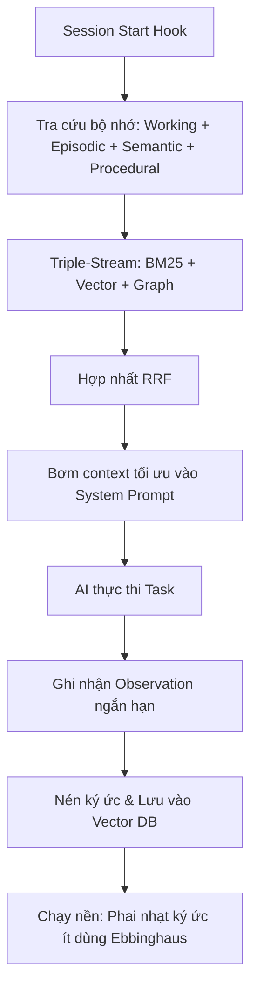

# 🧠 AgentMemory: Hệ Thống Bộ Nhớ AI Đa Tầng

## 🌟 Điểm Sáng & Tính Năng Hay Nhất (Best Features)

*   **Bộ Nhớ 4 Lớp Thực Tế (4-Tier Memory):** Phân chia ký ức của AI cực kỳ khoa học:
    *   *Working Memory (Ngắn hạn):* Các thông tin thu thập tức thì khi chạy tool (logs, terminal output).
    *   *Episodic Memory (Sự kiện):* Tóm tắt diễn biến của từng phiên làm việc trước đó (đã làm gì, gặp lỗi gì).
    *   *Semantic Memory (Ngữ nghĩa):* Các fact, cấu trúc codebase, conventions chung của dự án.
    *   *Procedural Memory (Quy trình):* Các bước thực thi và kinh nghiệm debug cụ thể của từng loại task.
*   **Triple-Stream Retrieval (Truy vấn 3 luồng):** Kết hợp đồng thời 3 cơ chế tìm kiếm: BM25 (tìm từ khóa chính xác), Vector Search (tìm ngữ nghĩa gần gũi), và Knowledge Graph (tìm quan hệ thực thể). Kết quả được hợp nhất bằng thuật toán RRF (Reciprocal Rank Fusion) giúp độ chính xác của RAG đạt trên **95%**.
*   **Đường Cong Quên Tự Động (Auto-forgetting curve):** Mô phỏng đường cong quên lãng Ebbinghaus của con người. Thông tin ít được truy cập sẽ nhạt dần và tự động bị nén/xóa để tránh làm tràn ngữ cảnh của AI. Dữ liệu truy cập nhiều sẽ được củng cố (Consolidated).

---

## 🧠 Bài Học & Cải Tiến Cho Auto Code OS (Takeaways & Improvements)

1.  **Lưu Trữ Quyết Định Kiến Trúc (Procedural Memory):**
    *   *Chi tiết:* Lưu lại cách sửa một lỗi cụ thể (ví dụ: cách config Postgres trong Docker container).
    *   *Áp dụng:* Thêm bảng `agent_procedural_memory` trong database PostgreSQL của Auto Code OS. Khi agent giải quyết thành công một lỗi phức tạp, lưu lại tóm tắt quy trình giải quyết. Khi gặp task tương tự, truy vấn RAG lấy lại quy trình này để hướng dẫn agent chạy nhanh hơn.
2.  **RAG Hợp Nhất (Reciprocal Rank Fusion):**
    *   *Chi tiết:* Gộp kết quả tìm kiếm keyword (BM25) và Vector để có kết quả tối ưu.
    *   *Áp dụng:* Cải tiến bộ tìm kiếm RAG trong database của Auto Code OS bằng cách kết hợp full-text search của PostgreSQL với `pgvector` thông qua thuật toán RRF.

---

## 🏗️ Kiến Trúc & Các File Quan Trọng (Architecture & Key Paths)

*   `DESIGN.md`: Tài liệu thiết kế chi tiết kiến trúc bộ nhớ đa tầng và thuật toán phai nhạt ký ức.
*   `src/`: Core logic xử lý ghi nhận bộ nhớ qua các hooks (`SessionStart`, `PostToolUse`, `SessionEnd`).
*   `benchmark/COMPARISON.md`: Các chỉ số đo đạc hiệu năng của bộ nhớ.

---

## 🔄 Luồng Hoạt Động (Main Flow)

