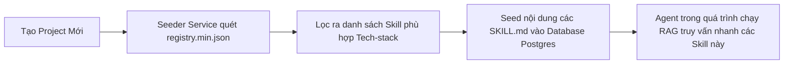

# 📚 Antigravity Awesome Skills: Thư Viện Kỹ Năng Agentic Di Động

## 🌟 Điểm Sáng & Tính Năng Hay Nhất (Best Features)

*   **Thư Viện Skill Đóng Gói Chuẩn Markdown:** Chứa hơn 1,470+ playbook kỹ năng (dưới dạng `SKILL.md`) viết hoàn toàn bằng Markdown. Điều này giúp các kỹ năng độc lập hoàn toàn với code logic lập trình của hệ thống điều phối, dễ dàng import và chạy tương thích trên nhiều AI CLI/IDE khác nhau.
*   **Phân Loại Rủi Ro Rõ Ràng (Risk Taxonomy):** Gán nhãn bảo mật cho từng kỹ năng (`safe`, `critical`, `offensive`, `none`) để máy chủ lọc và kiểm duyệt trước khi nạp vào AI, ngăn ngừa các kỹ năng độc hại hoặc không an toàn.
*   **Registry Manifest (`skills_index.json`):** Hệ thống chỉ mục JSON ổn định hỗ trợ quét, tra cứu và nạp JIT động cực nhanh dựa trên keyword của task.

---

## 🧠 Bài Học & Cải Tiến Cho Auto Code OS (Takeaways & Improvements)

1.  **Dùng Làm Nguồn Seed Dữ Liệu Skills Cho Dự Án:**
    *   *Chi tiết:* Auto Code OS cần một tập hợp các kỹ năng lập trình mặc định để cung cấp cho Agent khi người dùng tạo project.
    *   *Áp dụng:* Sử dụng danh mục trong thư viện này để nạp dữ liệu mẫu (seed) vào bảng `skills` và `rules` của dự án Auto Code OS khi khởi tạo. Khi tạo một project mới, tự động seed các skill tương ứng với techstack (vd: `golang-pro`, `nextjs-best-practices`, `postgres-optimization`).

---

## 🏗️ Kiến Trúc & Các File Quan Trọng (Architecture & Key Paths)

*   `skills/`: Chứa hàng ngàn file kỹ năng Markdown tổ chức theo phân loại (Core, Tech, Process, Custom).
*   `skills_index.json`: Manifest lưu trữ metadata, phân loại rủi ro và mô tả chi tiết của từng skill.
*   `schemas/`: JSON Schema để validate cấu trúc của file manifest và index.

---

## 🔄 Luồng Hoạt Động (Main Flow)

