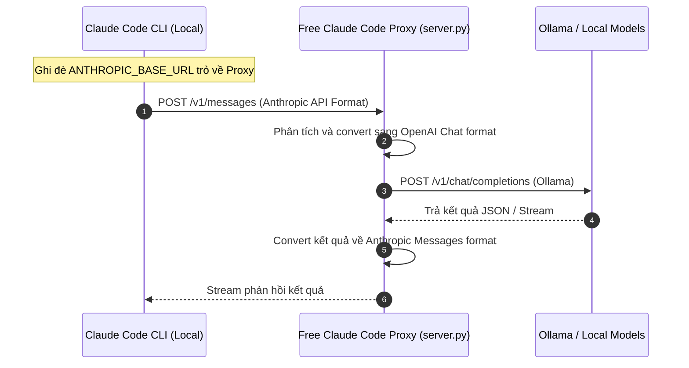

# 🆓 Free Claude Code: API Proxy Gateway Cho Claude Code CLI

## 🌟 Điểm Sáng & Tính Năng Hay Nhất (Best Features)

*   **Bọc API Trong Môi Trường Cục Bộ (Drop-in Proxy Gateway):** Cung cấp giải pháp đánh lừa (intercept) CLI của Claude Code gọi vào Local Server thay vì gọi thẳng lên Anthropic API, thông qua việc ghi đè biến môi trường `export ANTHROPIC_BASE_URL=http://localhost:port`.
*   **Chuyển Đổi Giao Thức API Tức Thời (Protocol Normalization):** Chuyển đổi định dạng Anthropic Messages API sang OpenAI hoặc DeepSeek API để chạy Claude Code bằng các mô hình LLM cục bộ (Ollama, NIM) hoặc nhà cung cấp rẻ hơn mà không cần sửa đổi mã nguồn nhị phân gốc của Claude Code.
*   **Điều Khiển Qua Discord/Telegram Bot:** Đóng gói phiên làm việc terminal của Claude Code để điều khiển lập trình, chạy lệnh từ xa thông qua ứng dụng trò chuyện di động.

---

## 🧠 Bài Học & Cải Tiến Cho Auto Code OS (Takeaways & Improvements)

1.  **Wrap Các AI CLI Công Cụ Phổ Biến:**
    *   *Chi tiết:* Claude Code, Cline, Cursor... là các công cụ cực kỳ mạnh mẽ nhưng thường bị đóng kín hoặc chỉ cho phép dùng API chỉ định. Free Claude Code cho thấy chúng ta hoàn toàn có thể bọc (wrap) chúng bằng cách dựng proxy API cục bộ.
    *   *Áp dụng:* Trong Docker Sandbox của Auto Code OS, chúng ta có thể cài đặt các công cụ AI CLI tiêu chuẩn này và thiết lập biến môi trường trỏ API của chúng về gateway cục bộ của Auto Code OS. Cách này giúp hệ thống tận dụng sức mạnh lập trình của các CLI hàng đầu thế giới mà vẫn kiểm soát được API key và chi phí.
2.  **Chặn Các Request Dò Đường (Probe Blocking):**
    *   *Chi tiết:* Tự động trả lời các request check kết nối hoặc request định dạng nhỏ tại local proxy để giảm độ trễ và tiết kiệm quota mạng.

---

## 🏗️ Kiến Trúc & Các File Quan Trọng (Architecture & Key Paths)

*   `server.py`: Server Python chính hứng request giả lập Anthropic API.
*   `providers/`: Thư mục chứa adapter kết nối sang Ollama, NIM, OpenRouter.
*   `messaging/`: Bot tích hợp với Discord và Telegram.

---

## 🔄 Luồng Hoạt Động (Main Flow)

