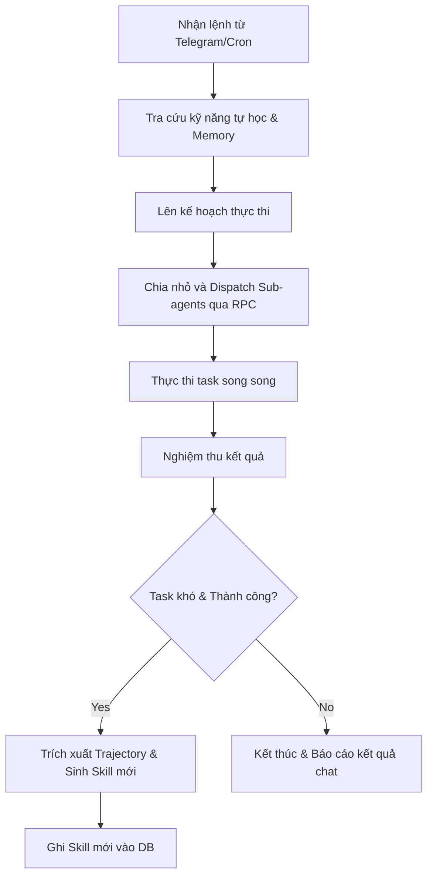

# 🦅 Hermes Agent: Agent Tự Học Đóng Kín (Nous Research)

## 🌟 Điểm Sáng & Tính Năng Hay Nhất (Best Features)

*   **Vòng Lặp Tự Học Đóng (Closed Learning Loop):** Hermes là agent duy nhất có khả năng tự động đúc kết kinh nghiệm sau khi giải quyết xong một task khó. Nó tự động tạo ra một file "Skill" (kỹ năng) mới dưới dạng procedural memory và ghi vào cơ sở dữ liệu để tái sử dụng ở các lần chạy sau.
*   **Điều Khiển Từ Xa Bằng Chat Bot (Remote Control):** Thiết kế độc lập hoàn toàn khỏi máy tính cá nhân. Nó có thể chạy trên một máy chủ VPS giá rẻ, lắng nghe yêu cầu qua Telegram, Discord, hoặc chạy tự động định kỳ bằng Cron.
*   **Điều Phối Sub-Agents Song Song Qua RPC:** Tránh việc nhồi nhét quá nhiều context cho một LLM bằng cách chia việc cho các sub-agents chuyên biệt chạy song song, giao tiếp thông qua Python RPC.

---

## 🧠 Bài Học & Cải Tiến Cho Auto Code OS (Takeaways & Improvements)

1.  **Học Hỏi Từ Thất Bại & Thành Công (Self-Improving Loop):**
    *   *Chi tiết:* Sau khi hoàn thành một PR khó và được merge, agent sẽ phân tích lịch sử thực thi (trajectory) để rút ra bài học kinh nghiệm và viết thành file playbook lưu vào repo.
    *   *Áp dụng:* Thêm bước `LEARN` cuối task trong Auto Code OS: Yêu cầu AI tóm tắt lỗi đã sửa và cách khắc phục vào thư mục `docs/playbooks/` dưới dạng file Markdown. Lần sau khi gặp issue tương tự, hệ thống tự động tải file playbook này vào context.
2.  **Tích Hợp Giao Thức MCP (Model Context Protocol):**
    *   *Chi tiết:* Sử dụng MCP để gọi các tool ngoài một cách chuẩn hóa.

---

## 🏗️ Kiến Trúc & Các File Quan Trọng (Architecture & Key Paths)

*   `run_agent.py`: Entrypoint khởi chạy toàn bộ hệ thống Agent.
*   `trajectory_compressor.py`: Bộ nén và trích xuất lịch sử thực thi thành kiến thức học tập.
*   `mcp_serve.py`: Tích hợp giao thức MCP phục vụ kết nối tool bên ngoài.

---

## 🔄 Luồng Hoạt Động (Main Flow)

