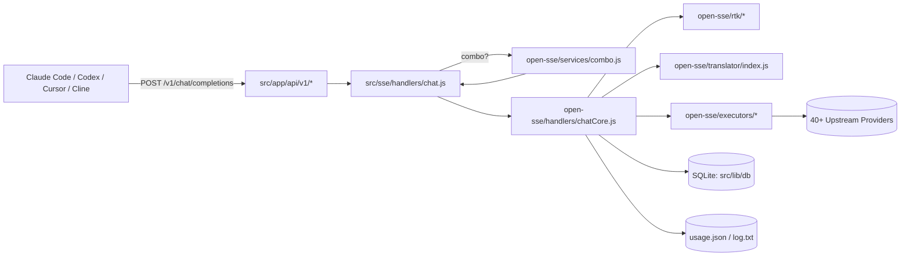
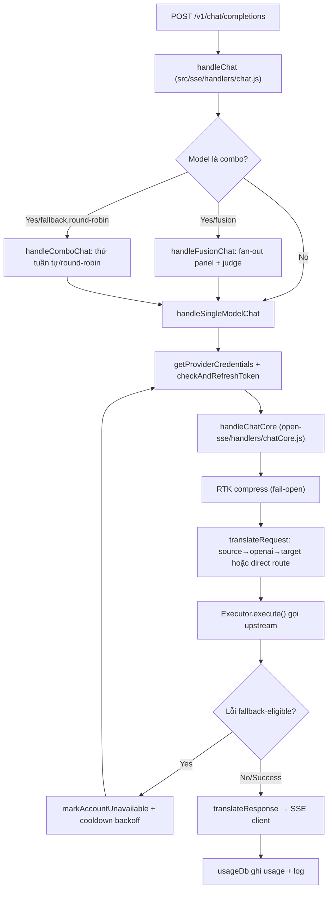

# Báo Cáo Phân Tích — 9Router

## Tổng Quan
9Router là một local AI routing gateway + dashboard, cung cấp một endpoint duy nhất OpenAI-compatible (`/v1/*`) và route traffic tới 40+ upstream providers (Anthropic, OpenAI, Gemini, Kiro, Cursor, Antigravity, GLM, MiniMax...) với format translation, model-combo fallback, multi-account fallback, OAuth/token refresh, RTK token compression và usage tracking.
Stack: Plain JavaScript (ESM, không TypeScript), Next.js 16 (App Router) làm cả dashboard lẫn API layer, SQLite (đa driver: `bun:sqlite`/`better-sqlite3`/`node:sqlite`/`sql.js`) cho persistence, Zustand cho state client, Express chỉ dùng trong `custom-server.js` để wrap Next standalone server.
Quy mô: repo lớn, hai package độc lập trong cùng monorepo — dashboard/gateway (`9router-app`, root) và CLI launcher (`cli/`, publish npm riêng `9router`). Core routing engine (`open-sse/`) tách biệt hoàn toàn khỏi Next.js app, có thể dùng standalone.
Độ trưởng thành: cao — có `docs/ARCHITECTURE.md` chính thức (mermaid diagrams đầy đủ), `AGENTS.md` riêng cho engine, test suite vitest ~1000 tests, changelog conventional commits. Auto Code OS đã có sẵn provider client `server/pkg/llm/nine_router.go` coi 9Router như một OpenAI-compatible gateway — báo cáo này so sánh trực tiếp routing/cost logic của 9Router với `server/pkg/llm/router.go`.

## Tính Năng Nổi Bật (Best Features)
1. **Config-driven Error-based Fallback với Exponential Backoff** (`open-sse/services/accountFallback.js:9-50`): `checkFallbackError()` match lỗi qua bảng `ERROR_RULES` (text-substring trước, status-code sau) thay vì if/else cứng, mỗi rule có thể gắn cờ `backoff` để leo thang cooldown theo cấp số nhân (`getQuotaCooldown`, base × 2^level, cap 4 phút). Kết quả: logic phân loại lỗi 429 vs 401 vs 5xx transient hoàn toàn tách khỏi code gọi API, dễ mở rộng rule mới mà không sửa business logic.
2. **Model Combo với 3 chiến lược fallback/round-robin/fusion** (`open-sse/services/combo.js`): `handleComboChat` thử tuần tự các model trong combo khi lỗi fallback-eligible; `handleFusionChat` (dòng 496-571) fan-out song song ra một "panel" model, dùng một "judge" model tổng hợp câu trả lời cuối — áp dụng ý tưởng OpenRouter Fusion, có quorum-grace collection (`collectPanel`, dòng 444-471) để giới hạn độ trễ do straggler mà vẫn ưu tiên panel đầy đủ khi mọi model nhanh.
3. **RTK (Request Token Killer) — nén tool_result trong request** (`open-sse/rtk/index.js`, `open-sse/rtk/filters/*`): trước khi translate format, RTK duyệt `messages`/`input`/Kiro `conversationState`, tự động detect loại tool output (git diff, git log, git status, grep, ls, tree, find...) qua `autodetect.js` và áp filter nén riêng cho từng loại — ví dụ `filters/gitDiff.js` cắt hunk > 100 dòng, gom `+N -M` thay vì giữ toàn bộ diff. Toàn bộ pipeline **fail-open**: lỗi bất kỳ trả `null`, giữ nguyên body gốc, không bao giờ throw ra ngoài — README công bố tiết kiệm 20-40% token.
4. **SQLite Multi-Adapter Driver Chain** (`src/lib/db/driver.js:55-64`): tự động thử `bun:sqlite` → `better-sqlite3` (optionalDependency, không fail install nếu thiếu build tools) → `node:sqlite` (Node ≥22.5) → `sql.js` (pure-JS, luôn chạy được) theo thứ tự runtime-aware. Đảm bảo app chạy được trên mọi môi trường (kể cả không có compiler) mà không cần cấu hình thủ công.
5. **Translator Registry pivot-qua-OpenAI với Direct Route override** (`open-sse/translator/index.js:52-154`): mọi cặp format request/response mặc định đi qua 2 bước `source→openai→target`, nhưng nếu có translator đăng ký trực tiếp cho cặp `source:target` (vd `claude:kiro`), engine dùng route đó để tránh mất dữ liệu qua double-hop (thinking blocks, tool ids, ảnh non-base64). Cơ chế self-register qua side-effect import (`register()` gọi khi module load) giữ cho việc thêm translator mới zero-touch với code điều phối.

## Áp Dụng Cho Auto Code OS (Applied Takeaways — ranked)
1. **Config-driven fallback rule table thay vì hard-coded status check** — What: `ERROR_RULES` (danh sách rule text/status → shouldFallback + cooldown) trong `open-sse/config/errorConfig.js`, dùng bởi `checkFallbackError()` (`open-sse/services/accountFallback.js:23-50`). Apply: `server/pkg/llm/router.go` hiện chỉ có retry với backoff cố định (`chatWithRetry`, dòng 215-241) không phân biệt lỗi transient/rate-limit/auth. Thêm bảng rule tương tự trong `server/pkg/llm/transient_error.go` (đã tồn tại, kiểm tra mở rộng) để account/provider bị 429 có cooldown leo thang riêng thay vì retry đồng nhất. Impact: H · Effort: M · Risk: L · Est: 2 ngày.
2. **RTK-style tool_result compression trước khi gửi LLM** — What: pipeline nén `tool_result`/`function_call_output` theo shape (`open-sse/rtk/index.js`), auto-detect loại nội dung (git diff/grep/ls) và áp filter riêng, fail-open. Apply: Auto Code OS đã tham chiếu RTK trong `docs/references/token-compression/DISCOVERY-rtk.md` — điểm khác biệt ở đây là 9Router tích hợp RTK **inline trong request pipeline** (không phải proxy riêng). Có thể port ý tưởng "per-tool-shape filter registry" vào `server/internal/tool/` khi build kết quả tool trả về cho `server/pkg/llm/router.go`, cắt token trước khi gọi `Gateway.ChatWithOptions`. Impact: H · Effort: M · Risk: L · Est: 3-4 ngày.
3. **Model-Combo Fallback (multi-provider theo LevelGroup + round-robin/quota)** — What: `getRotatedModels()` (`open-sse/services/combo.js:157-186`) xoay vòng model trong combo theo "sticky limit" (N request mỗi model trước khi chuyển), khác với `FallbackChain` tĩnh trong `router.go` chỉ duyệt tuần tự theo thứ tự cấu hình. Apply: bổ sung round-robin sticky cho `server/pkg/llm/fallback.go` (`FallbackChain.Providers`) để cân bằng tải/quota giữa nhiều account cùng provider thay vì luôn ưu tiên provider đầu tiên. Impact: M · Effort: M · Risk: L · Est: 2 ngày.
4. **SQLite driver fallback chain cho local/dev mode** — What: `src/lib/db/driver.js` tự chọn driver theo runtime, không fail nếu thiếu native deps. Apply: nếu Auto Code OS có mode chạy without Postgres (dev/offline), có thể áp dụng pattern tương tự cho một lightweight cache layer (`server/internal/database/` fallback SQLite cho local dev) — pattern hữu ích hơn là code cụ thể vì Auto Code OS đã cam kết Postgres làm source of truth. Impact: L · Effort: L · Risk: L · Est: 0.5 ngày (chỉ mượn ý tưởng, không port trực tiếp).
5. **Capability-aware model reordering (`reorderByCapabilities`)** — What: `open-sse/services/combo.js:63-82` xếp hạng model theo capability cứng (vision/pdf/audio) khớp với nội dung request, đưa model phù hợp lên đầu combo mà không loại bỏ fallback. Apply: `server/pkg/llm/provider.go`/`router.go` chọn provider theo `LevelGroup`/complexity nhưng chưa xét input modality (ảnh, file) của request — thêm bước tương tự trước khi chọn `FallbackChain` để tránh gọi model không hỗ trợ vision rồi mới fallback tốn round-trip. Impact: M · Effort: M · Risk: M (cần audit modality detection cho tool-based agent) · Est: 3 ngày.

## Kiến Trúc (Architecture)
9Router theo kiến trúc **layered gateway**: Next.js App Router route handlers (`src/app/api/*`) chỉ làm lớp HTTP/parsing/auth mỏng, toàn bộ business logic routing/translate nằm trong `open-sse/` — một engine provider-agnostic độc lập, không phụ thuộc Next.js (có thể import chuẩn ESM ở bất kỳ runtime Node/Bun nào). `src/sse/` là lớp glue app-side (parse request, combo expansion, account-selection loop) gọi vào `open-sse/handlers/chatCore.js` (translate, dispatch executor, retry/refresh, stream). Dependency direction rõ ràng một chiều: `src/app/api` → `src/sse` → `open-sse` → upstream providers; `open-sse` không import ngược lại `src/`. Persistence tách biệt hai lớp: state chính (providers, combos, keys, pricing) qua SQLite adapter (`src/lib/db/`), usage/log qua file JSON riêng (`src/lib/usageDb.js`, không theo `DATA_DIR` — ghi nhận là kỹ thuật nợ trong chính `docs/ARCHITECTURE.md`).
Lý do lựa chọn kiến trúc: tách `open-sse` khỏi Next.js cho phép engine được test độc lập (vitest suite ~1000 test không cần khởi Next server) và tái sử dụng nếu muốn nhúng vào runtime khác. Multi-driver SQLite chọn vì mục tiêu "chạy local, zero-config, mọi hệ điều hành" — ưu tiên hơn Postgres vốn cần server riêng.
Confidence: High (đối chiếu trực tiếp `docs/ARCHITECTURE.md`, `open-sse/AGENTS.md`, và source code đọc trực tiếp).

### ADR Suy Luận (Inferred ADRs)
| Quyết Định | Bằng Chứng | Lợi Ích | Đánh Đổi | Confidence |
|---|---|---|---|---|
| Tách `open-sse/` khỏi Next.js app | `open-sse/AGENTS.md`, không có import Next trong `open-sse/*` | Testable độc lập, có thể tái dùng ngoài Next | Thêm một lớp glue (`src/sse/`) trung gian, phải "cross the boundary consciously" | High |
| SQLite multi-adapter thay Postgres | `src/lib/db/driver.js`, comment trong `package.json` về `better-sqlite3` optional | Zero-config local-first, chạy mọi máy dev | Không phù hợp multi-tenant/cloud scale; phải giữ 4 adapter đồng bộ schema | High |
| Translator pivot qua OpenAI + direct-route override | `open-sse/translator/index.js:79-104`, `AGENTS.md` mục Pitfalls | DRY cho N×M format pairs, chỉ viết N+M thay vì N×M converters | Double-hop mất field (thinking, tool id) cho cặp không có direct route | High |
| RTK/headroom fail-open, không throw | `open-sse/AGENTS.md` mục Pitfalls, `open-sse/rtk/index.js:83-86` | An toàn tuyệt đối — compression bug không bao giờ chặn request thật | Có thể âm thầm bỏ qua nén khi lỗi, khó phát hiện regression nếu không log | Medium |

## Luồng Chính (Main Flow)

## Design Patterns & Chất Lượng Code
- **Registry pattern lặp lại nhất quán**: translator (`register(from,to,...)`), executor (`executors/index.js` map, fallback `DefaultExecutor`), provider (`providers/registry/*` auto-generated) — cùng một triết lý "thêm file mới, tự động được nhặt qua import side-effect hoặc generated index", giảm boilerplate khi mở rộng 40+ provider.
- **Fail-open như một convention xuyên suốt**: không chỉ RTK, mà cả `headroom.js` compression proxy đều tuân thủ "lỗi compress ≠ lỗi request" — một quy ước rõ ràng, được ghi thành luật trong `AGENTS.md` chứ không chỉ code convention ngầm.
- **Naming/style**: camelCase nhất quán, plain JS ESM (không TS) — đánh đổi mất type-safety nhưng đổi lại tốc độ thêm provider mới rất nhanh (copy template + đăng ký). Comment giải thích rationale khá dày (vd `combo.js:90-100` giải thích lý do chỉ scan "trailing user turn" cho capability detection).
- **Điểm yếu**: một số hàm dài, lồng nhiều điều kiện trùng lặp — `handleChat`/`handleSingleModelChat` trong `src/sse/handlers/chat.js` lặp lại gần như y hệt logic combo-strategy (dòng 89-128 và 140-181), có thể trích xuất hàm chung `resolveComboStrategy(modelStr, settings)`.

## Kỹ Thuật Thú Vị & Thực Hành Kỹ Thuật
- **Testing**: vitest suite độc lập (`tests/`, package riêng), có `tests/__baseline__/verify-no-regression.mjs` so sánh với snapshot đã biết thay vì kỳ vọng 100% xanh — chấp nhận số lượng fail đã catalogue (`known-fails.txt`), tránh CI đỏ giả do live-provider test.
- **Logging**: `src/sse/utils/logger.js` in dòng tóm tắt "▶" hợp nhất route/model/account thay vì log rải rác nhiều dòng — giảm nhiễu console khi debug production.
- **Config**: triệt để "no hardcode" — mọi constant (role strings, block types, timeout, retry count) đi qua `open-sse/config/*` và `translator/schema/*`, được nhấn mạnh như luật cứng trong `AGENTS.md`.
- **Security**: `custom-server.js` (theo `CLAUDE.md`) chỉ derive client IP từ TCP socket, không tin `X-Forwarded-For` trừ khi qua reverse proxy loopback — chống spoofing rate-limit. JWT session cookie, HMAC API key (`API_KEY_SECRET`), password mặc định `123456` được cảnh báo rõ phải override.
- **Resilience**: `BaseExecutor.execute()` (`open-sse/executors/base.js:99-183`) có connect-timeout riêng (AbortController + `FETCH_CONNECT_TIMEOUT_MS`) tách khỏi timeout tổng, cộng với retry theo `retryConfig` cấu hình per-status-code và hook `computeRetryDelay` cho phép subclass tính delay động (vd đọc header `Retry-After`).

## Engineering Gems
1. `open-sse/services/combo.js:444-471` (`collectPanel`) — Vấn đề: fan-out song song N model để "fusion" nhưng không muốn tổng thời gian bị kéo dài bởi 1 model chậm nhất. Cách làm phổ biến (yếu hơn): `Promise.all` chờ hết hoặc `Promise.race` chỉ lấy model nhanh nhất (mất đa dạng). Vì sao elegant: dùng "quorum + grace timer" — đạt `minPanel` kết quả thì bắt đầu đếm ngược một khoảng grace ngắn cho các model còn lại, timeout cứng bảo vệ tuyệt đối. Đánh đổi: kết quả panel có thể sparse (thiếu model chậm), cần xử lý gracefully ở bước judge. Bài học: pattern "quorum-grace" áp dụng tốt cho bất kỳ fan-out nào cần cân bằng latency vs completeness (vd multi-agent voting trong Auto Code OS).
2. `open-sse/services/accountFallback.js:9-13` (`getQuotaCooldown`) — Vấn đề: cooldown cố định cho rate-limit dễ gây thundering herd khi retry đồng loạt sau cùng một khoảng thời gian. Cách làm phổ biến: sleep cố định N giây. Vì sao elegant: exponential backoff dựa trên `backoffLevel` lưu trên account, cap ở mức tối đa (4 phút), tính tách biệt hoàn toàn khỏi network call — pure function dễ test. Đánh đổi: cần lưu trạng thái `backoffLevel` bền trên connection record, tăng field DB. Bài học: tách logic tính cooldown thành pure function giúp unit-test không cần mock HTTP.
3. `open-sse/translator/index.js:79-104` — Vấn đề: hỗ trợ N format nguồn × M format đích sẽ nổ N×M converter nếu viết trực tiếp từng cặp. Cách làm phổ biến: chỉ pivot qua 1 định dạng trung gian luôn luôn (đơn giản nhưng mất field cho cặp nhạy cảm). Vì sao elegant: mặc định pivot qua OpenAI (N+M converters) nhưng cho phép override bằng "direct route" khi đăng ký đúng cặp `source:target` — kết hợp cả độ đơn giản lẫn độ chính xác khi cần. Đánh đổi: hai code path (`directFn` vs 2-step) phải test riêng, dev mới dễ quên đăng ký direct route cho cặp fragile. Bài học: pattern "default pivot + explicit override" mở rộng tốt hơn so với chọn cứng một trong hai chiến lược.

## Top 10 Điều Đáng Học
| # | Khái Niệm | File | Vì Sao Hữu Ích | Độ Khó | Thứ Tự |
|---|---|---|---|---|---|
| 1 | Config-driven error → fallback rule table | `open-sse/services/accountFallback.js`, `open-sse/config/errorConfig.js` | Tách phân loại lỗi khỏi business logic, dễ thêm rule | ⭐⭐ | 1 |
| 2 | RTK auto-detect + per-shape filter registry | `open-sse/rtk/autodetect.js`, `open-sse/rtk/filters/*` | Nén token có target theo loại nội dung, không nén mù | ⭐⭐⭐ | 2 |
| 3 | Fail-open compression pipeline | `open-sse/rtk/index.js:83-86`, `open-sse/AGENTS.md` | Convention an toàn tuyệt đối cho optimizations không quan trọng | ⭐ | 3 |
| 4 | Translator pivot + direct-route override | `open-sse/translator/index.js` | Giải quyết N×M converter problem gọn | ⭐⭐⭐⭐ | 4 |
| 5 | Quorum-grace fan-out collection | `open-sse/services/combo.js:444-471` | Cân bằng latency/completeness khi gọi song song nhiều model | ⭐⭐⭐⭐ | 5 |
| 6 | Exponential backoff cooldown, pure function | `open-sse/services/accountFallback.js:9-13` | Dễ test, tránh thundering herd | ⭐⭐ | 6 |
| 7 | Multi-adapter driver chain (runtime detection) | `src/lib/db/driver.js` | Zero-config chạy mọi runtime, graceful degrade | ⭐⭐⭐ | 7 |
| 8 | Capability-aware model reordering | `open-sse/services/combo.js:63-82` | Tránh gọi model thiếu modality rồi mới fallback | ⭐⭐⭐ | 8 |
| 9 | Fusion judge-synthesis prompt design | `open-sse/services/combo.js:391-418` | Kỹ thuật multi-model consensus, áp dụng cho LLM-as-judge | ⭐⭐⭐ | 9 |
| 10 | Registry self-register qua side-effect import | `open-sse/translator/index.js:270-292`, `executors/index.js` | Mở rộng plugin không cần sửa điều phối trung tâm | ⭐⭐ | 10 |

## Hướng Dẫn Đọc (Reading Guide)
**L0 Build & Run:** `package.json` (root), `README.md` mục Quick Start, `docs/ARCHITECTURE.md`.
**L1 Entry Points:** `src/app/api/v1/chat/completions/route.js` → `src/sse/handlers/chat.js`.
**L2 Core Abstractions:** `open-sse/handlers/chatCore.js`, `open-sse/translator/index.js`, `open-sse/executors/base.js`.
**L3 Architecture Glue:** `open-sse/services/accountFallback.js`, `open-sse/services/combo.js`, `src/lib/db/driver.js`.
**L4 Engineering Gems:** `open-sse/rtk/*` (toàn bộ thư mục), `open-sse/services/combo.js` (fusion + quorum-grace).
**L5 Reimplement:** viết lại `checkFallbackError` + backoff làm pure function trong Go cho `server/pkg/llm/`; thử port "quorum-grace fan-out" cho multi-agent voting.

## Anti-Patterns & Không Nên Copy
1. **`usageDb` không theo `DATA_DIR`** (`docs/ARCHITECTURE.md` mục Known Architectural Notes #1): usage/log luôn ghi `~/.9router` bất kể cấu hình data dir chính — inconsistency đã được chính team ghi nhận là nợ kỹ thuật. Auto Code OS nên đảm bảo mọi state (kể cả usage/audit log) đi qua cùng một config path resolver, không có exception ngầm.
2. **Hàm dài lặp logic combo-strategy 2 lần** (`src/sse/handlers/chat.js:89-128` và `140-181`): copy-paste thay vì trích xuất hàm chung — dễ drift khi sửa một nhánh mà quên nhánh kia. Bài học cho Auto Code OS: khi có nhánh "check combo strategy" xuất hiện ở entry point và ở fallback path, trích xuất ngay từ đầu.
3. **Password mặc định `123456`** (`INITIAL_PASSWORD` trong `.env.example`, cảnh báo trong `ARCHITECTURE.md`): chấp nhận được cho local-only tool nhưng không phải pattern nên copy cho backend đa người dùng như Auto Code OS — luôn generate secret ngẫu nhiên lúc bootstrap, không có default hardcode.
4. **Plain JS không TypeScript trên codebase 40+ provider**: hợp lý cho tốc độ ban đầu của một dự án OSS cá nhân, nhưng với quy mô N×M format/executor như hiện tại, thiếu type-safety làm tăng rủi ro regression khi refactor translator. Auto Code OS (Go, có type system) không nên đánh đổi tương tự.

## Câu Hỏi Đáng Suy Ngẫm
1. Fusion combo (fan-out + judge) tốn N lần chi phí LLM cho 1 request — 9Router có cơ chế nào giới hạn ngân sách per-request khi dùng fusion không, hay hoàn toàn phó mặc cho settings người dùng? Auto Code OS nếu áp dụng multi-agent voting cần gắn với `MaxCostUSDPerCall` đã có ở `server/pkg/llm/router.go:264-275`.
2. Direct-route translator override giải quyết vấn đề lossy pivot, nhưng ai đảm bảo dev mới biết cặp nào "fragile" cần direct route thay vì để mặc định 2-hop? Có nên có test tự động phát hiện mất field qua pivot?
3. SQLite local-first có scale được nếu Auto Code OS muốn một gateway tương tự chạy multi-tenant/cloud, hay pattern này chỉ tối ưu cho single-user local dev tool?

## Đánh Giá Tổng Thể
| Architecture | Maintainability | Scalability | Clean Code | Learning Value |
|---|---|---|---|---|
| 8/10 | 7/10 | 6/10 | 7/10 | 9/10 |

## Lộ Trình Học Tập
- **Tuần 1**: Đọc `docs/ARCHITECTURE.md` toàn bộ + `open-sse/AGENTS.md`; chạy local (`npm run dev`), trace một request `/v1/chat/completions` bằng log "▶" để hiểu request lifecycle thực tế.
- **Tuần 2**: Đọc sâu `open-sse/services/accountFallback.js`, `open-sse/services/combo.js`, `open-sse/executors/base.js` — đây là phần trực tiếp so sánh được với `server/pkg/llm/router.go`/`fallback.go`. Viết note đối chiếu field-by-field (ERROR_RULES vs transient_error.go).
- **Tuần 3**: Đọc `open-sse/translator/index.js` + 2-3 file translator cụ thể (`request/claude-to-openai.js`, `response/kiro-to-openai.js`) để hiểu pattern pivot/direct-route.
- **Tuần 4**: Reimplement thử nghiệm: (a) port `checkFallbackError` + exponential backoff pattern thành Go function trong `server/pkg/llm/`, có unit test; (b) prototype RTK-style filter registry cho tool output trong `server/internal/tool/`, đo % token tiết kiệm trên vài task thật.
